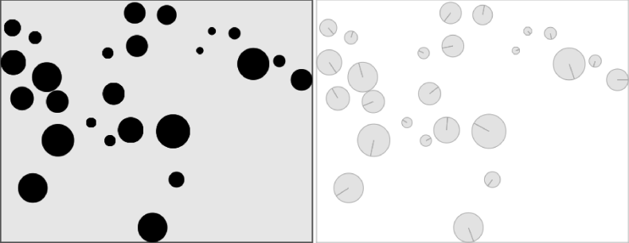

### 5.6.12　转换为Canvas

到目前为止，读者只学习了使用b2DebugDraw进行Box2D的输出。尽管这种方法很简单，但是对于Canvas应用却没有实际用途。如前所述，Box2D仅仅是“物理模型”。将模型应用到HTML5 Canvas是开发者的工作。在下一个示例中，将把上一个反弹球示例与画布应用并排显示，如图5-27所示。


<center class="my_markdown"><b class="my_markdown">图5-27　Box2D的反弹球分别在Canvas和b2DebugDraw中的对比</b></center>

首先，在HTML中定义第二个Canvas，用于显示b2DebugDraw的输出。

```javascript
<canvas id="canvasOne" width="450" height="350">
 Your browser does not support the HTML 5 Canvas.
</canvas>
<canvas id="canvasTwo" width="450" height="350">
 Your browser does not support the HTML 5 Canvas.
</canvas>
```

请注意，此处的画布变小了一些（450×350）。这里修改尺寸的目的是为了将画布并排显示在浏览器中。这里还需要确保在JavaScript中取得两个画布的引用。

```javascript
var theCanvas = document.getElementById('canvasOne');
var context = theCanvas.getContext('2d');
var theCanvasTwo = document.getElementById('canvasTwo');
var context2 = theCanvasTwo.getContext('2d');
```

现在，想一些办法来简化工作。此处不再直接使用数字确定比例尺，而是用一个变量代替。变量名为scaleFactor，这样使用缩放比例会更加方便。

```javascript
var scaleFactor = 30;
```

在确定Box2D中对象的位置和大小时会用到scaleFactor。首先，在创建用于显示小球的循环中，以整个画布的宽度和高度为范围生成随机数，然后通过scaleFactor转换为小球的随机位置。

```javascript
var ypos = (Math.random() * theCanvas.height)/scaleFactor;
var xpos = (Math.random() * theCanvas.width/scaleFactor);
var size = ((Math.random() * 20)+ 5)/scaleFactor;
```

使用画布的宽度和高度生成墙体的定义wallDefs，而不再像之前的示例那样使用MTS单位。虽然本质上是一样的，但是在调整画布尺寸的时候，这样做比使用明文数字更容易。因为画布缩小了，所以不需要重新计算所有的值。

```javascript
var wallDefs = new Array (
 {x:theCanvas.width,y:0,w:theCanvas.width ,h:1},　//上
 {x:theCanvas.width,y:theCanvas.height,w:theCanvas.width ,h:1},　//下
 {x:0,y:theCanvas.height,w:1 ,h:theCanvas.height},　//左
 {x:theCanvas.width,y:theCanvas.height,w:1 ,h:theCanvas.height} );　//右
```

在定义墙体的循环中，使用scaleFactor将数组中像素值转换为应用在墙体位置和宽度的MTS值。

```javascript
wallDef.position.Set(wallDefs[i].x/scaleFactor, wallDefs[i].y/scaleFactor);
...
wallFixture.shape.SetAsBox(wallDefs[i].w/scaleFactor, wallDefs[i].h/scaleFactor);
```

当定义b2DebugDraw实例时，传入第二个画布的引用（context2）。这样，第二个画布就会输出调试图像。然后，在第一个画布上通过Canvas的API进行绘图。

```javascript
debugDraw.SetSprite (context2);
debugDraw.SetDrawScale(scaleFactor);　//定义缩放比例
```

这个示例最大的变化在于drawScreen()函数。调用世界对象方法的代码与上一个示例一样（尽管此时world.DrawDebugData()使用的是context2）。

```javascript
function　drawScreen () {
　　　 world.Step(1 / 60, 10, 10);
　　　 world.DrawDebugData();
　　　 world.ClearForces();
```

现在，将模型中的Box2D数据转换到Canvas。drawScreen()函数中的大部分代码读者应该比较熟悉，因为它们与之前的反弹球示例差别不大。首先清除画布内容，然后遍历balls数组显示每一个小球。

```javascript
context.fillStyle = '#EEEEEE';
context.fillRect(0, 0, theCanvas.width, theCanvas.height);
//Box
context.strokeStyle = '#000000';
context.strokeRect(1,　1, theCanvas.width-2, theCanvas.height-2);
for (i =0;i <balls.length;i++) {
```

不同点在于绘制小球时获取小球位置和尺寸的方式不同。在balls数组中的成员都是Box2D的b2Body实例对象。使用对象的GetPosition()方法来获得小球的x轴坐标和y轴坐标。然后，调用b2Body的GetFixtureList()方法。此方法会返回创建小球时使用的b2Fixture对象。还记得吗？在创建fixture时还设置了shape属性。需要通过调用 fixtureList.GetShape()方法取得shape属性的值。

```javascript
var position = balls[i].GetPosition();
var fixtureList = balls[i].GetFixtureList();
var shape = fixtureList.GetShape();
```

有了所需的全部信息，就可以将小球绘制在画布上了。在使用context.arc()方法时，将位置的x轴坐标和y轴坐标分别乘以scaleFactor，这样可以将MTS单位转换为像素）。通过调用shape.GetRadius()可以获得小球的半径，同样也乘以scaleFactor。

```javascript
　　　 context.fillStyle = "#000000";
　　　 context.beginPath();
　　　 context.arc(position.x * scaleFactor　, position.y *
　　　 scaleFactor ,shape.GetRadius() *scaleFactor ,0,Math.PI*2,true);
　　　 context.closePath();
　　　 context.fill();
}
```

在运行示例（CH5EX22.html）时，画面与图5-27类似。左边的画布上是通过Canvas API绘制的对象，看起来与CH5EX8.html中的演示类似。右边的画布是通过b2DebugDraw显示Box2D的输出。现在，已经成功地将Box2D的物理模型应用在HTML5 Canvas上了。

再次提醒读者注意，除了熟悉Box2D的对象模型，这个示例是非常简单的。该列并没有自己搭建任何移动或碰撞检测的代码，全是依靠Box2D自身提供的功能，读者仅需要定义一个Box2D的世界，然后将对象放入其中即可。

