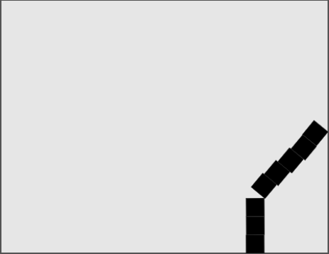

### 5.7　与Box2D交互

目前为止，我们仅仅是将物体放入已经定好的Box2D世界，然后让它们自行运动。这类程序对于教学指导来说已经足够好了，但是用Box2D创建一个能够互动的世界才是在Canvas上制作一个优秀游戏的不二法门。

在这个示例中，我们将创建一个游戏。在游戏中可以向一堆箱子发射小球，打翻箱子。在开始制作示例之前，还需要一个简单的步骤，那就是为箱子建模，在画布上显示出来，并让它们下落和翻滚，如图5-28所示。

<b class="my_markdown">图5-28　箱子下落和翻滚</b>

