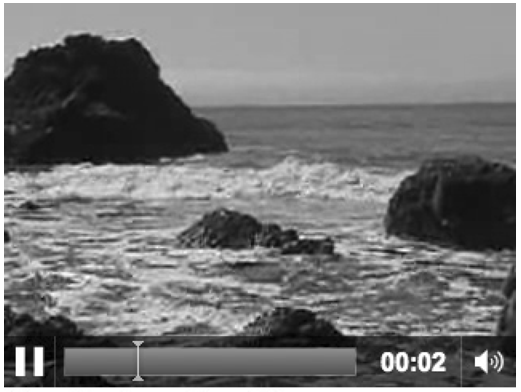

### 6.3.2　添加视频控制器并设置播放方式

显示不带控制界面的视频也许符合某些人的需求，但是大多数用户希望能直接看到控制视频的界面。而且作为开发者，可能希望视频能自动播放或当视频结束后能循环播放。在HTML5中可以轻松实现这些功能，但是需要浏览器支持。

在HTML5的嵌入视频中添加控制器、设置循环播放和自动播放很简单，只需要在<video>标签中设置controls、loop和autoplay选项即可，代码如下。

```javascript
<video autoplay loop controls id="thevideo" width="320" height="240">
 <sourcesrc="muirbeach.webm" type='video/webm; codecs="vp8, vorbis"' >
 <source src="muirbeach.mp4" type='video/mp4; codecs="avc1.42E01E, mp4a.40.2"' >
 <source src="muirbeach.ogg" type='video/ogg; codecs="theora, vorbis"'>
</video>
```

提示

> 对于上面的代码，在Firefox中的loop选项不会生效。不过，在4.0版本中将会得到支持。

如果使用上面的代码，嵌入的视频就会有控制界面，并且会循环播放和自动播放。读者可以在下载文件的 CH6EX2.html 中找到示例。图 6-2 展示了带控制界面的视频在 Google Chrome中播放时的效果。


<center class="my_markdown"><b class="my_markdown">图6-2　在HTML5嵌入带有控制界面视频</b></center>

例6-2给出了完整的代码。

例6-2　为HTML视频添加控制界面，并设置循环和自动播放

```javascript
<!doctype html>
<html lang="en">
<head>
<meta charset="UTF-8">
<title>CH6EX2: Basic HTML5 Video With Controls</title>
</head>
<body>
<div>
<video autoplay loop controls id="thevideo" width="320" height="240">
 <source src="muirbeach.webm" type='video/webm; codecs="vp8, vorbis"' >
 <source src="muirbeach.mp4" type='video/mp4; codecs="avc1.42E01E, mp4a.40.2"' >
 <source src="muirbeach.ogg" type='video/ogg; codecs="theora, vorbis"'>
</video>
</div>
<div>
(Autoplay, Loop, Controls)
</div>
</body>
</html>
```

