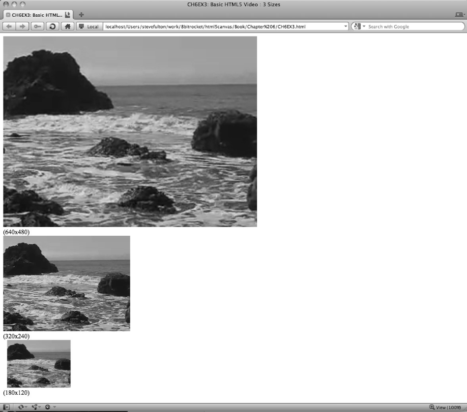

### 6.3.3　调整视频的宽度和高度

例6-2演示了如何在页面中使用默认的宽度和高度嵌入视频。然而，在实际情况中，有许多原因需要在HTML页面中修改视频默认的宽度和高度，例如让视频适配页面某个部分的大小，或者放大视频让用户更容易观看。与使用标签在HTML中嵌入一张图片类似，也可以根据<video>标签的width和height属性的设置视频缩放，将其缩放为任意大小。还有一点与标签类似，就是缩放并不影响对象下载时的体积。如果一个640 × 480的视频大小是5MB，当它以180 × 120显示时依然是5MB，只是进行了缩放而已。

在例6-3（CH6EX3.html）中，以3种不同的尺寸将一个相同的视频显示在同一个页面上。图6-3展示了这个页面在Google Chrome浏览器中运行的效果。


<center class="my_markdown"><b class="my_markdown">图6-3　在标签中控制视频的宽度和高度</b></center>

例6-3　用3种尺寸显示HTML5视频

```javascript
<!doctype html>
<html lang="en">
<head>
<meta charset="UTF-8">
<title>CH6EX3: Basic HTML5 Video: 3 Sizes</title>
</head>
<body>
<div>
<video autoplay loop controls width="640" height="480" id="thevideo">
 <source src="muirbeach.webm" type='video/webm; codecs="vp8, vorbis"' >
 <source src="muirbeach.mp4" type='video/mp4; codecs="avc1.42E01E, mp4a.40.2"' >
 <source src="muirbeach.ogg" type='video/ogg; codecs="theora, vorbis"'>
</video>
</div>
<div>
(640×480)
<div>
<video autoplay loop controls width="320" height="240"id="thevideo">
 <source src="muirbeach.webm" type='video/webm; codecs="vp8, vorbis"' >
 <source src="muirbeach.mp4" type='video/mp4; codecs="avc1.42E01E, mp4a.40.2"' >
 <source src="muirbeach.ogg" type='video/ogg; codecs="theora, vorbis"'>
</video>
</div>
<div>
(320×240)
</div>
<div>
<video autoplay loop controls width="180" height="120"id="thevideo">
 <source src="muirbeach.webm" type='video/webm; codecs="vp8, vorbis"' >
 <source src="muirbeach.mp4" type='video/mp4; codecs="avc1.42E01E, mp4a.40.2"' >
 <source src="muirbeach.ogg" type='video/ogg; codecs="theora, vorbis"'>
</video> 
</div> 
(180×120)
</body>
</html>
```

接下来，本节将介绍一个更复杂，也更有效的缩放视频的示例。通过修改<video>标签的 width和height属性，可以在程序运行时动态缩放视频。尽管现实中在只有一些特殊情况下才需要这样做，但这是一个有效地展示HTML5的<video>标签强大功能的办法。

首先，在页面上添加一个HTML5的range控件。

```javascript
<form>
Video Size: <input type="range" id="videoSize"
　　 　min="80"
　 　　max="1280"
　　 　step="1"
　　 　value="320"/>
</form>
```

range控件是HTML5中新增加的一个表单控件，可以让用户使用滑动条调整数值。第3章曾详细介绍过这个控件。本示例将使用这个滑动条设置视频的尺寸。

提示

> 如果浏览器不支持range元素，就会显示一个文本框，允许用户直接输入文本。

```javascript
window.addEventListener('load', eventWindowLoaded, false);
```

为了捕获滑动条数值的变化，并将值设置为视频的尺寸，需要添加一些JavaScript代码。首先需要添加一个事件监听器，用于捕获HTML页面中新添加的表单控件videoSize的数值变化。当滑动条左右滑动时将产生一个控件的“change”事件，事件处理函数videoSizeChanged()将捕获这个事件。

```javascript
var sizeElement = document.getElementById("videoSize")
sizeElement.addEventListener('change', videoSizeChanged, false);
```

接下来，创建一个变量，用于一次性地设置视频的宽度和高度。这是因为在改变视频尺寸的时候，需要保持视频正确的横纵比，即宽度和高度的比例。为此，需要创建一个名为widthtoHeightRatio的变量，它的值是视频宽度除以高度的商。

```javascript
var widthtoHeightRatio = videoElement.width/videoElement.height;
```

最后，当用户对range控件调整videoSize时，将会调用videoSizeChanged()事件处理函数。在函数中，将使用range控件的值（target.value）设置视频的width属性，然后再用这个值除以刚刚创建的widthtoHeightRatio变量的商设置视频的height属性。这将导致在播放过程中改变视频的大小。图6-4截取了视频大小改变的一瞬间。


<center class="my_markdown"><b class="my_markdown">图6-4　用JavaScript控制视频的宽度和高度</b></center>

```javascript
function videoSizeChanged(e){
　　　var target = e.target;
　　　var videoElement = document.getElementById("theVideo");
　　　videoElement.width = target.value;
　　　videoElement.height = target.value/widthtoHeightRatio;
　 }
```

提示

> 在写这篇文章的时候，这个例子在Firefox已经不能正常工作了。

例6-4提供了这个应用程序的完整代码。

例6-4　基本的HTML5视频和改变大小的range控件

```javascript
<!doctype html>
<html lang="en">
<head>
<meta charset="UTF-8">
<title>CH6EX4: Basic HTML5 Video With Resize Range Control </title>
<script type="text/javascript">
window.addEventListener('load', eventWindowLoaded, false); 
function eventWindowLoaded(){
　 var sizeElement = document.getElementById("videoSize")
　 sizeElement.addEventListener('change', videoSizeChanged, false);
　 var videoElement = document.getElementById("theVideo");
　 var widthtoHeightRatio = videoElement.width/videoElement.height;
function videoSizeChanged(e){
　　　var target =　e.target;
　　　var videoElement = document.getElementById("theVideo");
　　　videoElement.width = target.value;
　　　videoElement.height = target.value/widthtoHeightRatio;
　 }
}
</script>
</head>
<body>
<div>
<form>
Video Size : <input type="range" id="videoSize"
　　 　min="80"
　　 　max="1280"
　 　　step="1"
　 　　value="320"/>
</form>
　<br>
</div>
<div>
<video　autoplay loop controls id="theVideo" width="320" height="240">
 <source src="muirbeach.webm" type='video/webm; codecs="vp8, vorbis"' >
 <source src="muirbeach.mp4" type='video/mp4; codecs="avc1.42E01E, mp4a.40.2"' >
 <source src="muirbeach.ogg" type='video/ogg; codecs="theora, vorbis"'>
</video>
</div>
</body>
</html>
```

