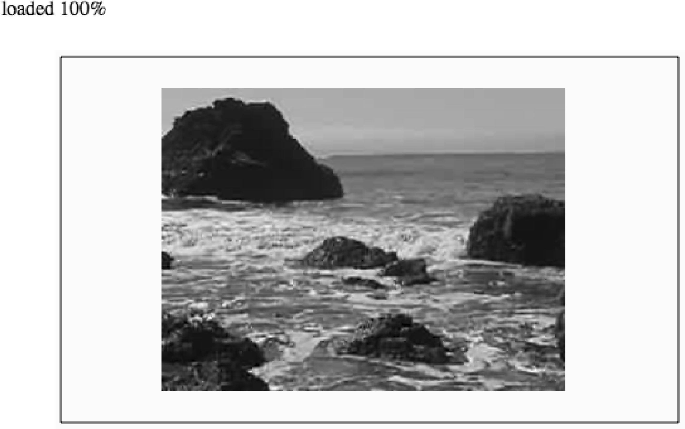

### 6.5.1　在HTML5 Canvas上显示视频

首先，需要学习在HTML5 Canvas上显示视频的基本方法。有几个重要的事情需要注意，这些事情在刚开始操作视频和画布时很容易被忽略。这里将对它们分别进行介绍，避免读者自己摸索。

#### 1．依然必须将视频嵌入在HTML中

尽管视频仅显示在HTML5的Canvas中，但是在HTML中依然需要<video>标签。这里的关键是将视频放入一个<div>标签（或类似的结构）中，然后在HTML中将<div>标签的CSS样式中的display属性设置为none。这样可以确保当在页面中加载视频时不会显示视频。如果在HTML中写代码，那么可以参考如下示例。

```javascript
<div style="position: absolute; top: 50px; left: 600px; display:none">
<video loop controls id="thevideo" width="320" height="240" preload="auto">
 <source src="muirbeach.webm" type='video/webm; codecs="vp8, vorbis"' >
 <source src="muirbeach.mp4" type='video/mp4; codecs="avc1.42E01E, mp4a.40.2"' >
 <source src="muirbeach.ogg" type='video/ogg; codecs="theora, vorbis"'>
</video>
```

然而，本节不打算使用HTML标签的方法嵌入视频。正如在6.4节中提到的，在HTML页面中嵌入视频元素会导致video对象的事件不能可靠地被触发。因此，需要一种新的策略动态加载视频——使用JavaScript创建<div>和<video>元素。

首先，需要在JavaScript中创建两个变量，用于保存动态创建的两个HTML元素的引用。videoElement变量用于保存动态创建的<video>标签的引用。videoDiv变量用于保存动态创建的<div>标签的引用。

```javascript
var videoElement;
var videoDiv;
```

提示

> 本章将用这种方式创建全局变量。尽管有许多原因不建议使用全局变量，但是在这些简单的应用程序中，使用全局变量是在画布中获取数据的快捷方法。如果读者希望使用更好的方式管理加载的资源，那么第7章的最后一节将介绍不使用全局变量预加载资源的策略。

接下来，要在eventWindowLoaded()函数中动态创建的表单元素。首先，调用DOM对象document的createElement方法创建一个<video>元素和一个<div>元素，并将它们的引用赋值给刚刚创建的两个变量。

```javascript
function eventWindowLoaded(){
　 videoElement = document.createElement("video");
　 videoDiv = document.createElement('div');
　 document.body.appendChild(videoDiv);
```

接下来，要将videoElement添加为videoDiv的子节点，也就是将它放入HTML页面的<div>标签中。然后，将<div>标签的style属性设置为display:none，使之在HTML页面中不可见。这样做的原因是希望视频在画布上显示，而不是在HTML页面上显示。

```javascript
videoDiv.appendChild(videoElement);
videoDiv.setAttribute("style", "display:none;");
```

创建一个名为videoType的新变量，用于保存将要创建的supportVideoFormat()函数的返回结果。这个函数将返回浏览器所支持的视频格式的扩展名。如果返回空字符串""，则通知用户他的浏览器不支持本应用中的视频。

```javascript
var videoType = supportedVideoFormat(videoElement);
if (videoType == ""){
　 alert("no video support");
　 return;
}
```

最后，根据supportedVideoFormat()函数返回的文件扩展名设置video元素的src属性，并为canplaythrough事件创建处理函数。

```javascript
videoElement.addEventListener("canplaythrough",videoLoaded,false);
videoElement.setAttribute("src", "muirbeach." + videoType);
}
```

当视频加载完成时，调用videoLoaded事件处理函数，在其中将调用canvasApp()函数。

```javascript
function videoLoaded(event){
　 canvasApp();
}
```

在最后一段代码运行前需要先定义supportedVideoFormat()函数。这个函数的目的很简单：当在HTML页面中动态添加video对象时，不能定义多个<source>标签。因此，需要调用video对象的canPlayType()方法。这样可以知道应该加载哪种类型的视频文件。

canPlayType()方法只有一个参数：一个MIME类型。它返回一个文本字符串，取值是“maybe”、“probably”和空字符串中的一个。

+ ""空字符串：这个返回值表示浏览器不能渲染该类型。
+ maybe：这个返回值表示浏览器不能确定是否可以显示该类型。
+ probably：这个返回值表示浏览器确定可以在audio或video元素中显示这种类型。

以上这些值用来判断可以加载和播放哪种类型的媒体文件。在本次练习中，假设maybe和probably都等价于 yes，即可以支持。如果检测到可以支持video/webm、video/mp4和video/ogg类型中的一种，那么函数将返回这种MIME类型对应的扩展名，这样就可以加载该视频文件了。

在下面的函数中，video表示待测试的HTMLVideoElement的实例。returnExtension变量表示在调用canPlayType函数时返回maybe或probably的MIME类型所对应的第一个合法的扩展名。

```javascript
function supportedVideoFormat(video){
　 var returnExtension = "";
　 if (video.canPlayType("video/webm")=="probably" ||
　　　 video.canPlayType("video/webm")== "maybe"){
　　　　 returnExtension = "webm";
　 } else if(video.canPlayType("video/mp4")== "probably" ||
　　　 video.canPlayType("video/mp4")== "maybe"){
　　　　 returnExtension = "mp4";
　 } else if(video.canPlayType("video/ogg")=="probably" ||
　　　 video.canPlayType("video/ogg")== "maybe"){
　　　　 returnExtension = "ogg";
　 }
　 return returnExtension;
}
```

当没有找到合法的视频时，函数内部没有进行检测，而是直接返回空字符串""。在实际情况中，则需要在调用该函数的代码中进行检查，对这种情况进行捕获并在程序执行过程中对用户进行提示。本示例对返回值进行了检查，并使用了alert()函数进行警告（上文已经介绍过了）。

#### 2．像图片一样显示视频

当编写代码在画布上显示视频时，需要使用context.drawImage()函数，就像显示一个静态图片一样。不要试图寻找drawVideo()方法，因为在HTML5 Canvas的规范中没有这个方法。下面的代码将在x轴和y轴坐标（85，30）的位置显示videoElement变量中储存的视频。

```javascript
context.drawImage(videoElement , 85, 30);
```

然而，第一次绘制视频的时候会发现视频不会变化，而是一直停留在第一帧。是不是什么事情做错了？当然不是，而是需要多做一些事情才能让它运转。

#### 3．设置更新显示间隔

正如前面章节所介绍的动画那样，在HTML5 Canvas上使用drawImage()方法绘制的视频并不会自动更新。不论HTML上的视频是否可见，都必须在一个循环中不断调用drawImage()方法才能将HTML页面中播放的视频画面更新到画布上。为此，首先需要调用视频的play()方法，然后使用setTimeout()循环每隔20ms调用一次drawScreen()函数。这段代码将会放入canvasApp()函数中，在视频加载完成后调用。

```javascript
videoElement.play();
functiongameLoop(){
　 window.setTimeout(gameLoop,20);
　 drawScreen();
}
gameLoop();
```

在drawScreen()函数中将会调用drawImage()方法显示视频。由于每隔20ms就会调用一次，因此将会不断刷新在画布上显示的视频。

```javascript
function　drawScreen (){
　 context.drawImage(videoElement , 85, 30);
}
```

例6-6给出了完整的源代码。该示例在Canvas上显示视频，并使用setInterval()函数进行刷新。图6-6演示了代码在浏览器中运行的效果。

例6-6　在画布上加载基础的HTML5视频

```javascript
<!doctype html>
<html lang="en">
<head>
<meta charset="UTF-8">
<title>CH6EX6 : Basic HTML5 Load Video Onto The Canvas</title>
<script src="modernizr.js"></script>
<script type="text/javascript">
window.addEventListener('load', eventWindowLoaded, false); 
var videoElement;
var videoDiv;
function eventWindowLoaded(){
　 videoElement = document.createElement("video");
　 videoDiv = document.createElement('div');
　 document.body.appendChild(videoDiv);
　 videoDiv.appendChild(videoElement);
　 videoDiv.setAttribute("style", "display:none;");
　 var videoType = supportedVideoFormat(videoElement);
　 if (videoType == ""){
　　　alert("no video support");
　　　return;
　 }
　 videoElement.addEventListener("canplaythrough",videoLoaded,false);
　 videoElement.setAttribute("src", "muirbeach." + videoType);
}
function supportedVideoFormat(video){
　 var returnExtension = "";
　 if (video.canPlayType("video/webm")=="probably" ||
　　　 video.canPlayType("video/webm")== "maybe"){
　　　　 returnExtension = "webm";
　 } else if(video.canPlayType("video/mp4")== "probably" ||
　　　 video.canPlayType("video/mp4")== "maybe"){
　　　　 returnExtension = "mp4";
　 } else if(video.canPlayType("video/ogg")=="probably" ||
　　　 video.canPlayType("video/ogg")== "maybe"){
　　　　 returnExtension = "ogg";
　 }
　 return returnExtension;
}
function canvasSupport (){
　　 return Modernizr.canvas;
}
function videoLoaded(event){
　 canvasApp();
}
function canvasApp(){
　 if (!canvasSupport()){
　　　　　return;
　　　　}
function　drawScreen (){
　　　//背景
　　　context.fillStyle = '#ffffaa';
　　　context.fillRect(0, 0, theCanvas.width, theCanvas.height);
　　　//边框
　　　context.strokeStyle = '#000000';
　　　context.strokeRect(5,　5, theCanvas.width-10, theCanvas.height-10);
　　　//视频
　　　context.drawImage(videoElement , 85, 30);
　 }
　 var theCanvas = document.getElementById('canvasOne');
　 var context = theCanvas.getContext('2d');
　 videoElement.play();
　 functiongameLoop(){
　　　window.setTimeout(gameLoop,20);
　　　drawScreen();
　 }
　 gameLoop();
}
</script>
</head>
<body>
<div style="position: absolute; top: 50px; left: 50px;">
<canvas id="canvasOne" width="500" height="300">
Your browser does not support the HTML 5 Canvas.
</canvas>
</div>
</body>
</html>
```


<center class="my_markdown"><b class="my_markdown">图6-6　在HTML5 Canvas上显示视频</b></center>

