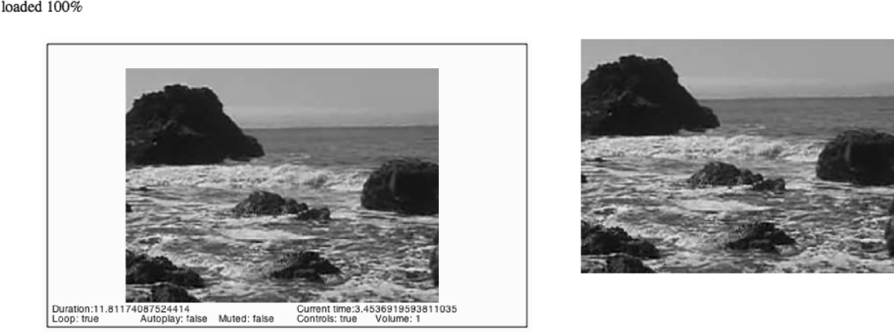

### 6.5.2　HTML5的视频属性

前面已经介绍了一些HTMLVideoElement从HTMLMediaElement继承的属性。如果要将视频显示在画布上，就需要更详细地了解它们是如何运作的。

这个示例将涉及HTMLVideoElement对象的7个与播放视频相关的属性：duration、currentTime、loop、autoplay、muted、controls和volume。其中，duration、loop和autoplay不会变化，因为在嵌入视频时就已经确定了它们的值。由于在预加载视频之后使用JavaScript调用play()方法，因此autoplay属性即使设置为false，视频也会播放。在视频播放时，其他属性会被更新。

为了在画布上显示这些属性的值，需要在setTimeout()循环所调用的drawScreen()函数中以文本的方式绘制这些值。以下是新的drawScreen()函数，其中添加了显示这些属性的代码。

```javascript
function　drawScreen (){
　　　//背景
　　　context.fillStyle = '#ffffaa';
　　　context.fillRect(0, 0, theCanvas.width, theCanvas.height);
　　　//边框
　　　context.strokeStyle = '#000000';
　　　context.strokeRect(5,　5, theCanvas.width-10, theCanvas.height-10);
　　　//视频
　　　context.drawImage(videoElement , 85, 30);
　　　//文本
　　　context.fillStyle　　= "#000000";
　　　context.fillText　("Duration:" + videoElement.duration,　10 ,280);
　　　context.fillText　("Current time:" + videoElement.currentTime,　260 ,280);
　　　context.fillText　("Loop: " + videoElement.loop,　10 ,290);
　　　context.fillText　("Autoplay: " + videoElement.autoplay,　100 ,290);
　　　context.fillText　("Muted: " + videoElement.muted,　180 ,290);
　　　context.fillText　("Controls: " + videoElement.controls,　260 ,290);
　　　context.fillText　("Volume: " + videoElement.volume,　340 ,290);
　 }
```

图6-7所示为这些属性被显示在画布上的效果。请注意，<video>标签被放置在画布的旁边，而且没有将其CSS的display属性设置为none。这样可以将嵌入在HTML页面中的视频与在画布上播放的视频进行对比。如果将鼠标指针悬停在HTML页面嵌入的视频上面，就可以看到控制面板。在调整音量的时候，可以看到显示在画布上的volume属性也会一同变化。如果将嵌入的视频暂停，画布上的视频也会暂停，而且currentTime属性也会停止变化。


<center class="my_markdown"><b class="my_markdown">图6-7　在画布上显示视频及其属性与使用<video>标签嵌入的视频</b></center>

这个示例可以很好地展示画布上的视频与使用<video>标签嵌入的视频之间的联系。尽管它们采用完全不同的方式来现实，但实际上它们的作用相同。

运行下载代码中的CH6EX7.html文件可以观察例6-7是如何运行的。

例6-7　视频属性

```javascript
<!doctype html>
<html lang="en">
<head>
<meta charset="UTF-8">
<title>CH6EX7 : Video Properties</title>
<script src="modernizr.js"></script>
<script type="text/javascript">
window.addEventListener('load', eventWindowLoaded, false); 
var videoElement;
var videoDiv;
function eventWindowLoaded(){
　 videoElement = document.createElement("video");
　 var videoDiv = document.createElement('div');
　 document.body.appendChild(videoDiv);
　 videoDiv.appendChild(videoElement);
　 videoDiv.setAttribute("style", "position: absolute; top: 50px; left: 600px; ");
　 var videoType = supportedVideoFormat(videoElement);
　 if (videoType == ""){
　　　alert("no video support");
　　　return;
　 }
　 videoElement.addEventListener("canplaythrough",videoLoaded,false);
　 videoElement.setAttribute("src", "muirbeach." + videoType);
}
function supportedVideoFormat(video){
　 var returnExtension = "";
　 if (video.canPlayType("video/webm")=="probably" ||
　　　 video.canPlayType("video/webm")== "maybe"){
　　　　 returnExtension = "webm";
　 } else if(video.canPlayType("video/mp4")== "probably" ||
　　　 video.canPlayType("video/mp4")== "maybe"){
　　　　 returnExtension = "mp4";
　 } else if(video.canPlayType("video/ogg")=="probably" ||
　　　 video.canPlayType("video/ogg")== "maybe"){
　　　　 returnExtension = "ogg";
　 }
　 return returnExtension;
}
function canvasSupport (){
　　 return Modernizr.canvas;
}
function videoLoaded(){
　 canvasApp();
}
function canvasApp(){
　if (!canvasSupport()){
　　 return;
　}
　function　drawScreen (){
　　　//背景
　　　context.fillStyle = '#ffffaa';
　　　context.fillRect(0, 0, theCanvas.width, theCanvas.height);
　　　//边框
　　　context.strokeStyle = '#000000';
　　　context.strokeRect(5, 5, theCanvas.width-10, theCanvas.height-10);
　　　//视频
　　　context.drawImage(videoElement , 85, 30);
　　　// 文本
　　　context.fillStyle = "#000000";
　　　context.fillText ("Duration:" + videoElement.duration,　10 ,280);
　　　context.fillText ("Current time:" + videoElement.currentTime,　260 ,280);
　　　context.fillText ("Loop: " + videoElement.loop,　10 ,290);
　　　context.fillText ("Autoplay: " + videoElement.autoplay,　100 ,290);
　　　context.fillText ("Muted: " + videoElement.muted,　180 ,290);
　　　context.fillText ("Controls: " + videoElement.controls,　260 ,290);
　　　context.fillText ("Volume: " + videoElement.volume,　340 ,290);
　}
　var theCanvas = document.getElementById('canvasOne');
　var context = theCanvas.getContext('2d');
　videoElement.play();
　functiongameLoop(){
　　 window.setTimeout(gameLoop,20);
　　 drawScreen();
　}
　gameLoop();
}
</script>
</head>
<body>
<div style="position: absolute; top: 50px; left: 50px;">
<canvas id="canvasOne" width="500" height="300">
 Your browser does not support HTML 5 Canvas.
</canvas>
</div>
</body>
</html>
```

提示

> 如果想查看HTMLVideoElement全部的事件和属性可访问w3官网。

