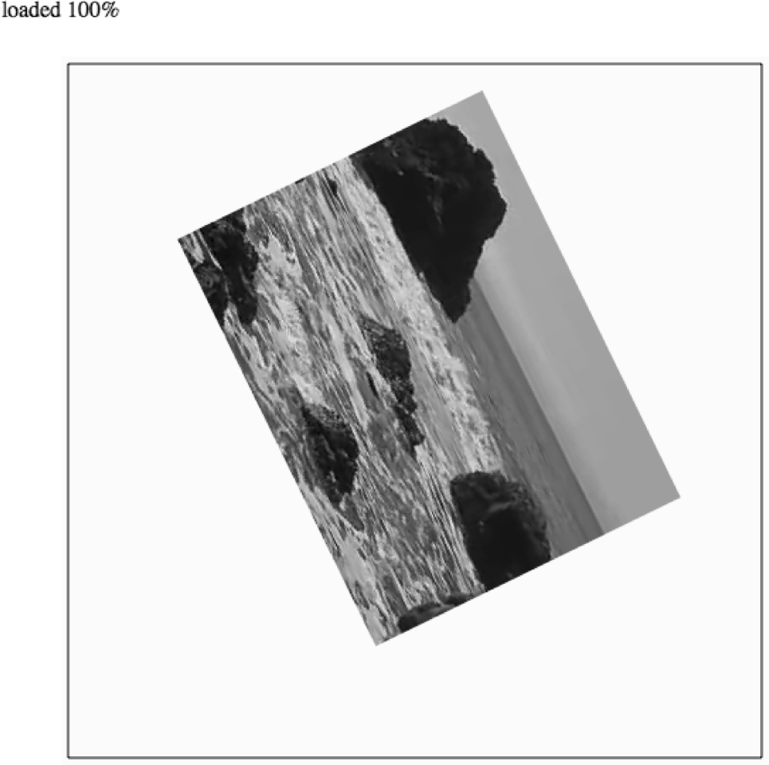

### 6.6.2　在画布上旋转视频

用户既可以在画布上显示一个静止的视频，又可以在屏幕上变换其形状。例如，使用alpha通道将其设置为半透明，或者旋转视频。在画布上对视频应用这些变换非常简单，其操作方法与在一张图片或一个绘制对象上应用形状变换的方法类似。

这个示例将创建一个顺时针旋转的视频。为了实现这个效果，需要创建一个名为rotation的变量。这个变量用于存储视频旋转角度的值。这个变量定义在drawScreen()函数外面的canvasApp()函数中。

```javascript
var rotation = 0;
```

drawScreen()函数是本示例中所有操作的关键所在。首先，需要保存当前画布的环境，这样才能在应用形状变换之后将其恢复。第2章已详细介绍了这个过程，在此对其进行简单的回顾。从本质来说，在画布上的形状变换是全局性的。这意味着它将影响所有的事情。由于画布是在实时模式下工作的，因此没有可供操作的对象堆栈。替代方法是，在变换形状之前需要保存画布的环境，然后变换形状，最后恢复保存的环境。

首先，保存环境。

```javascript
context.save();
```

接下来，重置环境的形状变换，这个操作将清除之前所应用的所有变换效果。

```javascript
context.setTransform(1,0,0,1,0,0);
```

然后，需要设置用于计算旋转角度的变量。x变量和y变量用于设置视频左上角在画布上的位置。在计算视频从中心所旋转的角度时需要用到videoWidth和videoHeight变量。

```javascript
var x=100;
var y=100;
var videoWidth=320;
var videoHeight=240;
```

现在，需要计算rotation变量的值，也就是视频在画布上旋转的角度。旋转角度从0开始，在每次调用drawScreen()时将增加角度。然而，context.rotate()方法需要将角度转换为弧度，作为一个长整型的参数传递。下面这行代码可以将rotation变量的值转换为弧度，并保存在一个名为angleInRadians的变量中。

```javascript
var angleInRadians = rotation * Math.PI / 180;
```

接下来，需要找到视频的中心点在画布上的坐标，这样才能以这个点为中心进行旋转。将x变量的值加上视频宽度的一半可以得到x轴坐标。将y变量的值加上视频高度的一半可以得到y轴坐标。然后，将这个两个值作为参数传递给context.translate()函数，这样就可以在这个点进行旋转了。这样做的原因是，这里旋转的并不是视频对象，而是将整个画布相对于显示的视频进行旋转。

```javascript
context.translate(x+.5*videoWidth, y+.5*videoHeight);
```

其余的代码非常简单易懂。首先，调用环境的rotate()函数实现旋转，传入的参数是角度所对应的弧度值。

```javascript
context.rotate(angleInRadians);
```

然后调用drawImage()函数，传入视频对象以及希望视频显示位置的x轴和y轴的坐标。尽管接下来的处理有些复杂，但却是合理的。由于已经使用context.translate()函数将画布移到了视频的中心，因此现在需要将视频以左上角的位置进行放置。为了找到左上角的位置，需要减去视频宽度的一半得到x轴的位置，并且减去视频高度的一半得到y轴的位置。

```javascript
context.drawImage(videoElement ,-.5*videoWidth, -.5*videoHeight);
```

最后，应该恢复形状变换之前所保存的画布状态，并更新rotation变量的值。这样，在下次调用drawScreen()函数时就可以得到一个新的角度了。

```javascript
context.restore();
rotation++;
```

在每次调用drawScreen()函数在画布上绘制视频时，视频都会顺时针旋转1°。如果修改drawScreen()函数的最后一行代码，改变rotation变量每次增加的值就可以很容易地增加视频的旋转速度。

以下是本示例中drawScreen()函数的完整代码。

```javascript
function　drawScreen (){
　　　//背景
　　　context.fillStyle = '#ffffaa';
　　　context.fillRect(0, 0, theCanvas.width, theCanvas.height);
　　　//边框
　　　context.strokeStyle = '#000000';
　　　context.strokeRect(5,　5, theCanvas.width-10, theCanvas.height-10);
　　　//视频
　　　//*** 开始计算旋转
　　　context.save();
　　　context.setTransform(1,0,0,1,0,0); //将形状变换重置为初始值，清除所有效果
　　　var angleInRadians =rotation * Math.PI / 180;
　　　var x=100;
　　　var y=100;
　　　var videoWidth=320;
　　　var videoHeight=240;
　　　context.translate(x+.5*videoWidth, y+.5*videoHeight);
　　　// 将形状变换的原点移动到视频窗口的中心
　　　context.rotate(angleInRadians);
　　　//****
　　　context.drawImage(videoElement ,-.5*videoWidth, -.5*videoHeight);
　　　//*** 恢复屏幕
　　　context.restore();
　　　rotation++;
　　　//***
}
```

图6-9展示了视频在画布上旋转的效果。读者可以在例6-9中查看完整的源代码。


<center class="my_markdown"><b class="my_markdown">图6-9　在画布上旋转视频</b></center>

例6-9　旋转视频

```javascript
<!doctype html>
<html lang="en">
<head>
<meta charset="UTF-8">
<title>CH6EX9: Video Rotation Transform</title>
<script src="modernizr.js"></script>
<script type="text/javascript">
window.addEventListener('load', eventWindowLoaded, false); 
var videoElement;
var videoDiv;
function eventWindowLoaded(){
　 videoElement = document.createElement("video");
　 videoDiv = document.createElement('div');
　 document.body.appendChild(videoDiv);
　 videoDiv.appendChild(videoElement);
　 videoDiv.setAttribute("style", "display:none;");
　 var videoType = supportedVideoFormat(videoElement);
　 if (videoType == ""){
　　　alert("no video support");
　　　return;
　 }
　 videoElement.addEventListener("canplaythrough",videoLoaded,false);
　 videoElement.setAttribute("src", "muirbeach." + videoType);
}
function supportedVideoFormat(video){
　 var returnExtension = "";
　 if (video.canPlayType("video/webm")=="probably" ||
　　　 video.canPlayType("video/webm")== "maybe"){
　　　　 returnExtension = "webm";
　 } else if(video.canPlayType("video/mp4")== "probably" ||
　　　 video.canPlayType("video/mp4")== "maybe"){
　　　　 returnExtension = "mp4";
　 } else if(video.canPlayType("video/ogg")=="probably" || 
　　　 video.canPlayType("video/ogg")== "maybe"){
　　　　 returnExtension = "ogg";
　 }
　 return returnExtension;
}
function canvasSupport (){
　　 return Modernizr.canvas;
}
function videoLoaded(){
　 canvasApp();
}
function canvasApp(){
　if (!canvasSupport()){
　　　　　return;
　　　　}
　 //*** 设置旋转值
　 var rotation = 0;
　 //***
　function　drawScreen (){
　　　//背景
　　　context.fillStyle = '#ffffaa';
　　　context.fillRect(0, 0, theCanvas.width, theCanvas.height);
　　　//边框
　　　context.strokeStyle = '#000000';
　　　context.strokeRect(5,　5, theCanvas.width-10, theCanvas.height-10);
　　　//视频
　　　//*** 开始计算旋转
　　　context.save();
　　　context.setTransform(1,0,0,1,0,0); //将形状变换重置为初始值，清除所有效果
　　　var angleInRadians =rotation * Math.PI / 180;
　　　var x=100;
　　　var y=100;
　　　var videoWidth=320;
　　　var videoHeight=240;
　　　context.translate(x+.5*videoWidth, y+.5*videoHeight);
　　　// 将形状变换的原点移动到视频窗口的中心
　　　context.rotate(angleInRadians);
　　　//****
　　　context.drawImage(videoElement ,-.5*videoWidth, -.5*videoHeight);
　　　//*** 恢复屏幕
　　　context.restore();
　　　rotation++;
　　　//***
　 }
　 var theCanvas = document.getElementById('canvasOne');
　 var context = theCanvas.getContext('2d');
　 videoElement.setAttribute("loop", "true");
　 videoElement.play();
　 functiongameLoop(){
　　　window.setTimeout(gameLoop,20);
　　　drawScreen();
　 }
　 gameLoop();
}
</script>
</head>
<body>
<div style="position: absolute; top: 50px; left: 50px;">
<canvas id="canvasOne" width="500" height="500">
Your browser does not support HTML 5 Canvas.
</canvas>
</div>
</body>
</html>
```

