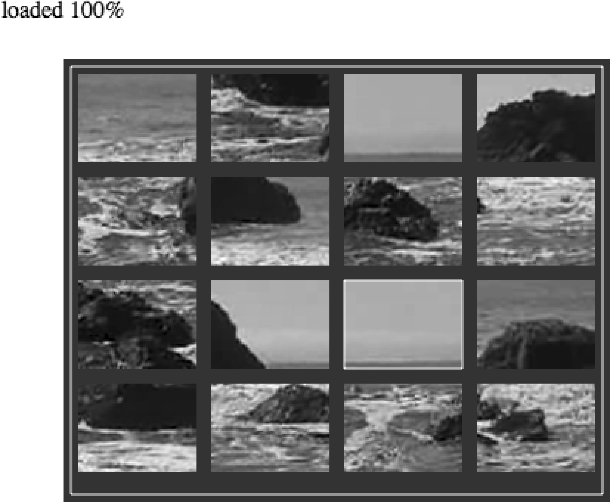

### 6.6.3　在画布上制作视频拼图

至此，已经介绍了本节大部分的示例。接下来，将基于画布上显示的视频创建一个拼图游戏，如图6-10所示。以下是创建游戏的主要操作步骤。

（1）在画布上加载一个视频，但并不将它显示出来。

（2）决定拼图中有多少个碎片。

（3）创建一个board数组，用于保存所有的拼图碎片。

（4）所有的碎片将显示在一个4 × 4的网格中。

（5）将拼图碎片打乱，随机放在board数组中。

（6）为鼠标按键创建一个事件监听器。

（7）设置一个时间间隔循环调用drawScreen()函数。

（8）等待用户单击一个拼图碎片。

（9）在等待过程中，将视频不同的部分显示出来，就像显示单个视频那样。

（10）当用户单击一个拼图碎片时，碎片将以黄色高亮显示。

（11）如果用户选择了两个碎片，则交换两个碎片的位置。

（12）用户尝试将所有碎片都放回原位，这样用户就能看到完整的视频了。


<center class="my_markdown"><b class="my_markdown">图6-10　视频拼图</b></center>

#### 1．游戏设置

首先，需要设置一些变量用于定义游戏区域。下面是每个变量的用途。

+ rows：拼图网格的行数。
+ cols：拼图网格的列数。
+ xPad：两列之间的距离，单位是像素。
+ yPad：两行之间的距离，单位是像素。
+ startXOffset：距离画布左边的像素数，将从此位置开始绘制拼图碎片的网格。
+ startYOffset：距离画布顶端的像素数，将从此位置开始绘制拼图碎片的网格。
+ partWidth：每一个拼图碎片的宽度。
+ partHeight：每一个拼图碎片的高度。
+ board：用于保存拼图碎片的二维数组。

下面的代码用于定义这些变量。

```javascript
var rows = 4;
var cols = 4;
var xPad = 10;
var yPad = 10;
var startXOffset = 10;
var startYOffset = 10;
var partWidth = videoElement.width/cols;
var partHeight = videoElement.height/rows;
var board = new Array();
```

接下来，需要初始化board数组，以在其中放入表示每一个拼图碎片的动态对象。首先循环cols次，遍历网格中的每一列；然后再循环rows次，创建每一行中的动态对象。在动态对象中将包含以下属性。

+ finalCol：最终所在列，即当拼图完成时该碎片位置的列数。在制作这个碎片时，将会用这个值来计算应该剪切视频的哪个部分。
+ finalCol：最终所在行，即当拼图完成时该碎片位置的行数。在制作这个碎片时，将会用这个值来计算应该剪切视频的哪个部分。
+ selected：这个是一个布尔值，初始值是false。当用户单击一个碎片时，将根据这个值确定是否将它高亮显示，以及是否将两个碎片交换位置。

在初始化board数组时用到了两个for:next的嵌套循环。建议读者尽快熟悉这种结构，因为本书将多次在游戏中使用这种结构。对于需要通过一个网格进行显示和操作的2D游戏和应用，两层嵌套循环会特别有用。

```javascript
for (var i = 0; i < cols; i++){
　　　board[i] = new Array();
　　　for (var j =0; j < rows; j++){
　　　　 board[i][j] = { finalCol:i,finalRow:j,selected:false };
　　　}
}
```

现在，board数组初始化完毕，接下来需要调用randomizeBoard()函数。这个函数将打乱碎片并将其随机放在屏幕上。随后将介绍这个函数。设置游戏的最后一步是为mouseup事件添加一个事件处理函数（用于监听用户释放鼠标按钮的事件），然后设置一个间隔，每隔20ms调用一次drawScreen()函数。

```javascript
board = randomizeBoard(board);
theCanvas.addEventListener("mouseup",eventMouseUp, false);
function gameLoop(){
　　　　 window.setTimeout(gameLoop,20);
　　　　 drawScreen();
　　}
gameLoop();
```

#### 2．随机放置拼图碎片

randomizeBoard()函数需要传入board变量并对其进行操作。之所以这样设计这个函数，是为了便于迁移到其他应用程序。

为了随机放置拼图碎片，首先需要创建一个名为newBoard的新数组，用于存储随机顺序的拼图碎片。newBoard变量一般被称作并行数组，它将成为一个随机化的原始数组。然后，定义一个名为cols的局部变量，它的初始值是board数组的长度。board数组就是传入函数的参数。再创建一行局部变量rows，它的初始值是每一列的行数，也就是board[0]中数组的长度。由于每一行和每一列的长度都相同，因此可以用第一列中的行数代表其他列的行数。这样就完成了一个用于放置随机碎片的容器。

```javascript
function randomizeBoard(board){
　　var newBoard = new Array();
　　var cols = board.length;
　　var rows = board[0].length
```

接下来需要遍历每一列与每一行，随机地从board数组中挑选一个碎片并将它移动到newBoard中。

```javascript
for (var i = 0; i < cols; i++){
```

提示

> 这里再次用到了for:next两重嵌套循环。

在每一次进行外层循环时都要创建一个新的数组，并在第二层循环中填充该数组。然后进入第二层循环。当在newBoard数组中找到一个可放置碎片的随机位置时，就将found变量设置为true。在rndRow和rndCol变量中放置两个随机值，用于尝试为拼图碎片找到一个随机位置。

```javascript
newBoard[i] = new Array();
　　　　 for (var j =0; j < rows; j++){
　　　　　　var found = false;
　　　　　　var rndCol = 0;
　　　　　　var rndRow = 0;
```

现在需要在newBoard中找到一个位置，用于将碎片从board数组放入其中。这里将使用while循环，当found变量为false时不停地循环查找。为了找到并移动碎片，需要随机选择行和列，然后查看对应位置（board[rndCol][rndRow]）是否为false。如果不是false，就将其中的碎片移动到newBoard数组中。将found变量设置为true，这样就可以跳出while循环，然后移动到newBoard的下一个需要填充的位置。

```javascript
while (!found){
　 var rndCol = Math.floor(Math.random()* cols);
　 var rndRow = Math.floor(Math.random()* rows);
　 if (board[rndCol][rndRow] != false){
　　　found = true;
　 }
}
```

最后，把在board中找到的碎片填充到newBoard的当前位置。将borad数组中的碎片设置为false，这样在填充下一个碎片的时候就不会使用同一个碎片了。当newBoard被填充完毕的时候，就将它作为一个已经将拼图碎片随机化的新数组返回。

```javascript
　　　newBoard[i][j] = board[rndCol][rndRow];
　　　board[rndCol][rndRow] = false;
　 }
　}　　retun newBoard;
}
```

#### 3．在屏幕上绘制

drawScreen()函数是本应用程序的核心。它每隔一段时间就被调用一次，用于更新视频画面和在屏幕上绘制拼图碎片。drawScreen()大体上与本书中构建的其他应用程序中的函数类似。在函数开始时，先在屏幕上绘制背景和一个边框。

```javascript
function　drawScreen (){
　　　//背景
　　　context.fillStyle = '#303030';
　　　context.fillRect(0, 0, theCanvas.width, theCanvas.height);
　　　//边框
　　　context.strokeStyle = '#FFFFFF';
　　　context.strokeRect(5,　5, theCanvas.width-10, theCanvas.height-10);
```

然而，这个函数的首要工作是设置另一个两重嵌套的for:next循环，用于将拼图碎片绘制在画布上。在这个嵌套循环中需要做3件事。

（1）在画布上绘制一个网格，根据拼图碎片在二维数组board中的位置放置这些碎片。

（2）以每一个碎片对应的动态对象中的finalCol和finalRow属性为依据，在视频中找到合适的部分，用于绘制碎片。

（3）如果碎片的selected属性被设置为true，就在碎片周围绘制一个黄色的边框。

在循环开始时，为了从视频对象中“剪切”出拼图碎片，需要找到x和y的位置（即imageX和imageY）。为此，需要访问所创建的碎片对象的finalRow和finalCol属性，将它们分别乘以partWidth和partHeight就可以得到x和y的值，即碎片上显示的视频的起始位置。

```javascript
for (var c = 0; c < cols; c++){
　 for (var r = 0; r <rows; r++){
　　　var tempPiece　= board[c][r];
　　　var imageX = tempPiece.finalCol*partWidth;
　　　var imageY = tempPiece.finalRow*partHeight;
```

在得到了每个拼图碎片上显示视频的起始位置之后，还需要知道碎片在画布上的显示位置。下面的代码可能让人有些困惑，但它实际的算法很简单。为了找到一个碎片的x轴坐标（即placeX），需要将partWidth乘以当前循环的列数c，加上当前循环的列数与xPad的乘积，再加上startXOffset。其中，xPad是两个碎片横向间距的像素数。startXOffset是整个拼图板左上角的x轴坐标。计算placeY的过程类似，只不过用到的变量是r（行数）、yPad和partHeight。

```javascript
var placeX = c*partWidth+c*xPad+startXOffset;
var placeY = r*partHeight+r*yPad+startYOffset;
```

现在，需要将碎片绘制在画布上。首先，将每个拼图碎片上显示的视频从视频对象上“剪切”出来（实际上并不会真的剪切）。这里将再次用到drawImage()函数。虽然之前曾多次用到这个函数，但是这次使用drawImage()函数时需要传递9个参数。

+ videoElement：需要显示的图像，在本例中为视频。
+ imageX：图片待显示部分的左上角的x轴坐标。
+ imageY：图片待显示部分的左上角的y轴坐标。
+ partWidth：待显示的矩形区域的宽度。
+ partHeight：待显示的矩形区域的高度。
+ placeX：图片在画布上放置位置的x轴坐标。
+ placeY：图片在画布上放置位置的y轴坐标。
+ partWidth：显示在画布上的图片的宽度。
+ partHeight：显示在画布上的图片的高度。

前面已经介绍了如何计算大多数变量的值，接下来，需要了解在调用drawImage()这个API函数时应该如何传递这些变量。

```javascript
context.drawImage(videoElement, imageX, imageY, partWidth, partHeight,
　　placeX, placeY, partWidth, partHeight);
```

最后，在这个函数中还需要做一件事情。如果拼图碎片被标记为“被选中”，也就是当其selected属性值为true的时候，就需要在碎片的周围绘制一个黄色的边框。

```javascript
　　　　 if (tempPiece.selected){
　　　　　　context.strokeStyle = '#FFFF00';
　　　　　　context.strokeRect( placeX,　placeY, partWidth, partHeight);
　　　　 }
　　　}
　 }
}
```

#### 4．检测鼠标与画布的交互

前面在canvasApp()函数中曾经为mouseup事件设置了一个事件监听器，即eventMouseUp函数。现在创建这个函数。

```javascript
videoElement.addEventListener("canplaythrough",videoLoaded,false);
```

当按下鼠标按键时，在eventMouseUp()函数中做的第一件事情就是找到鼠标指针的x轴和y轴的坐标。这个坐标将用于确定用户单击的是哪一块拼图碎片。

由于一些浏览器中支持事件对象的pageX、pageY属性，而在另一些浏览器中支持clientX、clientX属性，因此需要支持两种情况。无论浏览器支持哪种属性，都将使用这些属性将鼠标指针的x轴和y轴的坐标保存在mouseX和mouseY变量中。

```javascript
function eventMouseUp(event) {
　　var mouseX;
　　var mouseY;
　　var pieceX;
　　var pieceY;
　　var x;
　　var y;
　　if (event.pageX || event.pageY) {
　　　 x = event.pageX;
　　　 y = event.pageY;
　　} else {
　　　 x = e.clientX + document.body.scrollLeft +
　　　　　 document.documentElement.scrollLeft;
　　　 y = e.clientY + document.body.scrollTop +
　　　　　 document.documentElement.scrollTop;
　　}
　　　 x -= theCanvas.offsetLeft;
　　　 y -= theCanvas.offsetTop;
　　mouseX=x;
　　mouseY=y;
}
```

#### 5．利用点类型的碰撞检测进行单击测试

现在已经知道了用户单击了什么地方，接下来需要确定是否“选中”了一块拼图碎片。如果选中了，就要将这块碎片的selected属性设置为true。下面将要介绍一种简单的“点类型”的碰撞检测方法。这种方法可以判断出，当鼠标按键被按下时，一个鼠标指针的x轴、y轴坐标（点）是否在一个拼图碎片内（碰撞）。

首先，创建一个名为selectedList的局部变量。当需要交换board数组中的碎片时，要用到这个变量。接下来，将使用一个两重嵌套的for:next循环，遍历board数组中的所有碎片。在for:next循环中要做的第一件事是找到当前碎片左上角的x轴和y轴的坐标。可以通过board[c][r]获得当前碎片对象的引用。然后，将计算得到的结果保存在pieceX和pieceY变量中。

```javascript
var selectedList= new Array();
for (var c = 0; c < cols; c++){
　 for (var r =0; r < rows; r++){
　　　pieceX = c*partWidth+c*xPad+startXOffset;
　　　pieceY = r*partHeight+r*yPad+startYOffset;
```

接下来，将根据这些值的运算结果进行点类型的碰撞检测。这里使用一个稍微有些复杂的if:then语句，同时检测以下4个条件。

mouseY >= pieceY：鼠标指针低于或等于碎片的顶端。

mouseY <= pieceY+partHeight：鼠标指针高于或等于碎片的底部。

mouseX >= pieceX：鼠标指针位于碎片的左边界上或在其右侧。

mouseX <= pieceX+partWidth：鼠标指针位于碎片的右边界上或在其左侧。

只有当以上所有条件都等于true时，才认为这次单击选中了屏幕上的一个碎片。

```javascript
if ( (mouseY >= pieceY)&& (mouseY <= pieceY+partHeight)&& (mouseX >= pieceX)&&
　　 (mouseX <= pieceX+partWidth)){
```

如果所有条件都为true，那么再判断当前碎片对象的selected属性：如果是false，就设置为true；如果是true，就设置为false。这样可以在用户不想移动这个碎片的时候，允许用户取消选择。

```javascript
　 if ( board[c][r].selected){
　　　　 board[c][r].selected = false;
　 } else {
　　　　 board[c][r].selected = true;
　 }
}
```

在for:next嵌套循环的最后，一定要检测每一个碎片，查看其selected属性是否为true。如果是，就将这个碎片放入本地的selectedList数组，这样才能执行交换碎片的操作。

```javascript
　 if (board[c][r].selected){
　　　　 selectedList.push({col:c,row:r})
　 }
　 }
}
```

#### 6．在二维数组中交换两个元素

现在需要检测是否已经有两个碎片被标记为选中了。如果是，就需要交换这两个碎片。这样在拼图过程中，用户可以通过单击拼图碎片交换它们的位置。

为了完成交换操作，可以使用经典的三步交换法编程结构实现。利用一个名为tempPiece1的临时变量作为交换时的容器。首先，创建两个变量保存被选中的碎片：select1和select2。然后，将select1中引用的碎片对象移动到tempPiece1中。

```javascript
if (selectedList.length == 2){
　　　　var selected1 = selectedList[0];
　　　　var selected2 = selectedList[1];
　　　　var tempPiece1 = board[selected1.col][selected1.row];
```

接下来，将select2中引用的碎片对象移动到select1中的碎片在board中的位置（第一次移动）。将select1引用的碎片移动到select2引用的碎片的位置（第二次移动）。在完成交换之后，要确保两个碎片对象的selected属性设置为false。

```javascript
board[selected1.col][selected1.row]=board[selected2.col][selected2.row]; 
board[selected2.col][selected2.row] = tempPiece1;
board[selected1.col][selected1.row].selected = false;
board[selected2.col][selected2.row].selected = false;
```

提示

> 这部分函数之所以可以运行，是因为将选中的碎片数限制为2个。对于扑克牌游戏，可能需要用户选择5张牌，这时就需要用一些不同的算法检测5张牌而不是2张，然后再进行计算。

#### 7．测试游戏

这已经是将要介绍的全部代码。剩下的工作是打开CH6EX10.html文件测试游戏。当加载游戏后，应该可以看到视频被分隔为16个碎片摆放在格子中。每一个碎片上的视频都在播放。就好像在表演魔术一样，一个女人同时出现在许多不同的盒子中，而且她的腿、胳膊和头还在不停地活动。实际上，这个游戏真的就像魔术一样，因为实际上视频根本没有被“切割”。只是将视频一部分一部分地显示，使其看起来好像是被切割成16块而已。移动拼图碎片可以重新组合成一个完整的视频。

例6-10所示为视频拼图游戏的全部代码。

例6-10　视频拼图

```javascript
<!doctype html>
<html lang="en">
<head>
<meta charset="UTF-8">
<title>CH6EX10 : Video Puzzle</title>
<script src="modernizr.js"></script>
<script type="text/javascript">
window.addEventListener('load', eventWindowLoaded, false);
var videoElement;
var videoDiv;
function eventWindowLoaded(){
　 videoElement = document.createElement("video");
　 videoDiv = document.createElement('div');
　 document.body.appendChild(videoDiv);
　 videoDiv.appendChild(videoElement);
　 videoDiv.setAttribute("style", "display:none;");
　 var videoType = supportedVideoFormat(videoElement);
　 if (videoType == ""){
　　　alert("no video support");
　　　return;
　 }
　 videoElement.addEventListener("canplaythrough",videoLoaded,false);
　 videoElement.setAttribute("src", "muirbeach." + videoType);
}
function supportedVideoFormat(video){
　 var returnExtension = "";
　 if (video.canPlayType("video/webm")=="probably" ||
　　　 video.canPlayType("video/webm")== "maybe"){
　　　　　returnExtension = "webm";
　 } else if(video.canPlayType("video/mp4")== "probably" ||
　　　 video.canPlayType("video/mp4")== "maybe"){
　　　　 returnExtension = "mp4";
　 } else if(video.canPlayType("video/ogg")=="probably" ||
　　　 video.canPlayType("video/ogg")== "maybe"){
　　　　 returnExtension = "ogg";
　 }
　 return returnExtension;
}
function canvasSupport (){
　　 return Modernizr.canvas;
}
function videoLoaded(){
　 canvasApp();
}
function canvasApp(){
　if (!canvasSupport()){
　　　　　return;
　　　　}
　function　drawScreen (){
　　　//背景
　　　context.fillStyle = '#303030';
　　　context.fillRect(0, 0, theCanvas.width, theCanvas.height);
　　　//边框
　　　context.strokeStyle = '#FFFFFF';
　　　context.strokeRect(5,　5, theCanvas.width-10, theCanvas.height-10);
　　　for (var c = 0; c < cols; c++){
　　　　 for (var r = 0; r < rows; r++){
　　　　　　var tempPiece　= board[c][r];
　　　　　　var imageX = tempPiece.finalCol*partWidth;
　　　　　　var imageY = tempPiece.finalRow*partHeight;
　　　　　　var placeX = c*partWidth+c*xPad+startXOffset;
　　　　　　var placeY = r*partHeight+r*yPad+startYOffset;
　　　　　　//context.drawImage(videoElement , imageX, imageY, partWidth, partHeight);
　　　　　　context.drawImage(videoElement, imageX, imageY, partWidth, partHeight,
　　　　　　　　placeX placeY, partWidth, partHeight);
　　　　　　if (tempPiece.selected){
　　　　　　　 context.strokeStyle = '#FFFF00';
　　　　　　　 context.strokeRect( placeX,　placeY, partWidth, partHeight);
　　　　　　}
　　　　 }
　　　}
　 }
　 function randomizeBoard(board){
　　　var newBoard = new Array();
　　　var cols = board.length;
　　　var rows = board[0].length
　　　for (var i = 0; i < cols; i++){
　　　　 newBoard[i] = new Array();
　　　　 for (var j =0; j < rows; j++){
　　　　　　var found = false;
　　　　　　var rndCol = 0;
　　　　　　var rndRow = 0;
　　　　　　while (!found){
　　　　　　　 var rndCol = Math.floor(Math.random()* cols);
　　　　　　　 var rndRow = Math.floor(Math.random()* rows);
　　　　　　　 if (board[rndCol][rndRow] != false){
　　　　　　　　　found = true;
　　　　　　　 }
　　　　　　}
　　　　　　newBoard[i][j] = board[rndCol][rndRow];
　　　　　　board[rndCol][rndRow] = false;
　　　　 }
　　　}
　　　return newBoard;
　 }
　 function eventMouseUp(event){
　　　var mouseX;
　　　var mouseY;
　　　var pieceX;
　　　var pieceY;
　　　var x;
　　　var y;
　　　if (event.pageX || event.pageY) {
　　　　 x = event.pageX;
　　　　 y = event.pageY;
　　　} else {
　　　　 x = e.clientX + document.body.scrollLeft +
　　　　　　 document.documentElement.scrollLeft;
　　　　 y = e.clientY + document.body.scrollTop +
　　　　　　 document.documentElement.scrollTop;
　　　}
　　　x -= theCanvas.offsetLeft;
　　　y -= theCanvas.offsetTop;
　　　mouseX=x;
　　　mouseY=y;
　　　var selectedList= new Array();
　　　for (var c = 0; c < cols; c++){
　　　　 for (var r =0; r < rows; r++){
　　　　　　pieceX = c*partWidth+c*xPad+startXOffset;
　　　　　　pieceY = r*partHeight+r*yPad+startYOffset;
　　　　　　if ( (mouseY >= pieceY)&& (mouseY <= pieceY+partHeight)&& (mouseX >= pieceX)&&
　　　　　　　　 (mouseX <= pieceX+partWidth)){
　　　　　　　 if ( board[c][r].selected){
　　　　　　　　　　 board[c][r].selected = false;
　　　　　　　 } else {
　　　　　　　　　　 board[c][r].selected = true;
　　　　　　　 }
　　　　　　}
　　　　　　if (board[c][r].selected){
　　　　　　　　　selectedList.push({col:c,row:r})
　　　　　　}
　　　　 }
　　　}
　　　if (selectedList.length == 2){
　　　　 var selected1 = selectedList[0];
　　　　 var selected2 = selectedList[1];
　　　　 var tempPiece1 = board[selected1.col][selected1.row];
　　　　 board[selected1.col][selected1.row] =　board[selected2.col][selected2.row];
　　　　 board[selected2.col][selected2.row] = tempPiece1;
　　　　 board[selected1.col][selected1.row].selected = false;
　　　　 board[selected2.col][selected2.row].selected = false;
　　　}
　 }
　 var theCanvas = document.getElementById('canvasOne');
　 var context = theCanvas.getContext('2d');
　 videoElement.play();
　 //拼图设置
　 var rows = 4;
　 var cols = 4;
　 var xPad = 10;
　 var yPad = 10;
　 var startXOffset = 10;
　 var startYOffset = 10;
　 var partWidth = videoElement.width/cols;
　 var partHeight = videoElement.height/rows;
　 //320x240
　 partWidth=80;
　 partHeight=60;
　 var board = new Array();
　 //初始化拼图
　 for (var i = 0; i < cols; i++){
　　　　 board[i] = new Array();
　　　　 for (var j =0; j < rows; j++){
　　　　　　board[i][j] = { finalCol:i,finalRow:j,selected:false };
　　　　 }
　 }
　 board = randomizeBoard(board);
　 theCanvas.addEventListener("mouseup",eventMouseUp, false);
　 functiongameLoop(){
　　　window.setTimeout(gameLoop,20);
　　　drawScreen();
　 }
　 gameLoop();
}
</script>
</head>
<body>
<canvas id="canvasOne" width="370" height="300" style="position: absolute;
　　top: 50px; left: 50px;">>
 Your browser does not support HTML 5 Canvas.
</canvas>
</body>
</html>
```

