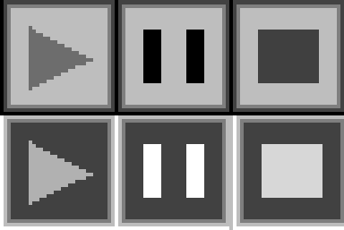
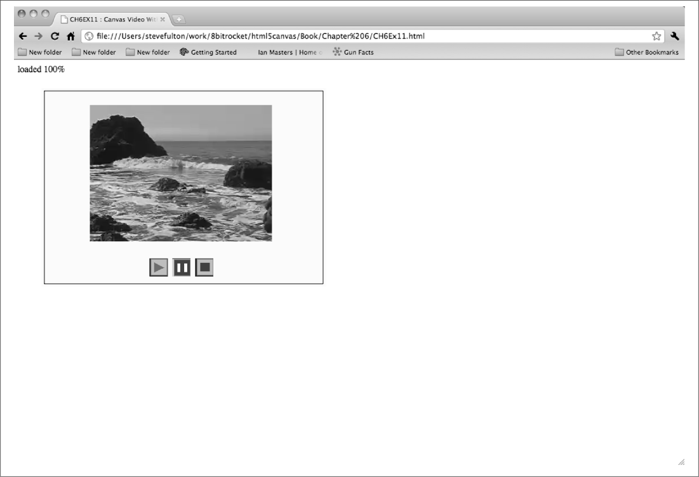

### 6.6.4　在画布上创建视频控制器

之所以使用HTML5 Canvas显示视频，其中的一个理由就是创建一个自定义的视频控制器，进行播放、暂停、停止等操作。读者可能已经注意到了，在画布上渲染视频的时候，并没有包括任何HTML5的视频控制器。如果要在画布上创建控制器，则需要自己动手制作。幸运的是，本书已经介绍了大部分所需的知识，现在将它们整合在一起。

#### 1．创建视频按钮

在本示例中，将专门制作一些视频控制按钮。图6-11展示了按钮的图片表，其中包含了播放、暂停和停止按钮的播放和静止状态的图片。第一行是播放状态的图片，第二行是静止状态的图片。


<center class="my_markdown"><b class="my_markdown">图6-11　视频按钮图片表</b></center>

提示

> 虽然这个应用不会用到静止状态的停止按钮，但是这里依然包括了这个图片，因为有兴趣的读者和程序员可能会在以后用到。

程序中将会动态地加载图片，然后将每一个32 × 32大小的按钮分别摆放在画布上。在绘制控件时，将使用宽度和高度来计算出应该显示图片的哪个部分。

#### 2．预加载按钮

第一件需要做的事情是预加载按钮的图片表。由于已经在画布上显示视频之前对预加载过程进行了测试，因此需要对加载策略进行一个小的调整，使之能够加载多个对象。在本例中，将使用一个名为loadCount的计数器变量，在每次检测到一个项目加载完成时就将计数器加1。还需要创建一个名为itemsToLoad的变量与之配合使用，这个变量将保存需要预加载的项目的数量。在这个应用中，有两个项目需要预加载：视频和图片表。这两个变量都在JavaScript的顶部、所有函数的外层创建。

```javascript
var loadCount=0;
var itemsToLoad = 2;
```

除了videoElement和videoDiv外，还需要创建一个新变量buttonSheet。这个变量将引用一个已加载的图片，而这个图片正是用来创建视频播放器界面上图形按钮的图片。

```javascript
var videoElement;
var videoDiv;
var buttonSheet
```

在一些浏览器中，有时一个鼠标点击会触发多个mouseup事件。为了解决这个问题，需要创建一个计数器，每过5帧接受一次点击。变量buttonWait是等待的时间，而变量timeWaited则是计数器。

```javascript
var buttonWait = 5;
var timeWaited = buttonWait;
```

本书大多数章节都使用了标准的eventWindowLoaded()函数，现在必须对这个函数进行一些修改。首先，要将视频的canplay事件的处理函数修改为新的itemLoaded函数。

```javascript
videoElement.addEventListener("canplay",itemLoaded,false);
```

之所以用canplay事件替换canplaythrough事件，是因为在大多数情况下，用户希望当视频加载到足够缓存数据时就能尽快开始播放，而不是在加载全部视频之后才开始播放。

接下来，加载图片表。首先创建一个新的Image对象，并将其src属性设置为videobuttons.png，就是在图6-11中曾展示的文件。然后，还需要将Image对象的onload事件的处理函数设置为itemLoaded，与视频类似。

```javascript
　 buttonSheet = new Image();
　 buttonSheet.src = "videobuttons.png";
　 buttonSheet.onload = itemLoaded;
}
```

最后，创建itemLoaded()事件处理函数。当调用这个函数时，将loadCount加1，然后将它与itemsToLoad进行比较。

提示

> 如果程序运行正常，loadCount变量应该永远不会大于itemsToLoad变量。然而更加安全的做法是，如果可能，在比较时应该尽量限制“==”的使用。为什么？因为一旦由于某些原因，在某些场合的某样东西被计算了2次，程序就永远不能正确加载了。

如果loadCount大于等于itemsToLoad，则调用canvasApp()函数，启动应用程序。

```javascript
function itemLoaded(){
　 loadCount++;
　 if (loadCount >= itemsToLoad){
　　　canvasApp();
　 }
}
```

#### 3．摆放按钮

在canvasApp()函数中需要设置一些变量，在显示播放、暂停和停止按钮时用来保存相关的位置信息。首先将标准按钮的宽度和高度定义为bW和bH。在图片表videobuttons.png中，所有的图像的大小都是32 × 32，所以bW和bH都据此设置。接着，需要创建表示每个按钮x轴、y轴坐标的变量：playX、playY、pauseX、pauseY、stopX和stopY。当然也可以直接使用数字值，但是使用成对的变量可以使得复杂的运算过程变得简单易懂。

```javascript
var bW = 32;
var bH = 32;
var playX = 190;
var playY = 300;
var pauseX = 230;
var pauseY = 300;
var stopX = 270
var stopY = 300;
```

在drawImage()函数中，只有先检测视频当前的播放状态，才能相应地渲染按钮。在这个程序中，需要通过视频对象的paused属性检查状态，将按钮绘制为“未选中”或“选中”的状态。

当第一次在页面上加载视频但还没有开始播放的时候，它的paused属性是true。当视频播放时，它的paused属性是false。据此，可以创建按钮的行为。

首先，如果已知视频不是处于暂停状态，就肯定是播放状态。所以，将播放按钮显示为“选中”的版本。“选中”版本位于图6-11所示的图片表的第二行。在调用drawImage()函数时的第3个参数是32，这个参数表示了要显示的图片在图片表上的y轴坐标。如果paused值为true，意味视频没有处于播放状态，所以应该显示播放按钮的“放开”版本，放开版本的图片的y轴坐标是0。

```javascript
if (!videoElement.paused){
　　context.drawImage(buttonSheet, 0,32,bW,bH,playX,playY,bW,bH); //播放键按下
} else {
　　context.drawImage(buttonSheet, 0,0,bW,bH,playX,playY,bW,bH); //播放键抬起
}
```

显示暂停按钮的逻辑正好与播放按钮相反。如果视频的paused属性为true，就显示“选中”版本的暂停按钮。如果视频正在播放，就意味着paused属性为false，因此，要显示“未选中”状态的版本。注意，在显示暂停按钮时，应该跳过图片表上的播放按钮。因此，第二个参数是32，表示暂停按钮在图片表上的x轴的坐标。

```javascript
if (videoElement.paused){
　　context.drawImage(buttonSheet,　32,32,bW,bH,pauseX,pauseY,bW,bH); // 暂停键按下
} else {
　　context.drawImage(buttonSheet,　32,0,bW,bH,pauseX,pauseY,bW,bH); // 暂停键抬起
}
context.drawImage(buttonSheet,　64,0,bW,bH,stopX,stopY,bW,bH); // 停止键抬起
```

最后，通过更新变量timecounter来限制监听的mouseUp事件，下节将介绍它的工作原理。

```javascript
timeWaited++;
```

#### 4．监听按钮单击事件

还需要监听鼠标按钮的单击事件。这个过程与在视频拼图游戏中的实现过程非常类似。首先，在canvasApp()函数中为mouseup事件设置一个事件处理函数event MouseUp()。

```javascript
theCanvas.addEventListener("mouseup",eventMouseUp, false);
```

eventMouseUp()函数的工作方式与视频拼图游戏中的该函数的工作方式非常相似。先要测试一下，看看是否已经等待了足够的时间（buttonWait）来接受另一个鼠标单击事件。如果是，则重置等待时间，即timeWaited=0，并进行下一步。接着，根据不同的浏览器用不同的方法取得鼠标指针的x轴和y轴的坐标，然后将其赋值给mouseX和mouseY变量。

```javascript
function eventMouseUp(event) {
　　if (timeWaited >= buttonWait) {
　　　timeWaited = 0;
　　　var mouseX;
　　　var mouseY;
　　　var x;
　　　var y;
　　　if (event.pageX || event.pageY) {
　　　　　x = event.pageX;
　　　　　y = event.pageY;
　　　} else {
　　　　　x = e.clientX + document.body.scrollLeft
　　　　　　　 + document.documentElement.scrollLeft;
　　　　　y = e.clientY + document.body.scrollTop
　　　　　　　 + document.documentElement.scrollTop;
　　　}
　　　x -= theCanvas.offsetLeft;
　　　y -= theCanvas.offsetTop;
　　　mouseX=x;
　　　//单击播放按钮
```

接下来，检测鼠标指针所在的点是否单击了按钮，使用的方法是在画布上检测按钮的边界（右、左、上、下），查看当用户单击时，鼠标指针是否落在了边界上或边界内。如果是，就判断为单击选中。

然后检测播放按钮。注意，这里创建了用于表示按钮左上角x轴和y轴坐标的变量（playX和playY）来帮助进行运算。而且在这个函数中，按钮的名字是表示自己含义的，可以帮助人们理解正在进行的检测目标。

如果单击播放按钮，并且视频的paused属性是true，就调用视频对象的play()函数开始播放视频。

```javascript
//单击播放按钮
　　　　if ( (mouseY >= playY)&& (mouseY <= playY+bH)&& (mouseX >= playX)&&
　　　　　　 (mouseX <= playX+bW)){
　　　　　 if (videoElement.paused){
　　　　　　　videoElement.play();
　　　　　 }
```

如果单击停止按钮，将视频的paused属性设置为true，然后将currentTime属性设置为0，那么视频将返回到第一帧。

```javascript
//单击停止按钮
　　　　if ( (mouseY >= stopY)&& (mouseY <= stopY+bH)&& (mouseX >= stopX)&&
　　　　　　 (mouseX <= stopX+bW)){
　　　　　 videoElement.pause();
　　　　　 videoElement.currentTime = 0;
　　　　}
```

如果单击暂停按钮，并且视频的paused属性是false，就调用视频的pause()方法将视频在当前帧暂停。如果paused属性是true，则调用视频的play()方法将恢复播放视频。

```javascript
//单击暂停按钮
　　　 if ( (mouseY >= pauseY)&& (mouseY <= pauseY+bH)&& (mouseX >= pauseX)&&
　　　　　　(mouseX <= pauseX+bW)){
　　　　　if (videoElement.paused == false){
　　　　　　 videoElement.pause();
　　　　　} else {
　　　　　　 videoElement.play();
　　　　　}
　　　 }
}
```

图6-12展示了带有控制界面的视频在画布上显示的效果。


<center class="my_markdown"><b class="my_markdown">图6-12　画布上的视频播放器按钮</b></center>

提示

> 读者可能注意到了，播放按钮和暂停按钮的关系有些奇怪。当一个是“选中”状态时，另一个则是“未选中”状态。这是因为只关联了一个属性：paused。在HTML5的规范中还有一个名为playing的属性，但是所有浏览器都没有支持，所以这里只使用paused。在实际应用时可能只使用一个按钮，然后根据paused属性的状态切换按钮上播放和暂停的图形。这样可以使控制器的工作方式更类似于HTML的视频控制器。

例6-11给出了这个程序完整的源代码。

例6-11　画布上的视频和控制器

```javascript
<!doctype html>
<html lang="en">
<head>
<meta charset="UTF-8">
<title>CH6EX11 : Canvas Video With Controls</title>
<script src="modernizr.js"></script>
<script type="text/javascript">
window.addEventListener('load', eventWindowLoaded, false); 
var loadCount=0;
var itemsToLoad = 2;
var videoElement;
var videoDiv;
var buttonSheet；
var buttonWait = 5;
var timeWaited = buttonWait;
function eventWindowLoaded(){
　 videoElement = document.createElement("video");
　 videoDiv = document.createElement('div');
　 document.body.appendChild(videoDiv);
　 videoDiv.appendChild(videoElement);
　 videoDiv.setAttribute("style", "display:none;");
　 var videoType = supportedVideoFormat(videoElement);
　 if (videoType == ""){
　　　alert("no video support");
　　　return;
　 }
　 videoElement.addEventListener("canplay",itemLoaded,false);
　 videoElement.setAttribute("src", "muirbeach." + videoType);
　 buttonSheet = new Image();
　 buttonSheet.onload = itemLoaded;
　 buttonSheet.src = "videobuttons.png";
}
function supportedVideoFormat(video){
　 var returnExtension = "";
　 if (video.canPlayType("video/webm")=="probably" ||
　　　 video.canPlayType("video/webm")== "maybe"){
　　　　 returnExtension = "webm";
　 } else if(video.canPlayType("video/mp4")== "probably" ||
　　　 video.canPlayType("video/mp4")== "maybe"){
　　　　 returnExtension = "mp4";
　 } else if(video.canPlayType("video/ogg")=="probably" ||
　　　 video.canPlayType("video/ogg")== "maybe"){
　　　　 returnExtension = "ogg";
　 }
　 return returnExtension;
}
function canvasSupport (){
　　 return Modernizr.canvas;
}
function itemLoaded(){
　 loadCount++;
　 if (loadCount >= itemsToLoad){
　　　canvasApp();
　 }
}
function canvasApp(){
　 if (!canvasSupport()){
　　　　　return;
　　　　}
　function　drawScreen (){
　　　//背景
　　　context.fillStyle = '#ffffaa';
　　　context.fillRect(0, 0, theCanvas.width, theCanvas.height);
　　　//边框
　　　context.strokeStyle = '#000000';
　　　context.strokeRect(5,　5, theCanvas.width-10, theCanvas.height-10);
　　　//视频
　　　context.drawImage(videoElement , 85, 30);
　　　//绘制按钮
　　　//播放
　　　if (!videoElement.paused){
　　　　 context.drawImage(buttonSheet, 0,32,bW,bH,playX,playY,bW,bH); // 选中播放按钮
　　　} else {
　　　　 context.drawImage(buttonSheet, 0,0,bW,bH,playX,playY,bW,bH); // 未选中播放按钮
　　　}
　　　if (videoElement.paused){
　　　　 context.drawImage(buttonSheet,　32,32,bW,bH,pauseX,pauseY,bW,bH); // 选中暂停按钮
　　　} else {
　　　　 context.drawImage(buttonSheet,　32,0,bW,bH,pauseX,pauseY,bW,bH); // 未暂停按钮
　　　}
　　　context.drawImage(buttonSheet,　64,0,bW,bH,stopX,stopY,bW,bH); // 未选中停止按钮
　　　timeWaited++;
　 }
　　　function eventMouseUp(event){
　　　if (timeWaited >= buttonWait) {
　　　　 timeWaited = 0;
　　　　 var mouseX;
　　　　 var mouseY;
　　　　 var x;
　　　　 var y;
　　　　 if (event.pageX || event.pageY) {
　　　　　　x = event.pageX;
　　　　　　y = event.pageY;
　　　　 } else {
　　　　　　x = e.clientX + document.body.scrollLeft
　　　　　　　　+ document.documentElement.scrollLeft;
　　　　　　y = e.clientY + document.body.scrollTop
　　　　　　　　+ document.documentElement.scrollTop;
　　　　 }
　　　　 x -= theCanvas.offsetLeft;
　　　　 y -= theCanvas.offsetTop;
　　　　 mouseX=x;
　　　　 mouseY=y;
　　　　//单击播放按钮
　　　　if ( (mouseY >= playY)&& (mouseY <= playY+bH)&& (mouseX >= playX)&&
　　　　　　　(mouseX <= playX+bW)){
　　　　　if (videoElement.paused){
　　　　　　　videoElement.play();
　　　　　}
　　　}
　　　//单击停止按钮
　　　if ( (mouseY >= stopY)&& (mouseY <= stopY+bH)&& (mouseX >= stopX)&& 
　　　　　　(mouseX <= stopX+bW)){
　　　　 videoElement.pause();
　　　　 videoElement.currentTime = 0;
　　　}
　　　//单击暂停按钮
　　　if ( (mouseY >= pauseY)&& (mouseY <= pauseY+bH)&& (mouseX >= pauseX)&& 
　　　　　 (mouseX <= pauseX+bW)){
　　　　 if (videoElement.paused == false){
　　　　　　videoElement.pause();
　　　　 } else {
　　　　　　videoElement.play();
　　　　 }
　　　}
　　 }
　 }
　 var theCanvas = document.getElementById('canvasOne');
　 var context = theCanvas.getContext('2d');
　 var bW = 32;
　 var bH = 32;
　 var playX = 190;
　 var playY = 300;
　 var pauseX = 230;
　 var pauseY = 300;
　 var stopX = 270
　 var stopY = 300;
　 theCanvas.addEventListener("mouseup",eventMouseUp, false);  
　 functiongameLoop(){
　　　　　window.setTimeout(gameLoop,20);
　　　　　drawScreen();
　 }
　 gameLoop();
}
</script>
</head>
<body>
<canvas id="canvasOne" width="500" height="350"　style="position: absolute;
　　 top: 50px; left: 50px;">
 Your browser does not support HTML 5 Canvas.
</canvas>
</body>
</html>
```

