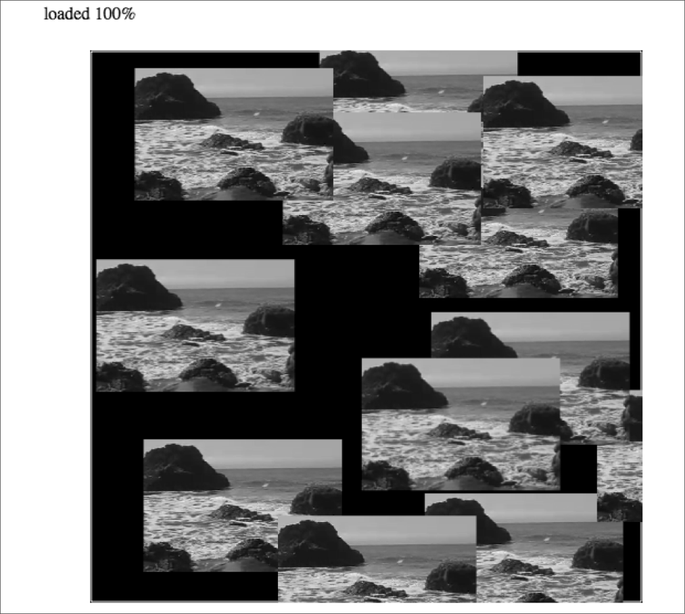

### 6.7　回顾动画效果之移动视频

现在回顾一下第5章的反弹球动画，看看如何使用图片和视频实现类似的效果。由于在示例5-5中已经详细介绍过这个程序了，因此这里无须讲解全部代码，仅介绍为了移动视频而需要修改的地方。

提示

> 由于视频的绘制方法与图像几乎一样，因此本程序只需要进行少量的修改就可以应用于静态图片。

然而，程序还做了一些其他的修改。drawScreen()函数是最重要的部分，用于将视频绘制在画布上。第5章曾经创建了一个balls数组和一个用于保存每个小球属性的动态对象，代码如下所示。

```javascript
tempBall = {x:tempX,y:tempY,radius:tempRadius, speed:tempSpeed, angle:tempAngle,
　　xunits:tempXunits, yunits:tempYunits}
```

对于视频，也要创建一个类似的数组，名为videos。但是，动态对象要做一些修改。

```javascript
tempvideo = {x:tempX,y:tempY,width:180, height:120, speed:tempSpeed, angle:tempAngle,
　　xunits:tempXunits, yunits:tempYunits}
```

这里最大的区别是不再需要使用radius变量表示小球的尺寸，取而代之的是width和height属性。在drawScreen()函数中渲染视频时会用到这两个属性指定视频的尺寸。

第5章在屏幕上绘制小球时，使用了下面的画布绘图命令。

```javascript
context.beginPath();
context.arc(ball.x,ball.y,ball.radius,0,Math.PI*2,true);
context.closePath();
context.fill();
```

为了绘制视频，需要修改代码，如下所示。

```javascript
context.drawImage(videoElement ,video.x, video.y, video.width, video.height);
```

这就是所有需要修改的地方。还有一些其他的修改（例如，在视频开始移动之前都放置在屏幕的中央），但是上面介绍的内容是将屏幕上移动的黄色小球替换为播放视频时主要需要关注的部分。图6-13演示了本示例用反弹的视频替换小球之后的效果。读者可以在例6-12中查看完整的源代码。


<center class="my_markdown"><b class="my_markdown">图6-13　画布上移动视频的演示程序</b></center>

例6-12　多个反弹的视频

```javascript
<!doctype html>
<html lang="en">
<head>
<meta charset="UTF-8">
<title>CH6EX12: Multiple Video Bounce</title>
<script src="modernizr.js"></script>
<script type="text/javascript">
window.addEventListener('load', eventWindowLoaded, false);
var videoElement;
var videoDiv;
function eventWindowLoaded(){
　 videoElement = document.createElement("video");
　 var videoDiv = document.createElement('div');
　 document.body.appendChild(videoDiv);
　 videoDiv.appendChild(videoElement);
　 videoDiv.setAttribute("style", "display:none;");
　 var videoType = supportedVideoFormat(videoElement);
　 if (videoType == ""){
　　　alert("no video support");
　　　return;
　 }
　 videoElement.addEventListener("canplaythrough",videoLoaded,false);
　 videoElement.setAttribute("src", "muirbeach." + videoType);
}
function supportedVideoFormat(video){
　 var returnExtension = "";
　 if (video.canPlayType("video/webm")=="probably" || 
　　　 video.canPlayType("video/webm")== "maybe"){
　　　　 returnExtension = "webm";
　 } else if(video.canPlayType("video/mp4")== "probably" || 
　　　 video.canPlayType("video/mp4")== "maybe"){
　　　　 returnExtension = "mp4";
　 } else if(video.canPlayType("video/ogg")=="probably" || 
　　　 video.canPlayType("video/ogg")== "maybe"){
　　　　 returnExtension = "ogg";
　 }
　 return returnExtension;
}
function canvasSupport (){
　　 return Modernizr.canvas;
}
function videoLoaded(){
　 canvasApp();
}
function canvasApp(){
　if (!canvasSupport()){
　　　　　return;
　　　　}
　function　drawScreen (){
　　　context.fillStyle = '#000000';
　　　context.fillRect(0, 0, theCanvas.width, theCanvas.height);
　　　//边框
　　　context.strokeStyle = '#ffffff';
　　　context.strokeRect(1,　1, theCanvas.width-2, theCanvas.height-2);
　　　//放置视频
　　　context.fillStyle = "#FFFF00";
　　　var video;
　　　for (var i =0; i <videos.length; i++){
　　　　 video = videos[i];
　　　　 video.x += video.xunits;
　　　　 video.y += video.yunits;
　　　　 context.drawImage(videoElement ,video.x, video.y, video.width, video.height);
　　　　 if (video.x > theCanvas.width-video.width || video.x < 0 ){
　　　　　　video.angle = 180 - video.angle;
　　　　　　updatevideo(video);
　　　　 } else if (video.y > theCanvas.height-video.height || video.y < 0){
　　　　　　video.angle = 360 - video.angle;
　　　　　　updatevideo(video);
　　　　 }
　　　}
　 }
　 function updatevideo(video){
　　　video.radians = video.angle * Math.PI/ 180;
　　　video.xunits = Math.cos(video.radians)* video.speed;
　　　video.yunits = Math.sin(video.radians)* video.speed;
　 }
　 var numVideos = 12 ;
　 var maxSpeed = 10;
　 var videos = new Array();
　 var tempvideo;
　 var tempX;
　 var tempY;
　 var tempSpeed;
　 var tempAngle;
　 var tempRadians;
　 var tempXunits;
　 var tempYunits;
　 var theCanvas = document.getElementById('canvasOne');
　 var context = theCanvas.getContext('2d');
　 videoElement.play();
　 for (var i = 0; i < numVideos; i++){
　　　tempX = 160 ;
　　　tempY = 190 ;
　　　tempSpeed = 5;
　　　tempAngle =　Math.floor(Math.random()*360);
　　　tempRadians = tempAngle * Math.PI/ 180;
　　　tempXunits = Math.cos(tempRadians)* tempSpeed;
　　　tempYunits = Math.sin(tempRadians)* tempSpeed;
　　　tempvideo = {x:tempX,y:tempY,width:180, height:120,
　　　　　 speed:tempSpeed, angle:tempAngle,
　　　　　 xunits:tempXunits, yunits:tempYunits}
　　　videos.push(tempvideo);
　 }
　 functiongameLoop(){
　　　　 window.setTimeout(gameLoop,20);
　　　　 drawScreen();
　 }
　 gameLoop();
}
</script>
</head>
<body>
<div style="position: absolute; top: 50px; left: 50px;">
<canvas id="canvasOne" width="500" height="500">
 Your browser does not support the HTML 5 Canvas.
</canvas>
</div>
</body>
</html>
```

提示

> 如你所见，将HTML5的视频元素与画布结合是网页技术上一个正在被探索的、激动人心的新兴领域。在CraftyMind网站上有很多很棒的视频效果的示例。

