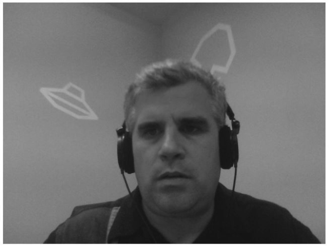

### 6.8.2　例1：播放视频

在第一个网络RTC媒体捕获例子中，将摄像头拍摄到的画面显示在一个HTML5页面里。

首先，需要在页面里添加一个<video>标签，用来显示摄像头拍摄的画面。这里需要设置video的autoplay属性。这样，一旦摄像头开始工作，就可以马上看到画面。

```javascript
<div>
<video id="thevideo" autoplay></video>
</div>
```

接下来，需要判断浏览器是否支持视频捕获。因为函数getUserMedia()还不通用，所以需要创建一个函数userMediaSupported()，在该函数中调用函数getUserMedia()来判断浏览器是否支持视频捕获，其返回值是一个布尔变量。

```javascript
function userMediaSupported() {
　　return !!(navigator.getUserMedia || navigator.webkitGetUserMedia ||
　　navigator.mozGetUserMedia || navigator.msGetUserMedia);
}
```

如果支持函数getUserMedia()，则调用函数startVideo()，否则弹出一个对话框。

```javascript
function eventWindowLoaded() {
　　if (userMediaSupported()) {
　　　　startVideo();
　　} else {
　　　　alert("getUserMedia() Not Supported")
　　}
}
```

同样的，由于函数getUserMedia()并不通用，为了方便调用，将本地函数navigator. getUserMedia()作为值传递给浏览器的getUserMedia()。

接下来，需要给getUserMedia()传递以下3个参数。

（1）一个包含布尔属性的对象，用于标明要捕获何种媒体（如video:true或者audio:true)。在写本文时，还不支持音频采集。

（2）采集成功时的回调函数。

（3）采集失败时的回调函数。

```javascript
function startVideo() {
　　navigator.getUserMedia = navigator.getUserMedia ||
　　　　　　　　　　　　　　　　 navigator.webkitGetUserMedia ||
　　navigator.mozGetUserMedia || navigator.msGetUserMedia;
　　navigator.getUserMedia({video: true, audio:true}, mediaSuccess, mediaFail);
}
```

函数mediaFail()只是简单地弹出一个对话框，显示获取失败。如果直接打开html文件运行代码，就会遇到error.code=1的错误。这个错误是因为权限不够：凡是调用到函数getUserMedia()的代码，都必须在本地计算机或网络服务器上运行。

```javascript
function mediaFail(error) {
　　//error code 1 = 没有权限
　　alert("Failed To get user media:" + error.code)
}
```

函数mediaSuccess()是这个例子的核心，该函数可以引用从摄像头（userMedia）获取到的视频对象。然后，创建一个URL指向这个对象，并将这个URL作为视频源传递给<video>对象。这样，<vidoe>就可以实时地播放获取到的视频。

首先，将浏览器所支持的window.URL格式全部设置给window.URL。然后，在页面中找到<vidoe>节点，调用函数window.URL.createObjectURL()，生成一个指向录制视频的video对象可以播放的URL，并将该URL传递给video。最后，为了监听视频播放情况，需要给video.onloadedmetadata事件设置回调。

```javascript
function mediaSuccess(userMedia) {
　　window.URL = window.URL || window.webkitURL || window.mozURL || window.msURL;
　　var video = document.getElementById("thevideo");
　　video.src = window.URL.createObjectURL(userMedia);
　　video.onloadedmetadata = doCoolStuff;
}
function doCoolStuff() {
　　alert("Do Cool Stuff");
}
```

这就是程序的框架，读者可以在CHX6EX13.HTML中查看这个例子的详细代码。

如果代码不能顺利运行，就检查是否符合以下要求。

（1）确保使用支持该功能的浏览器：Google Chrome Canary或实验版的Opera。

（2）确认机器上有摄像头。在Windows 7系统上可能需要先启动摄像头应用程序（虽然很奇怪，但却有效），Windows 8则不需要。

（3）确保网页是从服务器上获取的。图6-14是应用正常工作的截图。


<center class="my_markdown"><b class="my_markdown">图6-14　摄像头下略显紧张的开发者</b></center>

