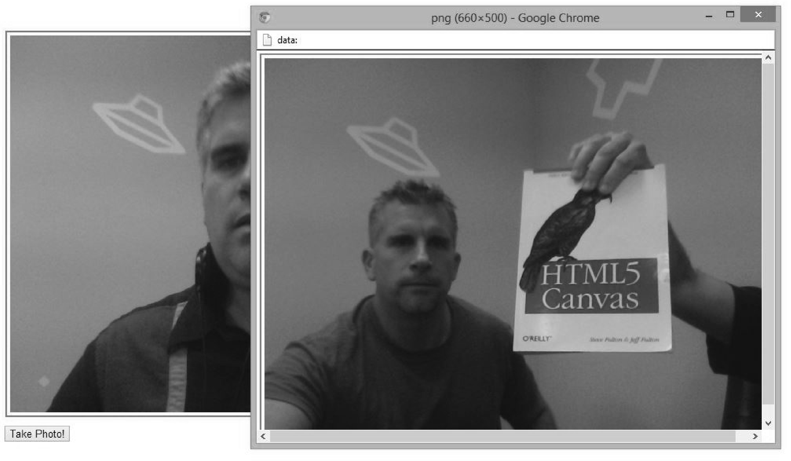

### 6.8.3　例2：在Canvas上播放视频并截图

接下来，将对本章的第六个例子CH6EX6.html进行修改。先复习一下，该例子在页面上动态添加了一个HTMLVideoElement对象，将其设置为Canvas上视频的播放源，从而实现了Canvas视频播放。在此，修改该例子，通过调用函数getUserMedia()为video生成播放源，并在Canvas上进行播放。同时，通过调用Canvas的函数context.toDataURL()，为该例子添加视频截屏的功能。

首先，创建一个<div>节点，在其中创建一个<video>子节点。因为需要在Canvas里显示该Video（不是在页面里显示），所以使用display:none样式将它们都设置为不可见。

接下来，调用函数userMediaSupported()检测是否支持摄像头。如果支持，则调用函数startVideo()开始捕获视频，同时调用函数canvasApp()启动程序。

```javascript
function eventWindowLoaded() {
　　videoElement = document.createElement("video");
　　videoDiv = document.createElement('div');
　　document.body.appendChild(videoDiv);
　　videoDiv.appendChild(videoElement);
　　videoDiv.setAttribute("style", "display:none;");
　　if (userMediaSupported()) {
　　　　startVideo();
　　　　canvasApp();
　　} else {
　　　　alert("getUserMedia() Not Supported")
　　}
}
```

函数startVideo()和上一个例子中的函数基本一样。首先获取到浏览器函数getUserMedia()的引用，然后传递3个参数（说明捕获内容的对象，失败时的回调函数，成功时的回调函数）并调用该函数。

```javascript
function startVideo() {
　　navigator.getUserMedia = navigator.getUserMedia ||
　　　　　　　　　　　　　　　　　 navigator.webkitGetUserMedia ||
　　navigator.mozGetUserMedia || navigator.msGetUserMedia;
　　navigator.getUserMedia({video: true, audio:true}, mediaSuccess, mediaFail);
}
```

如果调用函数getUserMedia()成功，就在回调函数mediaSuccess()中将获取到的视频设置为video的视频源。

```javascript
function mediaSuccess(userMedia) {
　　window.URL = window.URL || window.webkitURL || window.mozURL || window.msURL;
　　videoElement.src = window.URL.createObjectURL(userMedia);
}
```

在函数canvasApp()里，为了播放视频，需要调用视频的play()函数。

```javascript
videoElement.play();
```

同CH6EX6.html一样，需要在循环里调用函数drawScreen()来展示video的新一帧画面。否则，就只能展示一个静态的画面。

```javascript
function gameLoop() {
　　window.setTimeout(gameLoop, 20);
　　drawScreen();
}
gameLoop();
```

在函数drawScreen()中调用函数drawImage()，将videoElement里新的画面更新到Canvas上。

```javascript
function drawScreen () {
　　context.drawImage(videoElement , 10, 10); 
}
```

另外，代码中还提供了一个按钮，点击该按钮可以用摄像头进行拍照。这里的代码和第3章里的一样。在页面上放置一个按钮，id为createImageData。

```javascript
<canvas id="canvasOne" width="660" height="500">
 Your browser does not support the HTML 5 Canvas.
</canvas>
<form>
<input type="button" id="createImageData" value="Take Photo!">
</form>
```

在JavaScript中为该按钮添加一个处理点击事件的函数。

```javascript
formElement = document.getElementById("createImageData");
formElement.addEventListener("click", createImageDataPressed, false);
```

该点击函数通过调用函数toDataUrl()打开一个新的界面，用来显示从视频里截取的图片。

```javascript
function createImageDataPressed(e) {
window.open(theCanvas.toDataURL(),"canvasImage","left=0,top=0,width="
　 + theCanvas.width + ",height=" + theCanvas.height +",toolbar=0,resizable=0");
}
```

这就是程序的基本内容。图6-15所示为从Canvas里截取的照片。至此，用户不仅能从摄像头里获取的视频并进行播放，而且还能对视频的播放进行控制。读者可以从本书代码包中的CH6EX14.html文件查看程序的详细代码。


<center class="my_markdown"><b class="my_markdown">图6-15　利用函数getUserMedia()从Canvas里截取图片</b></center>

