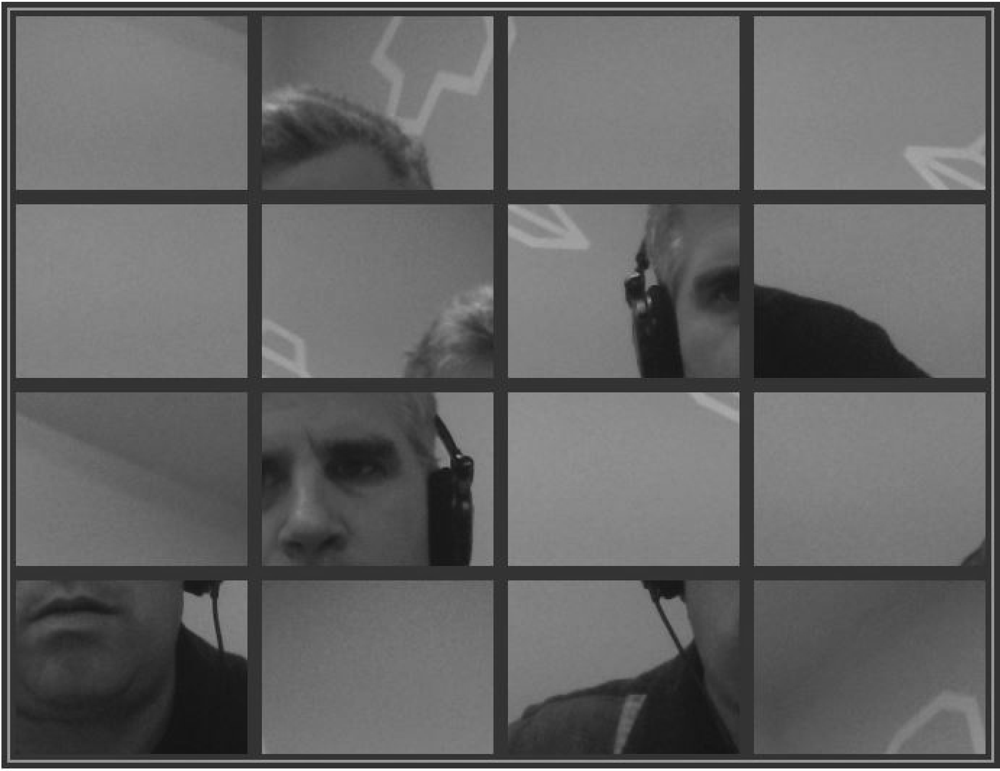

### 6.8.4　例3：创建视频拼图

这是最后一个关于函数getUserMedia()的例子。通过修改CH6EX10.html的代码，将实现通过摄像头获取视频，并在Canvas里创建出视频拼图的功能。

首先，需要将摄像头的分辨率固定为640 × 480，然后在CH6EX10.html中设置一个更大的画布和更大的拼图图片。

这里，先设定Canvas的大小为690 × 530。

```javascript
<canvas id="canvasOne" width="690" height="530"style="position: absolute; top:
　　　10px; left: 10px;" >
 Your browser does not support the HTML5 Canvas.
</canvas>
```

然后，在JavaScript里将每片拼图图片的大小设置为原来的2倍。在CH6EX10.html里设置的是80 × 60，这里修改成160 × 120。

```javascript
partWidth=160;
partHeight=120;
```

接下来的代码跟之前的类似。首先，创建一个<video>节点用来显示函数getUserMedia()捕获的视频。

```javascript
function eventWindowLoaded() {
　　videoElement = document.createElement("video");
　　videoDiv = document.createElement('div');
　　document.body.appendChild(videoDiv);
　　videoDiv.appendChild(videoElement);
　　videoDiv.setAttribute("style", "display:none;");
　　if (userMediaSupported()) {
　　　　startVideo();
　　　　canvasApp();
　　} else {
　　　　alert("getUserMedia() Not Supported")
　　}
}
function userMediaSupported() {
　　　return !!(navigator.getUserMedia || navigator.webkitGetUserMedia ||
　　　　　　navigator.mozGetUserMedia || navigator.msGetUserMedia);
}
function mediaFail(error) {
　　//error code 1 = 没有权限
　　alert("Failed To get user media:" + error.code)
}
function startVideo() {
　　navigator.getUserMedia = navigator.getUserMedia ||
　　　　　　　　　　　　　　　　 navigator.webkitGetUserMedia ||
　　navigator.mozGetUserMedia || navigator.msGetUserMedia;
　　navigator.getUserMedia({video: true, audio:true}, mediaSuccess, mediaFail);
}
function mediaSuccess(userMedia) {
　　window.URL = window.URL || window.webkitURL || window.mozURL ||  window.msURL;
　　videoElement.src = window.URL.createObjectURL(userMedia);
}
```

在函数drawScreen()里将video作为函数drawImage()的参数传递进去。

```javascript
function drawScreen () {
...
　　context.drawImage(videoElement, imageX, imageY, partWidth, partHeight,
　　　　　　　　　 　　　placeX, placeY, partWidth, partHeight);
...
}
```

仅仅需要几处简单的修改，就完成了一个新的程序。该程序不仅是在Canvas里播放摄像头获取的视频，还是一个交换式的应用程序。图6-16是该程序的截图，详细代码可以在CH6EX15.html文件里查看到。


<center class="my_markdown"><b class="my_markdown">图6-16　使用函数getUserMedia()实现视频拼图功能</b></center>

