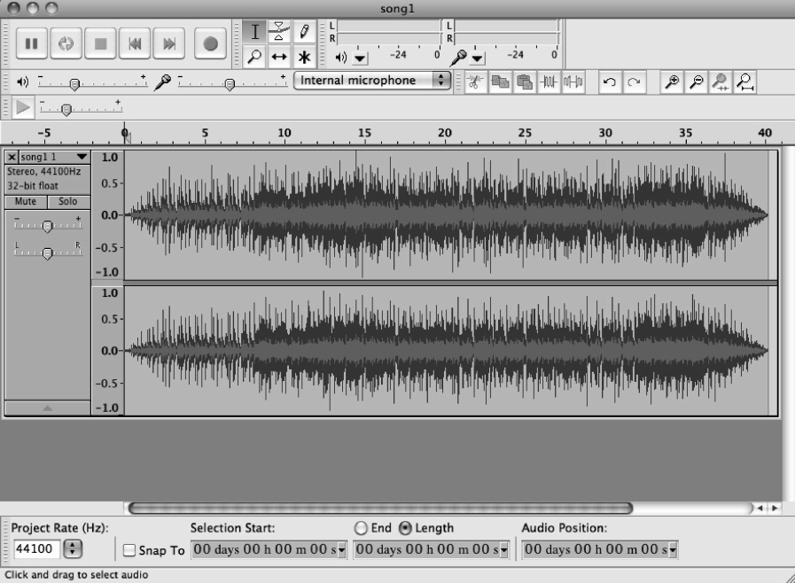

### 7.2.2　音频转换工具Audacity

幸运的是，现在有很多免费的工具可以将音频转换为任意格式。在这里，需要将音频转换为.mp3、.ogg和.wav格式。

Audacity是一款开源的、跨平台的工具软件，也是可以实现高级音频编辑的桌面级软件。目前的版本可以在Mac、Windows和Linux系统上工作。

图7-2展示了Audacity的界面截图。Audaciy加载一个音频后，可以展示声音的波形图。用户可以对音频进行剪裁、分割、复制等多种操作，也可以为声音增加特效，例如渐强渐弱、回音、反向播放等。完成声音的编辑之后，可以将声音导出为任意的格式。在本书中，主要导出为.mp3、.ogg和 .wav 3种格式。

提示

> 本书没有足够的篇幅详细介绍Audacity等音频工具的使用方法。不过，这里要给读者一个提示：目前的Audacity发布版本不支持导出.mp3的音频格式。为了扩展.mp3格式，读者需要从网上下载LAME mp3编码器来导出.mp3音频。LAME也是一个开源项目。

<b class="my_markdown">图7-2　在Audacity中编辑音频</b>

