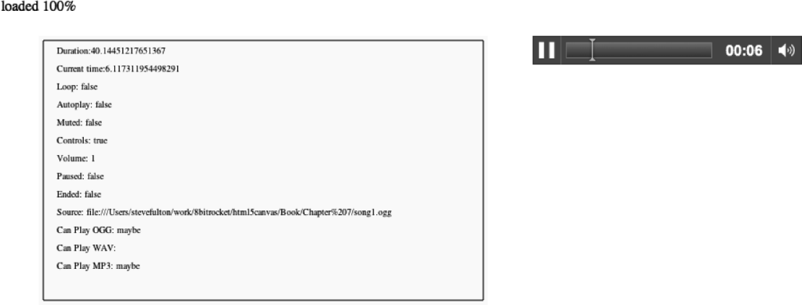

### 7.3.5　在画布上显示属性信息

现在，在HTML页面上显示播放中的音频元素属性值。在本例中（CH7EX3.html），将在HTML页面中显示音频元素，这样读者可以看出画布上的显示内容与页面中<audio>标签状态之间的关系。

在drawScreen()方法中添加以下代码，用于显示audioElement变量的属性。

```javascript
context.fillStyle = "#000000";
context.fillText ("Duration:" + audioElement.duration, 20 ,20);
context.fillText ("Current time:" + audioElement.currentTime, 20 ,40);
context.fillText ("Loop: " + audioElement.loop, 20 ,60);
context.fillText ("Autoplay: " +audioElement.autoplay, 20 ,80);
context.fillText ("Muted: " + audioElement.muted, 20 ,100);
context.fillText ("Controls: " + audioElement.controls, 20 ,120);
context.fillText ("Volume: " + audioElement.volume, 20 ,140);
context.fillText ("Paused: " + audioElement.paused, 20 ,160);
context.fillText ("Ended: " + audioElement.ended, 20 ,180);
context.fillText ("Source: " + audioElement.currentSrc, 20 ,200);
context.fillText ("Can Play OGG: " + audioElement.canPlayType("audio/ogg"), 20 ,220);
context.fillText ("Can Play WAV: " + audioElement.canPlayType("audio/wav"), 20 ,240);
context.fillText ("Can Play MP3: " + audioElement.canPlayType("audio/mp3"), 20 ,260);
```

读者应该已经比较熟悉大多数的属性了。当运行例7-3（CH7EX3.html）时，浏览器中会播放音频，并显示控制界面。读者会发现属性值的变化将显示在画布上。这只是将音频与画布整合的第一步。但是，这这对于如何通过JavaScript使用和操作audio元素是一个很好的启示。

图7-3展示了程序在浏览器中运行的效果。


<center class="my_markdown"><b class="my_markdown">图7-3　在画布上展示音频属性</b></center>

在列表底部还有几个之前没有讨论过的属性。它们是在调用HTMLAudioElement对象的canPlayType()时产生的。目前仅仅是显示它们。但在例7-3中，将使用这个函数帮助用户判断应该在JavaScript中动态加载何种音频。

例7-3　音频属性与画布

```javascript
<!doctype html>
<html lang="en">
<head>
<meta charset="UTF-8">
<title>CH7EX3: Audio Properties And The Canvas</title>
<script src="modernizr.js"></script>
<script type="text/javascript">
window.addEventListener('load', eventWindowLoaded, false);
function eventWindowLoaded(){
　 var audioElement = document.getElementById("theAudio");
　 audioElement.addEventListener("progress",updateLoadingStatus,false);
　 audioElement.addEventListener("canplaythrough",audioLoaded,false);
　 audioElement.load();
}
function canvasSupport (){
　　 return Modernizr.canvas;
}
function updateLoadingStatus(){
　 var loadingStatus = document.getElementById("loadingStatus");
　 var audioElement = document.getElementById("theAudio");
　 var percentLoaded = parseInt(((audioElement.buffered.end(0)/
　　　audioElement.duration)* 100));
　　document.getElementById("loadingStatus").innerHTML = 'loaded ' + percentLoaded + '%';
}
function audioLoaded(){
　 canvasApp();
}
function canvasApp(){
　if (!canvasSupport()){
　　　　　return;
　　　　}
　function drawScreen (){
　　　//背景
　　　context.fillStyle = "#ffffaa";
　　　context.fillRect(0, 0, theCanvas.width, theCanvas.height);
　　　//边框
　　　context.strokeStyle = "#000000";
　　　context.strokeRect(5, 5, theCanvas.width−10, theCanvas.height−10);
　　　// 文字
　　　context.fillStyle = "#000000";
　　　context.fillText ("Duration:" + audioElement.duration, 20 ,20);
　　　context.fillText ("Current time:" + audioElement.currentTime, 20 ,40);
　　　context.fillText ("Loop: " + audioElement.loop, 20 ,60);
　　　context.fillText ("Autoplay: " +audioElement.autoplay, 20 ,80);
　　　context.fillText ("Muted: " + audioElement.muted, 20 ,100);
　　　context.fillText ("Controls: " + audioElement.controls, 20 ,120);
　　　context.fillText ("Volume: " + audioElement.volume, 20 ,140);
　　　context.fillText ("Paused: " + audioElement.paused, 20 ,160);
　　　context.fillText ("Ended: " + audioElement.ended, 20 ,180);
　　　context.fillText ("Source: " + audioElement.currentSrc, 20 ,200);
　　　context.fillText ("Can Play OGG: " + audioElement.canPlayType("audio/ogg"), 20 ,220);
　　　context.fillText ("Can Play WAV: " + audioElement.canPlayType("audio/wav"), 20 ,240);
　　　context.fillText ("Can Play MP3: " + audioElement.canPlayType("audio/mp3"), 20 ,260);
　 }
　 var theCanvas = document.getElementById("canvasOne");
　 var context = theCanvas.getContext("2d");
　 var audioElement = document.getElementById("theAudio");
　 audioElement.play();
　 function gameLoop() {
　　　　　　 　　 window.setTimeout(gameLoop, 20);
　　　　　　　　　drawScreen()
　 }
　 gameLoop();
}
</script>
</head>
<body>
<div style="position: absolute; top: 50px; left: 50px;">
<canvas id="canvasOne" width="500" height="300">
Your browser does not support HTML5 Canvas.
</canvas>
</div>
<div id="loadingStatus">
0%
</div>
<div style="position: absolute; top: 50px; left: 600px; ">
<audio id="theAudio" controls >
<source src="song1.mp3" type="audio/mp3">
<source src="song1.ogg" type="audio/ogg">
<source src="song1.wav" type="audio/wav">
Your browser does not support the audio element.
</audio>
</div>
</body>
</html>
```

提示

> 在实际测试中，IE10并不能触发音频的progress事件。

