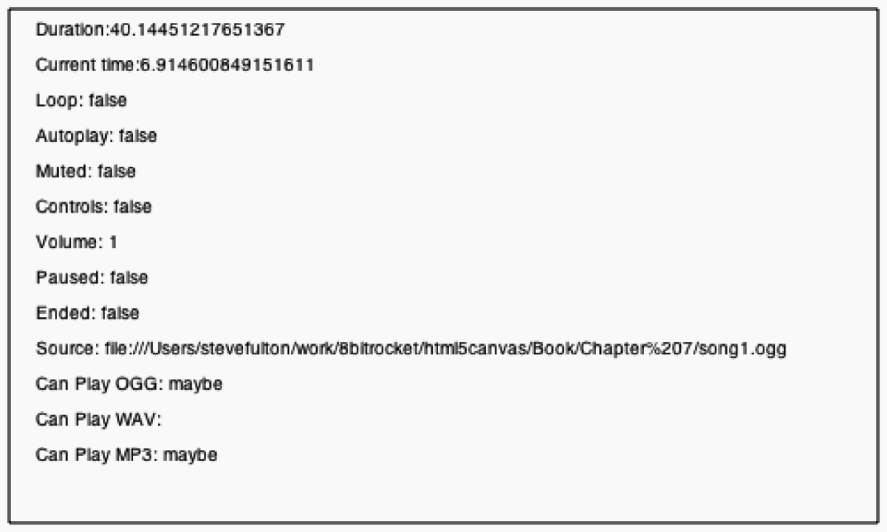

### 7.4.3　播放声音

最后，可以在canvasApp()函数中播放声音了。由于在函数环境之外定义了全局变量，并将声音预加载其中，仅需要调用audioElement变量的play()函数就可以播放声音。

```javascript
audioElement.play();
```

图7-4展示了在一个兼容HTML5的浏览器中执行画布程序的界面效果（注意，在程序中保留了音频属性的显示）。


<center class="my_markdown"><b class="my_markdown">图7-4　在“画布”上加载并播放声音</b></center>

