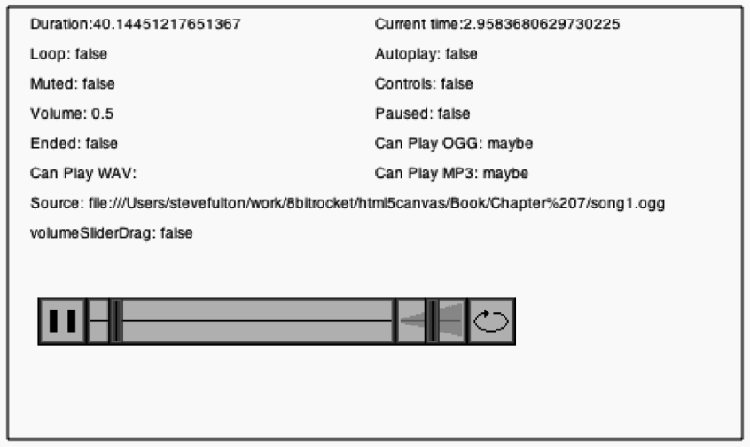

### 7.5.8　单击并拖动音量滑块

现在，实现音频播放器最后一个重要功能：音量滑块。音量滑块是一个可交互控件，允许用户左右滑动控制播放音频元素的音量。在创建音量滑块前，需要定义一些使用范围。

+ 滑块永远不能在y轴移动，所以滑块的y轴坐标是一个常量。
+ 滑块向右移动越多（x轴坐标值越大），音量越大。
+ 滑块在x轴的移动是有边界的。左边开始于音量滑块背景图片的起始位置volumn SliderStart，右边结束于volumnSliderEnd。
+ 当用户单击音量滑块时（假设用户要设置音量），开始“拖动”滑块。这就意味着，当用户沿x轴移动鼠标时，要相应地移动滑块。
+ 当用户释放鼠标按钮时，假设用户不再想要设置音量，于是停止“拖动”滑块。
+ 根据滑块的x轴位置设置音量。对应关系是volumeSliderStart加一个比率（volume Increment）。创建的这个变量用来表示根据滑块所在位置增加或减少多少音量。

#### 1．音量滑块变量

现在读者可能感觉有些困惑，本节将深入讲解处理过程。首先，从cavasApp()函数开始。在canvasApp()函数中，需要设置一些之前在列表中定义过的变量。

音量滑块在x轴的起始位置是volumeSliderStart。当程序启动时，它等于音量背景的x轴坐标，即volBackX。也就是，当音量为0时，音量滑块位于最左边位置的坐标。在计算完毕后，根据音量更新滑块的正确位置。

```javascript
var volumeSliderStart = volBackX;
```

音量滑块的终点位置是volumeSliderEnd，也就是最右边的位置。这也是音量被设置为100%（或1）时滑块所在的位置。这个位置的x轴坐标值是volumeSliderStart加音量滑块背景的宽度（wolBackW）再减去音量滑块自身的宽度（sliderW）。

```javascript
var volumeSliderEnd = volumeSliderStart + volBackW - sliderW;
```

volumeSliderX和volumeSliderY是滑块在画布上的x轴和y轴坐标。y轴坐标与音频播放器上的其他元素一样，都是controlStartY。然而，x轴坐标的计算方法有一些不同。首先取得volumeSliderStart的值，然后加音量滑块背景宽度与滑块宽度之差和audioElement的volume属性（取值是0～1之间的小数）的乘积。这样对于任意给定的音量值，都能得到一个相对于起始点的相对位置，将在此绘制音量滑块。

```javascript
var volumeSliderX = volumeSliderStart + (audioElement.volume* (volBackW - sliderW));
var volumeSliderY = controlStartY;
```

接下来，创建volumeSliderDrag变量。这是一个开关量，可以在任意时间指示音量滑块是否正在拖动。

```javascript
var volumeSliderDrag = false;
```

最后，创建volumeIncrement变量。这个变量用于指示根据滑块在音量滑块背景的位置，audioElement.volume属性应该增加或减少多少音量。因为音量的最大值是1，所以仅需用1除以音量滑块沿x轴可以滑动的总宽度（volBackW − sliderW）就可得到这个值。这个值将作为一个系数乘以滑块相对于volumeSliderStart的距离，得到要为audioElement设置的音量。

```javascript
var volumeIncrement = 1/(volBackW - sliderW);
```

#### 2．音量滑块功能

本文已经讨论了音量滑块所需的变量，现在将讨论如何在音频播放器的不同功能中使用这些变量。在了解变量工作方式的技术上，实现功能是相当简单的。

在事件处理函数eventMouseDown()中进行单击测试，就像处理播放/暂停按钮以及循环/不循环按钮的方式一样，测试音量滑块是否被单击。如果被单击，就将volumeSliderDrag变量置为true。这意味着在调用drawScreen()函数时，音量滑块将要移动到鼠标指针x轴的坐标位置。

```javascript
function eventMouseDown(event){
if ( (mouseY >= volumeSliderY)&& (mouseY <=volumeSliderY+sliderH)&&
　　 (mouseX >= volumeSliderX)&& (mouseX <= volumeSliderX+sliderW)){
　　　　 volumeSliderDrag = true;
　　　}
　 }
```

在事件处理函数eventMouseUp()中，检测volumeSliderDrag是否被置为true。如果是，就表明用户释放鼠标按键并且不再想要拖动音量滑块。将volumeSliderDrag置为false，这样，滑块将不再跟随鼠标移动。

```javascript
if (volumeSliderDrag){
　　　　 volumeSliderDrag = false;
　　　}
```

此外，还需确保这个条件判断处于(timeWaited >= buttonWait)之外，否则在某些浏览器上，滑块将会一直粘着鼠标。

在drawScreen()函数中，要将音量滑块绘制在画布上。首先，从buttonSheet中绘制背景。

```javascript
//音量背景
　　context.drawImage(buttonSheet, 32,32,volBackW,bH,volBackX,volBackY,volBackW,bH);
```

接下来，检查volumeSliderDrag是否被设置为true。如果是，就需要将volumeSliderX的值设置为与鼠标指针的x轴坐标一样。然后还要做一些测试，以判断音量滑块的x轴位置是否落在了音量背景范围的外面。这两个测试可以保证音量滑块不会超越音量滑块背景的最左侧或最右侧，同时也可以保证计算audioElement的volume属性时不会得到大于1或小于0的值。

```javascript
if (volumeSliderDrag){
　 volumeSliderX = mouseX;
　 if (volumeSliderX > volumeSliderEnd){
　　　volumeSliderX = volumeSliderEnd;
　 }
　 if (volumeSliderX < volumeSliderStart){
　　　volumeSliderX = volumeSliderStart;
　 }
```

如果volumeSliderDrag的值是false，那么还需要一个x轴坐标来绘制滑块的图形。使用与在canvasApp()函数中初始化变量时同样的方法计算volumeSliderX。

```javascript
} else {
　 volumeSliderX = volumeSliderStart + (audioElement.volume*
　　(volBackW -sliderW));
}
```

最后，在画布上绘制滑块。

```javascript
context.drawImage(buttonSheet, 238,0,sliderW,bH,volumeSliderX,
　　volumeSliderY, sliderW,bH);
audioElement.volume = (volumeSliderX-volumeSliderStart) * volumeIncrement;
```

图7-6在浏览器中显示自定义控件。


<center class="my_markdown"><b class="my_markdown">图7-6　使用自定义控件的画布音频播放器</b></center>

音频播放器制作完毕。读者可以访问源代码中的CH7EX5.html来测试音频播放器。HTML5画布音频播放器的源代码如例7-5所示。

例7-5　在画布上自定义音频播放器

```javascript
<!doctype html>
<html lang="en">
<head>
<meta charset="UTF-8">
<title>CH7EX5: A Custom Sound Player On The Canvas</title>
<script src="modernizr.js"></script>
<script type="text/javascript">
window.addEventListener('load', eventWindowLoaded, false);
var loadCount = 0;
var itemsToLoad = 2;
var buttonSheet;
var audioElement;
var buttonWait = 5;
var timeWaited = buttonWait;
function eventWindowLoaded(){
　 audioElement = document.createElement("audio");
　 document.body.appendChild(audioElement);
　 var audioType = supportedAudioFormat(audioElement);
　 if (audioType == ""){
　　　alert("no audio support");
　　　return;
　 }
　 audioElement.setAttribute("src", "song1." + audioType);
　 audioElement.addEventListener("canplaythrough",itemLoaded,false);
　 buttonSheet = new Image();
　 buttonSheet.onload = itemLoaded;
　 buttonSheet.src = "audiocontrols.png";
}
function supportedAudioFormat(audio){
　 var returnExtension = "";
　 if (audio.canPlayType("audio/ogg")=="probably" ||
　　　 audio.canPlayType("audio/ogg")== "maybe"){
　　　　　returnExtension = "ogg";
　 } else if(audio.canPlayType("audio/wav")=="probably" ||
　　　 audio.canPlayType("audio/wav")== "maybe"){
　　　　 returnExtension = "wav";
　 } else if(audio.canPlayType("audio/mp3")== "probably" ||
　　　 audio.canPlayType("audio/mp3")== "maybe"){
　　　　 returnExtension = "mp3";
　 }
　 return returnExtension;
}
function canvasSupport (){
　　return Modernizr.canvas;
}
function itemLoaded(event){
　 loadCount++;
　 if (loadCount >= itemsToLoad){
　　　 canvasApp();
　 }
}
function canvasApp(){
　if (!canvasSupport()){
　　　　　return;
　　　　}
　function drawScreen (){
　　　//背景
　　　context.fillStyle = "#ffffaa";
　　　context.fillRect(0, 0, theCanvas.width, theCanvas.height);
　　　//边框
　　　context.strokeStyle = "#000000";
　　　context.strokeRect(5, 5, theCanvas.width−10, theCanvas.height−10);
　　　// 文字
　　　context.fillStyle = "#000000";
　　　context.fillText ("Duration:" + audioElement.duration, 20 ,20);
　　　context.fillText ("Current time:" + audioElement.currentTime, 250 ,20);
　　　context.fillText ("Loop: " + audioElement.loop, 20 ,40);
　　　context.fillText ("Autoplay: " +audioElement.autoplay, 250 ,40);
　　　context.fillText ("Muted: " + audioElement.muted, 20 ,60);
　　　context.fillText ("Controls: " + audioElement.controls, 250 ,60);
　　　context.fillText ("Volume: " + audioElement.volume, 20 ,80);
　　　context.fillText ("Paused: " + audioElement.paused, 250 ,80);
　　　context.fillText ("Ended: " + audioElement.ended, 20 ,100);
　　　context.fillText ("Can Play OGG: " + audioElement.canPlayType("audio/ogg"),
　　　　　　　　　　　　　 250 ,100);
　　　context.fillText ("Can Play WAV: " + audioElement.canPlayType("audio/wav"),
　　　　　　　　　　　　　 20 ,120);
　　　context.fillText ("Can Play MP3: " + audioElement.canPlayType("audio/mp3"),
　　　　　　　　　　　　　 250 ,120);
　　　context.fillText ("Source: " + audioElement.currentSrc, 20 ,140);
　　　context.fillText ("volumeSliderDrag: " + volumeSliderDrag, 20 ,160);
　　　//绘制控件
　　　//播放或暂停
　　　if (audioElement.paused){
　　　　 context.drawImage(buttonSheet, 0,0,bW,bH,playX,playY,bW,bH);//显示播放
　　　} else {
　　　　 context.drawImage(buttonSheet, 0,32,bW,bH,playX,playY,bW,bH); //显示暂停
　　　}
　　　//循环
　　　if (audioElement.loop){
　　　　 context.drawImage(buttonSheet, 114,32,bW,bH,loopX,loopY,bW,bH);//显示循环
　　　} else {
　　　　 context.drawImage(buttonSheet, 82,32,bW,bH,loopX,loopY,bW,bH); //显示不循环
　　　}
　　　//播放滑块背景
　　　context.drawImage(buttonSheet, 32,0,playBackW,bH,playBackX,playBackY,playBackW,bH);
　　　//音量滑块背景
　　　context.drawImage(buttonSheet, 32,32,volBackW,bH,volBackX,volBackY,volBackW,bH);
　　　//播放滑块
　　　var slideIncrement = playBackW/audioElement.duration;
　　　var sliderX = (controlStartX+bW)+
　　　　　(slideIncrement*audioElement.currentTime);
　　　context.drawImage(buttonSheet, 238,0,sliderW,bH,sliderX,controlStartY,sliderW,bH);
　　　//回到音频开始
　　　if (audioElement.ended && !audioElement.loop){
　　　　 audioElement.currentTime = 0;
　　　　 audioElement.pause();
　　　}
　　　//音量滑块
　　　//测试音量拖动
　　　if (volumeSliderDrag){
　　　　 volumeSliderX = mouseX;
　　　　 if (volumeSliderX > volumeSliderEnd){
　　　　　　volumeSliderX = volumeSliderEnd;
　　　　 }
　　　　 if (volumeSliderX < volumeSliderStart){
　　　　　　volumeSliderX = volumeSliderStart;
　　　　 }
　　　} else {
　　　　 volumeSliderX = volumeSliderStart + (audioElement.volume* (volBackW -sliderW));
　　　}
　　　context.drawImage(buttonSheet, 238,0,sliderW,bH,volumeSliderX,volumeSliderY,
　　　　　sliderW,bH);
　　　audioElement.volume = (volumeSliderX-volumeSliderStart)* volumeIncrement;
　　　timeWaited++;
　 }
　 function eventMouseDown(event){
　　　//单击音量滑块
　　　if ( (mouseY >= volumeSliderY)&& (mouseY <=volumeSliderY+sliderH)&&
　　　　　 (mouseX >= volumeSliderX)&& (mouseX <= volumeSliderX+sliderW)){
　　　　 volumeSliderDrag = true;
　　　}
　 }
　 function eventMouseMove(event) {
　　　var x;
　　　var y;
　　　if (event.pageX || event.pageY) {
　　　　 x = event.pageX;
　　　　 y = event.pageY;
　　　} else {
　　　　 x = e.clientX + document.body.scrollLeft +
　　　　　 document.documentElement.scrollLeft;
　　　　 y = e.clientY + document.body.scrollTop +
　　　　　 document.documentElement.scrollTop;
　　　}
　　　x -= theCanvas.offsetLeft;
　　　y -= theCanvas.offsetTop;
　　　mouseX=x;
　　　mouseY=y;
　 }
　 function eventMouseUp(event){
　　　if (timeWaited >= buttonWait) {
　　　　 timeWaited = 0;
　　　　//单击播放按钮
　　　　if ( (mouseY >= playY)&& (mouseY <= playY+bH)&& (mouseX >= playX)&&
　　　　　 (mouseX <= playX+bW)){
　　　　　 if (audioElement.paused){
　　　　　　　audioElement.play();
　　　　　 } else {
　　　　　　　audioElement.pause();
　　　　　 }
　　　　}
　　　　//单击循环按钮
　　　　if ( (mouseY >=loopY)&& (mouseY <= loopY+bH)&& (mouseX >= loopX)&&
　　　　　　 (mouseX <= loopX+bW)){
　　　　　 if (audioElement.loop){
　　　　　　　audioElement.loop=false;
　　　　　 } else {
　　　　　　　audioElement.loop = true;
　　　　　 }
　　　　}
　　　}
　　　if (volumeSliderDrag){
　　　　　volumeSliderDrag = false;
　　　}
　 }
　 var theCanvas = document.getElementById("canvasOne");
　 var context = theCanvas.getContext("2d");
　 var bW = 32;
　 var bH = 32;
　 var playBackW = 206;
　 var volBackW = 50;
　 var sliderW = 10;
　 var sliderH = 32;
　 var controlStartX = 25;
　 var controlStartY =200;
　 var playX = controlStartX;
　 var playY = controlStartY;
　 var playBackX = controlStartX+bW;
　 var playBackY = controlStartY;
　 var volBackX = controlStartX+bW+playBackW;
　 var volBackY = controlStartY;
　 var loopX = controlStartX+bW+playBackW+volBackW;
　 var loopY = controlStartY;
　 var mouseX;
　 var mouseY;
　 theCanvas.addEventListener("mouseup",eventMouseUp, false);
　 theCanvas.addEventListener("mousedown",eventMouseDown, false);
　 theCanvas.addEventListener("mousemove",eventMouseMove, false);
　 audioElement.play();
　 audioElement.loop = false;
　 audioElement.volume = .5;
　 var volumeSliderStart = volBackX;
　 var volumeSliderEnd = volumeSliderStart + volBackW -sliderW;
　 var volumeSliderX = volumeSliderStart + (audioElement.volume*(volBackW -sliderW));
　 var volumeSliderY = controlStartY;
　 var volumeSliderDrag = false;
　 var volumeIncrement = 1/(volBackW -sliderW);
　 function gameLoop() {
　　　　　　　　window.setTimeout(gameLoop, 20);
　　　　　　　　drawScreen()
　　　　}
　 gameLoop();
}
</script>
</head>
<body>
<canvas id="canvasOne" width="500" height="300"
　　style="position: absolute; top: 50px; left: 50px;">
 Your browser does not support HTML5 Canvas.
</canvas>
</body>
</html>
```

