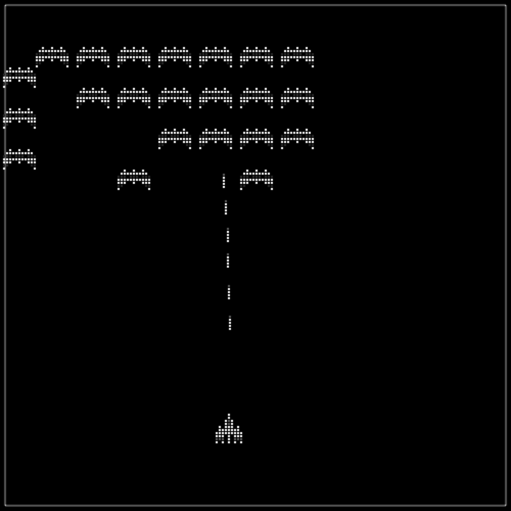

### 7.6.4　第一次迭代：使用单个对象播放声音

这里表述了动态声音的第一次迭代的代码。它的工作方式是根据需要尽可能频繁地调用shootSound和explodeSound对象的play()函数。起初这个方式工作正常，但如果仔细听（在某些浏览器上会更明显），有些声音会有异常或根本没有播放。这是因为使用了单个声音对象，并试图一次又一次的播放同一个声音。单个HTMLAudioElement对象不是按照这种操作方式设计的。读者可以使用兼容HTML5的浏览器运行本书示例代码中的CH7EX6.html文件，测试这段代码。尽可能快地单击发射按钮然后监听声音的播放。过一段时间，声音会在错误的时间播放，或者没有播放完，还有可能根本没播放。图7-7展示了太空掠夺者的第一次迭代在浏览器中的运行界面。

<b class="my_markdown">图7-7　太空掠夺者播放来自两个对象的声音</b>

