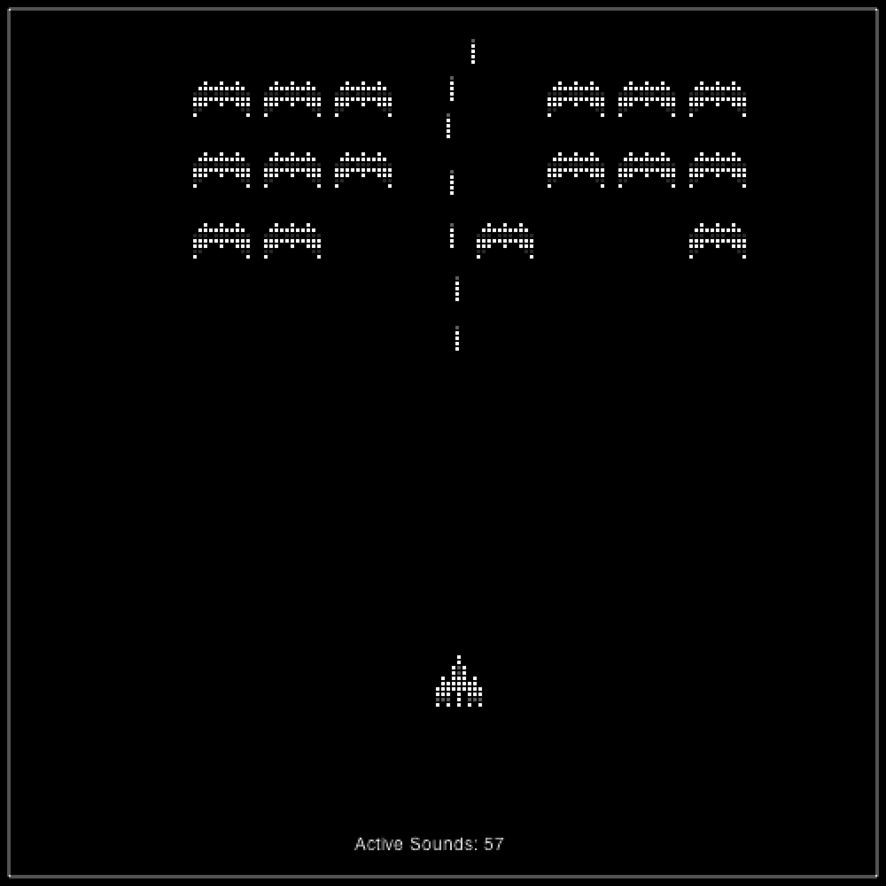

### 7.6.5　第二次迭代：创建无限个动态声音对象

在第一次迭代中，用户几乎得到了想要的效果。但是在声音播放结束之前多次调用单个HTMLAudioElement对象的play()函数时，会遇到一些奇怪的问题。

在第二次迭代中，本例将尝试不同的方法。看看如果每次播放声音时都创建一个新的HTMLAudioElement对象会发生什么事情。敏锐的读者会发现这并不是一个有效地利用内存的方式。这确实是一个可怕的主意。然后看看这样做会发生什么。

在canvasApp()中创建两个变量，表示将要播放的声音文件的文件名，但不包括扩展名。依旧通过调用supportAudioFormat()函数获取扩展名，正如第一次迭代的做法一样，将扩展名保存在audioType变量中。

创建一个名为sounds的数组，用于保存创建的HTMLAudioElement对象。可以从这个数组得知已经创建对象的数量，并将其显示出来，这样就能知道灾难会在何时发生。

```javascript
var SOUND_EXPLODE = "explode1";
var SOUND_SHOOT = "shoot1";
var sounds = new Array();
```

为了取代直接调用每个声音的play()函数，可创建一个名为playSound()的函数。这个函数有以下2个参数。

+ sound：在上面创建的变量之一，用于保存声音文件的文件名。
+ volume：0～1之间数字，用于标示声音播放的音量。

在每次被调用这个函数时，通过调用DOM对象document的createElement函数，创建一个新的声音对象。然后，设置该对象的属性（src、loop、volume）并试图播放声音。为了演示，将这个对象加入到sounds数组中。

```javascript
function playSound(sound,volume){
　 var tempSound = document.createElement("audio");
　 tempSound.setAttribute("src", sound + "." + audioType);
　 tempSound.loop = false;
　 tempSound.volume = volume;
　 tempSound.play();
　 sounds.push(tempSound);
}
```

要播放声音，就要调用playSound()函数，并传递正确的参数。

在eventMouseUp()函数中的调用方法如下。

```javascript
playSound(SOUND_SHOOT,.5);
```

在drawScreen()函数中的调用方法如下。

```javascript
playSound(SOUND_EXPLODE,.5);
```

为了在画布上显示创建了多少声音对象，可以在drawScreen()中添加以下代码。

```javascript
context.fillStyle = "#FFFFFF";
context.fillText ("Active Sounds: " + sounds.length, 200 ,480);
```

现在，运行这个示例（示例代码中的CH7EX7.html文件）。图7-8显示了第2版太空掠夺者在浏览器中的界面效果。注意，屏幕的底部添加了一些文字，用于显示在sounds数组中有多少音频对象。在本次迭代中，读者还会发现以下两个问题。

（1）当从本地磁盘加载声音时，播放几乎没有停顿。但是，当从远程网站上加载页面时，每次加载并播放声音之前都有一个停顿。

（2）声音对象的数量是一个致命问题。在大多数浏览器中，例如Chrome，活动声音对象的上限是50。超过这个数量声音就不再播放了。


<center class="my_markdown"><b class="my_markdown">图7-8　太空掠夺者在运行中创建声音对象</b></center>

