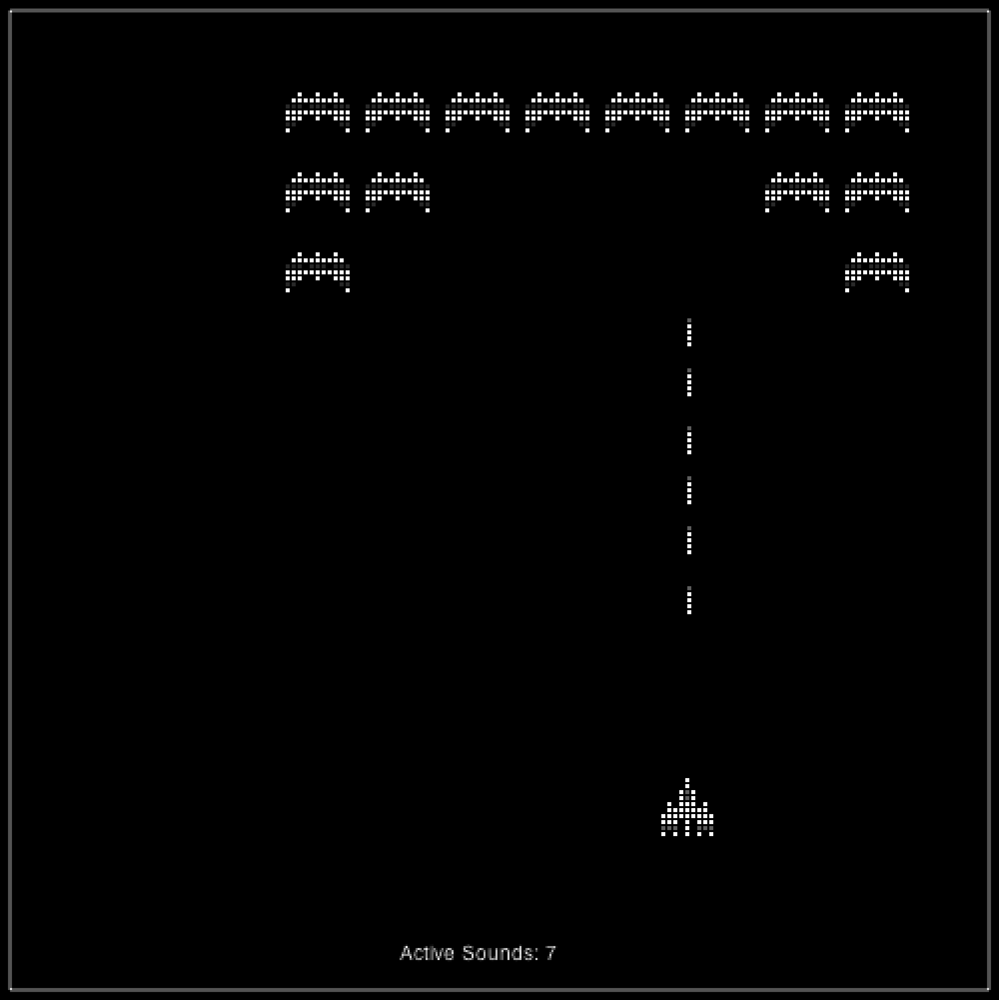

### 7.6.6　第三次迭代：创建一个声音池

现在已经知道不能重复播放一个HTMLAudioElement，也不能在运行中无限制地创建声音对象。然而，如果限制创建声音对象的数量，然后将这些对象放入一个池中，反复利用它们会如何呢？这样做会节省内存，并且在加载声音后，在声音播放前应该听不到停顿。

下面将实现一个方案。该方案将HTMLAudioElement当作一个通用的声音对象使用。维护一个对象池，无论要播放什么声音只需要修改src属性即可。这看上去是一个优雅的方案，可以尽最大可能地重用对象，并提供很大的灵活性。这应该就是我们想要的。

在canvasApp()中创建一个新的变量，名为MAX_SOUND。这个常量表示在任意时刻所能创建声音对象的最大数量。为了能更好地表述用途，将sounds数组重新命名为soundPool。

```javascript
const MAX_SOUNDS = 8;
var soundPool = new Array();
```

playSound()函数的变化很大。使用的参数与第二次迭代中的相同，但是功能差别很大。

```javascript
function playSound(sound,volume){
```

函数的前半部分循环遍历soundPool数据，检查池中是否有可用的HTMLAudioElement对象来播放声音。通过检查ended属性进行判断。由于只有曾经播放过声音的HTMLAudioElement对象被放入池中，因此当声音播放结束后，ended属性会被设为true。重放已经播放结束的声音，这样就可以解决再次使用正在使用中的HTMLAudio Element播放声音的问题。

```javascript
var soundFound = false;
var soundIndex = 0;
var tempSound;
if (soundPool.length> 0){
　 while (!soundFound && soundIndex < soundPool.length){
　　　var tSound = soundPool[soundIndex];
　　　if (tSound.ended){
　　　　 soundFound = true;
　　　} else {
　　　　soundIndex++;
　　　}
　 }
}
if (soundFound){
　 tempSound = soundPool[soundIndex];
　 tempSound.setAttribute("src", sound + "." + audioType);
　 tempSound.loop = false;
　 tempSound.volume = volume;
　 tempSound.play();
```

如果没找到可用的声音对象，并且池中对象数量小于MAX_SOUNDS，就创建一个新的HTMLAudioElement对象，调用它的play()函数，并将其放入池中。这样可以避免声音池过大，确保浏览器在一个时间内不会有太多的HTMLAudioElement对象。

```javascript
　 } else if (soundPool.length < MAX_SOUNDS){
　　　tempSound = document.createElement("audio");
　　　tempSound.setAttribute("src", sound + "." + audioType);
　　　tempSound.volume = volume;
　　　tempSound.play();
　　　soundPool.push(tempSound);
　 }
}
```

读者可以在兼容HTML5的浏览器中打开CH7EX8.html，体验本次迭代的效果。这次游戏运转正常。用户可以听到每个声音，并且浏览器不会像第二次迭代那样崩溃。

不幸的是，这里依然存在问题。在某些浏览器中，播放声音前会像第二次迭代那样有停顿。而且，当从外部网站加载页面时，这种情况比用浏览器从本地加载出现得更为频繁。

Google Chrome浏览器中的表现最糟糕：声音在每次播放前都会停顿。而且，在FireFox中，不是所有对象的src属性都会变化，这使得本应播放爆炸声时会播放射击声，反之亦然。

需要再进行一次迭代。图7-9显示了太空掠夺者在声音池受到MAX_SOUNDS限制时的工作状态。


<center class="my_markdown"><b class="my_markdown">图7-9　使用声音池的太空掠夺者</b></center>

