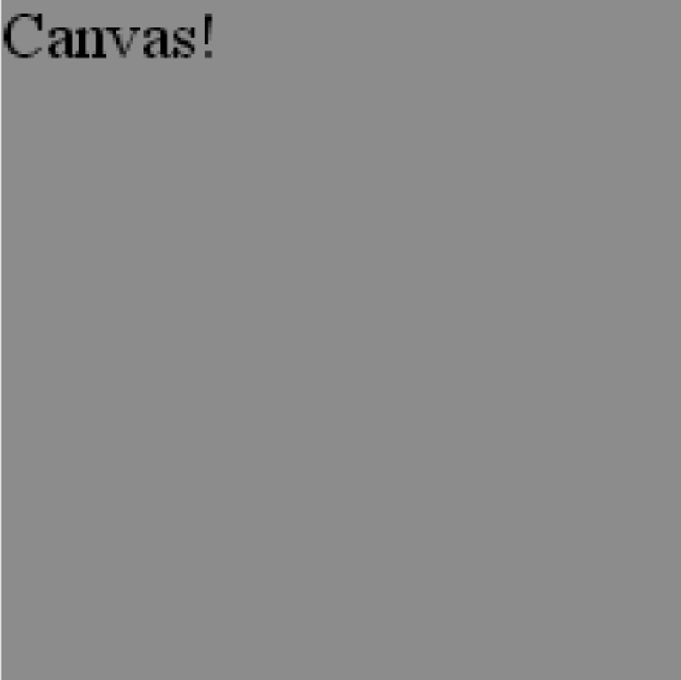

### 8.2　游戏的基本HTML5文件

在开始开发街机游戏之前，先看一下例8-1，这是将在本章中使用的最基本的HTML文件（CH8EX1.html）。首先，从使用第1章定义的HTML5模板入手。这里的画布是一个200×200的正方形。

例8-1　基本的HTML文件

```javascript
<!doctype html>
<html lang="en">
<head>
<meta charset="UTF-8">
<title>Ch8Ex1:Filled Screen With Some Text</title>
<script type="text/javascript">
　 window.addEventListener('load', eventWindowLoaded, false); 
　 function eventWindowLoaded(){
　　　canvasApp();
　 }
　 function canvasApp(){
　　　var theCanvas = document.getElementById('canvas');
　　　if (!theCanvas || !theCanvas.getContext){
　　　　 return;
　　　}
　　　var context = theCanvas.getContext('2d');
　　　if (!context){
　　　　 return;
　　　}
　　　drawScreen();
　　　function drawScreen(){
　　　　 context.fillStyle = '#aaaaaa';
　　　　 context.fillRect(0, 0, 200, 200);
　　　　 context.fillStyle = '#000000';
　　　　 context.font = '20px sans-serif';
　　　　 context.textBaseline = 'top';
　　　　 context.fillText　("Canvas!", 0, 0);
　　　}
　 }
</script>
</head>
　 <body>
　　　<div style="position: absolute; top: 50px; left: 50px;">
　　　　 <canvas id="canvas" width="200" height="200">
　　　　 Your browser does not support the HTML 5 Canvas.
　　　　 </canvas>
　　　</div>
　 </body>
</html>
```

这个例子除了在画布上放置一个200×200的灰色方框并在（0，0）点写上“Canvas！”之外，并没有做其他事情。在接下来的几个例子中将替换drawScreen()函数。图8-1展示了示例8-1运行时的效果。


<center class="my_markdown"><b class="my_markdown">图8-1　基本的HTML文件</b></center>

接下来，将开始制作一个类似Asteroids的游戏，称之为Geo Blaster Basic。游戏的最终运行界面如图8-7所示。

