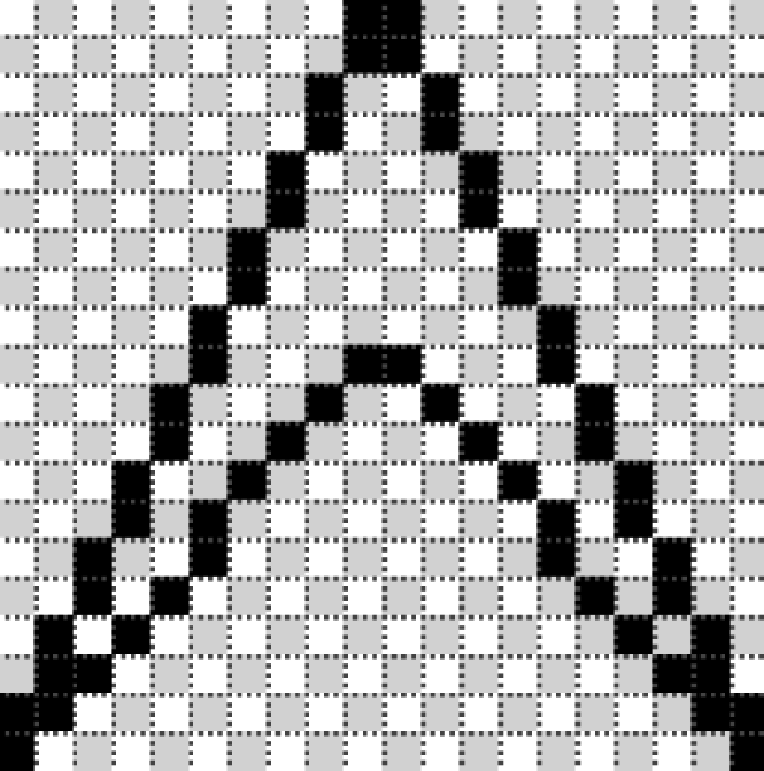
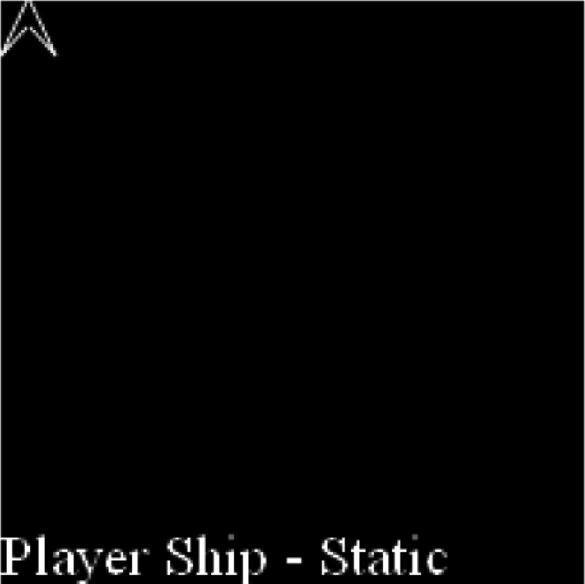
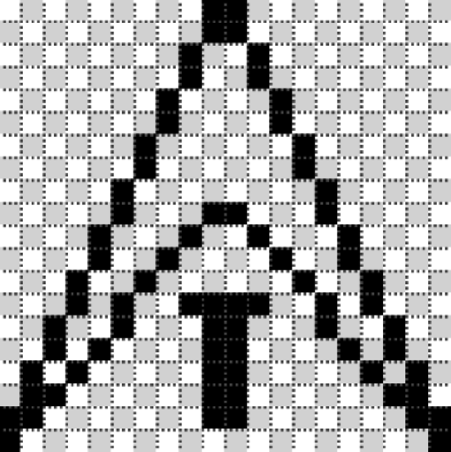

### 8.4.2　使用路径绘制游戏的主角

路径提供了一种简单而又强大的绘制矢量图形的方法。可以用这个方法模拟Asteroids游戏的外观。也可以使用位图图像达到这个目的，但是，本章将关注如何在不使用外部资源的条件下仅用代码创建游戏。先看一下创建飞船的两个动画帧。

#### 1．静态的玩家飞船（第1帧）

用路径将飞船的主要帧绘制在一个20×20的网格中，如图8-2所示。


<center class="my_markdown"><b class="my_markdown">图8-2　玩家飞船</b></center>

利用例8-1中所示的基本HTML文件，仅需用例8-2中的代码替换drawScreen()函数就可以绘制出飞船。

例8-2　绘制玩家飞船

```javascript
function drawScreen(){
　 // 绘制背景和文字
　 context.fillStyle = '#000000';
　 context.fillRect(0, 0, 200, 200);
　 context.fillStyle = '#ffffff';
　 context.font = '20px sans-serif';
　 context.textBaseline = 'top';
　 context.fillText ("Player Ship - Static", 0, 180);
　 //绘制飞船
　 context.strokeStyle = '#ffffff';
　 context.beginPath();
　 context.moveTo(10,0);
　 context.lineTo(19,19);
　 context.lineTo(10,9);
　 context.moveTo(9,9);
　 context.lineTo(0,19);
　 context.lineTo(9,0);
　 context.stroke();
　 context.closePath();
}
```

> **使用路径绘图**
> 以下是使用路径绘图的注意事项。
> （1）总是通过调用context.beginPath()函数开始创建新的路径。
> （2）在绘制路径之前，调用context.strokeStyle()设置线段样式。
> （3）使用context.moveTo()和context.drawTo()的线段命令组合来绘制路径的线段。
> （4）调用context.stroke()结束绘制，调用context.closePath()闭合路径。

在屏幕的左上角（0，0）开始绘制飞船，如图8-3所示。


<center class="my_markdown"><b class="my_markdown">图8-3　画布上的玩家飞船</b></center>

#### 2．带推进火焰的飞船（第2帧）

现在看看玩家飞船动画的第二帧，如图8-4所示。


<center class="my_markdown"><b class="my_markdown">图8-4　带推进火焰的玩家飞船</b></center>

在drawScreen()函数中加上另外的推进火焰图形非常简单，如例8-3所示。

例8-3　绘制带推进火焰的玩家飞船

```javascript
function drawScreen(){
　 // 绘制背景和文字
　 context.fillStyle = '#000000';
　 context.fillRect(0, 0, 200, 200);
　 context.fillStyle = '#ffffff';
　 context.font = '20px sans-serif';
　 context.textBaseline = 'top';
　 context.fillText ("Player Ship - Thrust", 0, 180);
　 //绘制飞船
　 context.strokeStyle = '#ffffff';
　 context.beginPath();
　 context.moveTo(10,0);
　 context.lineTo(19,19);
　 context.lineTo(10,9);
　 context.moveTo(9,9);
　 context.lineTo(0,19);
　 context.lineTo(9,0);
　 //绘制推进火焰
　 context.moveTo(8,13);
　 context.lineTo(11,13);
　 context.moveTo(9,14);
　 context.lineTo(9,18);
　 context.moveTo(10,14);
　 context.lineTo(10,18);
　 context.stroke();
　 context.closePath();
}
```

