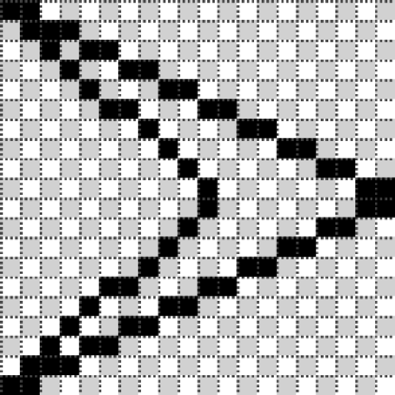

### 8.8.1　移动玩家飞船

当用户按下左右方向键时，玩家飞船会绕中心轴改变旋转角度。当用户按下向上的方向键时，玩家飞船会向飞船面向的角度加速（推进）。由于飞船不受摩擦力的影响，因此飞船将会沿当前的加速角度继续滑行。直到用户将玩家飞船旋转到一个新的角度，并再次按下向上的方向键（推进键）为止。此时，玩家飞船将沿一个新的角度加速。

#### 1．面向角度与移动方向的区别

玩家飞船旋转到的方向就是它面向的方向，而此时的飞船可能向一个不同的方向移动。因此，不能简单地用传统运动向量dx和dy直接表示飞船在x轴和y轴的坐标。程序必须每时每刻维护飞船的这两个值。当玩家仅旋转飞船而没有前进时，需要为飞船绘制新的角度。所有的导弹也都是从飞船面向的方向发射的。在x轴方向，将这个值命名为facingX；在y轴方向，将这个值命名为facingY。当飞船被推进时，使用movingX和movingY变量来处理飞船的移动操作。当飞船在一个新方向前进时要用到这4个值。接下来将具体介绍。

#### 2．在旋转后的方向上推进

一旦飞船旋转到预期的方向，玩家就可以通过按上箭头键推动飞船前进。只有按向上的箭头，才会推动飞船加速前进。由于知道飞船的旋转状态，因此可以很容易地算出旋转角度。分别在飞船的x值和y值上加上新的movingX和movingY的值，使飞船向前移动。

首先将飞船的旋转状态从角度换算为弧度。

```javascript
var angleInRadians = rotation * Math.PI / 180;
```

这段代码在之前出现过，与对玩家飞船应用旋转变换时的代码一样。

一旦得到飞船的旋转角度，就能计算当前方向的facingX和facingY值。仅当需要推进时才计算这两个值，因为这个过程对于处理器的计算量较大。尽管在玩家每次旋转飞船时都可以进行计算，但是这样做会对处理器增加不必要的开销。

```javascript
facingX = Math.cos(angleInRadians);
facingY = Math.sin(angleInRadians);
```

当得到表示玩家飞船当前面向的方向在x轴和y轴上的数值后，开始计算movingX和movingY的数值。

```javascript
movingX = movingX+thrustAcceleration*facingX;
movingY = movingY+thrustAcceleration*facingY;
```

为了将这些值应用到玩家飞船的当前位置，需要将它们分别加到飞船当前的x值和y值上。只有当玩家按向上的方向键时才会进行这个操作。此时，玩家飞船将会加速移动，而不是滑行。在每一帧中必须使用movingX和movingY修改x和y属性。

```javascript
x = x+movingX;
y = y+movingY;
```

#### 3．在0°位置重绘玩家飞船

在第一次绘制玩家飞船图像时，飞船的尖端是向上的。这样做是因为比较简单。但是当准备计算带旋转角度的加速度时，这并不是绘制飞船的最好方向。尖端向上的方向实际为−90°（270°）。如果想让所有的东西保持现状，就应该将angleInRadians的计算公式修改为下面的样子。

```javascript
var angleInRadians = (Math.PI * (player.rotation -90 ))/ 180;
```

这段代码很难看，但是如果希望飞船在应用旋转变换之前保持飞船尖端向上，只有这样写才能正常工作。一个更好的方法是保持angleInRadians的计算方法，但是真正好的方法是在0°绘制飞船（即向右）。图8-5展示了新绘制的飞船。


<center class="my_markdown"><b class="my_markdown">图8-5　新绘制的飞船</b></center>

在0°方向绘制的代码应该做如下修改。

```javascript
//面向右边
context.moveTo(−10,−10);
context.lineTo(10,0);
context.moveTo(10,1);
context.lineTo(−10,10);
context.lineTo(1,1);
context.moveTo(1,−1);
context.lineTo(−10,−10);
```

