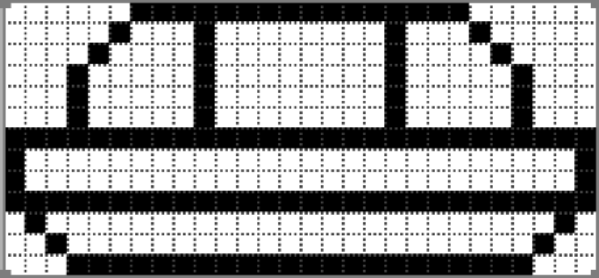

### 8.12.1　逻辑显示对象数组

这里使用数组保存所有的逻辑显示对象。为每个类型的对象定义一个数组（陨石、飞碟、玩家导弹、飞碟导弹和碎片）。每个逻辑显示对象都是一个简单对象的实例。用户可以创建一个单独的函数来绘制并更新每个对象。

提示

> 另外，也可以使用与定义FrameRateCounter对象原型类似的方法来为不同类型的显示对象分别定义一个原型。虽然这样做很方便，但是为了节省篇幅，不在本游戏中实现这种方法。如果定义这些对象，就可以从当前的通用函数中剥离出独立的更新代码和绘制代码，然后将这些代码放入每个独立对象的原型中。在本章的末尾使用一个Rock的原型定义作为示例（参见例8-13）。

读者会发现，飞碟和陨石的绘制方式与玩家飞船的绘制方式非常类似。

#### 1．陨石

陨石是一个正方形，它可以顺时针或逆时针旋转。陨石对象的实例将保存在rocks数组中。当一个新关卡开始时，将在游戏的右上角创建这些陨石。

以下是rock对象的属性变量。

```javascript
newRock.scale = 1;
newRock.width = 50;
newRock.height = 50;
newRock.halfWidth = 25;
newRock.halfHeight = 25;
newRock.x
newRock.y
newRock.dx
newRock.dy
newRock.scoreValue = bigRockScore;
newRock.rotation = 0;
```

将陨石的体积设置为表示陨石体积的3个常量中的一个（这些常量之前介绍过）。将根据陨石体积设置halfWidth和halfHeight，在运算中将会用到它们，使用方式与玩家飞船相应变量的使用方式相同。dx和dy变量中的值将会在每一帧更新陨石时应用到陨石的x属性和y属性上。

#### 2．飞碟

在Atari的Asteroids游戏中，既有小飞碟也有大飞碟。与此不同，在Geo Blaster Basic中只有一种尺寸的飞碟。将它保存在saucers数组中。使用路径将飞船绘制在一个28×13的网格中，如图8-6所示。


<center class="my_markdown"><b class="my_markdown">图8-6　飞碟的设计</b></center>

saucer对象的属性变量设置与rock对象属性变量的设置非常相似。飞碟没有scale属性，而且飞碟也不会旋转，它的角度永远是0。飞碟还包含了一些变量，在每个关卡会更新这些变量，这样可以使得游戏对于玩家更有挑战性。以下是这些变量，本书将在8.12.2节中对它们进行详细讨论。

```javascript
newSaucer.fireRate = levelSaucerFireRate;
newSaucer.fireDelay = levelSaucerFireDelay;
newSaucer.fireDelayCount = 0;
newSaucer.missileSpeed = levelSaucerMissileSpeed;
```

#### 3．导弹

玩家的导弹和飞碟的导弹都是2×2像素的方块。它们分别存储在playerMissiles和saucerMissiles数组中。

这些对象非常简单，其中包含的属性仅用于在屏幕中移动导弹以及计算导弹的寿命。

```javascript
newPlayerMissile.dx = 5*Math.cos(Math.PI*(player.rotation)/180);
newPlayerMissile.dy = 5*Math.sin(Math.PI*(player.rotation)/180);
newPlayerMissile.x = player.x+player.halfWidth;
newPlayerMissile.y = player.y+player.halfHeight;
newPlayerMissile.life = 60;
newPlayerMissile.lifeCtr = 0;
newPlayerMissile.width = 2;
newPlayerMissile.height = 2;
```

#### 4．爆炸和碎片

当一个陨石、飞碟或玩家飞船被摧毁，物体都将爆炸变成若干碎片。使用create Explode()函数创建爆炸后的碎片。碎片也是独立的逻辑显示对象，它拥有life、dx和dy属性。为了让每个爆炸效果都看起来与众不同，要为这些变量赋予随机值。碎片将被存储在particles数组中。

与导弹类似。particle对象也相当简单，其中包含的属性仅用于在屏幕中移动以及在每一帧中计算碎片寿命的消耗。

```javascript
newParticle.dx = Math.random()*3;
newParticle.dy = Math.random()*3;
newParticle.life = Math.floor(Math.random()*30+30);
newParticle.lifeCtr = 0;
newParticle.x = x;
newParticle.y = y;
```

