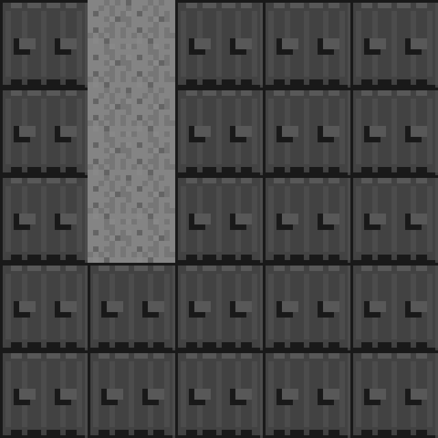
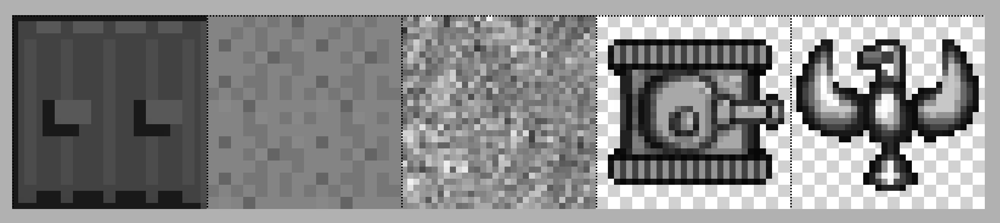
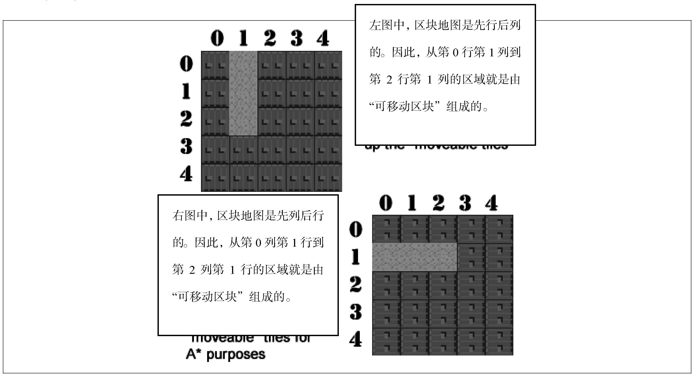
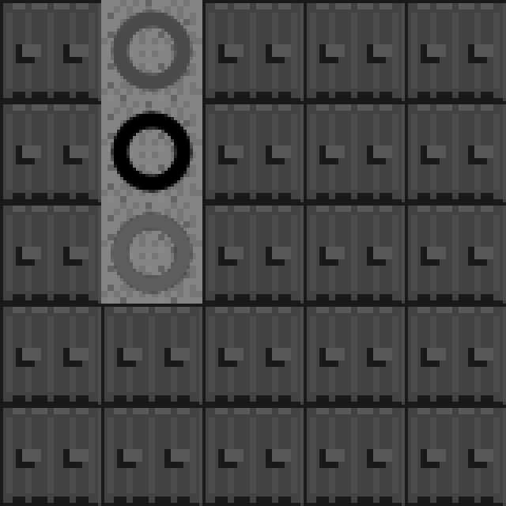

### 8.15.1　什么是A*算法

A *是一种基于网格的用于找到从A点到B点最短“节点”路径的寻路算法。当网格中的每个瓦片都被当成节点，A*就是最适合的寻路算法。图8-8显示的是一个简单的区块网格图。


<center class="my_markdown"><b class="my_markdown">图8-8　简单的5×5区块地图</b></center>

这个简单的5×5的地图中，仅有两种区块。灰色区块是“可移动”的区块，这意味着游戏中的人物可以占用这些地砖，而蓝色的区块是“墙”，墙是不能被游戏角色占用的。如图所示，图8-8的地图上只有三个“可移动”的区块。

在类似于图8-8的地图上，A *算法可以用来寻找两点之间的最短路径。可以看到，图中仅有一条可供物体移动的直线。使用（0,0）标识该图的左上角的第一块区块，则该直线以（0,1）为起点，以（2,1）为终点，而第1列是该可移动的垂直线。这个例子在实践中没有任何用途，因为在这个地图上如果只有3个可供移动的砖块，那么不需要任何寻路算法也可以找到最短的路径。不过，可以从简单入手，慢慢加大难度。 A *是一个非常有用的工具，虽然本书不打算在这里编写代码库，但会简单地写下算法的伪代码。

在O’Reilly 出版的AI for Game Developers书中，David M. Bourg 和 Glenn Seeman这样介绍A*：

A *利用节点化创建了一个简化的搜索区域，从而找到了任何两点之间的最短路径。

他们还提供了简化版的A*伪代码。

```javascript
//*** 来自于AI For Game Developers 的A*算法伪代码
//*** David M. Bourg
//*** Glenn Seeman
//*** O'Reilly (R)
add the starting node to the open node list
while the open list is not empty
　 current node=node from open list with lowest lost
　 if current node == goal then
　　　path complete
　 else
　　　move current node to the closed list
　　　examine each node adjacent to the current node
　　　for each adjacent node
　　　if node is not on the open list
　　　and node is not on the closed list
　　　and node is not an obstacle
　　　then
　　　　 move node to open list and calculate cost of entire path
　 }
```

节点可以包含障碍物（如蓝色的墙壁）或其他地形，例如水或草。本例的设计是：蓝色区块是不能被穿过的障碍物。另外，后面的例子将添加一种草地，该区块则是一种阻力比较大的可穿透的障碍物。在后面的章节中，我们并不使用自己的A*算法，而是使用Brian Grinstead设计实现的A*算法。

提示

> 读者可以在网上找到Brian的JavaScript版A*算法。

本节将使用Brian所创建的两个js文件：graph.js和astar.js。这两个文件可以在Brian的网站上下载到。由于使用的算法并非是自己设计的，因此需要稍微修改之前的代码。Brian的代码要求地图“先行后列”，而本例的地图是“先列后行”。举个简单的例子，如果用Brian的代码打开第4章的地图，可以发现，所有的地图都沿着边框转了90°（x坐标和y坐标对换）。不过这很容易修改。通过一个例子即可看出该如何修改JavaScript和Canvas的代码。

如果读者要查看第一个例子，需要从网站上下载本节的所有示例代码。在这个例子里，提供了一个新的简单的图片表(tiles.png)以及Brian Grinstead的算法库文件astar.js和graph.js文件。图8-9就是本节A*例子中使用到的图片表tiles.png。


<center class="my_markdown"><b class="my_markdown">图8-9　A*例子中所用到的图片表tiles.png</b></center>

下面是例8-13的完整代码。在接下来的章节里，将通过修改这个代码以及加大地图的面积来进一步验证A*功能。这个简单的例子将揭示如何使用该算法，并介绍如何在Canvas里展示算法的计算结果。

例8-13　A* Example 1

```javascript
<!doctype html>
<html lang="en">
<head>
<meta charset="UTF-8">
<title>Chapter 8 Example 14: A* Example 1</title>
<script src="modernizr.js"></script>
<script type='text/javascript' src='graph.js'></script>
<script type='text/javascript' src='astar.js'></script>
<script type="text/javascript">
window.addEventListener('load', eventWindowLoaded, false);
function eventWindowLoaded() {
　 canvasApp();
}
function canvasSupport () {
　 return Modernizr.canvas;
}
function canvasApp(){
　 if (!canvasSupport()) {
　　　return;
　 }else{
　　　var theCanvas = document.getElementById('canvas');
　　　var context = theCanvas.getContext('2d');
　 }
　 //设置区块地图
　 var mapRows=5;
　 var mapCols=5;
　 var tileMap=[
　　[0,1,0,0,0]
　 ,[0,1,0,0,0]
　 ,[0,1,0,0,0]
　 ,[0,0,0,0,0]
　 ,[0,0,0,0,0]
　 ];
　 //设置 a* graph
　 var graph = new Graph(tileMap);
　 var startNode={x:0,y:1}; ///使用将地图翻转后的值
　 var endNode={x:2,y:1};
　 //创建节点列表
　 var start = graph.nodes[startNode.x][startNode.y];
　 var end = graph.nodes[endNode.x][endNode.y];
　 var result = astar.search(graph.nodes, start, end, false);
　 //加载图片表
　 var tileSheet=new Image();
　 tileSheet.addEventListener('load', eventSheetLoaded , false);
　 tileSheet.src="tiles.png";
　 function eventSheetLoaded() {
　　　drawScreen();
　 }
　 function drawScreen() {
　　　for (var rowCtr=0;rowCtr<mapRows;rowCtr++) {
　　　　 for (var colCtr=0;colCtr<mapCols;colCtr++){
　　　　　　var tileId=tileMap[rowCtr][colCtr];
　　　　　　var sourceX=Math.floor(tileId % 5) *32;
　　　　　　var sourceY=Math.floor(tileId / 5) *32;
　　　　　　context.drawImage(tileSheet,sourceX,sourceY,32,32,colCtr*32,
　　　　　　　　　　　　　　　rowCtr*32,32,32);
　　　　 }
　　　}
　　　//在起始点绘制绿色圆圈
　　　context.beginPath();
　　　context.strokeStyle="green";
　　　context.lineWidth=5;
　　　context.arc((startNode.y*32)+16,(startNode.x*32)+16,10,0,
　　　　　　　　　(Math.PI/180) *360,false);
　　　context.stroke();
　　　context.closePath();
　　　//在终点绘制红色圆圈
　　　context.beginPath();
　　　context.strokeStyle="red";
　　　context.lineWidth=5;
　　　context.arc((endNode.y*32)+16, (endNode.x*32)+16, 10, 0,
　　　　　　　　　(Math.PI/180) *360,false);
　　　context.stroke();
　　　context.closePath();
　　　//在路径上绘制黑色圆圈
　　　for (var ctr=0;ctr<result.length-1;ctr++) {
　　　　 var node=result[ctr];
　　　　 context.beginPath();
　　　　 context.strokeStyle="black";
　　　　 context.lineWidth=5;
　　　　 context.arc((node.y*32)+16, (node.x*32)+16, 10, 0,
　　　　　　　　　　 (Math.PI/180) *360,false);
　　　　 context.stroke();
　　　　 context.closePath();
　　　}
　 }
}
</script>
</head>
<body>
<div style="position: absolute; top: 50px; left: 50px;">
<canvas id="canvas" width="500" height="500">
Your browser does not support the HTML5 Canvas.
</canvas>
</div>
</body>
</html>
```

在例8-13中，本书重温了第4章的内容，并引入了一些新的概念。在了解代码的功能前，先来看看该代码的核心部分。

首先创建了区块地图，用于描述了游戏的画面。

```javascript
　 var mapRows=5;
　 var mapCols=5;
　 var tileMap=[
　　[0,1,0,0,0]
　 ,[0,1,0,0,0]
　 ,[0,1,0,0,0]
　 ,[0,0,0,0,0]
　 ,[0,0,0,0,0]
　 ];
```

该区块地图大小为5×5，是通过一个二维矩阵来表示的。可以看到，该矩阵的第二列的前三个数字均为1。如图8-10所示为显示在画布上（不包括示例8-13中的路径查找代码）的样子。当使用从astar.js函数返回的数据时，需要将地图中的x、y坐标互换。


<center class="my_markdown"><b class="my_markdown">图8-10　不包含路径查询结果的原地图</b></center>

通过使用这个非常简单的只包含3个可移动区块的地图，例8-13介绍了如何使用astar.as和graph.as函数查找节点路径。

首先，需要利用graph.as文件里的原型代码创建一个Graph对象。为此，需要将二维数组传递给Graph的构造函数。正如之前提到的，Graph是“先行后列”，而不是“先列后行”。因此，如果地图是以这种形式创建的，那么当创建astar.js所需的起点和终点时，则需要顺着地图的边缘对其进行翻转（直接交换x、y坐标的值也可达到该效果）。

```javascript
//设置 a* graph
var graph = new Graph(tileMap);
var startNode={x:0,y:1}; //使用将地图翻转后的值
var endNode={x:2,y:1};
```

图8-11以一种易于理解的方式解释了翻转的概念。因此，在使用astar.js时，x坐标和y坐标的值需要进行交换。


<center class="my_markdown"><b class="my_markdown">图8-11　对比例8-13的地图与 A*所使用的地图</b></center>

图8-11指出了创建地图时所使用的二维矩阵和graph.js所要求的二维矩阵的区别。因此，当创建起点对象时，尽管实际地图上的x=1、y=0，但为了符合graph.js的需求，需设置x=0、y=1。同样，在创建终点对象时，需要将坐标值（x=1, y=2）设置成（x=2，y=1）。

接下来，将起点和终点传递给astar.search()函数，调用并查找最短的路径。

```javascript
var result = astar.search(graph.nodes, start, end, false);
```

函数的最后一个参数为false，该参数代表：搜索时不考虑对角线节点。后续章节中有一个例子将会介绍该参数。返回的结果是一个包含最短路径的节点数组。

另外，在Canvas里绘制地图的代码与之前第4章里的代码完全一致，都是通过遍历二维数组里的每一行以及行里的每个元素，并将其绘制到屏幕上，来完成该地图的绘制。

最后，绘制找到的路径。首先，用绿圈代表起点，红圈代表终点，路径的中间的每个节点则使用黑圈代表。需要注意的是，当循环遍历找到的路径节点时，需要将每个节点的x值和y值进行交换。

```javascript
context.arc((node.y*32)+16, (node.x*32)+16, 10, 0,(Math.PI/180) *360,false);
```

这个例子最后会返回两点间最短路径，并将其绘制到图上。图8-12所示为最终的结果。


<center class="my_markdown"><b class="my_markdown">图8-12　最终结果</b></center>

