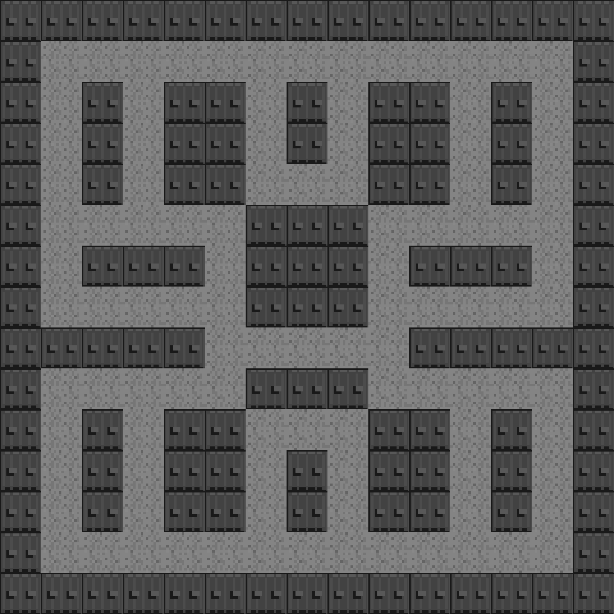
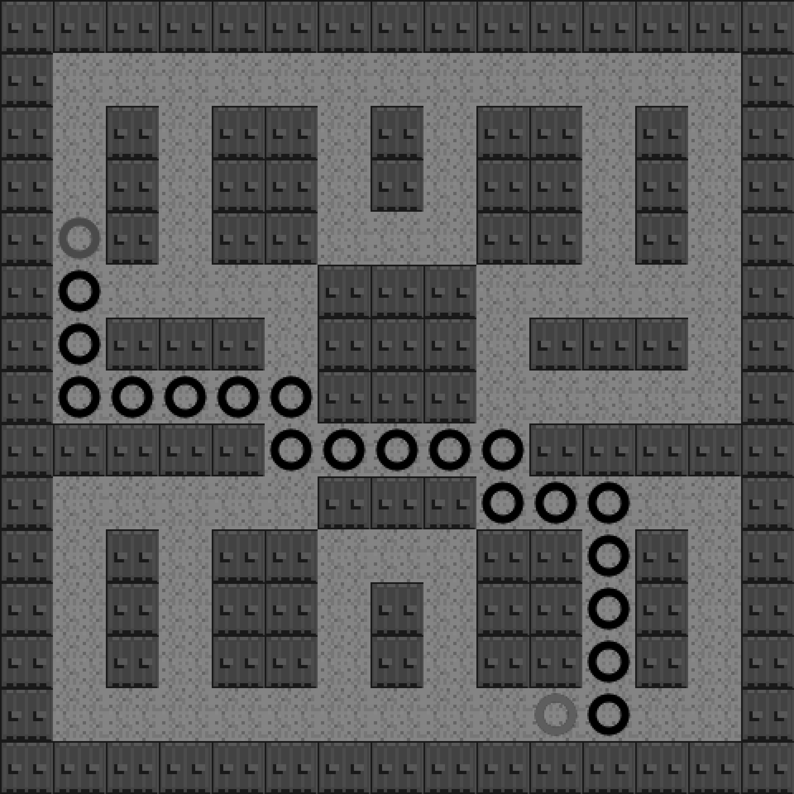

### 8.15.2　在更大的地图上使用A*

为了在更加真实的场景下演示A*算法的查找路径的准确性，需要创建一个新的地图。在下面的例子中，将使用前面的两种区块，创建出一个类似于迷宫的地图。

读者可以从下面的代码中找到这个例子和之前例子的不同之处。另外，例8-14还改变了起始节点和目标节点的坐标。下面的代码只列出了例8-14与例8-13的不同之处。

```javascript
//例 8-14 基于例 8-13进行修改，创建了一个更大的区块地图
　var mapRows=15;
　var mapCols=15;
　var tileMap=[
　[0,0,0,0,0,0,0,0,0,0,0,0,0,0,0]
 ,[0,1,1,1,1,1,1,1,1,1,1,1,1,1,0]
 ,[0,1,0,1,0,0,1,0,1,0,0,1,0,1,0]
 ,[0,1,0,1,0,0,1,0,1,0,0,1,0,1,0]
 ,[0,1,0,1,0,0,1,1,1,0,0,1,0,1,0]
 ,[0,1,1,1,1,1,0,0,0,1,1,1,1,1,0]
 ,[0,1,0,0,0,1,0,0,0,1,0,0,0,1,0]
 ,[0,1,1,1,1,1,0,0,0,1,1,1,1,1,0]
 ,[0,0,0,0,0,1,1,1,1,1,0,0,0,0,0]
 ,[0,1,1,1,1,1,0,0,0,1,1,1,1,1,0]
 ,[0,1,0,1,0,0,1,1,1,0,0,1,0,1,0]
 ,[0,1,0,1,0,0,1,0,1,0,0,1,0,1,0]
 ,[0,1,0,1,0,0,1,0,1,0,0,1,0,1,0]
 ,[0,1,1,1,1,1,1,1,1,1,1,1,1,1,0]
 ,[0,0,0,0,0,0,0,0,0,0,0,0,0,0,0]
];
```

使用上面的数组创建地图，将得到图8-13所示的地图，该地图比之前的地图要大很多。


<center class="my_markdown"><b class="my_markdown">图8-13　不包含路径的15×15的原始地图</b></center>

随着例8-14的地图的变化，需要修改起点和终点的位置，以此来适应更大的地图。将起点设定在在第4行第1列，终点设定在第13行第10列，因此需相应地修改起点和终点对象的属性值。对于例8-14，这是个很小的改变，但却为graph.as和astar.js的功能演示提供了一个更大更好的例子。

在例8-14里，读者将会看到在变大的地图里使用A*算法的结果。下面是修改起始节点和终点节点的代码。

```javascript
//例8-14 起点和终点
var graph = new Graph(tileMap);
var startNode={x:4,y:1}; // use values of map turned on side
var endNode={x:13,y:10};
```

如果例8-13的代码中进行了上述修改，那么结果将会和图8-14所展示的一样。


<center class="my_markdown"><b class="my_markdown">图8-14　在15*15的地图里使用A*寻路算法</b></center>

例8-14　在15×15的地图里使用A*寻路算法

```javascript
<!doctype html>
<html lang="en">
<head>
<meta charset="UTF-8">
<title>Chapter 8 Example 14 - Larger A* Example</title>
<script src="modernizr.js"></script>
<script type='text/javascript' src='graph.js'></script>
<script type='text/javascript' src='astar.js'></script>
<script type="text/javascript">
window.addEventListener('load', eventWindowLoaded, false);
function eventWindowLoaded() {
　　canvasApp();
}
function canvasSupport () {
　　return Modernizr.canvas;
}
function canvasApp(){
　　if (!canvasSupport()) {
　　　　　　　　return;
　　}else{
　　　　var theCanvas = document.getElementById('canvas');
　　　　var context = theCanvas.getContext('2d');
　　}
　　//设置区块地图
　　var mapRows=15;
　　var mapCols=15;
　　var tileMap=[
　　[0,0,0,0,0,0,0,0,0,0,0,0,0,0,0]
　 ,[0,1,1,1,1,1,1,1,1,1,1,1,1,1,0]
　 ,[0,1,0,1,0,0,1,0,1,0,0,1,0,1,0]
　 ,[0,1,0,1,0,0,1,0,1,0,0,1,0,1,0]
　 ,[0,1,0,1,0,0,1,1,1,0,0,1,0,1,0]
　 ,[0,1,1,1,1,1,0,0,0,1,1,1,1,1,0]
　 ,[0,1,0,0,0,1,0,0,0,1,0,0,0,1,0]
　 ,[0,1,1,1,1,1,0,0,0,1,1,1,1,1,0]
　 ,[0,0,0,0,0,1,1,1,1,1,0,0,0,0,0]
　 ,[0,1,1,1,1,1,0,0,0,1,1,1,1,1,0]
　 ,[0,1,0,1,0,0,1,1,1,0,0,1,0,1,0]
　 ,[0,1,0,1,0,0,1,0,1,0,0,1,0,1,0]
　 ,[0,1,0,1,0,0,1,0,1,0,0,1,0,1,0]
　 ,[0,1,1,1,1,1,1,1,1,1,1,1,1,1,0]
　 ,[0,0,0,0,0,0,0,0,0,0,0,0,0,0,0]
　];
　　console.log("tileMap.length=" , tileMap.length);
　　//设置 a* graph
　　var graph = new Graph(tileMap);
　　var startNode={x:4,y:1}; //使用将地图翻转后的值
　　var endNode={x:13,y:10};
　　//创建节点列表
　　var start = graph.nodes[startNode.x][startNode.y];
　　var end = graph.nodes[endNode.x][endNode.y];
　　var result = astar.search(graph.nodes, start, end, false);
　　//加载图片表
　　var tileSheet=new Image();
　　tileSheet.addEventListener('load', eventSheetLoaded , false);
　　tileSheet.src="tiles.png";
　　function eventSheetLoaded() {
　　　　　drawScreen()
　　}
　　function drawScreen() {
　　　　　for (var rowCtr=0;rowCtr<mapRows;rowCtr++) {
　　　　　　　 for (var colCtr=0;colCtr<mapCols;colCtr++){
　　　　　　　　　　 var tileId=tileMap[rowCtr][colCtr];
　　　　　　　　　　 var sourceX=Math.floor(tileId % 5) *32;
　　　　　　　　　　 var sourceY=Math.floor(tileId / 5) *32;
　　　　　　　　　　 context.drawImage(tileSheet, sourceX, sourceY,32,32,
　　　　　　　　　　　　　　　　　　　　　 colCtr*32,rowCtr*32,32,32);
　　　　　　　 }
　　　　　}
　　　　　//在起始点绘制绿色圆圈
　　　　　context.beginPath();
　　　　　context.strokeStyle="green";
　　　　　context.lineWidth=5;
　　　　　context.arc((startNode.y*32)+16, (startNode.x*32)+16, 10, 0,
　　　　　　　　　　　(Math.PI/180) *360,false);
　　　　　context.stroke();
　　　　　context.closePath();
　　　　　//在终点绘制红色圆圈
　　　　　context.beginPath();
　　　　　context.strokeStyle="red";
　　　　　context.lineWidth=5;
　　　　　context.arc((endNode.y*32)+16, (endNode.x*32)+16, 10, 0,
　　　　　　　　　　　(Math.PI/180) *360,false);
　　　　　context.stroke();
　　　　　context.closePath();
　　　　　//在路径上绘制黑色圆圈
　　　　　for (var ctr=0;ctr<result.length-1;ctr++) {
　　　　　　　 var node=result[ctr];
　　　　　　　 context.beginPath();
　　　　　　　 context.strokeStyle="black";
　　　　　　　 context.lineWidth=5;
　　　　　　　 context.arc((node.y*32)+16, (node.x*32)+16, 10, 0,
　　　　　　　　　　　　　 (Math.PI/180) *360,false);
　　　　　　　 context.stroke();
　　　　　　　 context.closePath();
　　　　　}
　　}
}
</script>
</head>
<body>
<div style="position: absolute; top: 50px; left: 50px;">
<canvas id="canvas" width="500" height="500">
Your browser does not support the HTML 5 Canvas.
</canvas>
</div>
</body>
</html>
```

