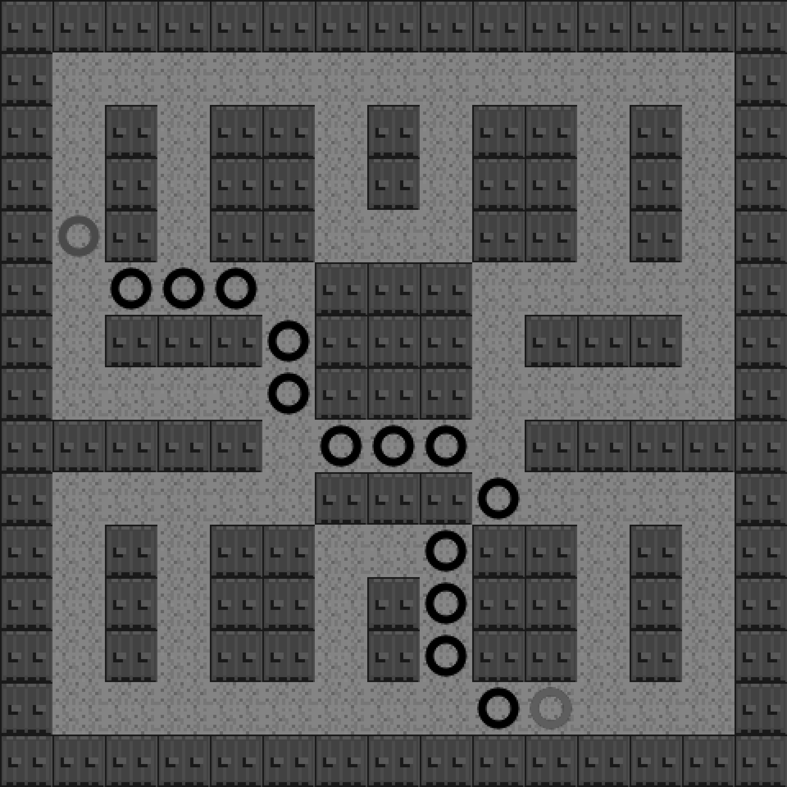

### 8.15.3　可穿过对角线的A*寻路算法

例8-15是在例8-14的基础上增加了穿过对角线选项，从而重新使用A*寻路算法。前面的例子在使用astar.js的函数时都忽略了对角线节点，用户只需将A*的search函数中的false改成true，就可以增加该功能。

```javascript
//在例8-15中将search函数中的最后一个参数设置为true
var result = astar.search(graph.nodes, start, end, true);
```

如果在调用astar.search()函数时将最后一个参数从false改为true，那么得到的最短路径会有明显变化。新的路径如图8-15所示。

在前面的例子中，所有可移动区块的权值均为1。当使用A*寻路算法寻找最短路径时，算法会将自动考虑各个节点的权值。在后面的例子中，将增加一个具有较高权值的节点。


<center class="my_markdown"><b class="my_markdown">图8-15　在15×15的地图里使用可穿过对角线的A*寻路算法</b></center>

例8-15　包含对角线的A*寻路算法的详细代码

```javascript
<!doctype html>
<html lang="en">
<head>
<meta charset="UTF-8">
<title>Chapter 8 Example 15 - Larger A* Example with Diagonals</title>
<script src="modernizr.js"></script>
<script type='text/javascript' src='graph.js'></script>
<script type='text/javascript' src='astar.js'></script>
<script type="text/javascript">
window.addEventListener('load', eventWindowLoaded, false);
function eventWindowLoaded() {
　　canvasApp();
}
function canvasSupport () {
　　return Modernizr.canvas;
}
function canvasApp(){
　　if (!canvasSupport()) {
　　　　　　　　return;
　　}else{
　　　　var theCanvas = document.getElementById('canvas');
　　　　var context = theCanvas.getContext('2d');
　　}
　　//设置区块地图
　　var mapRows=15;
　　var mapCols=15;
　　var tileMap=[
　　[0,0,0,0,0,0,0,0,0,0,0,0,0,0,0]
　 ,[0,1,1,1,1,1,1,1,1,1,1,1,1,1,0]
　 ,[0,1,0,1,0,0,1,0,1,0,0,1,0,1,0]
　 ,[0,1,0,1,0,0,1,0,1,0,0,1,0,1,0]
　 ,[0,1,0,1,0,0,1,1,1,0,0,1,0,1,0]
　 ,[0,1,1,1,1,1,0,0,0,1,1,1,1,1,0]
　 ,[0,1,0,0,0,1,0,0,0,1,0,0,0,1,0]
　 ,[0,1,1,1,1,1,0,0,0,1,1,1,1,1,0]
　 ,[0,0,0,0,0,1,1,1,1,1,0,0,0,0,0]
　 ,[0,1,1,1,1,1,0,0,0,1,1,1,1,1,0]
　 ,[0,1,0,1,0,0,1,1,1,0,0,1,0,1,0]
　 ,[0,1,0,1,0,0,1,0,1,0,0,1,0,1,0]
　 ,[0,1,0,1,0,0,1,0,1,0,0,1,0,1,0]
　 ,[0,1,1,1,1,1,1,1,1,1,1,1,1,1,0]
　 ,[0,0,0,0,0,0,0,0,0,0,0,0,0,0,0]
　];
　　console.log("tileMap.length=" , tileMap.length);
　　//设置 a* graph
　　var graph = new Graph(tileMap);
　　var startNode={x:4,y:1}; //使用将地图翻转后的值
　　var endNode={x:13,y:10};
　　//创建节点列表
　　var start = graph.nodes[startNode.x][startNode.y];
　　var end = graph.nodes[endNode.x][endNode.y];
　　var result = astar.search(graph.nodes, start, end, true);
　　//加载图片表
　　var tileSheet=new Image();
　　tileSheet.addEventListener('load', eventSheetLoaded , false);
　　tileSheet.src="tiles.png";
　　function eventSheetLoaded() {
　　　　　drawScreen()
　　}
　　function drawScreen() {
　　　　　for (var rowCtr=0;rowCtr<mapRows;rowCtr++) {
　　　　　　　 for (var colCtr=0;colCtr<mapCols;colCtr++){
　　　　　　　　　　 var tileId=tileMap[rowCtr][colCtr];
　　　　　　　　　　 var sourceX=Math.floor(tileId % 5) *32;
　　　　　　　　　　 var sourceY=Math.floor(tileId / 5) *32;
　　　　　　　　　　 context.drawImage(tileSheet, sourceX, sourceY,32,32,colCtr*32,
　　　　　　　　　　　　　　　　　　　 　 rowCtr*32,32,32);
　　　　　　　 }
　　　　　}
　　　　　//在起始点绘制绿色圆圈
　　　　　context.beginPath();
　　　　　context.strokeStyle="green";
　　　　　context.lineWidth=5;
　　　　　context.arc((startNode.y*32)+16, (startNode.x*32)+16, 10, 0,
　　　　　　　　　　　(Math.PI/180) *360,false);
　　　　　context.stroke();
　　　　　context.closePath();
　　　　　//在终点绘制红色圆圈
　　　　　context.beginPath();
　　　　　context.strokeStyle="red";
　　　　　context.lineWidth=5;
　　　　　context.arc((endNode.y*32)+16, (endNode.x*32)+16, 10, 0,
　　　　　　　　　　　(Math.PI/180) *360,false);
　　　　　context.stroke();
　　　　　context.closePath();
　　　　　//在路径上绘制黑色圆圈
　　　　　for (var ctr=0;ctr<result.length-1;ctr++) {
　　　　　　　 var node=result[ctr];
　　　　　　　 context.beginPath();
　　　　　　　 context.strokeStyle="black";
　　　　　　　 context.lineWidth=5;
　　　　　　　 context.arc((node.y*32)+16, (node.x*32)+16, 10, 0,
　　　　　　　　　　　　　 (Math.PI/180) *360,false);
　　　　　　　 context.stroke();
　　　　　　　 context.closePath();
　　　　　}
　　}
}
</script>
</head>
<body>
<div style="position: absolute; top: 50px; left: 50px;">
<canvas id="canvas" width="500" height="500">
Your browser does not support the HTML 5 Canvas.
</canvas>
</div>
</body>
</html>
```

