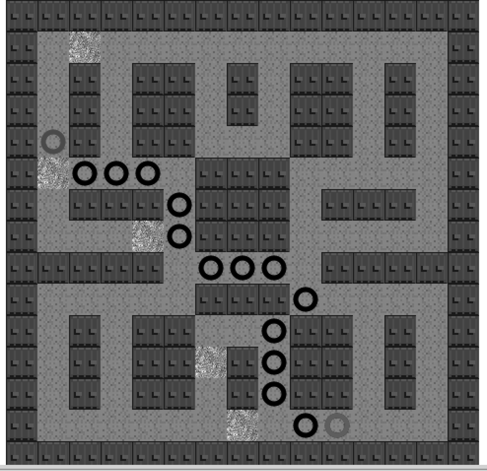

### 8.15.5　带权值及穿越对角线功能的A*寻路算法

在例8-17中，我们将重新添加对角线穿越功能，看看是否能找到新的不经过草地的路径。每经过一条对角线，总权值增加1.41（2的开方）；而每经过一块草地，总权值增加2。因此，穿过对角线的花费少于从经过草地的花费。

```javascript
//例8-17 与例8-16的不同之处
var result = astar.search(graph.nodes, start, end, true);
```

将astar.search()的最后一个参数设置成true后，其结果如图8-17所示。可以看到，由于对角线的权值为1.41，比草地的权值小，所以最短路径绕开了所有的草地。


<center class="my_markdown"><b class="my_markdown">图8-17　带权值及穿越对角线功能的A*寻路算法</b></center>

可以看到，添加穿越对角线的能力后结果明显改变，可以找到一条避免经过草地的路径。由于本书的目的是使用Canvas作出酷炫的应用，因此在本章的最后一个例子中，将在地图中添加一辆绿色的坦克，让它沿着最短路径行进。

例8-17　带权值及穿越对角线功能的A*寻路算法的详细代码

```javascript
<!doctype html>
<html lang="en">
<head>
<meta charset="UTF-8">
<title>Chapter 8 Example 17 - A* with Grass Tiles and Diagonal Moves</title>
<script src="modernizr.js"></script>
<script type='text/javascript' src='graph.js'></script>
<script type='text/javascript' src='astar.js'></script>
<script type="text/javascript">
window.addEventListener('load', eventWindowLoaded, false);
function eventWindowLoaded() {
　　canvasApp();
}
function canvasSupport () {
　　return Modernizr.canvas;
}
function canvasApp(){
　　if (!canvasSupport()) {
　　　　　　　　return;
　　}else{
　　　　var theCanvas = document.getElementById('canvas');
　　　　var context = theCanvas.getContext('2d');
　　}
　//设置区块地图
　　var mapRows=15;
　　var mapCols=15;
　　var tileMap=[
　　[0,0,0,0,0,0,0,0,0,0,0,0,0,0,0]
　 ,[0,1,2,1,1,1,1,1,1,1,1,1,1,1,0]
　 ,[0,1,0,1,0,0,1,0,1,0,0,1,0,1,0]
　 ,[0,1,0,1,0,0,1,0,1,0,0,1,0,1,0]
　 ,[0,1,0,1,0,0,1,1,1,0,0,1,0,1,0]
　 ,[0,2,1,1,1,1,0,0,0,1,1,1,1,1,0]
　 ,[0,1,0,0,0,1,0,0,0,1,0,0,0,1,0]
　 ,[0,1,1,1,2,1,0,0,0,1,1,1,1,1,0]
　 ,[0,0,0,0,0,1,1,1,1,1,0,0,0,0,0]
　 ,[0,1,1,1,1,1,0,0,0,1,1,1,1,1,0]
　 ,[0,1,0,1,0,0,1,1,1,0,0,1,0,1,0]
　 ,[0,1,0,1,0,0,2,0,1,0,0,1,0,1,0]
　 ,[0,1,0,1,0,0,1,0,1,0,0,1,0,1,0]
　 ,[0,1,1,1,1,1,1,2,1,1,1,1,1,1,0]
　 ,[0,0,0,0,0,0,0,0,0,0,0,0,0,0,0]
　];
　　//设置 a* graph
　　var graph = new Graph(tileMap);
　　var startNode={x:4,y:1}; //使用将地图翻转后的值
　　var endNode={x:13,y:10};
　　//创建节点列表
　　var start = graph.nodes[startNode.x][startNode.y];
　　var end = graph.nodes[endNode.x][endNode.y];
　　var result = astar.search(graph.nodes, start, end, true);
　　//加载图片表
　　var tileSheet=new Image();
　　tileSheet.addEventListener('load', eventSheetLoaded , false);
　　tileSheet.src="tiles.png";
　　function eventSheetLoaded() {
　　　　　drawScreen()
　　}
　　function drawScreen() {
　　　　　for (var rowCtr=0;rowCtr<mapRows;rowCtr++) {
　　　　　　　　for (var colCtr=0;colCtr<mapCols;colCtr++){
　　　　　　　　　　　var tileId=tileMap[rowCtr][colCtr];
　　　　　　　　　　　var sourceX=Math.floor(tileId % 5) *32;
　　　　　　　　　　　var sourceY=Math.floor(tileId / 5) *32;
　　　　　　　　　　　context.drawImage(tileSheet, sourceX, sourceY,32,32,
　　　　　　　　　　　　　　　　　　 　　　colCtr*32,rowCtr*32,32,32);
　　　　　　　　}
　　　　　}
　　　　　//在起始点绘制绿色圆圈
　　　　　context.beginPath();
　　　　　context.strokeStyle="green";
　　　　　context.lineWidth=5;
　　　　　context.arc((startNode.y*32)+16, (startNode.x*32)+16, 10, 0,
　　　　　　　　　　　(Math.PI/180) *360,false);
　　　　　context.stroke();
　　　　　context.closePath();
　　　　　//在终点绘制红色圆圈
　　　　　context.beginPath();
　　　　　context.strokeStyle="red";
　　　　　context.lineWidth=5;
　　　　　context.arc((endNode.y*32)+16, (endNode.x*32)+16, 10, 0,
　　　　　　　　　　　(Math.PI/180) *360,false);
　　　　　context.stroke();
　　　　　context.closePath();
　　　　　//在路径上绘制黑色圆圈
　　　　　for (var ctr=0;ctr<result.length-1;ctr++) {
　　　　　　　 var node=result[ctr];
　　　　　　　 context.beginPath();
　　　　　　　 context.strokeStyle="black";
　　　　　　　 context.lineWidth=5;
　　　　　　　 context.arc((node.y*32)+16, (node.x*32)+16, 10, 0,
　　　　　　　　　　　　　 (Math.PI/180) *360,false);
　　　　　　　 context.stroke();
　　　　　　　 context.closePath();
　　　　　}
　　}
}
</script>
</head>
<body>
<div style="position: absolute; top: 50px; left: 50px;">
<canvas id="canvas" width="500" height="500">
Your browser does not support the HTML5 Canvas.
</canvas>
</div>
</body>
</html>
```

作为最后一个例子，例 8-18 让会读者感受到 Canvas 和 A*寻路算法的魅力及乐趣所在。在这个例子中，让坦克沿着最短路径移动。下面是例8-18的详细代码，读者可以浏览并运行代码，稍后本书会讲解代码的重点部分。这段代码结合第4章讲到的Animation和Transformation以及A*寻路算法返回的结果，创造出一个非常酷的A*坦克移动的动画。

例8-18　坦克移动的详细代码

```javascript
<!doctype html>
<html lang="en">
<head>
<meta charset="UTF-8">
<title>Chapter 8 Example 18 - Larger A* With Tank Animation</title>
<script src="modernizr.js"></script>
<script type='text/javascript' src='graph.js'></script>
<script type='text/javascript' src='astar.js'></script>
<script type="text/javascript">
window.addEventListener('load', eventWindowLoaded, false);
function eventWindowLoaded() {
 canvasApp();
}
function canvasSupport () {
　　return Modernizr.canvas;
}
function canvasApp(){
 if (!canvasSupport()) {
　　return;
 }else{
　 var theCanvas = document.getElementById('canvas');
　 var context = theCanvas.getContext('2d');
 }
 var currentNodeIndex=0;
 var nextNode;
 var currentNode;
 var rowDelta=0;
 var colDelta=0;
 var tankX=0;
 var tankY=0;
 var angleInRadians=0;
 var tankStarted=false;
 var tankMoving=false;
 var finishedPath=false;
 //设置区块地图
 var mapRows=15;
 var mapCols=15;
 var tileMap=[
 [0,0,0,0,0,0,0,0,0,0,0,0,0,0,0]
 ,[0,1,2,1,1,1,1,1,1,1,1,1,1,1,0]
 ,[0,1,0,1,0,0,1,0,1,0,0,1,0,1,0]
 ,[0,1,0,1,0,0,1,0,1,0,0,1,0,1,0]
 ,[0,1,0,1,0,0,1,1,1,0,0,1,0,1,0]
 ,[0,2,1,1,1,1,0,0,0,1,1,1,1,1,0]
 ,[0,1,0,0,0,1,0,0,0,1,0,0,0,1,0]
 ,[0,1,1,1,2,1,0,0,0,1,1,1,1,1,0]
 ,[0,0,0,0,0,1,1,1,1,1,0,0,0,0,0]
 ,[0,1,1,1,1,1,0,0,0,1,1,1,1,1,0]
 ,[0,1,0,1,0,0,1,1,1,0,0,1,0,1,0]
 ,[0,1,0,1,0,0,2,0,1,0,0,1,0,1,0]
 ,[0,1,0,1,0,0,1,0,1,0,0,1,0,1,0]
 ,[0,1,1,1,1,1,1,2,1,1,1,1,1,1,0]
 ,[0,0,0,0,0,0,0,0,0,0,0,0,0,0,0]
　];
 //设置 a* graph
 var graph = new Graph(tileMap);
 var startNode={x:4,y:1}; // use values of map turned on side
 var endNode={x:13,y:10};
 //创建节点列表
 var start = graph.nodes[startNode.x][startNode.y];
 var end = graph.nodes[endNode.x][endNode.y];
 var result = astar.search(graph.nodes, start, end, false);
 console.log("result", result);
 //加载图片表
 var tileSheet=new Image();
 tileSheet.addEventListener('load', eventSheetLoaded , false);
 tileSheet.src="tiles.png";
 const FRAME_RATE=40;
 var intervalTime=1000/FRAME_RATE;
 function eventSheetLoaded() {
　 gameLoop();
 }
 function gameLoop() {
　 drawScreen();
　 window.setTimeout(gameLoop, intervalTime);
 }
 function drawScreen() {
　 for (var rowCtr=0;rowCtr<mapRows;rowCtr++) {
　　for (var colCtr=0;colCtr<mapCols;colCtr++){
　　　var tileId=tileMap[rowCtr][colCtr];
　　　var sourceX=Math.floor(tileId % 5) *32;
　　　var sourceY=Math.floor(tileId / 5) *32;
　　　context.drawImage(tileSheet,sourceX,
　　　　　sourceY,32,32,colCtr*32,rowCtr*32,32,32);
　　}
　 }
 //在起始点绘制绿色圆圈
 context.beginPath();
 context.strokeStyle="green";
 context.lineWidth=5;
 context.arc((startNode.y*32)+16, (startNode.x*32)+16, 10, 0,(Math.PI/180) *360,false);
 context.stroke();
 context.closePath();
 //在终点绘制红色圆圈
 context.beginPath();
 context.strokeStyle="red";
 context.lineWidth=5;
 context.arc((endNode.y*32)+16, (endNode.x*32)+16, 10, 0,(Math.PI/180) *360,false);
 context.stroke();
 context.closePath();
 //在路径上绘制黑色圆圈
 for (var ctr=0;ctr<result.length-1;ctr++) {
　 var node=result[ctr];
　 context.beginPath();
　 context.strokeStyle="black";
　 context.lineWidth=5;
　 context.arc((node.y*32)+16, (node.x*32)+16, 10, 0,(Math.PI/180)*360,false);
　 context.stroke();
　 context.closePath();
 }
 if (!finishedPath) {
　 if (!tankStarted) {
　 currentNode=startNode;
　 tankStarted=true;
　 nextNode=result[0];
　 tankX=currentNode.x*32;
　 tankY=currentNode.y*32
　}
　if (tankX==nextNode.x*32 && tankY==nextNode.y*32) {
　 //节点变化
　 currentNodeIndex++;
　 if (currentNodeIndex == result.length) {
　　 finishedPath=true;
　 }
　 currentNode=nextNode;
　 nextNode=result[currentNodeIndex]
　 tankMoving=false;
　}
　if (!finishedPath) {
　 if (nextNode.x > currentNode.x) {
　　 colDelta=1;
　 }else if (nextNode.x < currentNode.x) {
　　 colDelta=-1
　 }else{
　　 colDelta=0
　 }
　if (nextNode.y > currentNode.y) {
　 rowDelta=1;
　}else if (nextNode.y < currentNode.y) {
　　 rowDelta=-1
　 }else{
　　 rowDelta=0
　 }
　 angleInRadians=Math.atan2(colDelta,rowDelta);
　 tankMoving=true;
　}
　tankX+=colDelta;
　tankY+=rowDelta;
 }
 var tankSourceX=Math.floor(3 % 5) *32;
 var tankSourceY=Math.floor(3 / 5) *32;
 context.save(); //保存当前画布状态
 context.setTransform(1,0,0,1,0,0); // 重置变换矩阵
 context.translate((tankY)+16,(tankX)+16);
 context.rotate(angleInRadians);
 context.drawImage(tileSheet, tankSourceX, tankSourceY,32,32,-16,-16,32,32);
 context.restore();
 }
}
</script>
</head>
<body>
<div style="position: absolute; top: 50px; left: 50px;">
<canvas id="canvas" width="500" height="500">
Your browser does not support the HTML 5 Canvas.
</canvas>
</div>
</body>
</html>
```

