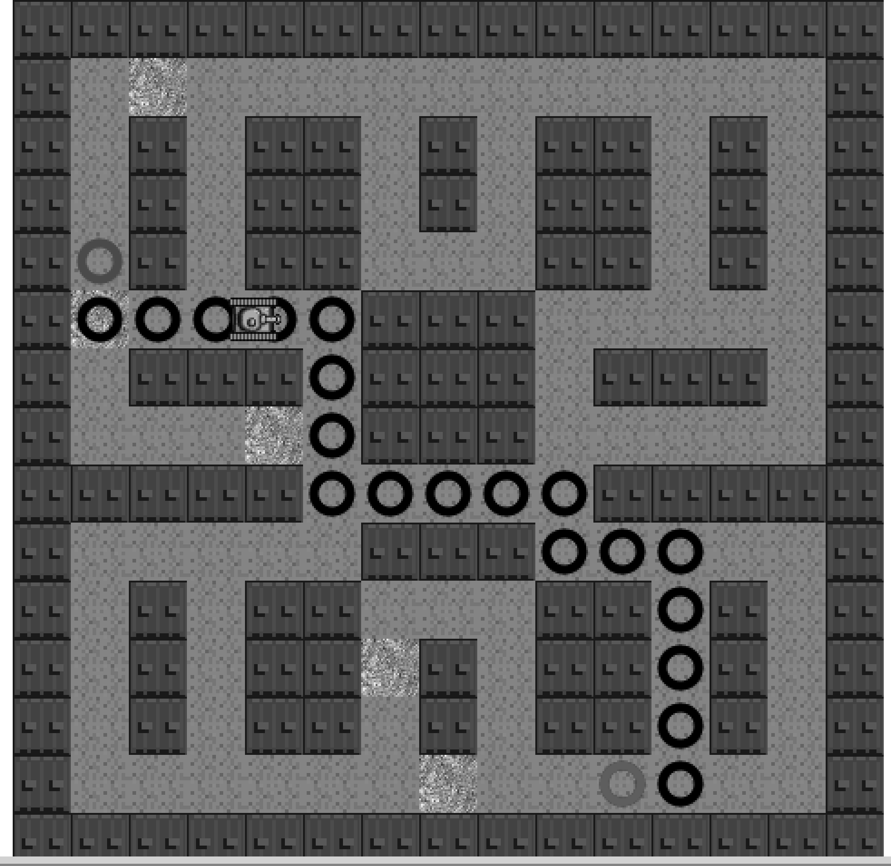

### 8.15.6　让游戏角色顺着A*最短路径移动

接下来，讲解例8-18的代码。为了在路径上添加一个游戏角色，首先需要用到函数astar.search()返回的数组以及数组元素的x和y的坐标值。由于返回的路径数组里并不包含起点，因此需要将起始节点作为坦克的起始节点。然后，再顺着路径数组里的其他节点进行移动。例8-18中加入了很多新的代码，读者可分块查看这些代码。首先，查看该例子中声明的变量。

#### 1．与坦克的移动和节点变化相关的变量

下面的变量与坦克的移动和节点的变化相关。

```javascript
var currentNodeIndex=0;
var nextNode;
var currentNode;
var rowDelta=0;
var colDelta=0;
var tankX=0;
var tankY=0;
var angleInRadians=0;
var tankStarted=false;
var tankMoving=false;
var finishedPath=false;
```

下面简单地介绍各个变量的含义和作用。

（1）currentNodeIndex；

该变量表示当前节点在路径上的位置。因为返回的数组并不包含整个路径，所以在计算坦克的绘制位置时，起始节点的计算与其他节点的计算略有不同。

（2）nextNode；

该变量是坦克即将移动到的下一个节点对象。

（3）currentNode；

该变量是坦克当前所处的节点对象。

（4）rowDelta；

每次坦克移动时都需重新计算，该变量代表着坦克在y轴上的像素变化。

（5）colDelta；

每次坦克移动时都需重新计算，该变量代表着坦克在x轴上的像素变化。

（6）tankX；

坦克当前在Canvas上的x坐标。

（7）tankY；

坦克当前在Canvas上的y坐标。

（8）angleInRadians；

每次坦克移动时都需重新计算，该变量代表着坦克沿着路径移动时所需旋转的角度。

（9）tankStarted；

在坦克出发之前，该变量值为false。当坦克从第一个节点出发之后，就可以使用节点数组里的值。

（10）tankMoving；

若该变量值为false，则意味着坦克还没有出发，或者坦克已经移动到下一个节点的中心位置。之后，代码将会重新计算rowDelta、colDelta以及angleInRadians的值。

（11）finishedPath；

当坦克走完整条路，即移动到最后一个节点时，该变量将被设置成true。

在drawScreen()函数中，将添加代码判断坦克是否已经走完了整条路。除了绘制坦克的代码，其他的代码都会放到这个判断里。

```javascript
if (!finishedPath) {
 //坦克节点和位置的更新逻辑
}
```

#### 2．坦克节点和位置的更新逻辑

接下来，更新坦克所在的节点。首先，判断坦克是否开始移动。如果没有，就使用A*返回数组里的第一个数据result[0]。

```javascript
if (!tankStarted) {
 currentNode=startNode;
 tankStarted=true;
 nextNode=result[0];
 tankX=currentNode.x*32;
 tankY=currentNode.y*32
}
```

如果坦克还位于起点节点，则变量tankStarted的值为false。这时，需要将currentNode设置为起始节点，而nextNode则设置为返回数组的第一个节点result[0]，tankX和tankY则是取当前节点的x、y坐标值乘以区块的大小（32）。

如果坦克是移动的，则需计算它到达下一个节点中心的时间。由于坦克每走一步所花的时间均为1，因此很容易计算。

提示

> 如果坦克的移动速度并不是1，则最好计算各个节点间的距离，并计算每两个节点间所需移动的步伐数。然后，按照计算的步伐数移动坦克。在第5章里有相关的例子可以查看。

```javascript
if (tankX==nextNode.x*32 && tankY==nextNode.y*32) {
 //节点变化
 currentNodeIndex++;
 if (currentNodeIndex == result.length) {
　 finishedPath=true;
 }
 currentNode=nextNode;
 nextNode=result[currentNodeIndex]
 tankMoving=false;
}
```

接下来，通过比较坦克的x、y值与节点的x、y值，来查看坦克是否移动到下一个节点的正中心。如果已经到达，则首先让currentNodeIndex自增1，并判断是否已经走完该路径。若走完，则将变量finishedPath设置为true；否则，将nextNode的值传递给currentNode，并利用变量currentNodeIndex 获取新的路径的节点作为nextNode。最后，再将tankMoving设置为false。

因此，当坦克停止移动时，它肯定置于当前节点的中心。这时，需要计算坦克的下一个节点以及它应该旋转的角度。

```javascript
if (!finishedPath) {
 if (nextNode.x > currentNode.x) {
　 colDelta=1;
 }else if (nextNode.x < currentNode.x) {
　 colDelta=-1
 }else{
　 colDelta=0
 }
 if (nextNode.y > currentNode.y) {
　 rowDelta=1；
 }else if (nextNode.y < currentNode.y) {
　 rowDelta=-1
 }else{
　 rowDelta=0
 }
 angleInRadians=Math.atan2(colDelta,rowDelta);
 tankMoving=true;
}
```

如果nextNode的x值大于currentNode的x值，则坦克向右行驶；如果小于则向左行驶；如果相等，则相对于x轴不动。

如果nextNode的y值大于currentNode的y值，则坦克向下行驶；如果小于则向上行驶；如果相等，则相对于y轴不动。

计算完rowDelta和colDelta的值，再使用它们来计算坦克所需旋转的角度。这里可以通过调用Mathy.atan2()函数来计算。请注意：因为该屏幕的显示是先行后列，而不是先列后行（graph.as的需求），所以为了符合屏幕的显示，这里不是直接使用astar.search()返回的x和y，而是将atan2函数的参数x,y(col,row)调整为y,x(row, col)。

最后，如果坦克还没走完这段路，就需要让tankX自增colDelta，tankY自增rowDelta。

```javascript
tankX+=colDelta;
tankY+=rowDelta;
```

#### 3．在屏幕上绘制坦克

下面的内容是对第4章关于如何在Canvas上使用transformations的复习。这里，使用变量angleInRadians（每次节点发生变化，该变量都需重新计算）来旋转坦克。

```javascript
var tankSourceX=Math.floor(3 % 5) *32;
var tankSourceY=Math.floor(3 / 5) *32;
context.save(); //保存当前画布状态
context.setTransform(1,0,0,1,0,0); // 重置变换矩阵
context.translate((tankY)+16,(tankX)+16);
context.rotate(angleInRadians);
context.drawImage(tileSheet, tankSourceX, tankSourceY,32,32,-16,-16,32,32);
context.restore();
```

首先，找到坦克区块左上角的位置，并将值传递给变量tankSourceX和tankSourceY。

接着，将当前的Canvas保存到堆栈里，并将transformation变化矩阵重置为初始值。将Canvas移动至当前节点的中心，并按照angleInRadians的值进行旋转。然后，将图片绘制到Canvas上。由于要将坦克绘制在正中心，因此两个坐标值都需要偏移16。

如图8-18所示，坦克正沿着例8-18中的路径前进。如果将代码var result = astar.search (graph. nodes, start, end, false)改为var result = astar.search(graph.nodes, start, end, true)，将会得到图8-19所示的结果，路径将引导坦克斜穿过墙壁。所以，如果将最后一个参数设置为true，那么在创造地图的时候需要考虑到这个因素。如图8-20所示，读者会发现地图里新增了一块墙砖，从而阻止了坦克斜穿过墙壁。


<center class="my_markdown"><b class="my_markdown">图8-18　坦克顺着A*算法得到的路径移动</b></center>

