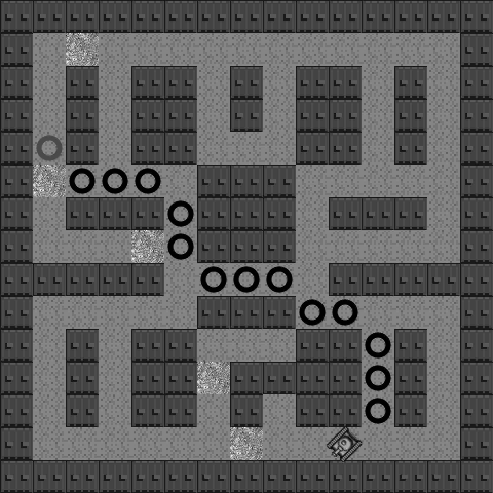

### 8.15.7　坦克斜穿过墙壁

例8-19展示了一个地图设计不当的例子。如图8-19所示，坦克竟然可以斜着穿过墙壁。下面是例8-19的详细代码。

例8-19　地图设计不当的迷宫导致坦克斜着穿过墙壁

```javascript
<!doctype html>
<html lang="en">
<head>
<meta charset="UTF-8">
<title>Chapter 8 Example 19 - A* With Tank Animation with diagoinal moves</title>
<script src="modernizr.js"></script>
<script type='text/javascript' src='graph.js'></script>
<script type='text/javascript' src='astar.js'></script>
<script type="text/javascript">
window.addEventListener('load', eventWindowLoaded, false);
function eventWindowLoaded() {
　　canvasApp();
}
function canvasSupport () {
　　return Modernizr.canvas;
}
function canvasApp(){
　　if (!canvasSupport()) {
　　　　　　　　return;
　　}else{
　　　　var theCanvas = document.getElementById('canvas');
　　　　var context = theCanvas.getContext('2d');
　　}
　　var currentNodeIndex=0;
　　var nextNode;
　　var currentNode;
　　var rowDelta=0;
　　var colDelta=0;
　　var tankX=0;
　　var tankY=0;
　　var angleInRadians=0;
　　var tankStarted=false;
　　var tankMoving=false;
　　var finishedPath=false;
　//设置区块地图
　　var mapRows=15;
　　var mapCols=15;
　　var tileMap=[
　　[0,0,0,0,0,0,0,0,0,0,0,0,0,0,0]
　 ,[0,1,2,1,1,1,1,1,1,1,1,1,1,1,0]
　 ,[0,1,0,1,0,0,1,0,1,0,0,1,0,1,0]
　 ,[0,1,0,1,0,0,1,0,1,0,0,1,0,1,0]
　 ,[0,1,0,1,0,0,1,1,1,0,0,1,0,1,0]
　 ,[0,2,1,1,1,1,0,0,0,1,1,1,1,1,0]
　 ,[0,1,0,0,0,1,0,0,0,1,0,0,0,1,0]
　 ,[0,1,1,1,2,1,0,0,0,1,1,1,1,1,0]
　 ,[0,0,0,0,0,1,1,1,1,1,0,0,0,0,0]
　 ,[0,1,1,1,1,1,0,0,0,1,1,1,1,1,0]
　 ,[0,1,0,1,0,0,1,1,1,0,0,1,0,1,0]
　 ,[0,1,0,1,0,0,2,0,1,0,0,1,0,1,0]
　 ,[0,1,0,1,0,0,1,0,1,0,0,1,0,1,0]
　 ,[0,1,1,1,1,1,1,2,1,1,1,1,1,1,0]
　 ,[0,0,0,0,0,0,0,0,0,0,0,0,0,0,0]
　];
　　//设置 a* graph
　　var graph = new Graph(tileMap);
　　var startNode={x:4,y:1}; // use values of map turned on side
　　var endNode={x:13,y:10};
　　//创建节点列表
　　var start = graph.nodes[startNode.x][startNode.y];
　　var end = graph.nodes[endNode.x][endNode.y];
　　var result = astar.search(graph.nodes, start, end, true);
　　console.log("result", result);
　　//加载图片表
　　var tileSheet=new Image();
　　tileSheet.addEventListener('load', eventSheetLoaded , false);
　　tileSheet.src="tiles.png";
　　const FRAME_RATE=40;
　　var intervalTime=1000/FRAME_RATE;
　　　　　function eventSheetLoaded() {
　　　　　gameLoop();
　　}
　　function gameLoop() {
　　　　　drawScreen();
　　　　　window.setTimeout(gameLoop, intervalTime);
　　}
　　function drawScreen() {
　　　　　for (var rowCtr=0;rowCtr<mapRows;rowCtr++) {
　　　　　　　 for (var colCtr=0;colCtr<mapCols;colCtr++){
　　　　　　　　　　 var tileId=tileMap[rowCtr][colCtr];
　　　　　　　　　　 var sourceX=Math.floor(tileId % 5) *32;
　　　　　　　　　　 var sourceY=Math.floor(tileId / 5) *32;
　　　　　　　　　　 context.drawImage(tileSheet,sourceX,
　　　　　　　　　　　　　　　　　　　 sourceY,32,32,colCtr*32,rowCtr*32,32,32);
　　　　　　　 }
　　　　　}
　　　　　//在起始点绘制绿色圆圈
　　　　　context.beginPath();
　　　　　context.strokeStyle="green";
　　　　　context.lineWidth=5;
　　　　　context.arc((startNode.y*32)+16, (startNode.x*32)+16, 10, 0,(Math.PI/180)*360,false);
　　　　　context.stroke();
　　　　　context.closePath();
　　　　　//在终点绘制红色圆圈
　　　　　context.beginPath();
　　　　　context.strokeStyle="red";
　　　　　context.lineWidth=5;
　　　　　context.arc((endNode.y*32)+16, (endNode.x*32)+16, 10, 0,(Math.PI/180)*360,false);
　　　　　context.stroke();
　　　　　context.closePath();
　　　　　//在路径上绘制黑色圆圈
　　　　　for (var ctr=0;ctr<result.length-1;ctr++) {
　　　　　　　 var node=result[ctr];
　　　　　　　 context.beginPath();
　　　　　　　 context.strokeStyle="black";
　　　　　　　 context.lineWidth=5;
　　　　　　　 context.arc((node.y*32)+16, (node.x*32)+16, 10, 0,(Math.PI/180)*360,false);
　　　　　　　 context.stroke();
　　　　　　　 context.closePath();
　　　　　}
　　　　　if (!finishedPath) {
　　　　　　　 if (!tankStarted) {
　　　　　　　　　　 currentNode=startNode;
　　　　　　　　　　 tankStarted=true;
　　　　　　　　　　 nextNode=result[0];
　　　　　　　　　　 tankX=currentNode.x*32;
　　　　　　　　　　 tankY=currentNode.y*32
　　　　　　　 }
　　　　　　　 if (tankX==nextNode.x*32 && tankY==nextNode.y*32) {
　　　　　　　　　　 //节点变化
　　　　　　　　　　 currentNodeIndex++;
　　　　　　　　　　 if (currentNodeIndex == result.length) {
　　　　　　　　　　　　　finishedPath=true;
　　　　　　　　　　 }
　　　　　　　　　　 currentNode=nextNode;
　　　　　　　　　　 nextNode=result[currentNodeIndex]
　　　　　　　　　　 tankMoving=false;
　　　　　　　 }
　　　　　　　 if (!finishedPath) {
　　　　　　　　　　 if (nextNode.x > currentNode.x) {
　　　　　　　　　　　　　colDelta=1;
　　　　　　　　　　 }else if (nextNode.x < currentNode.x) {
　　　　　　　　　　　　　colDelta=-1
　　　　　　　　　　 }else{
　　　　　　　　　　　　　colDelta=0
　　　　　　　　　　 }
　　　　　　　　　　 if (nextNode.y > currentNode.y) {
　　　　　　　　　　　　　rowDelta=1;
　　　　　　　　　　 }else if (nextNode.y < currentNode.y) {
　　　　　　　　　　　　　rowDelta=-1
　　　　　　　　　　 }else{
　　　　　　　　　　　　　rowDelta=0
　　　　　　　　　　 }
　　　　　　　　　　 angleInRadians=Math.atan2(colDelta,rowDelta);
　　　　　　　　　　 tankMoving=true;
　　　　　　　 }
　　　　　　　 tankX+=colDelta;
　　　　　　　 tankY+=rowDelta;
　　　　　}
　　　　　var tankSourceX=Math.floor(3 % 5) *32;
　　　　　var tankSourceY=Math.floor(3 / 5) *32;
　　　　　context.save(); //保存当前画布状态
　　　　　context.setTransform(1,0,0,1,0,0); // 重置变换矩阵
　　　　　context.translate((tankY)+16,(tankX)+16);
　　　　　context.rotate(angleInRadians);
　　　　　context.drawImage(tileSheet, tankSourceX, tankSourceY,32,32,-16,-16,32,32);
　　　　　context.restore();
　　}
}
</script>
</head>
<body>
<div style="position: absolute; top: 50px; left: 50px;">
<canvas id="canvas" width="500" height="500">
Your browser does not support the HTML 5 Canvas.
</canvas>
</div>
</body>
</html>
```

图8-19是例8-19的运行截图。这个设计不当的地图导致坦克可以斜着穿过墙壁。后面的例子将会设计一张新的地图来修复这个问题。


<center class="my_markdown"><b class="my_markdown">图8-19　坦克顺着A*算法提供的路径斜着穿过墙壁</b></center>

例8-20将修改迷宫，在原来的坦克斜穿过墙壁的路口处添加一堵墙。下面是例8-20中的新地图。

```javascript
var mapCols=15;
var tileMap=[
[0,0,0,0,0,0,0,0,0,0,0,0,0,0,0]
,[0,1,2,1,1,1,1,1,1,1,1,1,1,1,0]
,[0,1,0,1,0,0,1,0,1,0,0,1,0,1,0]
,[0,1,0,1,0,0,1,0,1,0,0,1,0,1,0]
,[0,1,0,1,0,0,1,1,1,0,0,1,0,1,0]
,[0,2,1,1,1,1,0,0,0,1,1,1,1,1,0]
,[0,1,0,0,0,1,0,0,0,1,0,0,0,1,0]
,[0,1,1,1,2,1,0,0,0,1,1,1,1,1,0]
,[0,0,0,0,0,1,1,1,1,1,0,0,0,0,0]
,[0,1,1,1,1,1,0,0,0,1,1,1,1,1,0]
,[0,1,0,1,0,0,1,1,1,0,0,1,0,1,0]
,[0,1,0,1,0,0,2,0,0,0,0,1,0,1,0]
,[0,1,0,1,0,0,1,0,1,0,0,1,0,1,0]
,[0,1,1,1,1,1,1,2,1,1,1,1,1,1,0]
,[0,0,0,0,0,0,0,0,0,0,0,0,0,0,0]
];
```

图8-20展示了在启用对角线选项下，新的地图对最短路径的影响。新增的墙壁改变了原来的路径，产生了一条新的不斜穿墙壁的路径。


<center class="my_markdown"><b class="my_markdown">图8-20　在新增一堵墙的地图里，坦克顺着A*算法提供的路径移动</b></center>

例8-20　使用新的迷宫地图，排除墙壁被穿越的可能

```javascript
<!doctype html>
<html lang="en">
<head>
<meta charset="UTF-8">
<title>Chapter 8 Example 20 - A* With Tank Animation with new maze to prevent
　　　　passable walls </title>
<script src="modernizr.js"></script>
<script type='text/javascript' src='graph.js'></script>
<script type='text/javascript' src='astar.js'></script>
<script type="text/javascript">
window.addEventListener('load', eventWindowLoaded, false);
function eventWindowLoaded() {
　 canvasApp();
}
function canvasSupport () {
　　return Modernizr.canvas;
}
function canvasApp(){
　　if (!canvasSupport()) {
　　　　　　　 return;
　　}else{
　　　　var theCanvas = document.getElementById('canvas');
　　　　var context = theCanvas.getContext('2d');
　　}
　　var currentNodeIndex=0;
　　var nextNode;
　　var currentNode;
　　var rowDelta=0;
　　var colDelta=0;
　　var tankX=0;
　　var tankY=0;
　　var angleInRadians=0;
　　var tankStarted=false;
　　var tankMoving=false;
　　var finishedPath=false;
　//set up tile map
　　var mapRows=15;
　　var mapCols=15;
　　var tileMap=[
　　[0,0,0,0,0,0,0,0,0,0,0,0,0,0,0]
　 ,[0,1,2,1,1,1,1,1,1,1,1,1,1,1,0]
　 ,[0,1,0,1,0,0,1,0,1,0,0,1,0,1,0]
　 ,[0,1,0,1,0,0,1,0,1,0,0,1,0,1,0]
　 ,[0,1,0,1,0,0,1,1,1,0,0,1,0,1,0]
　 ,[0,2,1,1,1,1,0,0,0,1,1,1,1,1,0]
　 ,[0,1,0,0,0,1,0,0,0,1,0,0,0,1,0]
　 ,[0,1,1,1,2,1,0,0,0,1,1,1,1,1,0]
　 ,[0,0,0,0,0,1,1,1,1,1,0,0,0,0,0]
　 ,[0,1,1,1,1,1,0,0,0,1,1,1,1,1,0]
　 ,[0,1,0,1,0,0,1,1,1,0,0,1,0,1,0]
　 ,[0,1,0,1,0,0,2,0,0,0,0,1,0,1,0]
　 ,[0,1,0,1,0,0,1,0,1,0,0,1,0,1,0]
　 ,[0,1,1,1,1,1,1,2,1,1,1,1,1,1,0]
　 ,[0,0,0,0,0,0,0,0,0,0,0,0,0,0,0]
　];
　　//设置 a* graph
　　var graph = new Graph(tileMap);
　　var startNode={x:4,y:1}; // use values of map turned on side
　　var endNode={x:13,y:10};
　　//创建节点列表
　　var start = graph.nodes[startNode.x][startNode.y];
　　var end = graph.nodes[endNode.x][endNode.y];
　　var result = astar.search(graph.nodes, start, end, true);
　　console.log("result", result);
　　//加载图片表
　　var tileSheet=new Image();
　　tileSheet.addEventListener('load', eventSheetLoaded , false);
　　tileSheet.src="tiles.png";
　　const FRAME_RATE=40;
　　var intervalTime=1000/FRAME_RATE;
　　　　　function eventSheetLoaded() {
　　　　　gameLoop();
　　}
　　function gameLoop() {
　　　　　drawScreen();
　　　　　window.setTimeout(gameLoop, intervalTime);
　　}
function drawScreen() {
　　　for (var rowCtr=0;rowCtr<mapRows;rowCtr++) {
　　　　　 for (var colCtr=0;colCtr<mapCols;colCtr++){
　　　　　　　　 var tileId=tileMap[rowCtr][colCtr];
　　　　　　　　 var sourceX=Math.floor(tileId % 5) *32;
　　　　　　　　 var sourceY=Math.floor(tileId / 5) *32;
　　　　　　　　 context.drawImage(tileSheet,sourceX,
　　　　　　　　　　　　　　　　　 sourceY,32,32,colCtr*32,rowCtr*32,32,32);
　　　　　 }
　　　}
　　　//在起始点绘制绿色圆圈
　　　context.beginPath();
　　　context.strokeStyle="green";
　　　context.lineWidth=5;
　　　context.arc((startNode.y*32)+16, (startNode.x*32)+16, 10, 0,(Math.PI/180)*360,false);
　　　context.stroke();
　　　context.closePath();
　　　//在终点绘制红色圆圈
　　　context.beginPath();
　　　context.strokeStyle="red";
　　　context.lineWidth=5;
　　　context.arc((endNode.y*32)+16, (endNode.x*32)+16, 10, 0,(Math.PI/180)*360,false);
　　　context.stroke();
　　　context.closePath();
　　　//在路径上绘制黑色圆圈
　　　for (var ctr=0;ctr<result.length-1;ctr++) {
　　　　　　var node=result[ctr];
　　　　　　context.beginPath();
　　　　　　context.strokeStyle="black";
　　　　　　context.lineWidth=5;
　　　　　　context.arc((node.y*32)+16, (node.x*32)+16, 10, 0,(Math.PI/180)*360,false);
　　　　　　context.stroke();
　　　　　　context.closePath();
　　　}
　　　if (!finishedPath) {
　　　　　 if (!tankStarted) {
　　　　　　　　 currentNode=startNode;
　　　　　　　　 tankStarted=true;
　　　　　　　　 nextNode=result[0];
　　　　　　　　 tankX=currentNode.x*32;
　　　　　　　　 tankY=currentNode.y*32
　　　　　 }
　　　　　 if (tankX==nextNode.x*32 && tankY==nextNode.y*32) {
　　　　　　　　 //节点变化
　　　　　　　　 currentNodeIndex++;
　　　　　　　　 if (currentNodeIndex == result.length) {
　　　　　　　　　　　finishedPath=true;
　　　　　　　　 }
　　　　　　　　 currentNode=nextNode;
　　　　　　　　 nextNode=result[currentNodeIndex]
　　　　　　　　 tankMoving=false;
　　　　　 }
　　　　　 if (!finishedPath) {
　　　　　　　　 if (nextNode.x > currentNode.x) {
　　　　　　　　　　　colDelta=1;
　　　　　　　　 }else if (nextNode.x < currentNode.x) {
　　　　　　　　　　　colDelta=-1
　　　　　　　　 }else{
　　　　　　　　　　　colDelta=0
　　　　　　　　 }
　　　　　　　　 if (nextNode.y > currentNode.y) {
　　　　　　　　　　　rowDelta=1;
　　　　　　　　 }else if (nextNode.y < currentNode.y) {
　　　　　　　　　　　rowDelta=-1
　　　　　　　　 }else{
　　　　　　　　　　　rowDelta=0
　　　　　　　　 }
　　　　　　　　 angleInRadians=Math.atan2(colDelta,rowDelta);
　　　　　　　　 tankMoving=true;
　　　　　 }
　　　　　 tankX+=colDelta;
　　　　　 tankY+=rowDelta;
　　　}
　　　var tankSourceX=Math.floor(3 % 5) *32;
　　　var tankSourceY=Math.floor(3 / 5) *32;
　　　context.save(); //保存当前画布状态
　　　context.setTransform(1,0,0,1,0,0); // 重置变换矩阵
　　　context.translate((tankY)+16,(tankX)+16);
　　　context.rotate(angleInRadians);
　　　context.drawImage(tileSheet, tankSourceX, tankSourceY,32,32,-16,-16,32,32);
　　　context.restore();
　　}
}
</script>
</head>
<body>
<div style="position: absolute; top: 50px; left: 50px;">
<canvas id="canvas" width="500" height="500">
Your browser does not support the HTML 5 Canvas.
</canvas>
</div>
</body>
</html>
```

针对A*寻路算法中的初级、中级以及更复杂的问题，本书全都介绍了一遍。读者可以在其他的应用中需要找到两点之间的最短路径时，简单地进行扩展和套用。

