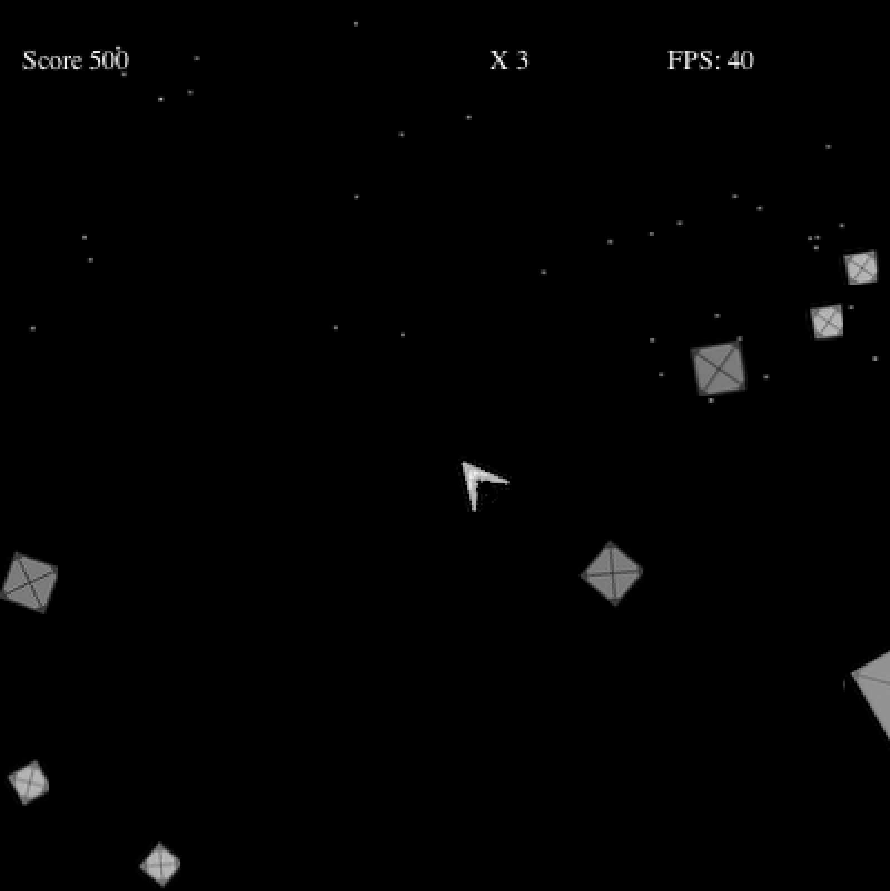

### 9.1　扩展版的Geo Blaster

本章将创建一个新游戏：扩展版的Geo Blaster。这个游戏在第8章的Geo Blaster Basic的基础上添加了位图和声音，大部分的游戏逻辑是相同的。但是，用位图取代路径可以对渲染过程进行优化。优化渲染过程是非常重要的，特别是在处理器能力有限的设备上，例如手机。将向Geo Blaster扩展版中加入声音，并为游戏爆炸效果的碎片应用一个对象池。图9-1所示为最终游戏的屏幕截图。

<b class="my_markdown">图9-1　Geo Blaster扩展版</b>

首先看一下在新游戏中用到的图片表。

