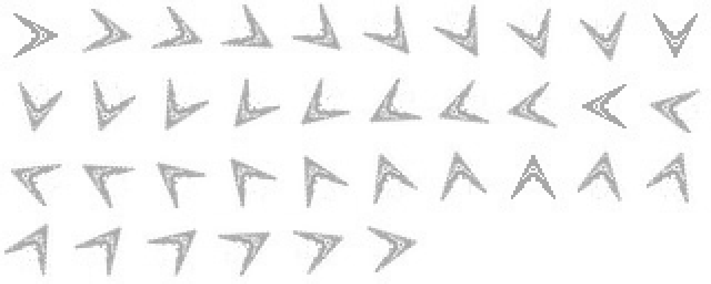
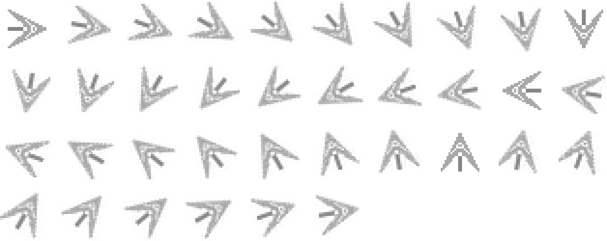
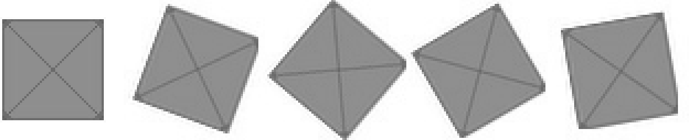
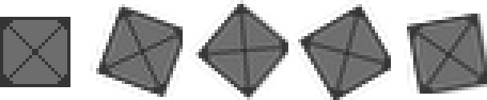
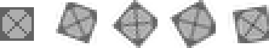
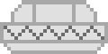

### 9.1.1　Geo Blaster的图片表

在第4章中，读者学习了如何在canvas中应用位图图形，并且还学习了使用图片列表渲染图像的方法。第8章也使用路径绘制了全部的游戏图形，并在运行过程中对它们进行形状变换。本章将使用第4章中学到的知识对Geo Blaster Basic的渲染过程进行优化。通过预先将全部游戏图形和形状变换都绘制成位图可以实现优化效果。在创建 Geo Blaster Extend时，将使用这些位图取代在第8章中使用的路径和实时的形状变换。

图9-2展示了游戏中所用到的图片表之一（ship_tiles.png）。


<center class="my_markdown"><b class="my_markdown">图9-2　图片表ship_tiles.png</b></center>

图9-3展示了飞船带推进火焰的第二组图片表（ship_tiles.png）。当用户按下向上键时，将使用这组图片绘制飞船。


<center class="my_markdown"><b class="my_markdown">图9-3　图片表ship_titles2.png</b></center>

接下来的3组图片都是玩家要摧毁的各种陨石。这里准备了3个图片表：largerocks.png（见图9-4）、mediumrocks.png（见图9-5）和smallrocks.png（见图9-6）。


<center class="my_markdown"><b class="my_markdown">图9-4　图片表largerocks.png</b></center>


<center class="my_markdown"><b class="my_markdown">图9-5　图片表mediumrocks.png</b></center>


<center class="my_markdown"><b class="my_markdown">图9-6　图片表smallrocks.png</b></center>

这3个图片表中都只需要5个图片。因为陨石是正方形，无论是顺时针旋转还是逆时针旋转，都可以通过重复播放这5帧来模拟。

向玩家射击的飞碟只需要一张图片saucer.png，如图9-7所示。


<center class="my_markdown"><b class="my_markdown">图9-7　图片saucer.png</b></center>

最后是parts.png（见图9-8）。这是一个8×2的图片表，其中包含了4个2×2的“碎片”图。这些图将用于玩家导弹和飞碟导弹击中目标后的爆炸效果。


<center class="my_markdown"><b class="my_markdown">图9-8　图片表parts.png</b></center>

读者在书中看到的是黑白颜色的图像，但可以从本书网站上下载源代码及相关文件进行查看。第一张图片是绿色的，用于小陨石和飞碟的爆炸效果。第二张图片是浅蓝色的，用于描绘玩家导弹和玩家飞船的爆炸效果。第三张图片是粉红色的，用于表示大陨石的爆炸效果。最后一张图片是紫色的，用于中型陨石的爆炸效果。

现在，图片已经就位，下面将学习如何在Geo Blaster的扩展版中使用图片表位图图像，取代Geo Blaster Basic中实时模式的路径来实现形状变换的方法。

#### 1．复习：计算图片源的位置

在第 4 章中，读者学习了在知道图片编号的情况下如何计算图片在图片表中位置的方法。下面简要回顾一下相关内容，因为本章将用这个方法渲染游戏中的全部图片。

对于一个给定的图片表，例如ship_tiles.png，可以用一个简单的数学技巧来定位要显示的图片。

ship_tiles.png中包含了玩家飞船从0°开始旋转的36帧的动画图片。第一张图片是向右的，其余35张图片中的飞船依次增加10°旋转。

如果显示第19张图片（飞船指向左边，处于190°的位置），首先需要通过计算sourceX和sourcY，找到该图片左上角的x和y的坐标。

下面是之前用于计算sourceX的代码。

```javascript
sourceX = integer(current_frame_index modulo
the_number_columns_in_the_tilesheet)* tile_width
```

取模运算符%，返回除法运算的余数。以下是用于计算sourceX的实际代码，其中的变量使用数值进行了替换。

```javascript
var sourceX = Math.floor(19 % 10)*32;
```

运算结果是x = 9×32 = 288;

sourceY的运算方法与之类似，只是进行除法运算，而不是取模运算。

```javascript
sourceY = integer(current_frame_index divided by
the_number_columns_in_the_tilesheet)*tile_height
```

以下是用于计算的实际代码。

```javascript
var sourceY = Math.floor(19 / 10)*32;
```

运算结果是 y = 1×32 = 32，因此，要复制的图片的左上在ship_tiles.png的坐标是（288,32）。

实际使用以下语句将图片复制到画布。

```javascript
context.drawImage(shipTiles, sourceX, sourceY,32,32,player.x,player.y,32,32);
```

第8章用了相当多的代码来实现绘制飞船，以及将飞船相对于当前旋转状态进行平移。当使用图片表之后将缩减代码。

以下是用于渲染玩家飞船的代码。本例将用它替换第8章中例8-12的renderPlayer()函数。

```javascript
function renderPlayerShip(x,y,rotation, scale){
　　//形状变换
　　context.save(); //将当前状态保存到栈中
　　context.globalAlpha = parseFloat(player.alpha);
　　var angleInRadians = rotation * Math.PI / 180;
　　var sourceX = Math.floor((player.rotation/10)% 10)* 32;
　　var sourceY = Math.floor((player.rotation/10)/10)*32;
　　if (player.thrust){
　　　 context.drawImage(shipTiles2, sourceX, sourceY, 32, 32,
　　　　　player.x,player.y,32,32);
　　}else{
　　　 context.drawImage(shipTiles, sourceX, sourceY, 32, 32,
　　　 player.x,player.y,32,32);
　　}
　　//恢复环境
　　context.restore(); //将原有状态恢复到屏幕
　　context.globalAlpha = 1;
}
```

提示

> 读者可以在附录A中的示例A-2中查看Geo Blaster扩展版的全部的代码。

renderPlay()函数将player.rotation除以10，从而确定将shipTiles对象中保存的36张图片中哪一张显示在画布上。如果玩家处于“推进”状态，就使用shipTiles2图像代替shipTiles。

因为将每次按下向左键或向右键的旋转角度定为10°，所以以上代码可以正常工作。在第8章中的游戏版本里，每次旋转角度是5°。如果准备一张72帧的图片表，就可以让玩家飞船每次旋转5°，并保持player.rotationalVelocity等于5。对于Geo Blaster扩展版，只为玩家飞船绘制了36张图片。所以，将飞船的旋转速度定为10°。当然，也可以为玩家飞船旋转使用72帧，甚至是360帧的图片。这仅仅是受限于人们的创造力和想象力，也可能是没有足够的耐心使用绘图工具。

下面看看在gameStateNewGame()函数中预先对rotationalVelocity赋值的过程。

```javascript
function gameStateNewGame(){
　 ConsoleLog.log("gameStateNewGame")
　 //设置一个新游戏
　 level = 0;
　 score = 0;
　 playerShips = 3;
　 player.maxVelocity = 5;
　 player.width = 32;
　 player.height = 32;
　 player.halfWidth = 16;
　 player.halfHeight = 16;
　 player.hitWidth = 24;
　 player.hitHeight = 24;
　 player.rotationalVelocity = 10; //每次旋转飞船多少度
　 player.thrustAcceleration = .05;
　 player.missileFrameDelay = 5;
　 player.thrust = false;
　 player.alpha = 1;
　 player.rotation = 0;
　 player.x = 0;
　 player.y = 0;
　 fillBackground();
　 renderScoreBoard();
　 switchGameState(GAME_STATE_NEW_LEVEL)
}
```

#### 2．新的玩家属性

随着旋转速度的变化，还需要修改玩家的width和height属性。这两个属性现在的值都是32，与图片的宽度和高度一样。如果观察ship_tiles.png中的第一帧图片，就会发现玩家飞船并没有完全充满32×32的图片。飞船在图片的中央，占据了约是24×24的图片。图片的四周预留了足够的空白区域，用于避免在飞船旋转时出现飞船被截断的情况。在创建陨石旋转时也是用同样的做法。

这些为了避免在旋转帧截断飞船而预留的多余像素给碰撞检测造成了一些问题。在第8章的游戏版本中，使用了width和height属性的值作为碰撞检测的边框。新版本则不会使用这些值，新版本将专门为碰撞检测创建两个新变量：hitWidth和hitHeight。这些变量的值不是32，而是24。用小一些的值替代整体的宽度和高度，可以使碰撞检测更加精确。

#### 3．新的边框碰撞算法

游戏中所有其他的物体也都会有 hitWidth 和 hitHeight 属性。下面，修改 Geo Blaster Basic中的boundingBoxCollide()函数，使用新的属性来进行碰撞检测。

```javascript
function boundingBoxCollide(object1, object2){
　 var left1 = object1.x;
　 var left2 = object2.x;
　 var right1 = object1.x + object1.hitWidth;
　 var right2 = object2.x + object2.hitWidth;
　 var top1 = object1.y;
　 var top2 = object2.y;
　 var bottom1 = object1.y + object1.hitHeight;
　 var bottom2 = object2.y + object2.hitHeight;
　 if (bottom1 < top2)return(false);
　 if (top1 > bottom2)return(false);
　 if (right1 < left2)return(false);
　 if (left1 > right2)return(false);
　 return(true);
　 }
```

接下来，快速浏览一下如何用同样的方法使用新的图片表渲染游戏中的其他对象。

