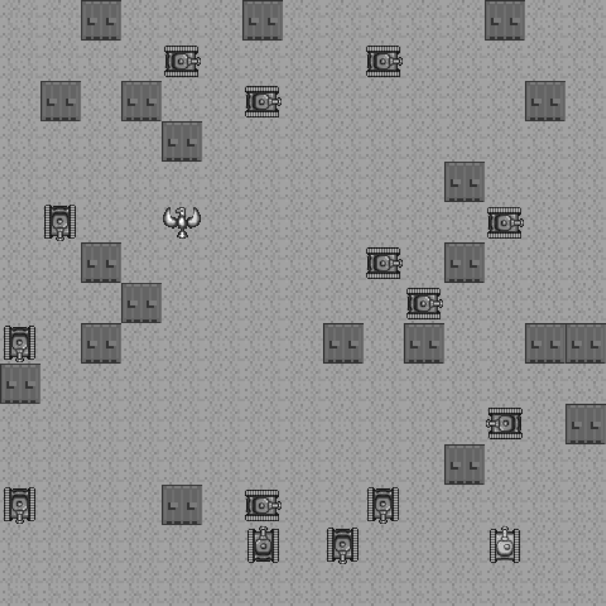

### 9.3　简单的基于区块的游戏

先来看一下Asteroids公司另一个经典的游戏，这是一个迷宫追逐类的游戏。当讨论基于区块的游戏时，毫无疑问，吃豆人（Pac-Man）游戏会首先进入人们的眼帘，尽管它并不是第一个此种类型的游戏。当人们还认为微型计算机不可能实现的时候，初露头角的游戏开发者已经在开发迷宫追逐类的游戏了。许多微型计算机和主流的基于区块的游戏（如Daleks）都是在20世纪60年代和70年代开发的。本节将创建一个回合制、迷宫追逐类的游戏，游戏名为“微型坦克迷宫”。它与Daleks类似，只不过将使用第4章中的坦克精灵。图9-10展示了游戏最终的运行界面。

<b class="my_markdown">图9-10　微型坦克迷宫的运行界面</b>

