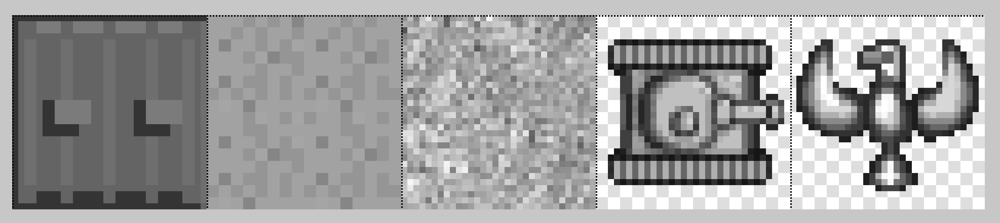

### 9.3.2　游戏中用到的图片表

在继续阅读本章前，应确保已经阅读了第4章和第8章的“一个基本的游戏框架”小节。尽管微型坦克迷宫是一个相当简单的游戏，但是它的代码量也是非常大的。鉴于篇幅的原因，本书无法讨论每一个细节，只介绍一些重点。

如果读者阅读过第4章，一定对游戏中用到的图片表（tanks_sheet.png）非常熟悉。图9-11展示了tanks_sheet.png图片。


<center class="my_markdown"><b class="my_markdown">图9-11　微型坦克迷宫的图片表</b></center>

在微型坦克迷宫中，将只用到图片表中的一小部分。

+ 道路图片：玩家和敌方坦克都可以在道路上移动。左上角的图片（即0号图片）代表道路。
+ 墙体图片：撞到墙上的任何坦克都会被摧毁。图片表中的倒数第2张图片（即30号图片）表示墙体。
+ 目标图片：玩家必须抵达目标区块才能赢得游戏。目标是抵达凤凰处，即图片表倒数第2行的最后一张图片。
+ 玩家图片：玩家图片由靠前的8个绿色坦克组成。将图片一张接一张地显示，用于模拟坦克履带移动的动画。
+ 敌方坦克：敌人的图片由接下来的8个蓝色坦克组成。当坦克移动时，图片一张接一张地显示，用于模拟坦克履带的动画。

在游戏代码中的应用程序作用域范围创建变量，为这些游戏对象存储图片的编号。

```javascript
var playerTiles = [1,2,3,4,5,6,7,8];
var enemyTiles = [9,10,11,12,13,14,15,16];
var roadTile = 0;
var wallTile = 30;
var goalTile = 23;
var explodeTiles = [17,18,19,18,17];
```

图片表将被加载为应用程序作用域范围的图像对象实例，变量名为tileSheet。

```javascript
var tileSheet;
```

在应用程序的初始化状态加载图像对象实例，并进行赋值。

```javascript
tileSheet = new Image();
tileSheet.src = "tanks_sheet.png";
```

下节将介绍如何设置游戏区域。

