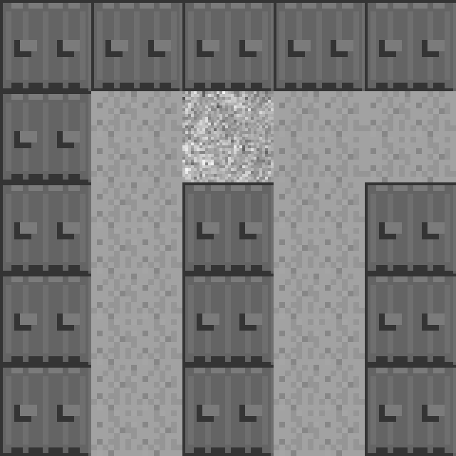

### 9.4.3　第三步：将基于区块的世界绘制在画布上

游戏世界使用了15×15的网格。图9-13展示了在滚动示例中使用的全部世界。


<center class="my_markdown"><b class="my_markdown">图9-13　15×15的区块地图</b></center>

对于滚动示例，需要使用一个比世界小的画布。这里使用一个160×160的小画布和一个480×480的小世界，这样可以确保书中的代码易于理解。一般在实际的案例中，一个基于区块的世界在行和列上会有超过100个区块绘制在640×480的画布上。这里使用的HTML5 Canvas对象使用下面的代码定义。

```javascript
<canvas id="canvas" width="160" height="160">
```

