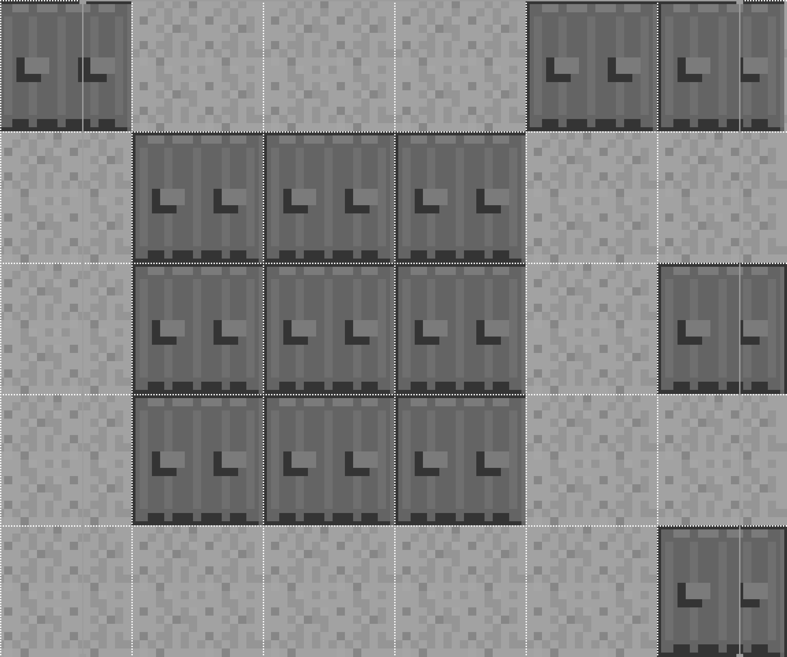
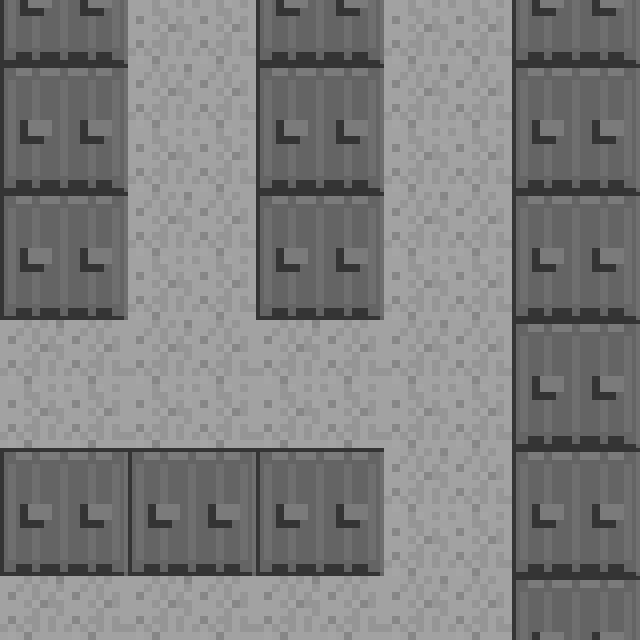

### 9.4.7　精确滚动时行和列的缓冲区

行和列的缓冲区是画布精确滚动的秘密。缓冲区中存放了额外的区块（在Camera可视范围之外的区块）。而在粗糙滚动中则不需要缓冲区。缓冲区对于精确滚动非常重要，在镜头可视区域的上、下、左、右边界上的区块在通常情况下只有部分被绘制。

如果camera.x和camera.y都为0，即在区块地图的左上角，则不需要滚动缓冲区。如果camera.x和camera.y是游戏地图屏幕上的任何其他值，即camera在x轴和y轴上的坐标至少有一个大于0，则需要滚动缓冲。不能超过可视世界的右边界和下边界，原因之前已经说过。读者可以想象以下，当运行游戏时，x和y的值几乎很少有是0的时候。现在请读者仔细看几个示例，因为这正是计算和绘制精美的游戏画面时，滚动的关键所在。

在精确滚动中绘制区块地图时，通过以下代码决定是否使用行或列的缓冲区。

```javascript
if (camera.x<=0) {
　　camera.x=0;
　　colBuffer=0;
}else if (camera.x > (world.width - camera.width)-scrollRate) {
　　camera.x=world.width - camera.width;
　　colBuffer=0;
}else{
　　colBuffer=1;
}
if (camera.y<=0) {
　　camera.y=0;
　　rowBuffer=0;
}else if (camera.y > (world.height - camera.height)-scrollRate) {
　　camera.y=world.height - camera.height;
　　rowBuffer=0;
}else{
　　rowBuffer=1;
}
```

这个算法通过camera对象的x和y的值确定是否需要colBuffer和rowBuffer。

（1）如果camera的x或y小于等于0，则将其设置为0（这样不会出现负值，避免绘制地图上不存在的区域），然后将对应的colBuffer或rowBuffer设置为0。

（2）如果camera的x或y大于0，则检查camera是否已经超过了地图的右边界或下边界。如果是，则将对应的colBuffer或rowBuffer设置为0。

（3）如果camera的x轴或y轴坐标在地图的中间，则将对应的colBuffer或rowBuffer设置为1。这将在屏幕绘制时添加一行或一列额外的区块，这样就能够显示部分区块了。

接下来不会一行一行地走查代码，而是通过以下4个示例来介绍在代码中是如何计算和显示的。

#### 1．camera的左上角位置

在游戏世界左上角的位置使用下面的代码中的变量值。这可以成为最简单的滚动，即没有滚动。

+ scrollRate = 4；
+ camera.x = 0；
+ camera.y = 0。

world.width（480）减camera.width（160）等于320，然后再减去scrollRate的结果就可以用于计算colBuffer的值了。

在y轴方向也用同样的算法可以得到rowBuffer：camera.y > (world.height−camera.height) −scrollRate。

```javascript
(world.width - camera.width) - scrollRate = 316
(world.height - camera.height) - scrollRate = 316
```

在这个示例中，因为窗口就在左上角，所以（316,316）这个值是不需要的。但是，之所以在这里演示，是因为在其他示例中会用到。在地图的左上角，仅需要检查camera.x和camera.y是否小于等于0即可。

```javascript
if (camera.x<=0) {
　　camera.x=0;
　　colBuffer=0;
colBuffer= 0
if (camera.y<=0) {
　　camera.y=0;
　　rowBuffer=0;
rowBuffer= 0
```

图9-14展示了左上角是如何绘制的。


<center class="my_markdown"><b class="my_markdown">图9-14　精确滚动中镜头的位置在（0,0）</b></center>

接下来，学习常见的计算类型。这种计算发生在可视镜头中既不在游戏屏幕的最右或最下边，也不在左上角的区块。

#### 2．滚动后的镜头位置

镜头在滚动之后就不再位于屏幕的左上角了。在本例中，将镜头放在屏幕的中央。

```javascript
scrollRate = 4
camera.x = 180
camera.y = 120
```

world.width（480）减camera.width（160）等于320，再减去scrollRate的结果就可以用于计算colBuffer的值了。

在y轴方向用同样的算法也可以得到rowBuffer：camera.y > (world.height−camera.height)− scrollRate。

```javascript
(world.width - camera.width) - scrollRate = 316
(world.height - camera.height) - scrollRate = 316
colBuffer= 1
rowBuffer= 1
```

此时，需要在每个坐标轴上添加一个滚动缓冲区。图9-15展示了镜头在这个位置时在画布上绘制的样子。


<center class="my_markdown"><b class="my_markdown">图9-15　精确滚动中镜头的位置在（180,120）时绘制滚动缓冲区</b></center>

实际上，在应用精确滚动时，每个坐标轴上是看不到滚动缓冲区的。图9-15中既展示了在画布上绘制的内容，也展示了不会绘制在画布上的额外的地图图像数据。图像被放大显示是为了说明镜头在精确滚动状态中实际上需要在画布上绘制额外的一行和额外的一列。为了显示滚动后的区块的实际位置，需要使用一个矩阵变换将画布平移到屏幕上实际绘制的点。

```javascript
context.setTransform(1,0,0,1,0,0);
context.translate(-camera.x%world.tileWidth, -camera.y%world.tileHeight);
```

利用取模运算法（%）可以获得在每个坐标轴上需要在负方向上移动的像素数，这样就可以显示图9-15中全部区块的局部了。

然后，遍历所有的区块并从该位置开始绘制区块。因此，每一行的第一个区块将在负位置开始绘制，即在画布之外绘制。只有一部分区块会被实际绘制在画布上。每列的区块的工作方式与之类似。这样，仅仅通过平移画布然后绘制一部分区块（包含额外的缓冲区区块，见图9-16）就可以实现精确滚动了。


<center class="my_markdown"><b class="my_markdown">图9-16　精确滚动之后镜头的位置是（180,120）</b></center>

下面的代码将一行一行地遍历区块，然后从平移后的点开始将它们绘制在屏幕上。

```javascript
for (rowCtr=0;rowCtr<camera.rows+rowBuffer;rowCtr++) {
　　for (colCtr=0;colCtr<camera.cols+colBuffer;colCtr++) {
　　　　tileNum=(world.map[rowCtr+tiley][colCtr+tilex]);
　　　　var tilePoint={};
　　　　tilePoint.x=colCtr*world.tileWidth;
　　　　tilePoint.y=rowCtr*world.tileHeight;
　　　　var source={};
　　　　source.x=Math.floor(tileNum % 5) * world.tileWidth;
　　　　source.y=Math.floor(tileNum /5) *world.tileHeight;
　　　　context.drawImage(tileSheet, source.x,
　　　　source.y,world.tileWidth,world.tileHeight, tilePoint.x, tilePoint.y,
　　　　　　　　 world.tileWidth, world.tileHeight);
　　　　　}
　　}
```

请注意，代码在rowCtr的循环中添加了rowBuffer的值（此时为1），在colCtr的循环中添加了colBuffer的值。接下来，检验一下边界条件。当镜头滚动到了地图的最右边或或最下边时会发生这种情况。

#### 3．镜头滚动到最右边的位置

当镜头滚动到游戏屏幕地图的最右边并且已经超过了缓冲区中额外区块的所在位置时，需要将镜头移回原来的位置，避免绘制colBuffer中的额外区块。因为地图中已经没有可显示的区块了。否则就会在JavaScript中抛出一个异常，告诉用户在world.map数组访问到了一个null。因此，需要从camera的当前位置上减去dx或scrollRate的值。

虽然下面的代码在之前出现过，但是这里还要再强调一遍。边界条件是指第一个else（已经用粗体字标出）。

```javascript
if (camera.x<=0) {
　　camera.x=0;
　　colBuffer=0;
}else if (camera.x > (world.width - camera.width)-scrollRate) {
　　camera.x=world.width - camera.width;
　　colBuffer=0;
}else{
　　colBuffer=1;
}
```

图9-17展示了在右边界的示例。


<center class="my_markdown"><b class="my_markdown">图9-17　精确滚动中镜头在右边界的位置</b></center>

算法得到的数值是：

```javascript
scrollRate= 4
camera.x= 320
camera.y= 80
```

缓冲区的返回值为：

```javascript
colBuffer= 0
rowBuffer= 1
```

由于镜头滚动到了最右边，因此camera.x的值为320。当320加上camera.width的值160之后就得到了480。这个值正好是世界的宽度（world.width）。注意，这里必须减去scrollRate是为了确保此处比较的数值总是比玩家要去的位置数值要小。否则，运行到访问列数组时就会抛出空指针异常。

#### 4．镜头滚动到最下面的位置

当镜头滚动到游戏屏幕地图的最下面，并且已经超过了缓冲区中额外区块的所在位置时，需要将镜头移回原来的位置，避免绘制rolBuffer中的额外区块——地图中已经没有可显示的区块了。否则，程序就会在JavaScript中抛出一个异常，告诉用户在world.map数组访问到了一个null。因此，需要从camera的当前位置上减去dx或scrollRate的值。

虽然下面的代码在之前出现过，但是这里还要再强调一遍。边界条件是指第一个else（已经用粗体字标出）。

```javascript
if (camera.y<=0) {
　　camera.y=0;
　　rowBuffer=0;
}else if (camera.y > (world.height - camera.height)-scrollRate) {
　　camera.y=world.height - camera.height;
　　rowBuffer=0;
}else{
　　rowBuffer=1;
}
```

图9-18展示了在下边界的示例。


<center class="my_markdown"><b class="my_markdown">图9-18　精确滚动中镜头在右边界的位置</b></center>

算法得到的数值是：

```javascript
scrollRate= 4
camera.x= 40
camera.y= 320
```

缓冲区的返回值为：

```javascript
colBuffer= 1
rowBuffer= 0
```

由于镜头滚动到了最下边，因此camera.y的值为320。当320加上camera.height的值160之后就得到了480。这个值正好是世界的高度（world.height）。注意，这里必须减去scrollRate是为了确保此处比较的数值总是比玩家要去的位置数值要小。否则，运行到访问列数组时就会抛出空指针异常。

