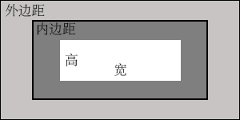

[toc]

### 1. 元素盒子

元素盒子的最内部分是实际的内容，直接包围内容的是内边距。内边距可以呈现元素的背景。内边距的边缘是边框，边框以外是外边距，外边距默认是透明的，因此不会遮挡其后的元素。



内边距、边框和外边距的宽度都是可选的，其默认值是零。但是，许多元素将会由浏览器自身设置不同的外边距和内边距，可以通过将元素的 margin 和 padding 设置为零来覆盖这些浏览器样式，以实现元素在不同浏览器中样式的统一。可以使用通用选择器对所有元素进行设置，如下所示：

```css
* {
    margin: 0;
    padding: 0;
}
```

#### 1.1 外边距：margin

外边距相当于文档中的页边距，是元素边框边缘与相邻元素之间的距离，主要用来分割各种元素，设置元素之间的距离。

定义元素外边距使用 margin 属性，属性值单位可以为长度单位（px、pt、em、ex、in）或百分比，取值可以为正值或负值。同时外边距还有专门设置某一方向上外边距的属性：margin-top、margin-right、margin-bottom、margin-left 四种属性。

##### 1.1.1 margin 属性

Margin 可以设置为 auto。常见的做法是为外边距设置固定的长度值。

下面的声明 h1 元素的各个边上设置了 1/4 英寸宽的空白。

```css
h1 { margin: 0.25in; }
```

下面的例子为 h1 元素的四个边分别定义了不同的外边距，所使用的长度单位是像素。

```css
h1 { margin: 10px 0px 15px 15px; }
```

这些值的顺序是从上外边距（top）开始围着元素顺时针旋转的。

```css
margin: top right bottom left;
```

另外，还可以为 margin 设置一个百分比数值。

```css
p { margin: 10%; }
```

##### 1.1.2 值复制

在 Web 前端开发中，有时需要输入一些重复的值，如下所示：

```css
p { margin: 0.5em 1em 0.5em; }
```

这种情况下可以使用值复制，不必重复地键入相同的数字。上面的规则与下面的规制是等价的。

```css
p { margin: 0.5em 1em; }
```

为此 CSS 定义了一些规则，允许为外边距指定少于 4 个值，规则如下：

+ 如果缺少左边距的值，则使用右外边距的值。
+ 如果缺少下外边距的值，则使用上外边距的值。
+ 如果缺少右外边距的值，则使用上外边距的值。

如果为外边距指定了 3 个值，则第 4 个值会从第 2 个值复制得到。如果给定了两个值，第 4 个值会从第 2 个值复制得到，第 3 个值会从第 1 个值复制得到。如果只给定一个值，那么其他 3 个外边距都由这个值复制得到。

利用这个简单的机制，只需指定必要的值，而不必 4 个值全部都应用，如下所示：

```css
h1 { margin: 0.25em 1em 0.5em; }	/* 等价于 0.25em 1em 0.5em 1em */
h2 { margin: 0.5em 1em; }	/* 等价于 0.5em 1em 0.5em 1em */
p { margin: 1px; }	/* 等价于 1px 1px 1px 1px */
```

如果希望除了左外边距以外所有其他外边距都是 auto （左外边距是 20px），则如下所示：

```css
p { margin: auto auto auto 20px; }
```

##### 1.1.3 单边外边距属性

使用单边外边距属性可以为元素单边上的外边距设置值，可以采用以下方法：

```css
p { 
    margin-top: 20px;
    margin-right: 30px;
    margin-bottom: 30px;
    margin-left: 20px;
}
```

##### 1.1.4 外边距合并

外边距合并指的是，当两个垂直外边距相遇时，它们将形成一个外边距。合并后的外边距的高度等于两个发生合并的外边距的高度中的较大者。

当一个元素包含在另外一个元素中时，它们的上和下外边距，或者上边距，或者下边距也会发生合并。

假设有一个元素，它有外边距，但是没有边框或填充。在这种情况下，上外边距与下外边距就碰到了一起，它们会发生合并。如果空元素外边距遇到另一个元素的外边距，也会发生合并。

> 注意：只有普通文档中块框的垂直外边距才会发生外边距合并。行内框、浮动框或绝对定位之间的外边距不会合并。

##### 1.1.5 外边距示例

+ 行内元素的外边距：当行内元素定义外边距时，能够看到外边距对版式的影响，但是上下外边距犹如不存在一般，不会对周围的对象产生影响。
+ 块状元素的外边距：对于块状元素来说，外边距都能够很好地被解析。
+ 浮动元素的外边框：元素浮动显示与块状、行内等显示是两个不同的概念。不管什么元素，一旦被定义为浮动显示，就拥有了完整的盒模型结构，可以自由地定义外边距、内边距、边框、宽和高来控制它的大小以及其他对象之间的位置关系。

**案例：示例 10-01：外边距**

```html
<!doctype html>
<html>
    <head>
        <meta charset="utf-8">
        <meta keywords="HTML5 盒子模型">
        <meta content="外边距">
        <title>外边距</title>
        <style type="text/css">
            .box1 {
                margin: 50px;
                /*外边距*/
                border: 20px solid red;
                /*边框为20px实线*/
            }

            .box2 {
                width: 400px;
                height: 20px;
                border: 10px solid blue;
                /*边框为10px实线*/
            }

            .box3 {
                display: block;
                /*定义块状元素*/
                margin: 50px;
                /*外边距为50px*/
                border: 20px solid red;
                /*边框为20px*/
            }

            .box4 {
                float: left;
                /*向左浮动*/
                margin: 50px;
                /*外边距为50px*/
                border: 20px solid red;
            }
        </style>
    </head>

    <body>
        <h1>1 行内元素的外边距</h1>
        <div class="box2">相邻块状元素</div>
        <div>外部文本<span class="box1">行内元素包含的文本</span>外部文本</div>
        <div class="box2">相邻块状元素</div>
        <h1>2 块状元素的外边距</h1>
        <div class="box2">相邻块状元素</div>
        <div>外部文本<span class="box3">块状元素包含的文本</span>外部文本</div>
        <div class="box2">相邻块状元素</div>
        <h1>3 浮动元素的外边距</h1>
        <div class="box2">相邻块状元素</div>
        <div>外部文本<span class="box4">浮动元素包含的文本</span>外部文本</div>
        <div class="box2">相邻块状元素</div>
    </body>
</html>
```

#### 1.2 边框：border

任何元素都可以定义边框，并都能够很好地显示出来。可以为边框指定样式、颜色或宽度。宽度属性值可以指定长度值；或者使用 3 个关键字（thin、medium（默认值）和 thick）之一。

<center><b>表 10-2 边框的属性</b></center>

| 属性          | 描述                                                         |
| ------------- | ------------------------------------------------------------ |
| border        | 简写属性，用于把针对四个边的属性设置在一个声明中             |
| border-style  | 用于设置元素所有边框的样式，或者单独地为各边设置边框样式     |
| border-width  | 简写属性，用于为元素的所有边框设置宽度，或者单独地为各边边框设置宽度 |
| border-color  | 简写属性，设置元素的所有边框中可见部分的颜色，或为四个边分别设置颜色 |
| border-bottom | 简写属性，用于把下边框的所有属性设置到一个声明中             |
| border-left   | 简写属性，用于把左边框的所有属性设置到一个声明中             |
| border-right  | 简写属性，用于把右边框的所有属性设置到一个声明中             |
| border-top    | 简写属性，用于把上边框的所有属性设置到一个声明中             |

**案例：示例 10-02：边框**

```html
<!doctype html>
<html>
    <head>
        <meta charset="utf-8">
        <meta keywords="HTML5 盒子模型">
        <meta content="边框">
        <title>边框</title>
        <style type="text/css">
            .box1 {
                border: 100px solid;
                /*边框宽度*/
                border-color: red blue green;
                /*边框颜色*/
            }
        </style>
    </head>

    <body>
        <div class="box1">边框</div>
    </body>
</html>
```

#### 1.3 内边距：padding

内边距就是元素包含的内容与元素边框内边沿之间的距离。定义内边距使用 padding 属性，属性值单位可以为长度单位（px、pt、em、ex）或百分比，取值可以为正值，但不允许使用负数值。

<center><b>表 10-3 内边距的属性</b></center>

| 属性           | 描述                           |
| -------------- | ------------------------------ |
| padding        | 在一个声明中设置所有内边距属性 |
| padding-bottom | 设置元素的下内边距             |
| padding-left   | 设置元素的左内边距             |
| padding-right  | 设置元素的右内边距             |
| padding-top    | 设置元素的上内边距             |

##### 1.3.1 padding 属性

如果希望所有 h1 元素的各边都有 10 像素的内边距，代码如下所示：

```css
h1 { padding: 10px; }
```

还可以按照上、右、下、左的顺序分别设置各边的内边距，各边均可以使用不同的单位或百分比值。

```css
h1 { padding: 10px 0.25em 2ex 20%; }
```

##### 1.3.2 单边内边距属性

也可以通过使用单边内边距属性，分别设置上、右、下、左内边距。

```css
h1 {
    padding-top: 10px;
    padding-right: 0.25em;
    padding-bottom: 2ex;
    padding-left: 20%;
}
```

##### 1.3.3 内边距的百分比数值

百分比数值是相对于其父元素的 width 计算的。注意，上下内边距与左右内边距一致；即上下内边距的百分数会相对于父元素宽度设置，而不是相对于高度。

##### 1.3.4 特性

第一，当元素没有定义边框时，可以把内边距当作外边距来使用，用来调节元素与其他元素之间的距离。由于外边距相邻时会出现重叠现象，而且比较复杂，使用内边距来调节元素之间的距离往往不用考虑边距重叠的问题。

第二，当为元素定义背景时，对于外边距区域来说，背景图像是不显示的，它永远表现为透明状态；而内边距区域却可以显示背景。

第三，行内元素的内边距能够影响元素边框的大小，而外边距不存在这样的问题。

##### 1.3.5 内边距示例

**案例：示例 10-03：内边距**

```html
<!doctype html>
<html>
    <head>
        <meta charset="utf-8">
        <meta keywords="HTML5 盒子模型">
        <meta content="内边距">
        <title>内边距</title>
        <style type="text/css">
            .box1 {
                margin: 50px;
                /*外边距*/
                padding-left: 200px;
                /*左侧内边距*/
                padding-top: 100px;
                /*顶部内边距*/
                background-color: #CCCCCC;
                /*背景*/
                width: 100px;
                height: 30px;
                border: 20px solid red;
            }

            .box2 {
                width: 140px;
                height: 20px;
                border: 10px solid blue;
            }

            .box3 {
                padding: 30px;
                /*内边距*/
                border: 20px solid red;
            }
        </style>
    </head>

    <body>
        <h1>内边距</h1>
        <div class="box1">文本内容</div>
        <h1>行内元素的内边距</h1>
        <div class="box2">相邻块状元素</div>
        <div>外部文本<span class="box3">行内元素包含的文本</span>外部文本</div>
        <div class="box2">相邻块状元素</div>
    </body>
</html>
```

#### 1.4 宽和高：width/height

这里讲的宽和高，指的是元素内容区域的宽和高，而不是盒子的实际宽度和高度。属性值单位可以为长度单位（px、pt、em、ex、in）或百分比，取值为正值。

### 2. 尺寸

#### 2.1 W3C 标准盒模型

目前浏览器大部分元素都是基于此模型，在内容区外面，依次围绕着 padding 区、border 区、margin 区。盒子的宽度和高度的计算公式如下：

盒子的宽度=margin-left + border-left + padding-left + width + padding-right + border-right + margin-right。

盒子的高度=margin-top + border-top + padding-top + height + padding-bottom + border-bottom + margin-bottom。

#### 2.2 IE 传统盒模型

此种盒模型主要存在于 IE6 以下版本浏览器。盒子的宽度和高度计算公式如下：

盒子的宽度=margin-left + width + margin-right。

盒子的高度=margin-top + height + margin-bottom。