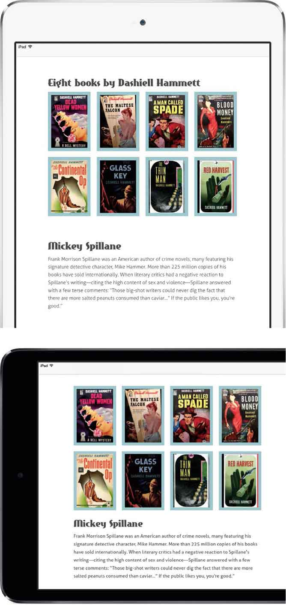
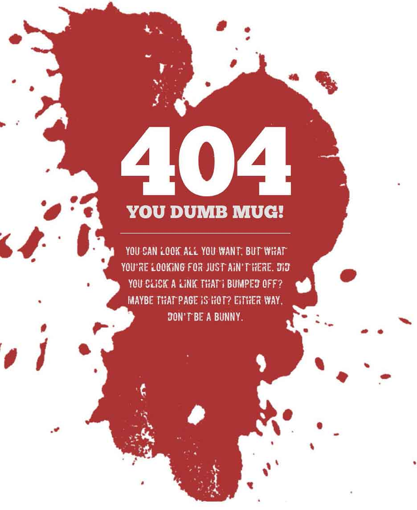
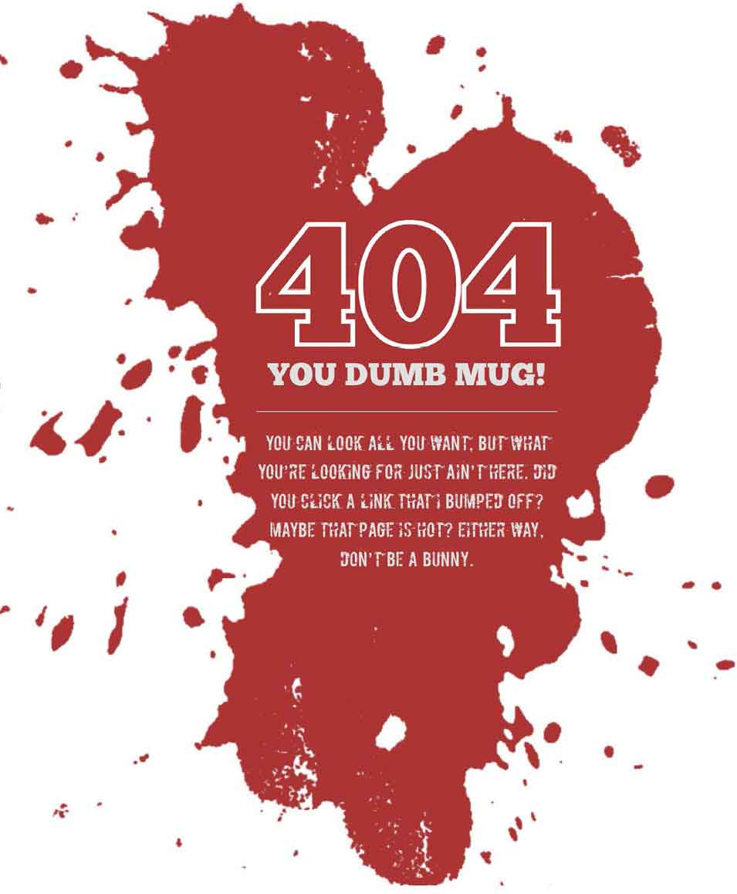
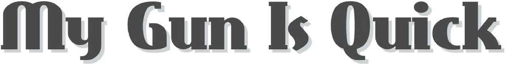
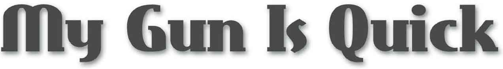
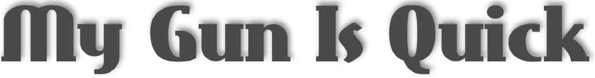
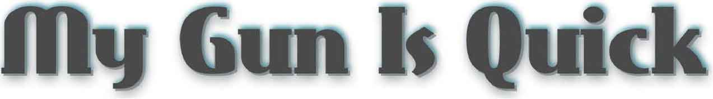

# 第12章　响应式字体

> 在实现设计的时候，我们可能会多尝试几款在线字体。但必须记住，每多使用一款在线字体，用户在浏览网页时，浏览器就会多下载一个文件，网页也因此变得越来越笨重。所以，要考虑清楚哪种在线字体是必需的。
> 字体文件通常比较大，因此在线字体给设计师和开发者需要考虑性能问题。许多浏览器在完全加载在线字体之前，会隐藏文本内容，这意味着用户盯着空白页的时间长达三秒。如果字体没有加载成功，浏览器会停止下载字体文件，从而采用系统默认的字体。

## 在线字体与性能

2006年的时候，信息架构师Oliver Reichenstein就说过， “网页设计95%在于字体”。我不敢完全确信他的观点，但我每天浏览的网页确实都是由文字组成。当本书第一版出版的时候，那时候人们使用的字体库数量非常有限，基本上都是Arial、Georgia、Times和Verdana这些常见的字体。由于缺乏好看的字体，网页设计其实很无聊。幸运的是，自五年前起，网页排印水准已经有了很大的提升，设计师可以在丰富的字库和字形不再受限于简单的字体，现在我们称它为web font（在线字体）。

## 在线字体简史

在20世纪90年代，微软和Netscape开发的浏览器允许在网页中嵌入字体。由于这两家公司是竞争关系，要使用这些字体并不容易。我清晰地记得，我曾尝试使用它们互不兼容的TrueDoc和EOT格式，但几乎都失败了。我打赌，很多年轻设计师都没听说过Netscape浏览器，这简直暴露了我的年龄。

Netscape在和微软的浏览器大战中失败了，微软的IE浏览器仍支持字体嵌入，但它的EOT 格式不被其他浏览器厂商支持。十年，整整十年，在线字体都没什么发展，直到苹果公司的Safari3.1的出现。Safari3.1是第一个支持TrueType和OpenType 格式的浏览器。Mozilla和Opera随后也支持这两种字体类型。后来，谷歌开发出Chrome浏览器，安卓系统面世，苹果开发了Safari和iOS系统，自此，它们都支持在线字体了。

## 在线字体有用么？

在线字体提供了一种可以使用更多字体的方式。随着现代浏览器支持在线字体， 设计师创作的丰富字体可以给用户带去更好的体验。

实现在线字体很简单，当使用它们的时候， 文本仍然便于选择和搜索。要使用在线字体的话，需要做三个准备工作。

选择浏览器能识别的字体文件。我们可以使用任何有版权或者免费的字体。

在样式表开头需要一个 `@font-face` 声明。需要定义 `font-family` 名，还有字体的格式（下面的例子是WOFF2格式），下面是一个简单的声明。

```html
@font-face { 
font-family : 'Aller Light'; 
src : url('fonts/aller_std_lt.woff2') format('woff2');}
```

类属性可以应用到 `id` 、 `class` 、 `child` 、 `attribute` 和 `pseudo` -或者任何类型的选择器上。我们来试一个老练风格的顶级heading。

```html
h1 { 
font-family : Eastmarket; }
```

我们很快就能搞定嵌入式的在线字体语法和细节。

## 在线字体格式

使用比较广泛的在线字体格式有六种：EOT、OpneType、SVG、True Type、WOFF 和WOFF2。不同的浏览器支持部分字体格式。我们选择的字体格式依赖于浏览器支持。越新的浏览器，我们需要的格式越少。相反的，如果浏览器版本越老，我们可能需要提供多种字体格式。

### 嵌入式OpenType（EOT）

嵌入式字体格式是微软公司开发的在线字体技术。EOT在TrueType上有一层封装，这使得它更难下载、提取和重用嵌入式字体。不过至少在理论上维护字体授权变得更加容易了。微软公司在2007年就把EOT提交给W3C工作组，不过EOT至今都不是标准的一部分。

### OpenType（OTF）

OpenType是TrueType的一个扩展，它在字体控制方面做得更好，提供超过65000种不同的字形，并且能更好地渲染手写体。

### SVG

SVG 根本不是个字体格式，它是一种创作可缩放矢量图形的技术。我们可以将字体信息放入SVG文档中，然后和其他格式一样使用。我们可以使用Font Squirrel在线字体生成器来把字体转换为SVG格式。像Typekit这种在线字体服务商也提供SVG 格式字体。

### TrueType（TTF）

苹果公司在20世纪80年代开发出了TrueType格式，作为其PostScript Type 1格式的替代品。TrueType字体类型的所有信息，包括字边距和微调信息都放入一个文件里面，这会使得一些TrueType文件很大，并不适合用于在线字体。

### Web Open Font Format（WOFF）

WOFF不是严格的字体格式，它对TrueType和OpenType字体进行了封装，并且在网络传输上做了优化，这样它传输的文件更小，更加适合网络传输。因为WOFF包含了所有权信息，这样它对那些关注知识产权的字体创造者来说就更具吸引力。

### WOFF2

WOFF2是WOFF的最新版本，压缩比例更高，因此更适合移动设备。WOFF2显然是将来在线字体的标准，并且不久后应该是我们需要的唯一的标准。

## 在样式表里面包含@font-face

在我们的样式表里面使用在线字体，首先要指定字体文件的名字，然后是它的位置。我们先从Font Squirrel下载Aller Light字体文件。Aller Light是本书英文原版的正文使用的字体。

```html
@font-face { 
font-family : 'Aller Light'; 
src : url('fonts/aller_std_lt.woff2') format('woff2'); }
```

上个例子中，我们只使用了WOFF2格式，理想情况下这就足够了。令人伤心的是，现实世界并不是这样的，即使今天，某些最现代的浏览器也不支持WOFF2，比如iOS和OS X上面的Safari浏览器。为了能使用，我们不得不加入WOFF格式，绝大部分浏览器都支持这个格式，除了Opera Mini。两个格式使用逗号分隔开。

```html
@font-face { 
font-family : 'Aller Light'; 
src : url('fonts/aller_std_lt.woff2')     format('woff2'),  
url('fonts/aller_std_lt.woff') format('woff'); }
```

为了广泛支持老旧的浏览器，安卓还有iOS系统的Safari浏览器，我们在声明中加入TrueType格式字体。

```html
@font-face { 
font-family : 'Aller Light'; 
src : url('fonts/aller_std_lt.woff2') format('woff2'), 
url('fonts/aller_std_lt.woff') format('woff'), 
url('fonts/aller_std_lt.ttf') format('truetype'); }
```

为了能够完全支持font-face， 包括那些老旧的微软IE浏览器，我们也需要把EOT格式加入到声明中。

```html
@font-face { 
font-family : 'Aller Light'; 
src: url('aller_std_lt.eot'); 
src: url('aller_std_lt.eot?#iefix') format('embedded-opentype'), 
url('aller_std_lt.woff2') format('woff2'), 
url('aller_std_lt.woff') format('woff'), 
url('aller_std_lt.ttf') format('truetype'); }
```

把新的 `@font-face` 声明放在样式表的顶部，下面的任何声明都可以用到。 `font-family` 不一定要和文件名一致，我们只是为了方便在样式表里面引用。这个字体在字体库里面应该是第一次出现，后面跟着系统中已存在的字体。

```html
body {font-family : 'Aller Light', Helvetica, Arial, sans-serif; }
```

通常，在系统里安装字体备份是很有必要的，因为我们不能总是依赖浏览器加载字体库，同样我们不能保证在线字体服务总是100%可用的。

## 高分辨率显示下的字体设计

毫无疑问，随着苹果公司开发出Retina 高分辨率屏幕（首次出现在iPhone4上，然后是iPad、MacBook Pro，还有5K iMac），类似的智能手机屏幕以及PC设备紧随其后，使得Web设计师和开发者的工作变得更加复杂。我们不仅要考虑为这些高分辨率设备提供不同尺寸的图像，还要考虑在不同分辨率情况下的字体渲染问题。


<center class="my_markdown"><b class="my_markdown">我们不确定每个人都使用高分辨率设备来阅读我们的文本，所以测试文本在不同分辨率上的显示效果是十分重要的。上方是iPad Mini Retina高清屏幕；下方是低分辨率的iPad Mini屏幕。</b></center>

带有弧形的细线字体在高分辨率屏幕上的显示效果惊人，但在分辨率低设备上的显示效果会非常拙劣。

当我们使用细线字体的时候，首先需要考虑跨分辨率设备上的渲染效果，这是一个好习惯。如果有必要，给屏幕提供不同粗细的字体：为高分辨率屏幕使用细线字体；为低分辨率屏幕提供粗线字体。我们可以使用 `min-resolution` 媒体查询来解决。

首先，设定好低分辨率屏幕上的在线字体， 在本例中，我们使用正常权重的Aller typeface字体。

```html
body { 
font-family : 'Aller Regular', Helvetica, Arial, sans-serif; }
```

下面我们设定好最小分辨率的阈值： `192dpi` ，同时，Aller字体也用更细一些的。超过 `192dpi` 分辨率的设备将会使用更细的Aller Light字体。

```html
@media 
(min-resolution: 192dpi) { 
font-family : 'Aller Light', Helvetica, Arial, sans-serif; }
```

目前Mac OS X和iOS系统上的Safari浏览器使用的并不是标准属性，而是带设备前缀的 `max-device-pixel-ratio` 替代属性，所以我们需要在类型声明中加入这个属性，以便支持苹果设备。

```html
@media 
(-webkit-min-device-pixel-ratio: 2), 
(min-resolution: 192dpi) { 
font-family : 'Aller Light', Helvetica, Arial, sans-serif; }
```

在例子中，我们指定了dpi，低分辨率的传统屏幕一般是72dpi，但打印或印刷通常需要更高的dpi。dpi并不是唯一的分辨率单位，我们还可以使用以下两种。

+ **dpcm：** 每厘米点数
+ **dppx：** 每像素包含点数

IE9到IE11只支持dpi，在我写这本书的时候，Opera Mini也是只支持dpi。

## 在线字体源码

现在来说，对于在线字体的授权和服务，我们有很多的选择。但在过去的五年里，许多字体制造和销售商只在网络上放出授权版本。例如，Hoefler&Co 公司开发了著名的Gotham、Knockout和Whitney字体，等等。要在桌面或网络上使用这些字体，是需要付费的。

Adobe Typeki和Fontdeck都是著名的字体服务商，它们提供了丰富的字体库， 这些字体库来自许多设计师和字体公司。

Typekit和Fontdeck的收费模式不同：Fontdeck采用年费制；Typekit则提供了几款免费字体，但若要想使用更多字体库，就要付费，或者购买Creative Cloud服务。

像Font Squirrel这样的免费在线字体资源网站越来越受欢迎，Font Squirrel还提供了转换工具，帮助用户将桌面字体转换为在线字体。这套工具很实用，但在使用的时候需要检查转换字体的用户许可协议（EULA）。

最后，谷歌提供了一个小巧但是很有用的字库选择。

## 在线字体的404风险

我希望前面介绍的在线字体的内容没有让你感到迷惑。下面我们利用所学知识，来开发一个我们示例网站的404页面。这个页面使用两种在线字体、一张图片和一个使用CSS实现的滴溅效果（splatter）。不要担心，某些CSS属性浏览器是不支持的。我们只要确定每个人都能得到合适的体验就行。

这个设计没有太多标记， 只有两个部分，一标题和一对段落。

```html
<div class="splatter"> 
   <div class="splatter__content"> 
      <h1 class="splatter__heading">404</h1> 
      <p class="splatter__lead">You dumb mug!</p> 
      <p>You can look all you want, but what you're looking for
just ain't here. Did you click a link that I bumped off? Maybe
that page is hot? Either way,don't be a bunny.</p> 
   </div> 
</div>
```

我们的第一项工作是设置一个红色背景图，通过设置一个最小高度来保证这个滴溅效果始终可见。


<center class="my_markdown"><b class="my_markdown">混合使用在线字体、图像和霸气的效果，这个404页面竟然让用户流连忘返。</b></center>

```html
.splatter { 
min-height : 900px; 
background-image : url(blood.png); 
background-repeat : no-repeat; 
background-position : 50% 0; }
```

保持内容水平居中，内容足够宽正好能放入大标题，小屏幕也要正好合适。

```html
.splatter__content { 
width : 280px; 
margin : 0 auto; }
```

现在设置两种字体——ChunkFive和Boycott。我们使用三种格式：TrueType、WOFF和WOFF2。

```html
@font-face { 
font-family : 'ChunkFive'; 
src : url('fonts/chunkfive.woff2') format('woff2'), 
url('fonts/chunkfive.woff') format('woff'), 
url('fonts/chunkfive.ttf') format('truetype'); } 
@font-face { 
font-family : 'Boycott'; 
src : url('fonts/boycott.woff2') format('woff2'), 
url('fonts/boycott.woff') format('woff'), 
url('fonts/boycott.ttf') format('truetype'); }
```

我们使用白色的ChunkFilve字体来制作标题。

```html
.splatter__heading { 
font-family : ChunkFive; 
font-size : 16rem; 
text-align : center; 
color : rgb(255,255,255); }
```

接下来，我们为下面的两段文字使用浅灰色的Boycott字体，以凸显上面的标题。

```html
p { 
font-family : Boycott; 
font-size : 1.6rem; 
text-align : center; 
color : rgb(224,224,224); }
```

到此，我们就完成了在线字体兼容的设计了。

```html
.splatter__lead { 
font-family : ChunkFive; 
font-size : 3rem; 
text-transform : uppercase; }
```

## WebKit属性实验

过去，浏览器厂商也开发了一些实验性质的属性， 这些属性带有私有前缀，即使它们没有可能成为标准，但在一些视觉设计中加入它们会非常有用。我们使用Webkit前缀属性——- `webkit-text-stroke` ——来装饰文字，然后看下在Chrome、Safari 和Opera中的渲染效果。

```html
.splatter__heading, 
.splatter__lead { 
-webkit-text-fill-color : transparent; 
-webkit-text-stroke : 4px rgb(255,255,255); }
```


<center class="my_markdown"><b class="my_markdown">在使用某些还未成为标准的CSS实验属性的时候，我们应该小心谨慎一些。</b></center>

## 文本阴影

在扁平化设计更受欢迎的今天，文本阴影被认为是一种过时的效果。但为了提升复杂背景中的文字可读性和深度，文本阴影 `text-shadow` 影仍不失为一种有效的方法。

```html
h1 { 
text-shadow : 2px 2px 0 rgb(204,211,213); }
```

我们来打破 `text-shadow` 的规则。

第一个 `2px` 是阴影的水平偏移量，第二个 `2px` 是阴影的垂直偏移量。在这个例子中，这两个值是一样的，可以根据效果改变。值越大，阴影就离文本越远。

第三个值我们设定的是0，这是模糊半径。值越大，模糊半径越大，阴影越浅。

最后的是设定阴影的颜色。我们可以设定半透明或者不透明颜色。如果你对RGB颜色不熟悉，可以参考后面的章节。


<center class="my_markdown"><b class="my_markdown">在这个例子中，我们仅为文本添加一个主要阴影效果。</b></center>

下面我们把垂直偏移改成 `3px` ，模糊半径改成 `6px` ，使阴影变得更柔和。

```html
h1 { 
text-shadow : 2px 3px 6px rgb(204,211,213); }
```


<center class="my_markdown"><b class="my_markdown">主要阴影比较柔和，这是因为我们将模糊半径从0调整为10。</b></center>

文本阴影的偏移可以设置成负值。我们把垂直偏移改成 `-5px` ，就好像向下移动光源，使阴影移动到文字上方。

```html
h1 { 
text-shadow : 2px -3px 6px rgb(204,211,213); }
```


<center class="my_markdown"><b class="my_markdown">通过改变水平和垂直偏移量，可以将阴影调整到文字的任何一侧。</b></center>

## 多重阴影

我们可以设置多重阴影，来让文本的显示效果更加自然。多重阴影效果使用逗号隔开。

```html
h1 { 
text-shadow : 
2px 2px 0 rgba(125,130,131,.75), 
2px 5px 10px rgba(125,130,131,.65); }
```

我们可以通过设置三种阴影效果来创建三维文本。下面我们在文本上面使用白阴影， 在文本下面使用两种黑色阴影。

```html
h1 { 
text-shadow : 
2px 2px 0 #0f2429, 
2px 5px 10px rgba(15,36,41,0.5), 
2px -2px 5px rgb(56,143,162); }
```


<center class="my_markdown"><b class="my_markdown">`text-shadow` 可以用来创建各种各样的效果，当与在线字体共同使用的时候， 我们就无需再使用大量的文字图像。</b></center>

## 打破传统

经历了十年的期望和挫折，在线字体终于来了。随着Fontdeck、Adobe Typekit、Font Squirrel以及谷歌这样的字体资源库越来越成熟，我们再也不需要那些受限的字体了，现在我们可以使用任何我们想用的。我们可以在当今的浏览器中轻松地部署和应用在线字体。尽管浏览器在处理字形的方式上不太相同，但在网站和应用中有什么理由不使用它呢？


