# 第16章　渐变

回顾2015年的网站设计，满眼都是扁平化配色。扁平化风格设计在iOS和Windows操作系统上已经成为常态。在几乎每个网站都能看到很大的扁平化色块，而且是横向平铺，几乎撑满了全屏。不仅如此，线框按钮和图标也都是扁平化的。我希望设计师们能尽快放弃这种扁平化的审美，那样人们就能看到更加丰富多彩的网站设计了。

渐变可以为平面带来二维的视觉体验，在Photoshop或者Sketch里制作渐变图像很容易，但是在响应式设计时代，我们特别注重扩展性和性能，所以使用CSS来实现渐变还是很有必要的。

虽然有时候SVG来实现渐变也可以，但是SVG并不是实现渐变的最简单的技术。值得庆幸的是，用CSS来实现线性、镜像、重复等各种类型的渐变非常方便。这一章，我们来介绍渐变。

## 背景图像渐变

不得不承认，当我第一次听说CSS渐变有别于背景渐变，而是类似于位图或者SVG的背景图像时，我很惊讶。后来我才意识到这样有个好处，就是我们在使用多个 `background-image` 时，可以把它和其他图片格式混合使用。

## 线性渐变

线性渐变是最常见和有用的渐变类型，它由一个渐变轴和两种或两种以上颜色组成。这个轴可以水平、垂直或者以任何角度来贯穿元素背景。这个概念和CSS渐变语法并不难，如果你对Photoshop或者Sketch很熟悉，就更不在话下了。

首先我们用垂直的线性渐变来实现一个按钮，从Get Hardboiled网站的品牌颜色上取两个色值来做渐变。

```html
div { 
background-image : linear-gradient( 
#fed46e, 
#ba5c61); }
```

我们可以使用十六进制、RGB、RGBa、HSL和HSLa来定义色值，然后用逗号分隔开。

下一步，我们将指定渐变的方向，简单来说，就是我们希望渐变到（ `to` ）哪里结束，可以是左边或右边，也可以是底部或者顶部。我们不需要指定渐变的起点，只需要声明结束的位置即可。

在第一个例子中，渐变在顶部结束。

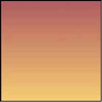
```html
div { 
background-image : linear-gradient( 
to top, 
#fed46e, 
#ba5c61); }
```

下面这个渐变在右边结束。


```html
div { 
background-image : linear-gradient( 
to right, 
#fed46e, 
#ba5c61); }
```

下一个渐变是在左边结束。

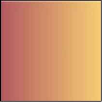
```html
div { 
background-image : linear-gradient( 
to left, 
#fed46e, 
#ba5c61); }
```

这个 `to` 语法，不仅对元素的顶部、右侧、底部或者左侧有效；它也可以指定元素的四个角来创建对角线的渐变。

下面这个渐变在右下角结束。

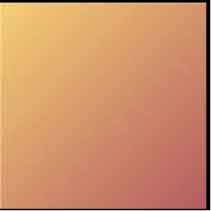
```html
div { 
background-image : linear-gradient( 
to bottom right, 
#fed46e, 
#ba5c61); }
```

下面的渐变在左下角结束。

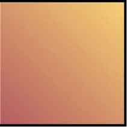
```html
div { 
background-image : linear-gradient( 
to bottom left, 
#fed46e, 
#ba5c61); }
```

这个渐变在左上角结束。

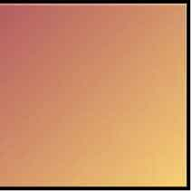
```html
div { 
background-image : linear-gradient( 
to top left, 
#fed46e, 
#ba5c61); }
```

此渐变的最终版结束于右上角。

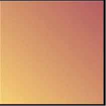
```html
div { 
background-image : linear-gradient( 
to top right, 
#fed46e, 
#ba5c61); }
```

当需要指定精确的渐变角度时，我们可以使用相同的方式，用角度值来代替 `to` 。

下面的例子使用了 `30deg` 的渐变。

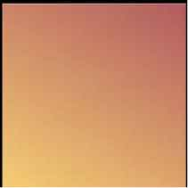
```html
div { 
background-image : linear-gradient( 
30deg, 
#fed46e, 
#ba5c61); }
```

如果有需要，我们还可以使用负值来实现反向的渐。

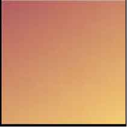
```html
div { 
background-image : linear-gradient( 
-30deg, 
#fed46e, 
#ba5c61); }
```

### 添加颜色节点

简单的渐变是由两个色值来创建的，但是我们的设计经常需要包含一个或多个颜色的复杂渐变。什么是颜色节点？现在回到我们熟悉的图像处理软件中，使用Sketch，我们可以在调色板中双击，为渐变添加色值。

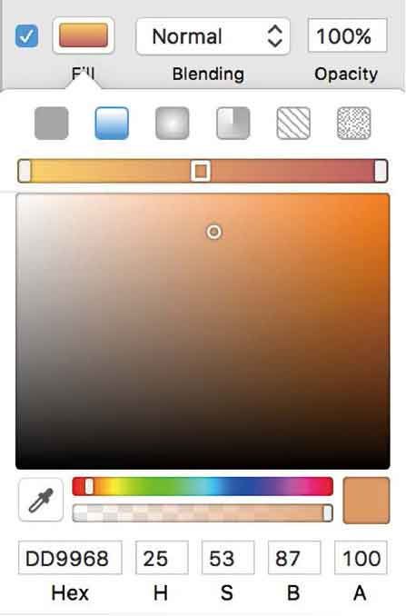
<center class="my_markdown"><b class="my_markdown">在Sketch中添加颜色节点。</b></center>

为CSS渐变指定一个或者多个颜色节点的时候，浏览器会平滑地把它们融合在一起。

在下一个案例中，这个线性渐变从顶部开始，由红变黄，直到底部以蓝色结束。

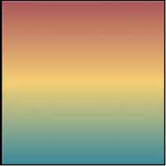
```html
div { 
background-image : linear-gradient( 
#b1585d, 
#fed46e, 
#388fa2); }
```

由于我们还没有指定颜色融合的位置，那么它们会均匀地融合在渐变轴上。如果想精确地控制颜色的融合位置，那么可以指定颜色节点在我们希望的位置开始融合。在这个例子中，我们指定第二个节点，即黄色从渐变轴的20%高度的位置开始融合。

仔细看，你会发现黄色值旁边出现了一个 `20%` 。

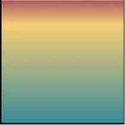
```html
div { 
background-image : linear-gradient( 
#b1585d, 
#fed46e 20%, 
#388fa2); }
```

我们可以为渐变中的任何一个颜色节点指定位置。接下来，使用同样的方法，指定蓝色在渐变轴60%高度的位置开始融合。

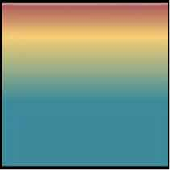
```html
div { 
background-image : linear-gradient( 
#b1585d, 
#fed46e 20%, 
#388fa2 60%); }
```

到目前为止的每一个例子中，我们都是让颜色在渐变轴上逐渐融合。但有时我们也需要一个突然的颜色变化。CSS渐变很容易就可以实现。给两个颜色设置相同的节点位置，就可以实现这种颜色的突然变化。下面这个例子中，我们将其设置为 `40%` 。

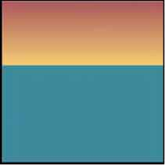
```html
div { 
background-image : linear-gradient( 
#b1585d, 
#fed46e 40%, 
#388fa2 40%); }
```

### 线性渐变实战

是时候实践一下了。让我们来创建一个网站上的便签效果，它可以用来充当网站的等待页面。我们的HTML标签既简洁，又专业， `article` 元素只包含了标题和列表。

```html
<article> 
   <h1>Back soon!</h1> 
   <ul> 
      <li><del>Gone for smokes</del></li> 
      <li><del>Getting booze</del></li> 
      <li>On a job (yeah, really)</li> 
   </ul> 
</article>
```

首先给 `article` 元素定义一个尺寸、一点内边距值和一个实色背景。如果有些浏览器无法渲染渐变背景，那么用户就会看到这个背景色。

```html
article { 
width : 280px; 
height : 280px; 
padding : 22px; 
background-color : #fed46e; 
box-sizing : border-box; 
text-align : center; }
```


现在，添加一个对角线渐变，以便让便签更真实。使用两种颜色，渐变轴指向便签的右上角，并让颜色在 `60%` 高度的位置开始融合。

```html
article { 
background-image : linear-gradient( 
to top right, 
#fed46e 60%, 
#bf9f53); }
```

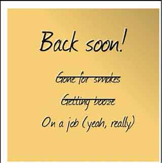
支持CSS渐变的浏览器，不管需不需要厂商前缀，都会正常地渲染它。如果有些浏览器无法渲染渐变背景，那么用户就会看到实色背景。

最后，为了给便签增添厚重感，我们为它巧妙地添加一点阴影。

```html
article { 
box-shadow : 0 2px 5px 
rgba(0,0,0,.5); }
```


## 径向渐变

在本书第1版中，径向渐变部分是一笔带过的，因为当时浏览器厂商还不同意它的语法。我写道：

“围观每一次标准制订之争，在CSS工作组的Twitter上跟帖，或者关注他们博客上的每一次聚会，那种感觉很赞，不是吗？”

幸运的是，这种斗争已经离我们远去，并且所有的现代浏览器都已经完全支持了所有类型的渐变。

### 定义渐变类型

和线性渐变一样，我们依然可以把径向渐变当作 `background-image` 属性的值。在这个例子中，我们依然使用两种颜色，不过这次我们指定的渐变类型是径向。

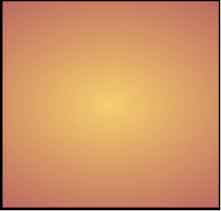
```html
div { 
background-image : radial-gradient( 
#fed46e, 
#ba5c61); }
```

在这个最简单的径向渐变中，第一种颜色从元素的中心开始，与第二种颜色慢慢融合，一直延伸到最远的边缘。这意味着，如果元素的宽度和高度不相同，那么这个渐变将会是一个椭圆，这是径向渐变默认的形状。

如果想让镜像渐变变为圆形，就要在定义中添加 `circle` 关键字，来覆盖默认的椭圆形，并用逗号和颜色值分隔开。

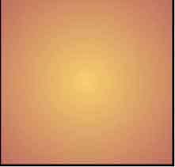
```html
div { 
background-image : radial-gradient( 
circle, 
#fed46e, 
#ba5c61); }
```

仔细看最后一个例子，你应该注意到了，渐变圆延伸到了元素的边缘，这意味着我们看到的是一个不完整的圆。如果需要设计一个完整的渐变圆的效果，我们可以在 `circle` 这行添加 `closest-side` 关键字。

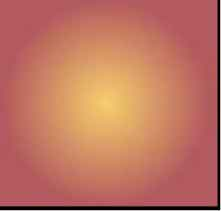
```html
div { 
background-image : radial-gradient( 
circle closest-side, 
#fed46e, 
#ba5c61); }
```

当然，我们还可以使用其他关键字来决定渐变在哪条边或者哪个角结束。

这个圆在离中心最近的一个角结束。

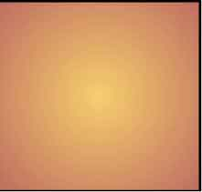
```html
div { 
background-image : radial-gradient( 
circle closest-corner, 
#fed46e, 
#ba5c61); }
```

这个是在最远的角结束。

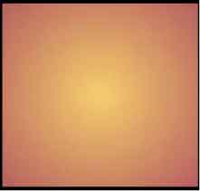
```html
div { 
background-image : radial-gradient( 
circle farthest-corner, 
#fed46e, 
#ba5c61); }
```

而这个是在最远的那条边结束。

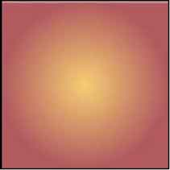
```html
div { 
background-image : radial-gradient( 
circle farthest-side, 
#fed46e, 
#ba5c61); }
```

### 改变渐变的原点

默认情况下，径向渐变使从元素背景的中心将颜色融合后向外延伸，但是在很多场景下我们需要改变默认方式。使用 `at` 关键字，后面跟一些位置或者其他的一些值就完全可以做到。

这个渐变从元素背景的左上角开始。

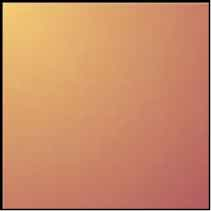
```html
div { 
background-image : radial-gradient( 
circle at top left, 
#fed46e, 
#ba5c61); }
```

这个渐变从左下角开始。

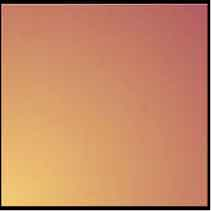
```html
div { 
background-image : radial-gradient( 
circle at bottom left, 
#fed46e, 
#ba5c61); }
```

我们同样可以让渐变从右上角开始。

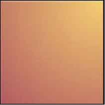
```html
div { 
background-image : radial-gradient( 
circle at top right, 
#fed46e, 
#ba5c61); }
```

当然，还可以从右下角开始渐变。

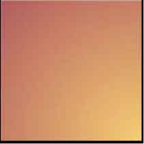
```html
div { 
background-image : radial-gradient( 
circle at bottom right, 
#fed46e, 
#ba5c61); }
```

还想把渐变玩出花样？你很幸运，除了 `at` 关键字，你还可以精确地使用CSS单位来控制渐变的原点位置，包括像素和百分比。这样，就能完美地实现响应式设计。

我们把原点定位在距离元素中心 `80px` 、距离顶部 `30px` 的位置。

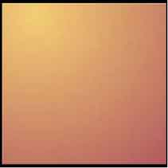
```html
div {
background-image : radial-gradient(
circle at 80px 30px,
#fed46e,
#ba5c61); }
```

如果你希望渐变的中心在元素本身以外，你可以使用负值。在这个例子中，原点在元素外面距离顶部 `30px` 的位置。

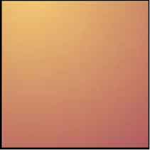
```html
div {
background-image : radial-gradient(
circle at 80px -30px,
#fed46e,
#ba5c61); }
```

### 添加颜色节点

和线性渐变一样，简单的径向渐变也是由两种颜色实现的。但是更为复杂的渐变往往需要包含一个或多个颜色节点。下一步，我们将为上一个渐变添加第三种颜色。

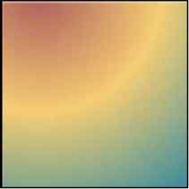
```html
div { 
background-image : radial-gradient( 
circle at 80px -30px, 
#b1585d, 
#fed46e, 
#388fa2); }
```

由于我们还没有指定颜色融合的位置，那么它们此时会均匀地融合在渐变轴上。如果想精确地控制颜色的融合位置，那么可以指定颜色节点在我们希望的位置开始融合。


```html
div { 
background-image : radial-gradient( 
circle at 80px -30px, 
#b1585d 30%, 
#fed46e 30%, 
#fed46e 40%, 
#388fa2 40%); }
```

### 抢眼的径向渐变

是时候让径向渐变露一手了。结合径向渐变和RGBa来实现一个聚光灯照在办公室门上的效果。首先使用一个深色背景和木纹材质的背景图像做出门的造型。

```html
.hb-about { 
background-color : #332115; 
background-image : url(about-wood.jpg); 
background-position : 50% 50%; 
min-height : 100vh; }
```

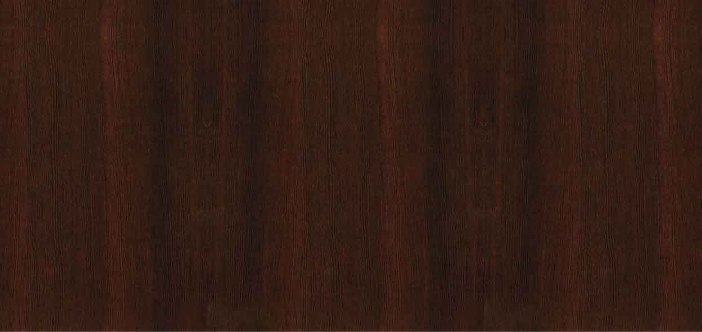
<center class="my_markdown"><b class="my_markdown">这个漂亮的木纹门板给访客带来了良好的第一印象。我们也欢迎使用低端浏览器的用户来访。</b></center>

因为CSS渐变使用的是 `background-image` 属性，所以我们可以在多个背景图像中使用它们，包括位图或者其他CSS渐变。首先，我们在 `background-image` 上添加一个径向渐变。因为是先定义的这个渐变，所以它将出现在木纹图案上面。

```html
.hb-about { 
background-image : url(about-wood.jpg); 
background-position : 50% 50%; }
```

然后给这个径向渐变加上 `background-position` 和 `background-repeat` 属性值，并用逗号分隔它们，来修饰木纹背景。

```html
.hb-about { 
background-image : 
radial-gradient( 
circle at bottom left, 
transparent, 
rgba(0,0,0,.8)), 
url(about-wood.jpg); 
background-position : 0 100%, 50% 50%; 
background-repeat : no-repeat, repeat; }
```

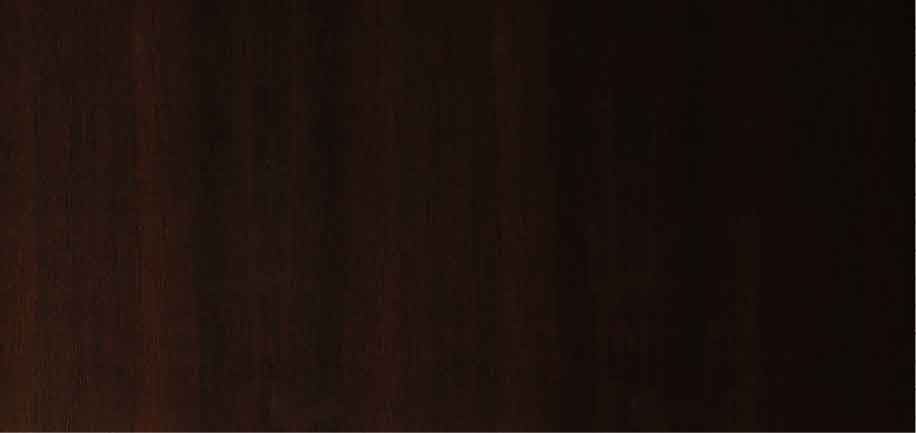
这扇门虽说是做好了，但是我们要问问自己，这样就足够专业和老到了么。虽然这个木纹背景经过优化后只有50Kb，但是这仍然造成了一个额外的HTTP请求。

专业的CSS应该是做到淋漓尽致，所以我们用一个半透明的线性渐变，结合 `background-image` 属性来代替那张位图。

```html
.hb-about { 
background-image : 
linear-gradient( 
90deg, 
#472615 50%, 
transparent 50%); 
background-size : 6px; }
```

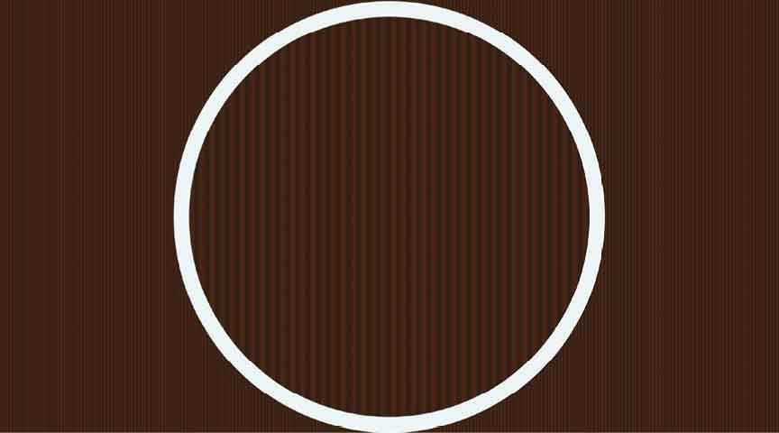
<center class="my_markdown"><b class="my_markdown">这个木纹是一个从上到下、从棕色到透明的渐变。这两种颜色是在渐变轴50%高度位置上开始融合的，形成了一条锐利的线，所以不受背景尺寸的影响。</b></center>

这种渐变形成了竖状条纹，但是看起来还并不太像木纹，所以我们使用另一种渐变——重复。

## 重复渐变

到目前为止，我们已经了解了如何将线性渐变和径向渐变充满整个元素，但是如果我们希望渐变铺满整个元素背景，来创造一种新的模式，是不是写几行简单的CSS就可以搞定？好吧，我们可以用重复渐变来做到这一点。

重复渐变有 `repeating-linear-gradient` 和 `repeating-radial-gradient` 这两种类型。这里介绍如何制作线性重复渐变。

```html
div {background-image : repeating-linear-gradient(); }
```

而径向重复渐变的代码如下所示。

```html
div {background-image : repeating-radial-gradient(); }
```

我们从Get Hardboiled网站的调色板上取两个颜色，来写一个线性的重复渐变。如果想让渐变垂直变化，只需要将渐变角度设置为 `90deg` 。

```html
div {background-image : repeating-linear-gradient(90deg); }
```

现在把我们取的两个颜色添加到颜色节点，在颜色融合的位置形成锐利的边缘：

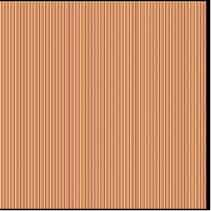
```html
div {
background-image : repeating-linear-gradient(
90deg,
#fed46e,
#fed46e 3px,
#ba5c61 3px,
#ba5c61 6px); }
```

最后一个颜色值有个很重要的作用，它有效地控制着用来平铺的渐变背景的尺寸。改变颜色节点的位置比例，就可以看到背景随之发生了有趣的变化。下一个重复渐变密度比较小，并且设置了 `45deg` 的倾斜。

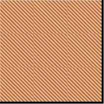
```html
div { 
background-image : repeating-linear-gradient( 
45deg, 
#fed46e, 
#fed46e 5px, 
#ba5c61 5px, 
#ba5c61 10px); }
```

现在我们把渐变设置成 `-45deg` ，并放大密度。

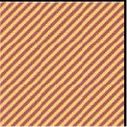
```html
div { 
background-image : repeating-linear-gradient( 
-45deg, 
#fed46e, 
#fed46e 10px, 
#ba5c61 10px, 
#ba5c61 20px); }
```

到目前为止，我们已经了解了线性的重复渐变，但重复渐变还包括圆形或者椭圆形。下一个例子就是一个原点在元素底部中间的圆。

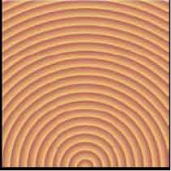
```html
div { 
background-image : repeating-radial-gradient( 
circle at 50% 100%, 
#fed46e, 
#ba5c61 20px); }
```

最后的颜色节点依然控制着平铺背景的尺寸大小。所以我们增大这个值，并把渐变的原点定位到顶部的中间。

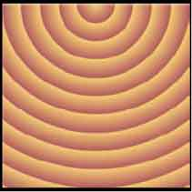
```html
div { 
background-image : repeating-radial-gradient( 
circle at 50% 0, 
#fed46e, 
#ba5c61 40px); }
```

最后，我们把圆改成 `ellipse` ，并把渐变的原点定位到右侧的中间。

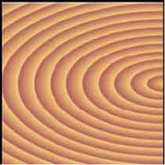
```html
div { 
background-image : repeating-radial-gradient( 
ellipse at 100% 50%, 
#fed46e, 
#ba5c61 40px); }
```

### 重复渐变实战

让我们带着重复渐变的知识重新回到办公室的那扇门。我们再试一次用线性渐变来实现它。这一次，我们使用重复渐变来代替位图图像。这次我们融合六种颜色，并设置不同的颜色节点来实现更逼真的效果。

```html
.hb-about { 
background-image : 
repeating-linear-gradient( 
90deg, 
#24170b, 
#24170b 6px, 
#291A0b 8px, 
#3e2010 10px, 
#281A11 11px, 
#281A11 12px, 
#25170a 18px, 
#180f06 24px, 
#180f05 24px, 
#180f05 28px); 
}
```

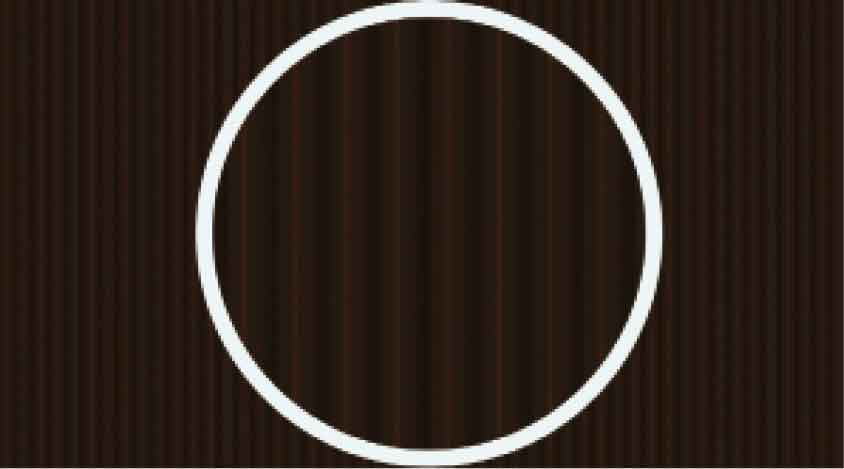
现在的效果就比较专业了。虽说细看起来它并不像真的木头材质，但当用户在小屏手机上看的时候，可能并不会注意到这点。用户能感受到的，就是加载速度更快。但如果是专为大屏设备进行设计，就需要重新引入那张木纹位图背景，用来补充材质细节。

```html
@media (min-width: 48rem) { 
.hb-about { 
background-image : 
radial-gradient( 
circle at bottom left, 
transparent, 
rgba(0,0,0,.8)), 
url(about-wood.jpg); 
background-position : 0 100%, 50% 50%; 
background-repeat : no-repeat, repeat; } 
}
```

## 打破传统

扁平化设计风格在今天确实很流行，但是Web设计的流行风格变化很快，所以渐变风格肯定会重新流行起来的。不管你是喜欢线性、径向、重复或者多个背景图像，你都需要了解怎么来处理它们。


