# 第17章　混合背景与滤镜

快速改变不仅反映在我们手头使用的工具上，新工具和新技术的开发速度也十分迅速。一个更现实的体现就是，一系列新兴的CSS属性在现代浏览器中的实现。在过去，设计师和开发者年复一年地等待像 `border-radius` 这种简单的CSS技术能够跨浏览器实现；而今天，新的属性从概念到实施，甚至成为规范，都能在短时间完成。

总之，这种发展速度无论是对设计师和开发者，还是对企业和品牌，或者对互联网来说，都是一件好事。即使最新的浏览器也可能跟不上这种发展速度，我们也不能放慢前进的步伐。相反，我们应该在实际工作中使用新兴技术来推进Web的发展，而不是只停留在实验项目上。

## CSS着色器

在过去十年中，许多CSS的创新是由浏览器厂商推动的。但是在过去几年，Illustrator和Photoshop的开发商，Typekit的所有者Adobe的贡献颇大，它在CSS里增加了一些有趣的图像绘制效果。2011年，Adobe公司发布了CSS着色器，它是一种高级的Web视觉效果。将Photoshop中使用的滤镜带到浏览器的提议得到普遍接受，在2014年底，Adobe的滤镜被列入W3C的滤镜效果模块工作草案。

混合模式和滤镜的采用速度非常惊人，主要的浏览器现在都支持CSS滤镜。Chrome、Opera和Safari需要 `-webkit` 前缀，微软的Edge浏览器也同样开始支持滤镜。

## CSS滤镜

不要与微软专有的滤镜相混淆，CSS滤镜是功能强大的新工具，它使浏览器能实现一些图像后期处理软件的功能。滤镜属性使浏览器可以实现像模糊、图像调整，甚至下拉阴影之类的效果。

```html
blur          brightness       contrast
drop-shadow   grayscale        hue-rotate
invert        opacity          saturate
sepia
```

正如你所期望的，这种图像后期处理软件的技术，主要用于处理图像。你可以使用它处理任何元素，甚至还可以将它们应用到整个页面。我希望在不久的将来，我们也能够将滤镜应用于背景和边框。

滤镜的语法很简单：滤镜类型后面跟上滤镜 `filter` 属性，如模糊 `blur` ，括号内加上它的值。

```html
.filter { 
filter : blur(5px); }
```

滤镜简单易用，并且它们相对新颖，尝试起来也很有趣。接下来，我们将展示一系列的滤镜类型，学习它们支持的值并看下对应的效果。我们首先来尝试模糊效果。

## 模糊

要给一个元素应用高斯模糊，我们只需要指定 `blur` 作为滤镜类型，括号内的值为模糊的半径。为了证明这一点，我们将为Stuff & Nonsense网站的banner背景上使用 `blur` 。

```html
.filter { 
filter : blur(5px); }
```

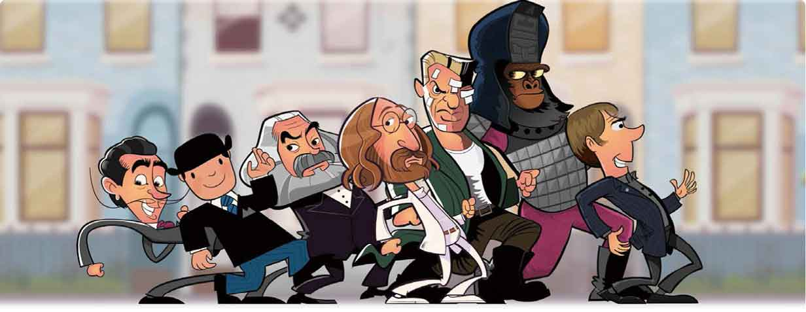
<center class="my_markdown"><b class="my_markdown">Stuff & Nonsense网站使用模糊来区分开banner背景。</b></center>

模糊滤镜的半径可以使用任何CSS单位，所以我们可以使用 `px` 、 `em` 、 `rem` ，甚至 `cm` 。数字越大，应用的半径越大，滤镜效果也越强。但是不能使用百分比。当我们输入无效值时，浏览器会默认应用 `none` 。

要想获得看起来自然的效果，需要设定一个合适的值，这有些困难，但是当我们想使用滤镜时，第一个想到的就是模糊效果，因为在CSS中使用它非常简单。

## 亮度和对比度

你可能一开始认为亮度  `brightness` 只适用于照片或者其他图像，但实际上，从文本元素到整个页面，都可以改变亮度。在接下来的例子中，我们将会把Stuff & Nonsense网站上部的图片亮度降低到 `50%` 。

```html
.filter { 
filter : brightness(50%); }
```

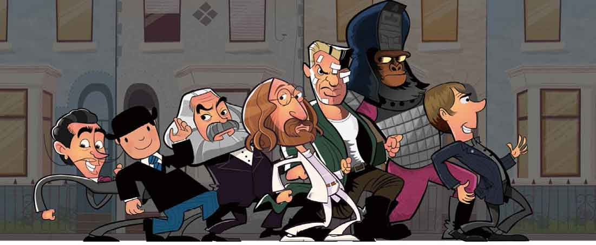
亮度  `brightness` 滤镜接受百分比值。当值为 `100%` 时，元素保留原来的样子。当值在 `0%` 至 `100%` 之间调整，减小值会逐渐变暗直到变成黑色，而当值超过 `100%` 并一直上升，直到元素看起来像是烧糊了一样。

与亮度  `brightness` 一样，对比度 `contrast` 滤镜也可以应用到任何元素上。为了和亮度  `brightness` 对比，我们继续在这幅图片上做对比度的示例。

```html
.filter { 
filter : contrast(50%); }
```

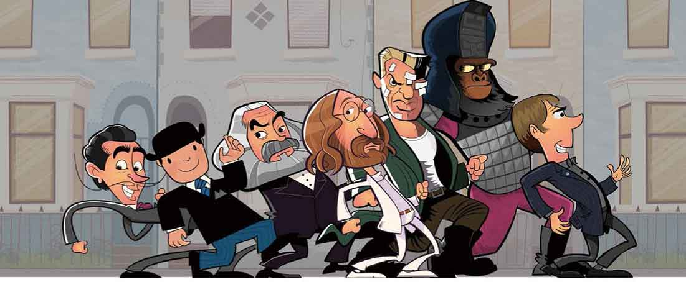
对比度 `contrast` 同样可以使用百分百单位。对比度为 `0%` 时，高亮的部分和阴影部分的对比很弱，形成了一个灰蒙蒙的效果。对比度为 `100%` 时，元素保持原样。当值超过 `100%` 时，就会形成一些非常有趣的效果。像前面蒙太奇风格的示例。

## 灰度和饱和度

灰度 `grayscale` 滤镜逐步使用灰色来替换其他颜色。属性值从 `0%` 开始，起初保持元素不便，随着值达到 `100%` ，元素将彻底变为灰色。

```html
.filter { 
filter : grayscale(100%); }
```

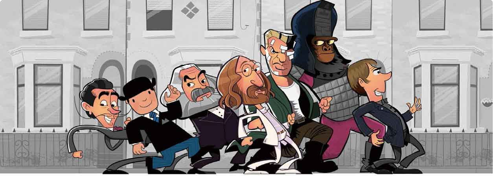
而饱和度 `saturate` 滤镜可以使颜色混合保持完整和改变颜色的总数。饱和度滤镜的值和灰度滤镜不同：灰度 `grayscale` 值为 `0%` 时，元素保持不变，而饱和度 `saturate` 值为 `0%` 时，元素则看起来完全没有颜色。

```html
.filter { 
filter : saturate(25%); }
```

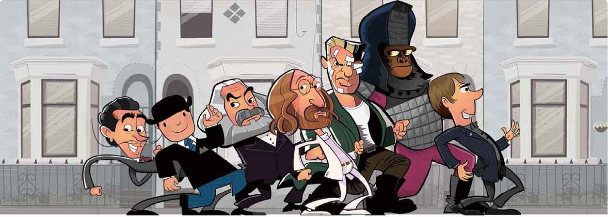
`100%` 的饱和度将保持元素原来的样子，超过 `100%` 就会让饱和度过高。

## 色调旋转

使用色调旋转 `hue-rotate` 滤镜可以创造出一些奇怪而又神奇的色彩。色调（hue）是颜色的一个属性，随着饱和度、亮度或者明度的变化而变化。我们经常看到的色盘就是由色调构成的，我们通过为色调旋转 `hue-rotate` 滤镜设定度数，使得元素的所有颜色发生旋转。在接下来的例子中，我们会尝试让色调旋转 `90deg` 。

```html
.filter { 
filter : hue-rotate(90deg); }
```

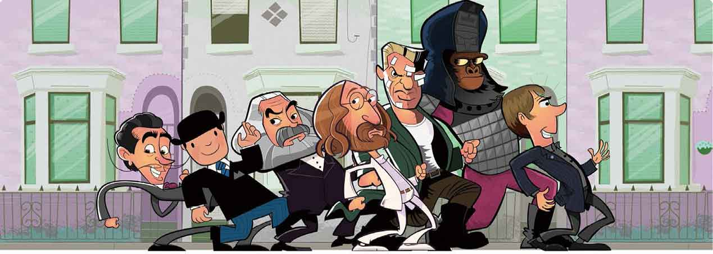
`hue-rotate` 转沿着色盘顺时针改变元素颜色的角度，45度表示为 `45deg` 。

## 反色

反色 `invert` 按照我们设定的值来反转元素上出现的颜色。值为 `0%` 时，元素不发生改变。

```html
.filter { 
filter : invert(100%); }
```

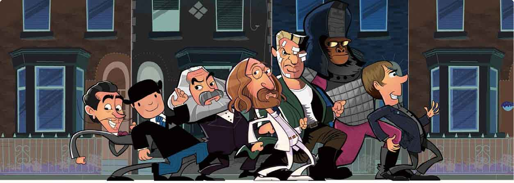
逐渐增大反色的百分比，反转的颜色的量越来越大，直到最大值 `100%` ，完全倒置颜色。

## 透明度

现在你或许会奇怪，为什么我们要采用全新的透明度 `opacity` 滤镜，而不是使用已经用了很多年的 `opacity` 属性。事实上，它们的效果的确是相同的。 `0%` ，完全透明； `100%` ，完全不透明。我们既可以用数字也可以用百分比， `.75` 等同于 `75%` 。

```html
.filter { 
filter : opacity(.75); }
```

那么，相对于以前的属性，新的滤镜有哪些优势呢？至少有两个方面。第一，透明度 `opacity` 滤镜可以与其他滤镜进行组合，实现有趣的效果。第二，某些浏览器将来会在CSS滤镜上使用硬件加速，以此提高网页渲染速度。

## 混合滤镜

为了获得更有趣的创意效果，我们可以将两个或多个滤镜组合应用。这些组合的语法有点出乎意料，不要以为用逗号隔开滤镜列表就行了。在下面的例子中，我们会组合亮度 `brightness` 、对比度 `contrast` 和饱和度 `saturate` 滤镜，得到老照片的复古效果。组合滤镜的语法如下。

```html
.filter { 
filter : brightness(1.25) contrast(.75) saturate(40%); }
```

滤镜的顺序很重要，它是从左到右执行的。在上面的例子中，先是将元素亮度增加到 `125%` ，然后将对比度减少到 `75%` ，将这两种滤镜效果组合后，又把饱和度降低到了 `40%` 。

在为使用了滤镜效果的元素设置 `:active` 、 `:focus` 和 `:hover` 状态时，必须为每个状态再重复设置一遍各个属性。例如，我们可能想要调整前面例子中鼠标悬停时的饱和度，同时保持亮度和对比度不变。

```html
.filter { 
filter : brightness(1.25) contrast(.75) saturate(40%); } 
.filter:hover { 
filter : saturate(10%); }
```

注意！我们在定义 `:hover` 状态时删除了元素的亮度和对比度设置。为了保持该状态的所有滤镜属性，我们必须重复设置各个值。

## drop-shadow和box-shadow

你可能会又一次奇怪，阴影 `drop-shadow` 滤镜是什么？它和 `box-shadow` 有什么区别。它们使用相同的参数：水平（x）偏移、垂直（y）偏移、模糊半径、扩散半径和阴影颜色值，你或许更混淆。下面是 `drop-shadow` 的语法。

```html
.filter { 
filter : drop-shadow(5px 5px 5px rgba(0,0,0,.5)); }
```

你可能并没有发现 `drop-shadow`  和  `box-shadow` 的差别，直到你将它们应用于包含alpha透明度通道的图像。当图像有一个alpha值时， `drop-shadow` 滤镜会检测到它，并在图像空间内添加阴影，就像我们在Photoshop或Sketch里添加 `drop-shadow` 。

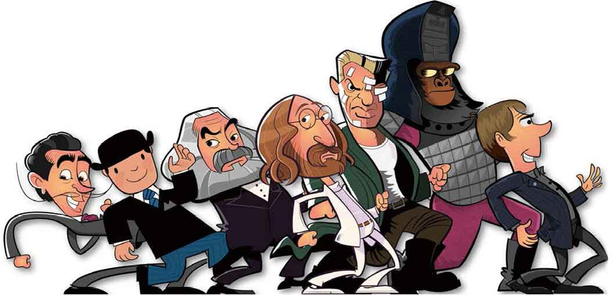
<center class="my_markdown"><b class="my_markdown">上面是 `drop-shadow` 的效果，下面是 `box-shadow` 的效果。</b></center>

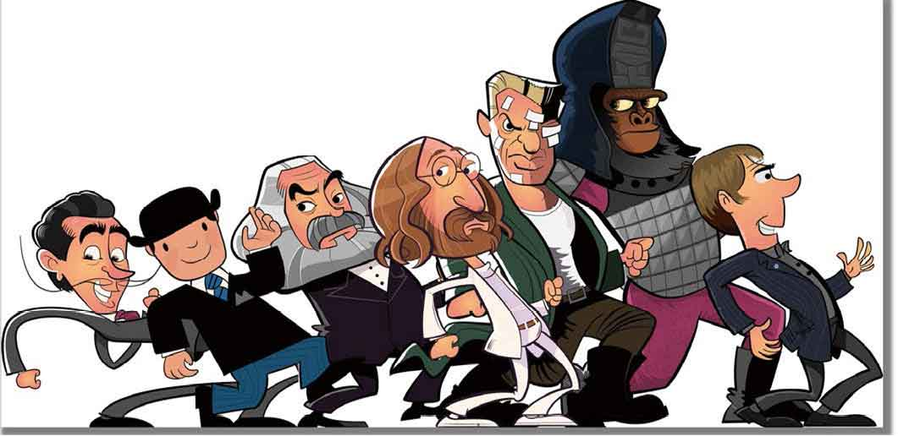
与之相反， `box-shadow` 属性只能检测到元素的外边缘并应用阴影效果。

让我们来看看从左向右移动，增加偏移量，水平和垂直偏移如何影响 `drop-shadow` 滤镜的结果。

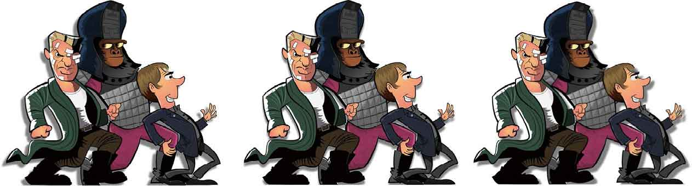
<center class="my_markdown"><b class="my_markdown">增加偏移。</b></center>

`drop-shadow` 的水平和垂直偏移是必需的，而其他值不是。接下来，我们将从小到大增加可选任意的模糊半径的值。当我们不指定模糊半径，阴影显得很浓厚，边缘也很清晰锐利。

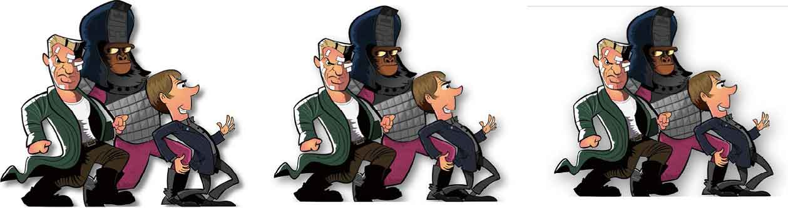
<center class="my_markdown"><b class="my_markdown">调整模糊半径的值。</b></center>

回顾多年的Web标准发展过程，我一直为变化的过程缓慢而沮丧。不过让我感到惊讶和兴奋的是，新技术如CSS滤镜这么快就被浏览器所支持。这对设计师和开发人员来讲都是一个好消息，尤其是我们现在正拥抱响应式设计。

移动端的兴起和相关需求都非常关注性能，这些都表明我们需要减少服务器的请求数和减小下载资源的大小。视觉方面，我越来越多地采用CSS来实现，这让网站可以更快、更好的呈现出来。CSS滤镜及其相关的混合模式朝着这个方向迈出了一大步。

## 混合背景

看看现在流行的扁平化Web或APP设计，你可能还没意识到CSS赋予我们的神奇力量。你可能会认为我们把元素添加到一个平面上，实际上元素之间可能是重叠摆放的，甚至元素的多个背景图也有个堆叠顺序。就我个人而言，我希望目前的扁平化设计时代快点过去，我们将返回头去做些有深度的设计。

如果你熟悉Photoshop、Affinity Photo或 Pixelmator之类的图像后期处理、平面设计软件，那你可能对混合模式比较熟悉。在这些软件中，混合模式可以用来混合或合并不同的图像，以便创建各种不同的效果。

现在浏览器也原生支持这种能力，主要通过 `background-blend-mode` 和 `mix-blend-mode` 这两种CSS混合模式来实现。接下来，我们将逐个展示它们。首先从 `background-blend-mode` 开始，它用来混合元素的背景图像。

## background-blend

在CSS盒模型中，元素的背景色在背景图片之下，边框在它们之上。或许你可以从名字猜出， `background-blend-mode` 将一个元素的背景色和图片混合在一起。当一个元素只有单一背景图片， `background-blend-mode` 控制背景图如何与它后面的背景颜色融合。

要应用混合背景，在 `background-blend-mode` 后面设置混合类型值，在这个实例中使用 `lighten` 。

```html
.blend { 
background-color : #8c4549; 
background-image : url(blend-01.jpg); 
background-blend-mode : lighten; }
```

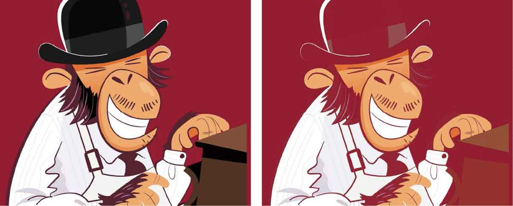
<center class="my_markdown"><b class="my_markdown">左边为 `normal` ，右边为 `lighten` 。</b></center>

## 混合模式

CSS有16种混合模式： `normal`  （没有混合应用）、 `color` 、 `color-dodge` 、 `color-burn` 、 `difference` 、 `exclusion` 、 `hue` 、 `luminosity` 、 `multiply` 、 `overlay` 、 `saturate`  、 `screen` 、 `lighten`  、 `darken` 、 `hard-light`  和  `soft-light` 。

`background-image` 和 `background-color` 通过我们选择各种混合模式来形成不同的视觉效果。


`multiply` ：将 `background-image` 和 `background- color` 叠加到一起，可以得到一个颜色更深的 `background-image` 。

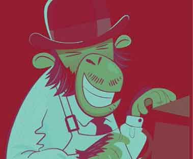
`exclusion` ：衡量源和目标的亮度，减去亮度更大的区域的色彩。它和 `difference` 相似，不同之处在于它会得到对比度较低的效果。

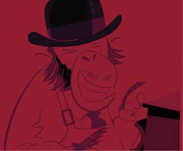
`lighten` ：这个模式与 `darken` 相反，它的效果取决于源和背景颜色之间更浅的（色彩）。即将两像素的RGB值进行比较后，取高值成为混合后的颜色，因而总的颜色灰度级升高，造成变亮的效果。

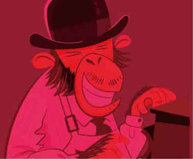
`overlay` ：这是一个复杂的混合模式，通过对目标颜色叠加复合或过滤，使亮的颜色变得更亮，暗的颜色变得更暗。

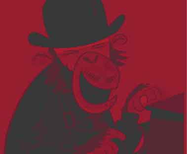
`saturate` ：通过组合源颜色的饱和度，目标颜色的色相和亮度产生的效果。 `saturate` 类似于 `hue` ，但是它使用可选择的属性。

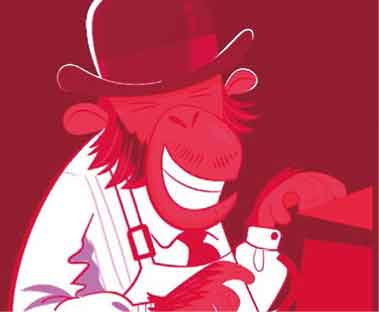
`color-dodge` ：提亮目标颜色来反映源颜色。

## 多个背景图像的混合

当给一个元素添加多个背景图像时，我们可以给每个图像应用不同的混合模式。每个图像和它下面的元素融合，最终与元素的背景色 `background-color` 融合。

```html
.blend { 
background-color : #8c4549; 
background-image : url(blend-01.jpg), url(blend-02.jpg); 
background-blend-mode : lighten, multiply; }
```

在这个例子中，图片 `blend-02.jpg` 和 `background-color` 融合，采用 `multiply` 模式；图片 `blend-01.jpg` 与第二个图片融合，然后 `background-color` 用 `lighten` 模式。

肯定还有更多的方式来使用 `background-blend-mode` ，而不只是混合单一的背景图像和颜色。设计师可以混合多个背景图像，以创造更加丰富和充满深度的设计，我很高兴看到这种新的属性能让我们创造更多的可能。

## 混合图像类型

在下一个例子中，我们会结合页面背景色、径向和重复的线性渐变来实现Get Hardboiled网站桌面的照明效果。

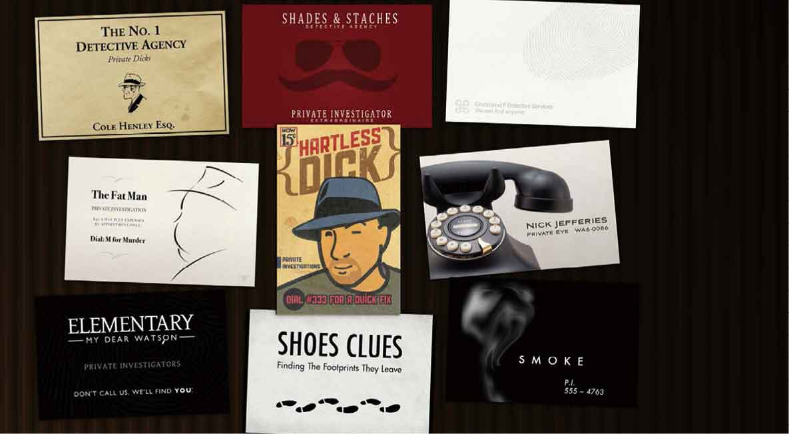
<center class="my_markdown"><b class="my_markdown">我们用来混合的不一定是传统意义上的图片，它也可以是我们用CSS生成的任何形式的渐变。</b></center>

首先在页面的 `body` 元素上应用一个径向渐变，这个渐变开始是透明的，然后渐变到红色来模拟灯光照到整个桌面的效果。

```html
.hb-bg-light { 
background-color : #332115; 
radial-gradient(circle at bottom left, transparent, #f00); }
```

为了确保 `body` 延伸到浏览器窗口的最大高度，所以不管它包含多少内容，我们将设置它的 `min-height` 为浏览器窗口的 `100%` 。

```html
.hb-bg-light { 
min-height : 100vh; }
```

下一步，添加一个重复的线性渐变，用来创建纹理效果。

```html
.hb-bg-light { 
background-image : 
radial-gradient(circle at bottom left, transparent, #f00), 
repeating-linear-gradient( 
90deg, 
#24170b, 
#24170b 6px, 
#291A0b 8px, 
#3e2010 10px, 
#281A11 11px, 
#281A11 12px, 
#25170a 18px, 
#180f06 24px, 
#180f05 24px, 
#180f05 28px); }
```

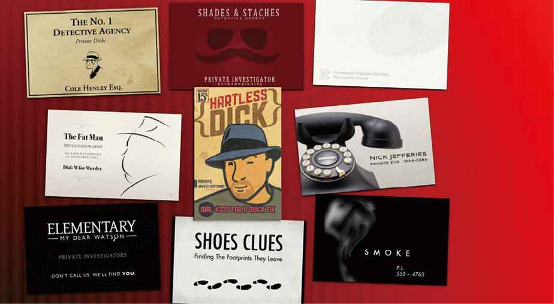
<center class="my_markdown"><b class="my_markdown">重复的线性渐变有助于实现纹理效果。</b></center>

现在，我们把这些渐变背景图像和页面本身的背景融合在一起。我们将选择两种混合模式： `color` ，将混合出径向渐变聚光灯效果； `screen` ，将重复的渐变纹理和后面的背景颜色混合。

```html
.hb-bg-light { 
background-blend-mode : color, screen; }
```

由于混合模式最终呈现的效果，很大程度上取决于混合的颜色，所以有时很难一下找到实现理想效果的恰当模式。因此需要通过切换混合模式、改变背景颜色等方式来慢慢尝试。

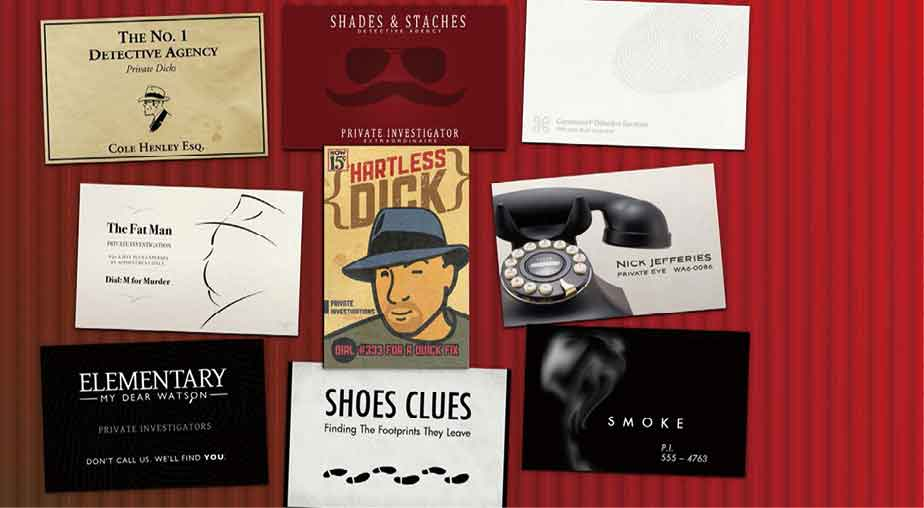
<center class="my_markdown"><b class="my_markdown">不知道结果，却往往能给我带来一个意想不到的好结果。</b></center>

## 测试background-blend-mode的支持程度

不是所有的浏览器都支持 `background-blend-mode` ，但这显然不能阻止一个高明的设计师。某些情况下，因为浏览器不支持或者不全部支持，那我们需要考虑使用替代品。

Modernizr工具的原理是，通过 `class` 属性值来为不同的浏览器环境定义不同的样式。这正是处理微软IE和Edge浏览器的好方法。当浏览器支持 `background-blend-mode` 时，Modernizr给HTML元素追加一个 `backgroundblendmode` 类。

```html
.backgroundblendmode .blend { 
background-color : #8c4549; 
background-image : url(blend-01.jpg), url(blend-02.jpg); 
background-blend-mode : lighten, multiply; }
```

如果不支持，Modernizr通过追加 `no-backgroundblendmode` 类使我们可以提供一个替代图片。

```html
.no-backgroundblendmode .blend { 
background-image : url(blend-alt.jpg); }
```

虽然Modernizr很有用，但它还只是一个很粗糙的工具，因为它只能检测浏览器支持的CSS属性，而不能检测是否支持每一个属性值。例如，苹果的Safari支持部分 `background-blend-mode` , 因为它不支持 `color` 、 `hue` 、 `luminosity` 和 `saturate`  混合模式。苹果的浏览器已经实现了我们之前学过的 `@supports` 功能查询，@规则是一个解决部分支持的理想方案。

我们将若干特征查询链到一起，首先测试 `color` ，然后是 `hue` 、 `luminosity` ，最后测试 `saturate` 。我们将使用 `not` 运算符来指定缺乏支持这些特定的属性和值的浏览器，用 `or` 运算符，以确保涵盖了几种可能不支持的混合类型。

```html
@supports not (background-blend-mode:color) 
or not (background-blend-mode:hue) 
or not (background-blend-mode:luminosity) 
or not (background-blend-mode:saturate) { 
.blend { 
background-image : url(blend-alt.jpg); } 
}
```

## mix-blend

`background-blend-mode` 使我们能够影响单个元素内一个或多个背景图像和背景颜色的视觉效果，另一种混合模式可以影响和其他元素的视觉效果，甚至是页面本身。这个新的特性称为 `mix-blend-mode` ，它为Web和应用实现新的创意创造了新机会。

`mix-blend-mode` 的语法和 `background-blend-mode` 一样简单。

```html
.blend { 
background-colour : #a20b30; 
mix-blend-mode : multiply; }
```

在这个例子中，我们的元素不会和自身混合，而是跟其他有层级关系的元素和页面本身混合。

## mixing blend模式

如果一个元素包含多个背景图片，我们可以将相同的混合模式分配给所有的元素，如下所示。

```html
.blend { 
background-image : url(blend-01.jpg), url(blend-02.jpg),  
url(blend-03.jpg); 
mix-blend-mode : multiply; }
```

或者我们可以为每个 `background-image` 指定不同的混合类型。

```html
.blend { 
background-image : url(blend-01.jpg), url(blend-02.jpg), 
url(blend-03.jpg); 
mix-blend-mode : multiply, screen, luminosity; }
```

在这个例子中，图片 `blend-01.jpg` 将使用 `multiply` 混合模式，图片 `blend-02.jpg` 将使用 `screen` ，以此类推。因此，我们需要注意背景图片和它们对应的混合模式的顺序。

`mix-blend-mode` 属性和 `back-ground-blend-mode` 使用相同的混合类型，所以我们可以使用它们实现相同的混合效果。

## 打破传统

几乎每个方面，我们都在作出快速改变。这对设计师、开发人员、企业、品牌和互联网来讲都是好事。新技术如CSS滤镜和混合背景不仅被很快提出，而且很快被浏览器所支持，并成为标准。现在我们需要更加努力，来使用这些令人兴奋的新工具去完成更有创造性的工作。


