# 第5章　组件与原子化设计

在过去的五年里，可以很明显地看到Web的巨大变化以及我们所做的努力。随着响应式Web设计的发展，我们的设计流程也发生了根本的变化。虽然我们的设计方法并不适合每一个人，但它已经被证明是成功的，因此在本章中，我将解释我们的流程。

## 风格指南

我做Web工作之前，一直被各个公司的风格指南和品牌呈现方式所吸引。我喜欢看到多种多样的相似组件的外观，尤其是喜欢看排版定稿文档。有时候，虽然在工作中我会收到公司的品牌风格指南，但我仍然会想办法在指导原则的范围内加入自己的想法。

## 与品牌设计规范作斗争

传统的风格指南覆盖了各种各样的媒体，包括包装、印刷和网络，然而这对Web设计师来说并不总是有益的。例如，我曾经参与的汇丰银行的项目。此项目全面的指南规定了产品名称——比如预收账款、高级账户和私人银行等——的字号永远不应该比银行名称更大。这条规定使得当产品被挤进只有80像素的网站横幅广告中时，名称可读性将变得很差。

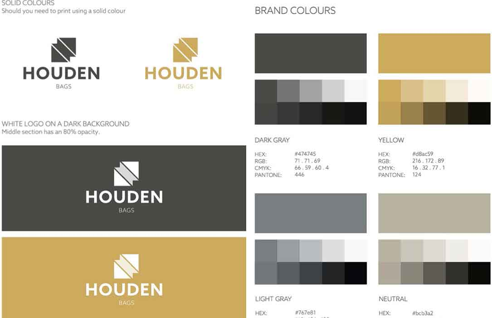

<b class="my_markdown">Houden手袋品牌风格指南。</b>

## 沟通不是记录

多年来，我并没有满足于向客户展示静态设计稿。这些使用Photoshop或Sketch软件制作出的静态视觉，无法证明网站中设计的重要性。客户会期望最终的网站是冻结的图像的副本，事情显然不会是样。最重要的是，他们在谈话中对于设计手段所知甚少，而且很少能够对具体问题进行专注的、富有成效的讨论。

客户在看静态视觉时，往往容易分心。我可能需要讨论关于排版的问题，但客户却希望logo再大些；我可能想要谈论一下搜索将如何发挥作用，但他们却纠结于一张过时的产品照片。客户没有抓住重点，因为我们所讨论的静态视觉也没有重点。

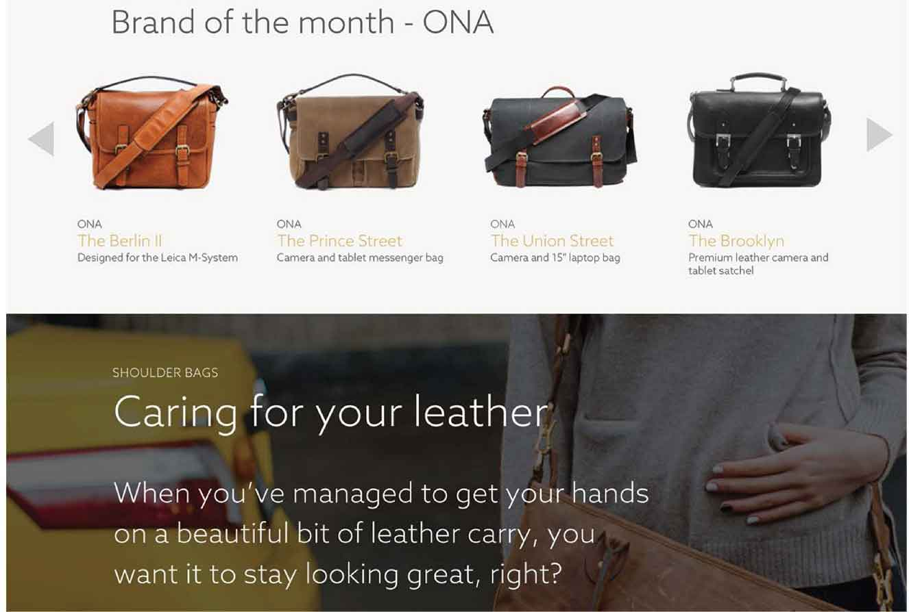

<b class="my_markdown">houden手袋的关键网页设计。</b>

过去我给客户展示静态视觉的时候，他们有时会说：“我不确定这个设计的效果。”这令人非常沮丧，尤其是我们花了几个小时对他们的设计进行了详细的再现。当我想得更深一些的时候，我发现他们所评论的往往不是重要的设计细节，不是我们选择的字体或排版方式，也不是我们使用的色彩、线条、边框或底纹。

当我们进一步询问客户，他们可能会说：“侧边栏应该是在左边，不是在右边。”换句话说，他们在谈论布局，但却站在整体设计的角度来表达他们的批评。为什么我感到惊讶？我期望什么？毕竟，我已经向他们展示了把各个重要部分混合在一起的设计稿。

我知道必须有一个更有效的方法来展示设计，并让客户专注于我需要讨论的方面。随着时间的推移，我的工作室已经建立了一种方式来做这件事情。最重要的是，我们开始展示我所说的设计风格，然后设计从布局分离出来的元组件。

## 描述设计风格

查看“atmosphere”这个单词，字典会告诉你它代表“弥漫的色调、一个地方、情况的氛围，或创造性的工作”。在响应式网页设计的背景下，我觉得设计风格与布局截然不同，包括颜色、字体和纹理。我们要打破传统。

### 颜色

我们用色彩来营造风格，并唤起一个人在使用网站或APP时的情绪。作为交互的一部分，我们还要突出交互的行为；例如“我能点击吗？”“我已经点击了什么？”“点击之后有什么潜在危险？”

### 排版

设计的个性化相当一部分取决于我们选择的字体，以及如何把行高、字号、粗细和周围的空白结合起来使用。

### 纹理

纹理可以是像纸张、石头或木头的拟物化纹理，但也并不一定是这样。在设计风格里，纹理指的是细节，包括边框样式、阴影以及盒子模型或其他元素的形状。

## 设计风格

让我们看一个设计感十足的网站：2015年的dConstruct会议网站。你认为是什么让它的视觉风格如此有特色？

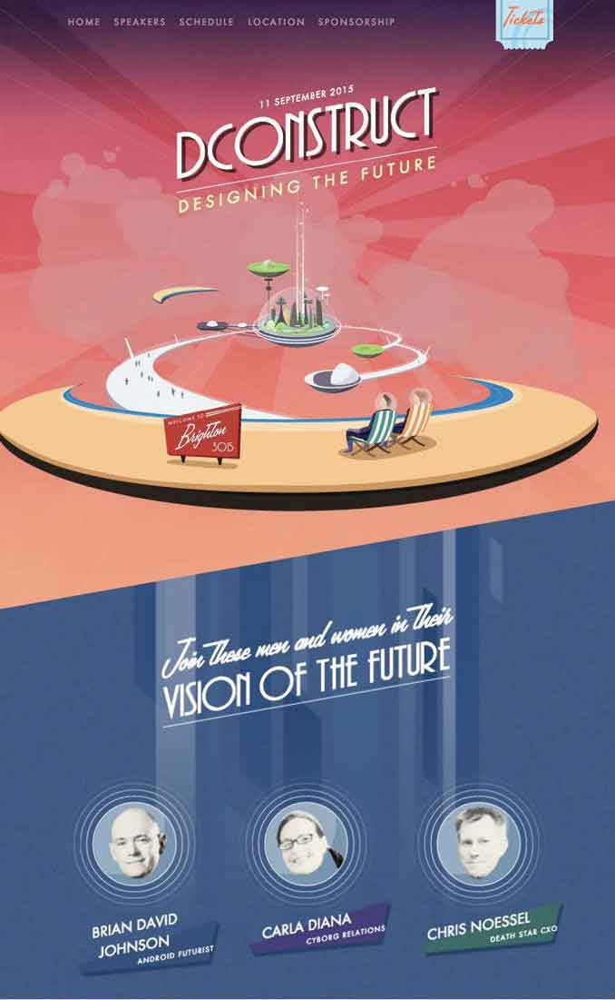

<b class="my_markdown">此网页由Paddy Donnelly 设计，由Graham Smith建立，会议组织者为Clearleft。</b>

当然，你可能第一眼就被本次会议主题“设计未来”（VISION OF THE FUTURE）中的特色插图所吸引，但也有其他方面让这个设计看起来个性十足。

+ 字体组合：Futura (naturally)、humanist sans和Lamplighter Script。
+ 倾斜的内容容器。
+ 用活泼的方式展示演讲者。

为什么我要强调2015年dConstruct会议呢？在不同尺寸的任何设备上访问这个网站，看起来都是一样的。当然，页面的排版会随着设备的尺寸变化，但是网页的整体设计风格应该保持一致，不论是在手机、平板电脑还是在PC上访问。

2014年，dConstruct设计风格完全不同，它采用了扁平化设计和简单的配色。选择的字体是PT Sans，无衬线字体。与当年的主题“生活与网络”文字框周围的鲜明线条非常匹配。

2013年和之前的dConstruct网页设计都有着完全不同的设计风格，但是每年的设计也有共同之处。

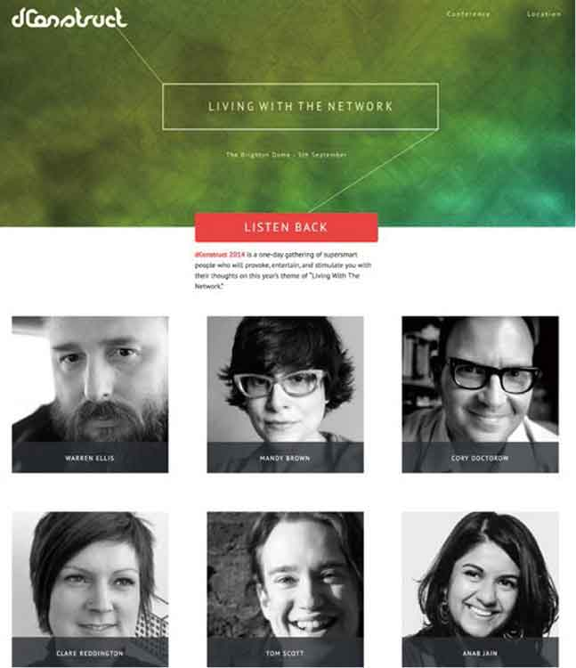

<b class="my_markdown">自2005年以来，dConstruct主办方在保持会议网站、回顾十年的设计工作以及如何确定一个网站的设计风格方面做了出色的工作。</b>

当你仔细观察它们的颜色、字体和纹理时，设计的每一个部分都有着独一无二的个性，设计风格被跨终端地呈现出来。

如果说自适应设计已经告诉了我们什么，那就是我们应该承认，配色、纹理背景、边框和排版设计应该跨越屏幕尺寸保持自己的特点。换言之，设计风格不应该受布局的限制。

## 使用前端样式指南和组件库

我们注意到，当我们开始用令人着迷的风格指南去设计并呈现我们的作品时，我们与客户的沟通效率将得到很大的改善。尽管风格指南几经迭代，当一个新形式的Web风格指南流行起来的时候，我们仍然饶有兴致。

## 指导视觉识别

人们在媒体上维护一个组织的品牌，需要风格指南或品牌准则来保持品牌资产、安置和处理方法的一致性。这些指南通常从描述品牌的个性和价值观开始。Jamie Oliver是这样描述他的Fresh Retail Ventures品牌个性的。

“诚实并具有挑战性——直接、豁达、坦率；充满激情和鼓舞——对食物充满兴趣和爱，健康的生活方式；平易近人和乐趣——朴实无华、方便、充满乐趣，鼓励大家一展身手。”

大多数风格指南提供了一些logo使用或禁用示例，它们也给出了字体的使用规则，并应该让你对如何使用颜色和如何处理图像不会心存疑惑。Jamie Oliver的风格指南甚至说明了“Jamie期望所有的照片中都是新鲜的熟食，并且是在自然光线下拍摄的。”

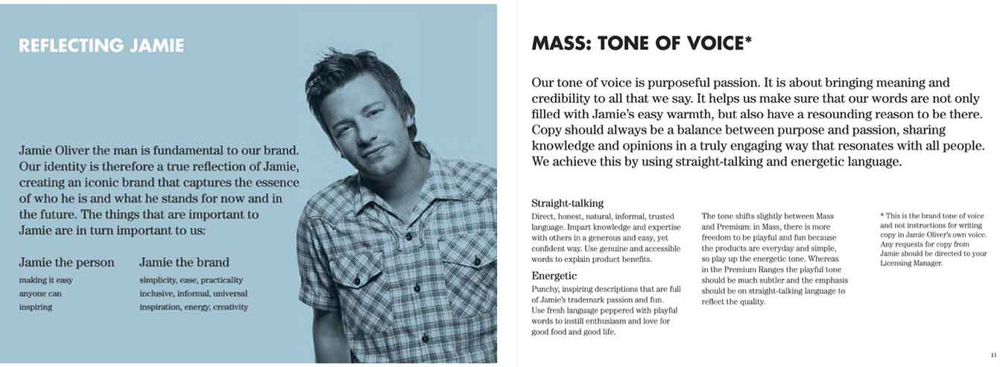

<b class="my_markdown">Fresh Retail Ventures有一套严格的品牌设计规范，涵盖了广泛的品牌原则，例如包装设计，甚至语气。</b>

## 创建Web设计风格指南

可惜的是，我常常发现，品牌标识指南很少恰当地应用到Web设计上。有些指南会强迫我使用在色卡上看起来很棒、但在屏幕上看起来很不舒服的颜色。还有些情况下，特定字体不能作为网页字体，如果把它们用在网页上，会让人阅读起来很不舒适。经验告诉我，我们再做Web设计时，品牌设计规范只能作为参考，而不是标准。我们需要的是可以具体应用到网上的风格指南。

要清楚地说明这个问题，我认为最好举个例子。英国有个伦敦国王学院医院NHS（National Health Service，英国医疗服务体系）信托基金会，作为英国国民健康服务的一部分，意味着信托基金会的出版物必须参考NHS的品牌设计规范。

由于国王学院医院是一个独立的组织，其网站不必严格遵守NHS品牌设计规范。我们为其做了一个设计，体现出了基金会的价值，而不是NHS的价值。尽管NHS品牌设计规范给了我们一个起点，但是我们还需要一个适用于国王学院医院网站的风格指南。

品牌标识指南往往以PDF格式提供，但响应式的HTML、CSS和JavaScript，是更佳的Web设计风格指南媒介。相较风格指南文档，我们的Web设计风格指南，已经成为了一个工具，而不是纯粹记录设计风格的地方。

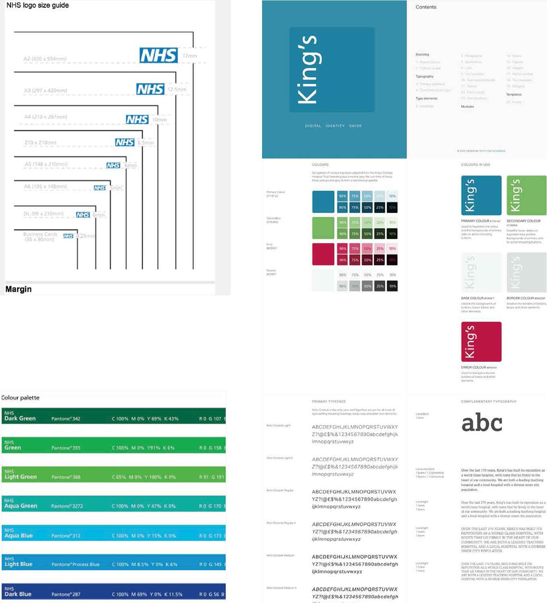

<b class="my_markdown">NHS品牌设计规范是一套全面的设计规则，涵盖了logo、字体（包括FRUTIGER的几个权重）的使用，以及如何使用照片和插图。在国王学院医院的项目中，某人设计了一套综合性的Web风格指南。</b>

## 

## 发展Web设计风格指南

组件是我们开发的模板中的块元素，我们可以通过调整这些模板来制作页面。我们的设计风格，就是伴随着设计这些独的组件，并将它们建设成为模式库而发展的。

在过去的几年里，有些人创建了组件库。其中一些组件库已经被广泛引用，包括BBC、英国政府、MailChimp和星巴克的组件库。

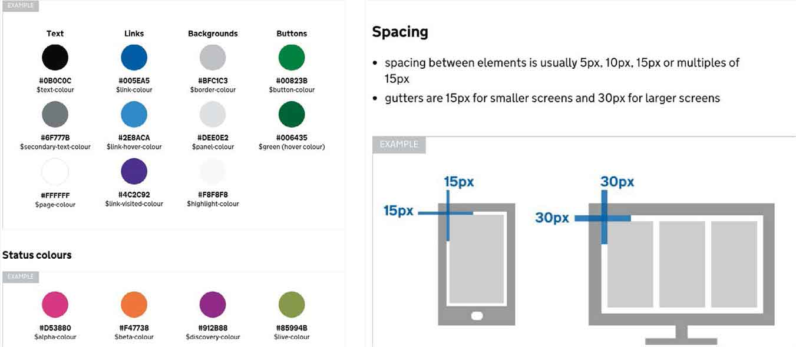

<b class="my_markdown">英国政府服务设计手册，可以帮助他们的设计师和开发人员，实现GOV.UK网站的各个部分，并保持外观一致。</b>

## 原子化设计

Brad Frost提出的原子化设计已经成为了响应式设计的代名词。Brad第一次讨论原子化设计是在2013年，他写道：

“最近，我一直对接口的组成，以及如何通过更有条理的方式来构造设计系统很感兴趣。”

Brad接着描述了他的原子设计系统，是如何由原子、分子、组件、模板和页面组成的。

+ **原子：** HTML的基础，包括按钮、表单和标签等元素。
+ **分子：** 一组元素的组合，例如由标签、输入框和按钮组成的搜索表单。
+ **组件：** 一组分子组合在一起形成界面的一部分。
+ **模板：** 大多数组件结合形成页面级的对象。
+ **页面：** 测试设计系统有效性的必需品。

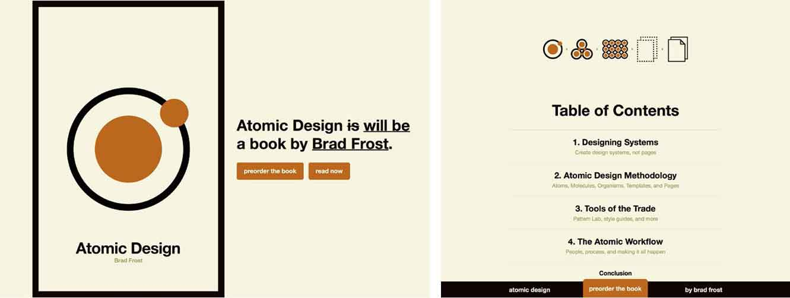

<b class="my_markdown">Brad将原子化设计描述为“用于构建网页设计系统的方法。”这个方法由工具和模式库来创建原子化设计系统。</b>

然而，并不是每个人都认同原子化的设计方式。Mark Boulton就写出了他的顾虑，我不得不同意他的说法。

“一致性和效率是要付出代价的。这个代价就是设计，是人类对从无到有创造作品的感觉。我描述的不是设计过程。它就像一个制造蛋糕的机器，生产出大量相同的蛋糕。虽然裹着不同的糖衣，但它们的味道都是一样的。”

当你单独地设计各个部分，那么往往很难知道它们是否能够融为一体。

如果人们不能一眼全览设计的全部，人们很容易感觉到设计不连贯，缺乏连通性。而且想要摆脱组件库提供的默认样式也将变得更加困难。你只需要看看基于Bootstrap和Foundation的成千上万的相似网页就能够意识到了。

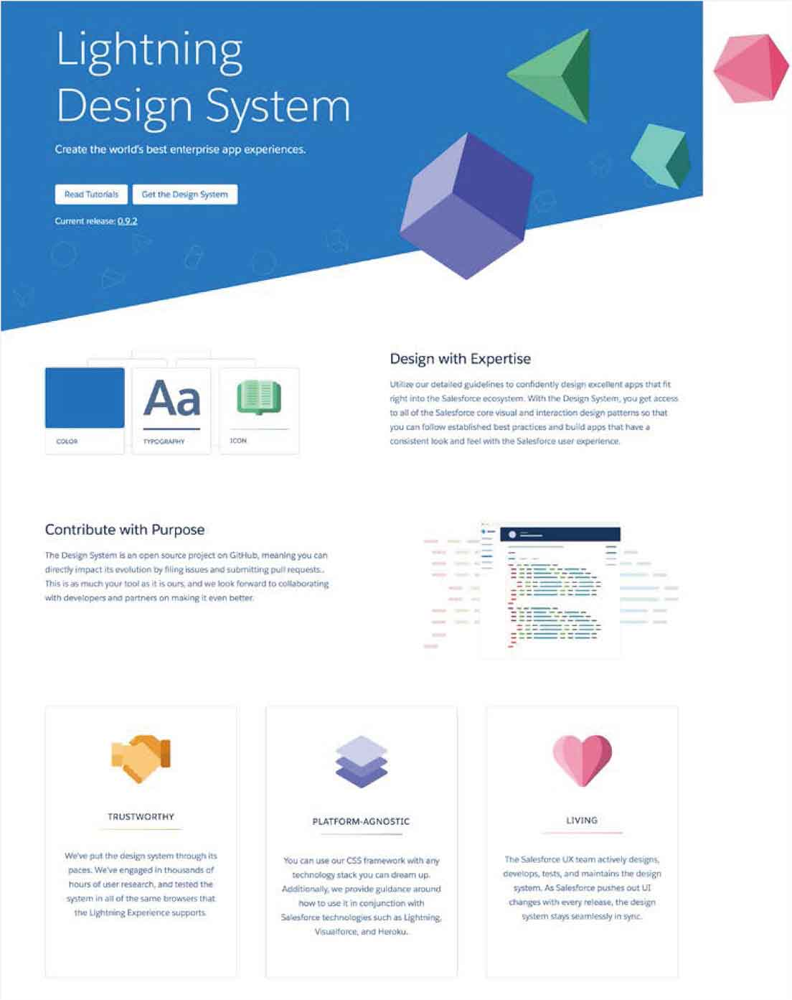

<b class="my_markdown">做得好，组件库可能会成为非常有用的资源。Salesforce的闪电设计系统是最好的资源之一。Salesforce成立于1999年3月，是一家客户关系管理（CRM）软件服务提供商。</b>

## 节省时间

基于组件的方法使得设计初期的工作更高效。我们能够更快地原型化组件，与使用Photoshop和Sketch软件设计一套完整的页面相比，我们可以用更少的时间将它变成响应式模板。我们的项目会运行得更平稳，也将可以进行更专注的沟通，并且能够减少与客户的误会。

我们已经意识到，开发组件仅仅是工作的一部分，我们需要一套工具，包括一些也许很令人惊讶的静态视觉效果，以及一个灵活的工作环境。

## 建立Web设计风格指南

我们发现，当使用基于组件的方法构建网页时，为了保证设计的原创性，我们需要保持设计过程轻快而简约。在设计模式库或风格指南时，很容易做得过头儿，所以我们用最简单的HTML、CSS和JavaScript建立自己的Web设计风格指南工具包。

为了避免复杂性，我们把设计风格和组件具化到一个页面，这让我们在通过Photoshop和Sketch验证想法时，可以尽可能地自由。

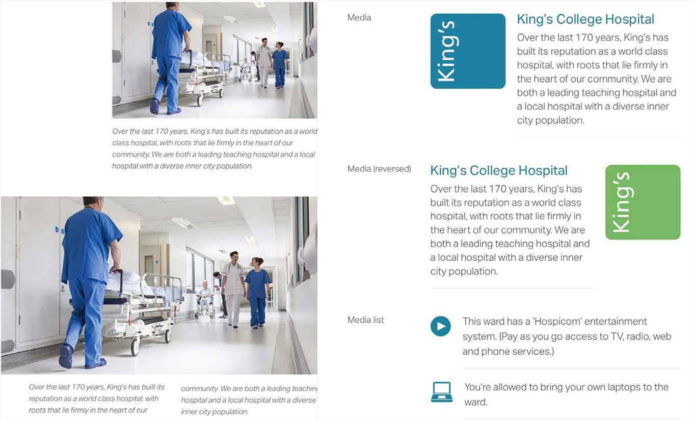

<b class="my_markdown">我们已经做了初步的风格指南，并可以在Github上访问。我们希望大家可以使用它，以及贡献想法来改进它。</b>

为了保证Web设计风格指南的易用性，我们把风格分为以下几种。

+ **品牌：** 根据屏幕断点设置不同的logo和字体。
+ **颜色：** 按钮、背景、边框和超链接的主要、次要、普通和重点的色调。
+ **版式：** 多种大小和粗细的主要和次要字体。

字体元素：h1到h6的标题层级；文本样式，如导语（大号）、二级（小号）、三级（更小号）和最小号；块级元素以及列表的样式。

+ **其他HTML元素：** 基本表格样式；各种类型、大小、风格和状态的表单输入框和按钮。
+ **常用组件类型：** 盒模型、博客、事件、新闻摘要与媒体组件。

我们这里只列出了启动项目所需的样式指南，如果有需要，你也可以轻松地为新组件添加样式。

## 只包括我们需要的

建立一个能用于多个项目的风格指南工具包，这通常很诱人，因为其中的许多组件（如手风琴效果、按钮或选项卡）可能会在某天派上用场。我们应该警惕：当我们把并不需要的组件增加进来时时，工具包很快就会变得臃肿。

目前有数十种模式库和框架可供我们选择，它们提供了大量的组件。例如，Bourbon，这个Sass库包含了Bitters和Refills这两个实用的HTML、CSS和JavaScript模式。这些组件对于实现快速原型设计非常有用，但在你把所有的这些都一股脑地推到Web设计风格指南里之前，请三思而行。每增加一个额外的组件，就意味着更复杂，以及需要维护更多的代码，所以设计风格指南里应该只包括你需要的那些，对于项目中并不需要的部分要毅然丢掉。

## 远离复杂的框架

像Bootstrap和Foundation这种前端框架，可能非常适合那些需要现成的栅格和主题化的系统的人。但开发者的需求与那些用HTML和CSS工作的设计师不同。Bootstrap和Foundation功能很强大，但是设计师根本不需要它们，哪怕只是一小部分。

我们将通过使用自己需要的部分，来建立Web设计风格指南。如果有需要，再在这个基础上进行扩展，而不是依靠框架。我们将从颜色开始，添加排版，然后是通用组件，包括字体。在将一切融合在一起创造组件之前，我们将包括常见的HTML元素。

我们必须时刻谨记让事情变得简单，记住我们正在做的是一个创造性的工具，而不是开发环境。这并不意味着我们不能在合适的时候，去充分使用开发者工具，所以，如果我们习惯于把样式表拆分为Sass片段，尽管放手去做吧。只要记住，最重要的是我们在做的设计，而不是工具的复杂性。

## 制作协作工具

并不是每个设计师都会编写代码，有些设计师专注于平面设计、排版和配色，而且做得很棒。尽管我觉得掌握HTML和CSS对于Web设计师非常重要，但设计师并不需要知道如何写HTML或CSS代码，哪怕一行。

也就是说，设计师应了解HTML和CSS这些广泛应用的现代Web设计工具。我认为，甚至让设计师参与设计这些工具更加重要。这样，他们就会知道如何使用这些工具，而不需要太多的技术知识。

制作工具，是一个让设计师和开发人员一起工作的好机会。毕竟，这些工具的目的是使协作更加容易。做得好的话，他们也可以减少摩擦、消除误解。

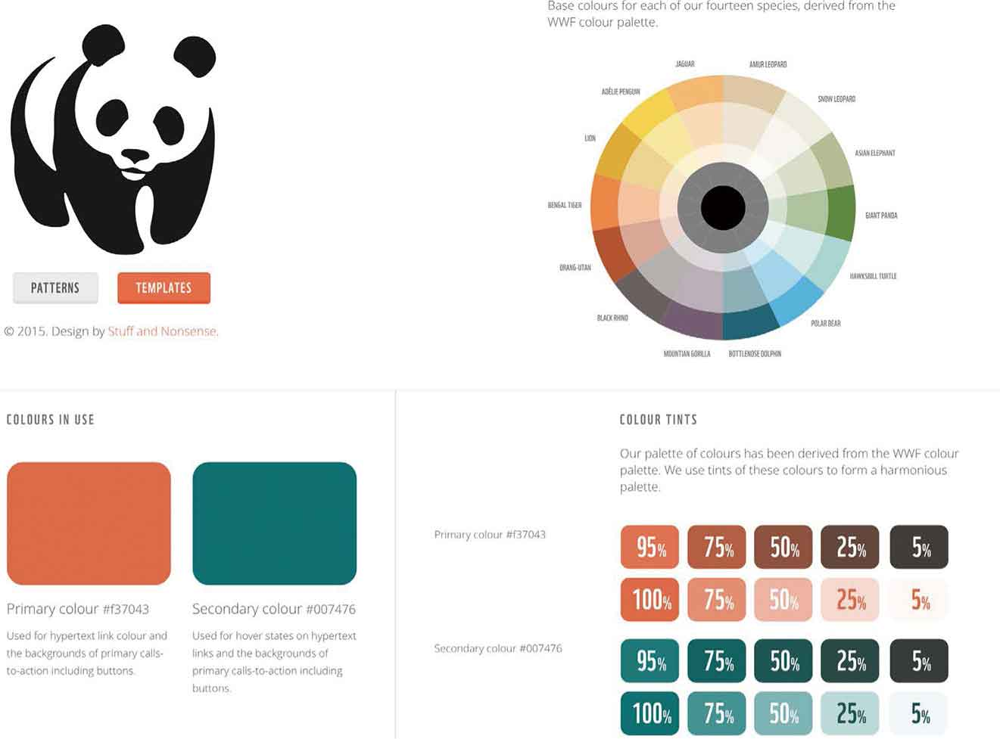

<b class="my_markdown">我们花时间打造的Web设计风格指南，不仅是一款实用的内部工具，还可以用于为客户做演示。</b>

我们发现，Web设计风格指南不仅仅在提高设计师和开发者协同工作方面发挥了作用，它还帮助我们与客户更紧密地合作。我们意识到，客户使用我们的工具包来向别人演示工作，所以我们在工具包中加入了客户的VI和专案信息，以令它更真实。此外，我们还是用真实内容片段代替了千篇一律的占位符。

由于Web设计风格指南简明易懂，客户也喜欢在公司中分享它。人们通常会在多种设备上来查看我们的工作成果，这意味着我们会得到更好的反馈。我相信，我们的工作会因此而改善。

## 打破传统

在过去的五年里，我们的工作、流程和工具都发生了翻天覆地的变化。我们已经学会了如何去应对响应式Web设计的需求，还学会了利用Web设计风格指南来设计网页风格和元素。在下一章，我们将从排版开始，构建一个新的网页设计风格指南。

