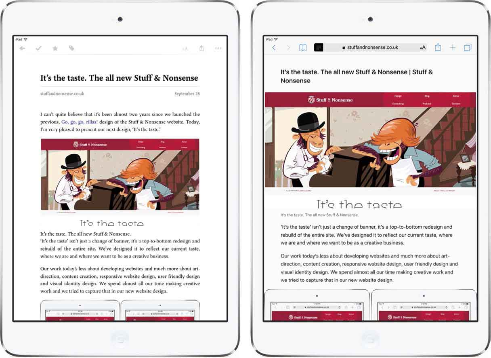
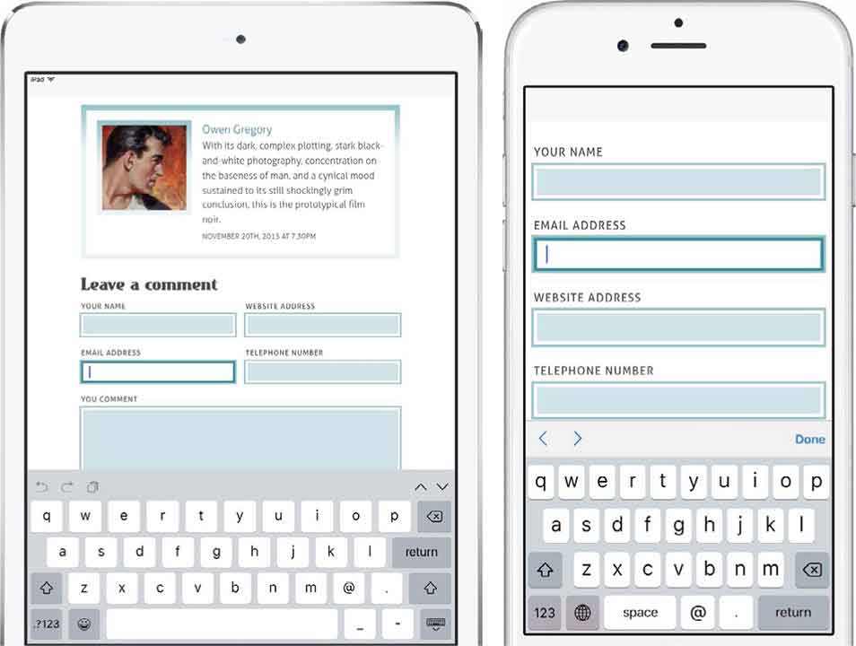
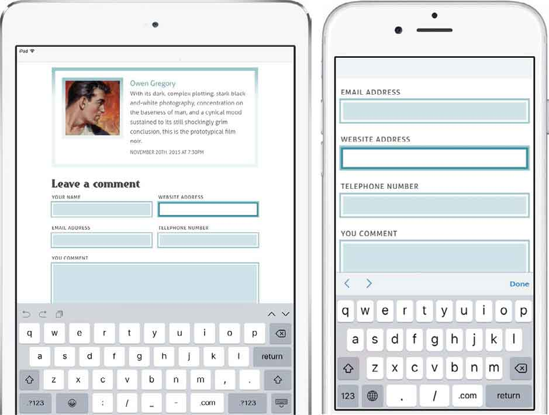
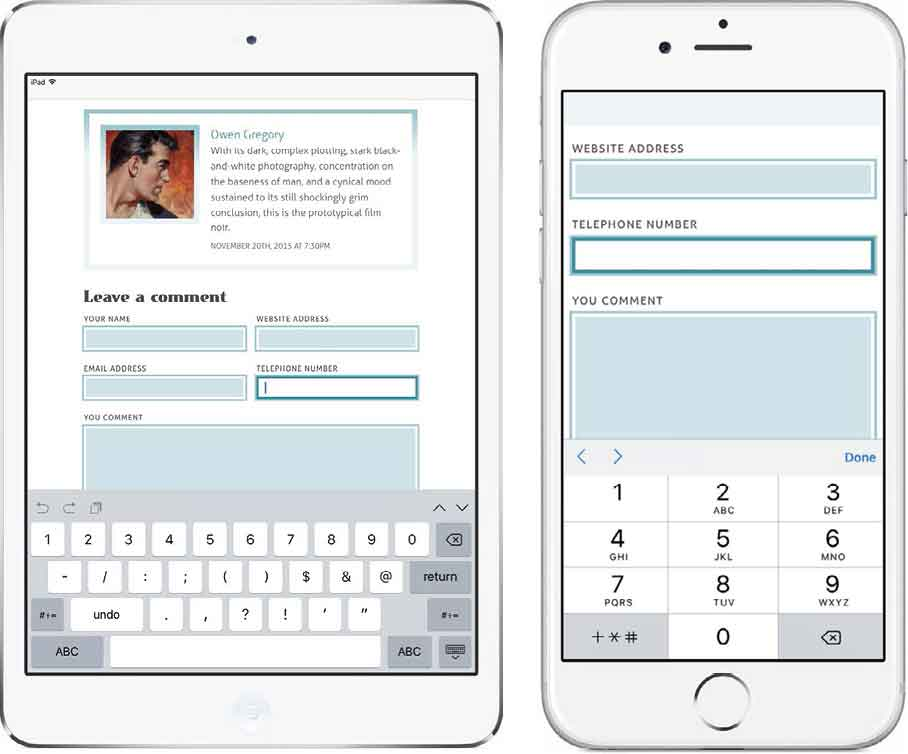
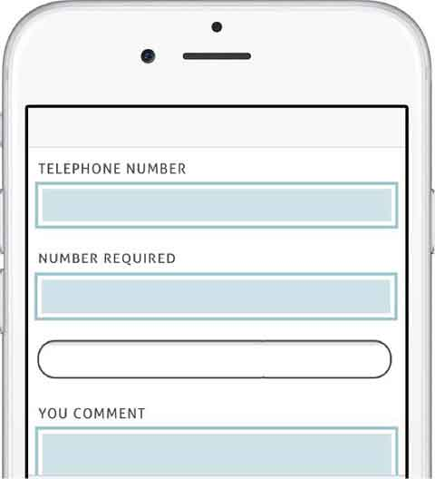
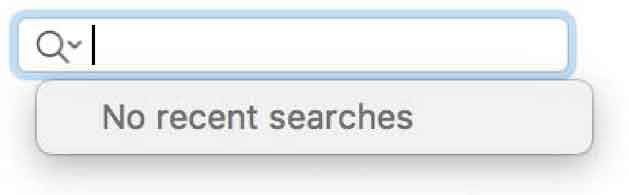
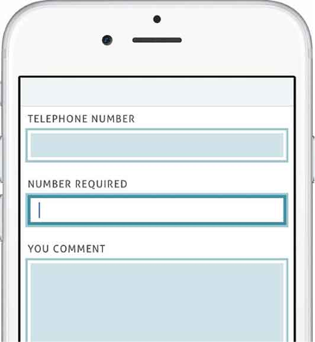
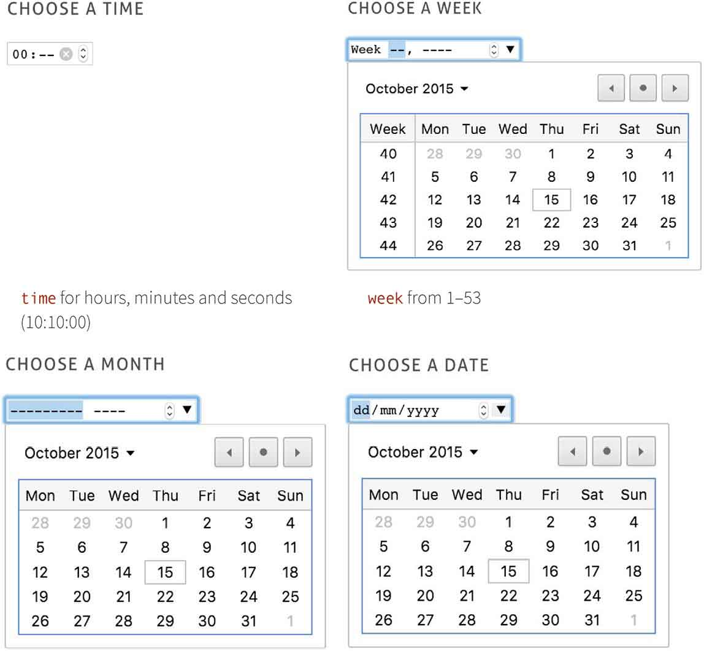
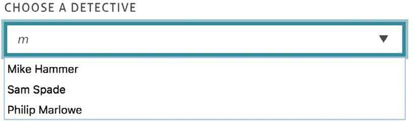

# 第7章　直击HTML

> 如果你多年来关注我的作品，你会发现我一直痴迷于HTML的命名规则和尽量少写 `class` 。编写最简洁的HTML是我的信仰。
> 过去，我尽可能使用较短的 `class` 命名，比如我会像下面这样，使用CSS的属性选择器来替代 `class` 的显示声明。
> 我使用子选择器（配合 `>` 使用）直接定义元素子集的样式，在这个例子中， `ul` 无序列表就是 `header` 元素的子集。
> 当然，我使用了很多相邻兄弟选择器。这种选择器可能已不再安全，它会把样式规则作用在近邻指定元素后方的元素上。比如下面的例子会对 `h1` 一级标题后的 `header` 元素增加一个蓝色的边框。
> 甚至有一次，我制作了一个完全没有包含任何类属性的页面，什么都没有。每每想到这里，就很同情那些不得不靠很多 `class` 来构建页面的开发人员。
> 在过去的几年里，我们公司参与了几个大项目，这让我意识到，良好的代码结构、HTML和CSS元素之间的关系，对于项目交付是很重要的。BEM语法或者命名公约的作用就在于此。
> 仔细看之前例子，你就会注意到，许多元素的属性值都有两条下划线或者俩个连字符。这些连字符和下划线是BEM系统的一部分，它们经常像下面这样使用。
> `.block` 用作高阶元素，包含了其他的内容和风格。例如在本书第一部分里，一个具有 `container` 的 `class` 里面将包含一些子元素，包含一些主内容和互补内容。这个 `container` 就是典型的BEM区块。
> `.block__element` 代表这个元素是我们的子容器。主内容和互补内容边界就是很好的例子。用两个带下划线的元素就能描述它们的边界： `.container__main` 和 `.container__complementary` 。子元素或者特定的段落（如 `.container__lead` ）也可包含标题（如 `.container__heading` ）。
> `.block--modifier` 描述了对一个区块元素的改变。在本书网站的主页中，主容器是一个浅色背景，然而，一些属性改变了，它就变成了深色背景。我们可以通过有两个连字符的属性来做到，比如： `container--dark`
> 使用这个约定可以帮助精确定义不同元素之间的关系。开发人员可以通过检查HTML结构或者通过阅读我的样式表来理解。 `.container__main` 显然是容器的子元素。容器标题就是 `container__heading` 。开发人员不需要理解 `.container__dark` 的目的，因为BEM语法告诉他们，这是 `.container` 的一个标准替代。
> 使用BEM已经改变了我的工作，尽管我仍然追求简洁的HTML代码，但我可以为此牺牲一部分严谨的代码风格。

## 向BEM转换

每天早晨，我都例行公事般地喝咖啡、收邮件和刷Twitter。我在Instagram上浏览照片，查看屏幕截图，然后上传到Dribbble。我还使用DiggReader来阅读RSS订阅，然后在Swarm上看看附近的小伙伴。这些站点都与传统意义上的网站不同，它们更像是桌面软件，而不是Web应用。

Web应用已经变得越来越强大和复杂，但是标记语言与早期相比没什么变化。HTML以及后来更严格的XML、XHTML，这些是用来构建网页的工具，而不是构建应用的工具。所以HTML5应运而生——我们先来介绍一点历史知识。

在HTML4.0发布之后，W3C关闭了HTML工作组。HTML结束了。他们认为未来是属于XML的，而不是HTML。在2004年的时候，W3C举办了一场研讨会，几个浏览器大厂都参加了。他们考虑设计一款文档语言用来开发Web应用。

```html
a[title="Get Hardboiled"] { 
border-bottom : 5px solid #ebf4f6; }
```

Mozilla和Opera给出了自己的建议，但是W3C忽略了他们……

目前W3C不打算为HTML和CSS的Web应用投入任何资源。

```html
header > ul { 
list-style-type : none; 
display : flex; }
```

但在真实世界中，浏览器厂商才有决定权，而不是W3C这样的标准组织。因此，当W3C拒绝了厂商提出的建议后，这些厂商自己组建了一个WHATWG工作组。这是一个松散、非官方且开放的协作式工作组，其成员包括苹果、Google、Mozilla和Opera。微软最初没有加入这个组织。WHATWG称其规范为WebApplications1.0。

与此同时，W3C的工作也在继续，他们把重心放在了文档语言XHTML2上面。虽然他们雄心勃勃，然而没有这些浏览器大厂的支持，他们的命运是注定的。正如MarkPilgrim所说“赢家是顺应潮流的人。”

```html
h1 + header { 
border-bottom : 5px solid #ebf4f6; }
```

在Web标准的制定上，浏览器厂商握有重要的牌。各厂商都在不遗余力地支持HTML5，快速开发制定规范，结果呢？HTML不仅被广泛采用，而且成为了标准，即使W3C到2022年也不认可它。

我们是要等到那时才能使用HTML5？幸好我们没那么做，如果选择了等待，那我们就创造不出令人激动的网站和应用了。

有人肯定会问“如果规范变了，我是不是还得修改我的HTML？”是的。无论怎样我们都要改变。

### 区块、元素、装饰器

HTML不会冰封，改写HTML5标记是其进化过程中的一部分。

HTML5建立在已有的标记之上，它不是一门新语言，而是在原有的基础之上加了一些强大的特性。学习HTML5不是很难，我们现在就开始吧。

## 简述

从最简单的开始吧。首先用简短的HTML写一个文档类型的声明。

```html
<!DOCTYPE html>
```

没有版本号、没有语言、没有URI，只是一个普通的HTML。

文档类型doctype是不区分大小写的，所以也可以写为： `<!doctypehtml>` 、 `<!DOCTYPEhtml>` 或者 `<!DoctypeHTML>` 。

你知道吗，最新版本的HTML甚至不需要写doctype，你甚至可以不声明它，页面仍然有效。但不建议这样做。

不仅doctype变短了，字符编码也变短了。下面是一个写在HTML里面的meta元素。

```html
<meta charset="UTF-8">
```

我们不需要指定每一个link上面的每个stylesheet值，我们可以简写成这样。

```html
<link rel="stylesheet" href="Hardboiled.css">
```

因为浏览器不需要知道，我们不必要包含 `text/javascript` ，我们可以简写成这样。

```html
<script src="modernizr.js"></script>
```

HTML不计较我们怎么写标记。是否大小写，是否大小写混用，是否忘记闭合标签，HTML都不介意。浏览器也不介意，所以按照自己的喜好来写吧。

## HTML中的语义元素

HTML5引入了一组新的元素，提高了页面的构建能力。你的文档可能仍然充满了 `div` ——HTML4.01规范中描述其为“附加结构机制”——对相关内容进行语义分组。

```html
<div class="branding"> […] </div> 
<div class="nav"> […] </div> 
<div class="content"> 
   <div class="content__main"> […] </div> 
   <div class="content__sub"> […] </div> 
</div> 
<div class="footer"> […] </div>
```

以上标签中的任何一个属性语义都是比较隐晦的，也不是机器可读的。在实践中，爬虫会认为 `you-dumb-mug` 和 `content__main` 毫无区别。

将来，添加 `id` 和 `class` 属性将只是简单地描述可视化布局，而不会承担语义化的任务。

我们可以替换一些语义更精确的结构元素来帮助减少对可视化的依赖。结果是，我们的可视化布局将会变得更简单。

2005年，Google调查了30亿的网页，从中找出设计师最常用的 `id` 和 `class` 属性。这些发现后来成为了HTML5的基本元素。

+ `section`
+ `article`
+ `aside`
+ `header`
+ `footer`
+ `nav`

这个列表并不全面，因为本书并不是一本HTML参考书。参考书我推荐Jeremy Keith的《HTML5+CSS3网页设计入门必读》。

## section

挑选一个典型的Web页面的结构，我们就会发现 `div` 元素。这些元素组织起相关内容，帮助我们建立CSS布局。我们看一下一个老手构建的页面。

```html
<div class="banner"> […] </div> 
<div class="navigation"> […] </div> 
<div class="content"> 
   <div class="content__uk"> […] </div> 
   <div class="content__usa"> […] </div> 
   <div class="content__world"> […] </div> 
</div> 
<div class="footer"> […] </div>
```

这样垒代码是非常有效的。然而，虽然我们能理解每个 `div` 代表了页面上的一小块，浏览器却无法将它们和任何匿名块级元素区分开。

相反， `section` 元素将内容组织到精确的语义块而不是通用容器中。把它们当做文档中独立且清晰存在的一部分。在下一个例子中， `section` 将包含不同国家地区的新闻报道，每一篇报道与国家地区都是相关的。请注意，每一个部分都是独立的，所以我们将在每个部分中加入描述性标题。

如果有必要，我们可以添加 `id` 属性，以便通过片段标识符寻址。

```html
http://hardboiledwebdesign.com#content__uk:
```

```html
<section id="content__uk"> 
   <h1>Stories from the UK</h1> 
</section> 
<section id="content__usa"> 
   <h1>Stories from the USA</h1> 
</section> 
<section id="content__world"> 
   <h1>Stories from around the world</h1> 
</section>
```

让我们继续增加一些文章来构建文档。

## article

当我们为博客、在线杂志或新闻网站写稿时，我们就是在发布文章。在HTML中，每篇文章都是一个独立的故事，就算没有网页中的上下文，它也应该能被人们理解。这听起来类似于 `section` ，但有很大的差别。 `article` 代表了一个故事，可以独立存在，而 `section` 是页面中完整的一部分，它包含多个相关文章。

检查 `article` 标记是否运用得当的方法是：看其内容本身是否有意义。例如，将之导入iPad的Pocket应用里，看它是否还具备完整的意义。

如果你仍然对 `section` 和 `article` 的区别有所困惑，Doctor Bruce Lawson的文章“HTML5 articles and sections: what’s the difference?”可以供你参考。


<center class="my_markdown"><b class="my_markdown">如果你有iPad，使用Pocket是阅读文章的好方式。在Pocket里，内容是独立的，并且没有广告和导航等。Mac OSX和iOS中的Safari也提供类似的功能。</b></center>

让我们给本书归档页的大纲的每个部分各自添加一段文章。

```html
<section id="content__uk"> 
   <h1>Stories from the UK</h1> 
   <article> […] </article> 
   <article> […] </article> 
   <article> […] </article> 
</section> 
<section id="content__usa"> 
   <h1>Stories from the USA</h1> 
   <article> […] </article> 
   <article> […] </article> 
   <article> […] </article> 
</section> 
<section id="content__world"> 
   <h1>Stories from around the world</h1> 
   <article> […] </article> 
   <article> […] </article> 
   <article> […] </article> 
</section>
```

`section` 可以包含 `article` ， `article` 也可以包含 `section` 。你想轻轻松松地学习新的HTML元素？不可能吧？

我来帮你梳理一下对 `article` 和 `section` 的困惑，那不是你的问题，在以下例子中， `article` 元素中分为三个部分，每个都对应一个知名作家。

```html
<article> 
   <section id="chandler">[…]</section> 
   <section id="hammett">[…]</section> 
   <section id="spillane">[…]</section> 
</article>
```

## header

页面的标志区域或报头可以用 `header` 元素来描述，通常这些标题放在页面的顶端，当然也可以放在底部或者其他地方。我们用一个更合适的 `header` 元素来替换经典的banner。

```html
<header> 
   <h1>It's Hardboiled</h1> 
</header>
```

我们可以在 `section` 或者 `article` 里面添加 `header` 元素，而且在页面里面可以有多个 `header` 。这意味着我们有多种使用 `header` 的方式：作为整页的标志；作为介绍 `section` 和 `article` 区域的引言，或者二者混合使用。

下面我们试试在 `article` 中加上“本书作者”的 `header` 描述。

```html
<article> 
   <header> 
      <h1>Hardboiled authors</h1> 
   </header> 
   <section id="chandler"> 
      <header> 
            <h1>Raymond Chandler</h1> 
      </header> 
   </section> 
      <section id="dashiell-hammett"> 
            <header> 
                  <h1>Dashiell Hammett</h1> 
            </header> 
      </section> 
      <section id="mickey-spillane"> 
            <header> 
                  <h1>Mickey Spillane</h1> 
            </header> 
      </section> 
</article>
```

这个规范将 `header` 元素描述成“导航辅助或一组引导的容器”。让我们可以自由地包含搜索表单、时间日历组件。页面或者段落都将以此开始。

## footer

我在2004年对一些元素的使用情况进行过调研，Google也做过类似的调研，我们都发现：大多数设计师都会标注页脚，通常包含联系人和版权信息——这就是页脚。

在典型的HTML4.01和XHTML1.0文档中，页脚通常会是一个 `div` 并带有一个值为 `footer` 的 `class` 属性。

```html
<div class="footer"> […] </div>
```

我们甚至可以使用 `footer` 元素来替换蹩脚的 `div` 布局。

```html
<footer> 
   <h3>It's Hardboiled</h3> 
   <small>Creative Commons Attribution-ShareAlike 4.0
International License.</small> 
</footer>
```

虽然它的名字叫做页脚，但我们没必要将它放在页面、 `section` 或者 `article` 的底部。事实上，在任何一个容器元素中都可以放一个。就像 `header` 一样，我们可以使用 `footer` 来定义任何 `section` 或 `article` 中的meta信息。在 `article` 内部，页脚应该包含作者信息或者发布时间。而 `section` 的页脚应该包含文章的更新时间或新文章的添加时间等相关信息。

```html
<section id="spillane"> 
   <header> 
      <h1>Mickey Spillane</h1> 
   </header> 
   <footer> 
      <small>Published by Andy Clarke on 20th Nov. 2015</small> 
   </footer> 
</section>
```

## aside

Mickey Spillane是一名多产的小说家，如果我们要写一篇关于他工作生活的传记，我们应该在传记里包含相关的信息，比如他的小说《My Gun Is Quick》。反之，如果我们要写这本书的书评，那我们应该捎带上作者简介。HTML5使用  `aside`  来定义这种类似的关系。

我们可以用 `aside` 来描述和文章相关，但对于理解文章又不是非常重要的内容。下面让我们写一段Mickey Spillane的简介，其中 `header` 包含了标题， `footer` 包含作者名字，以及 `article` 的发布日期。

```html
<article> 
   <header> 
      <h1>Mickey Spillane</h1> 
   </header> 
   <footer> 
      <small>Published by Andy Clarke on 20th Nov. 2015</small> 
   </footer> 
   <p>Frank Morrison Spillane, better known as Mickey Spillane,
was an author of crime novels…</p> 
</article>
```

像我喝的咖啡一样顺滑流畅，现在我们来添加一些 `aside` ，来包含《My Gun Is Quick》的信息。

```html
<article> 
   <header> 
      <h1>Mickey Spillane</h1> 
    </header> 
   <footer> 
      <small>Published by Andy Clarke on 20th Nov. 2015</small> 
   </footer> 
    <p>Frank Morrison Spillane, better known as Mickey Spillane,
was an author of crime novels…</p> 
    <aside> 
      <h2>My Gun Is Quick</h2> 
      <p>Mickey Spillane's second novel featuring private
investigator Mike Hammer.</p> 
    </aside> 
</article>
```

也许我们的页面包含其他小说作家的信息。对于我们的作者简介来说，这个容器内容不是特别相关，所以我们应该把 `aside` 置于文章之外。在这种情况下，我们也应该在 `section` 元素包裹 `article` 和 `aside` 、使其申明这两个是相关的。

```html
<section> 
   <article> 
      <header> 
         <h1>Mickey Spillane</h1> 
      </header> 
      <footer> 
         <small>Published by Andy Clarkeon 20th Nov. 2015</small> 
      </footer> 
      <p>Frank Morrison Spillane,better known as Mickey Spillane, was an author of crime novels...</p> 
      <aside> 
      <h2>My Gun Is Quick</h2> 
      <p>Mickey Spillane's second novel featuring private
investigator Mike Hammer.</p> 
      </aside> 
    </article> 
    <aside> 
       <h2>Other crime fiction writers</h2> 
       <ul> 
          <li>Raymond Chandler</li> 
          <li>Dashiell Hammett</li> 
          <li>Jonathan Latimer</li> 
       </ul> 
    </aside> 
</section>
```

## nav

有了导航，浏览网站变得更加简单。当我们构建页面时，导航通常看起来是这样的。

```html
<div class="nav—-main"> 
   <ul> 
      <li><a href="about.html">What's Hardboiled?</a></li> 
      <li><a href="archives.html">Archives</a></li> 
      <li><a href="authors.html">Hardboiled Authors</a></li> 
      <li><a href="store.html">Classic Hardboiled</a></li> 
   </ul> 
</div>
```

我们已经习惯了使用列表标记导航，但我们还使用列表标记其他事情。那么问题来了，浏览器如何区分不同的列表？

好在我们现在有了 `nav` 元素，来实现页面上的一个或多个“主要导航块”。不是所有的链接或者链接区块都是页面主导航，所以我们应该保留 `nav` 元素，以便帮助人们快速区分出哪里才是页面导航

导航可能会包含跳转最重要页面的链接列表，它可能在 `header` 中，可能在侧边栏，也可能在 `footer` 中。接下来，我们将使用充满语义的 `nav` 元素，取代以前的 `div` 布局。

```html
<nav> 
   <ul> 
      <li><a href="about.html">What's Hardboiled?</a></li> 
      <li><a href="archives.html">Archives</a></li> 
      <li><a href="authors.html">Hardboiled Authors</a></li> 
      <li><a href="store.html">Classic Hardboiled</a></li> 
   </ul> 
</nav>
```

当访客通过搜索来寻找内容时，我们在 `nav` 中添加一个搜索表单。如果我们包含跳转链接，这些也可以作为无障碍技术的主要导航区域。

## figure

我通常会在印刷品、图片、图表、简图中配上一些说明文字。与其纠结使用什么样的元素来做图注，不如直接使用 `figure` 和 `figcaption` 元素，就像下面这样。

```html
<figure> 
    
   <figcaption>I, The Jury by Mickey Spillane</figcaption> 
</figure>
```

当我们需要注释一组元素时，我们可以嵌套多个图片、图表示意图，然后用一个 `figcaption` 来标记。

```html
<figure> 
    
    
    
   <figcaption>Books by Mickey Spillane</figcaption> 
</figure>
```

## HTML5时间和日期

你可以想象，在HTML里写日期如此简单。

```html
<footer> 
   <small>Published by Andy Clarke on 06/05/2015</small> 
</footer>
```

但问题是，软件很难知道这串数字是一个日期。另一方面，人们对相同的数字可能会有不同的解读，如果你来自英国，这些数字代表2015年5月6日，但如果你生活在美国，你可能认为它表示6月5日，2015年。

为了解决这个问题， `time` 元素必须对人是可读的——不管是6 May 2015,还是May 6th, 2015——这些参数必须格式化。

```html
<time>May 6th 2015</time>
```

`time` 元素是由两个版本的日期或日期/时间属性构成的。首先是一个人类可读的、自然语言的日期；第二个是名为 `datetime` 的机器可读属性，它遵从ISO标准日期格式： `YYYY-MM-DDThh:mm:ss` 。年月日后跟着的是小时、分钟和秒（如果我们需要精确的话）。

```html
<time datetime="2015-05-06">May 6th 2015</time>
```

`time` 元素有一段曲折的历史。在2011年首次引入HTML5中的时候，它曾遭HTML规范的抛弃，被一个更通用、且在我看来缺乏语义的 `data` 元素替代。好在当年晚些时候 `time` 元素又被加入到规范中，并增加了一些有用的额外功能。比如此前的 `datetime` 格式要求精确，而新支持的ISO标准格式则允许使用模糊日期。

```html
<time datetime="2015"> means the year 2015 
<time datetime="2015-05"> means May 2015 
<time datetime="05-06">means 6th May (in any year) 
<time datetime="2015-W1"> means week 1 of 2015
```

当需要描述一个事件持续多长时间时，可以使用 `datetime` 属性和前缀 `P` 。添加后缀 `D` 表示天、 `H` 表示小时、 `M` 表示分钟、 `S` 表示秒。如果你想标记为了买火车票排了一天队的话，像下面这样写就好了。

```html
<time datetime="P 1 D">
```

下一个事件持续了1天6小时10分钟30秒。发现了吗？额外的 `T` （时间）前缀表示一个更为精确的时间。

```html
<time datetime="PT 1D 6H 10M 30S">
```

通过结合精确、结构化的日期格式，日期和时间得以借助自然语言来设定，同时实现了一个对于人类和机器都可读的通用格式。

## 表单元素

哪种网站或APP将由一两个表单构成？无论你喜不喜欢，如果网站中没有表单，那着实让人难以接受。HTML5引入十多个 `input` 类型和属性，这令实现复杂的控制和功能——如滑块、日期选择器和客户端验证——变得更加简单。这些元素包括 `email` 、 `url` 、 `tel` 和 `search` 。不要担心老旧的浏览器，因为当浏览器无法理解这些 `input` 类型的时候，会自动降级为文本框。

### 电子邮件 `email` 

很多场景下都需要填写电邮地址，比如联系人表单、评论表单、注册、登记表单等。选择 `email` 的 `input` 类型，来表述这些email地址。

现在你可以使用各种各样的有趣的功能，比如检查电邮地址的有效性，以及是否包含@符号等。在一个 `email` 类型输入框中输入时，Safari会自动调出虚拟键盘，@符号很直观地出现在键盘下方。


<center class="my_markdown"><b class="my_markdown">我们已经习惯了使用软键盘处理手头工作，如左图所示，iPad键盘已经包含了一个可以便捷输入email的设置键。</b></center>

```html
<input type="email">
```

### 网址 `url` 

当我们使用URL类型的输入框时——为了帮助用户专注和精准的输入网址地址——iOS软键盘会为此类型输入框提供斜杠/、句点以及.com这样的按键。

```html
<input type="url">
```


<center class="my_markdown"><b class="my_markdown">提升网站表单的体验，有助于让人们愿意完成输入。当使用 `url` 时，iPhone的键盘会自动在下方调取出.com按钮。</b></center>

### 电话 `tel` 

如果我们使用 `tel` 输入框，iOS会自动调出数字键盘。

```html
<input type="tel">
```


<center class="my_markdown"><b class="my_markdown">iOS做了很多细致且卓越的工作，以使键盘输入更加便捷。</b></center>

### 搜索 `search` 

如果网站内容太多，我们就得使用搜索框来找到所需的内容。刚好有一个输入框表单类型可以用于搜索。

```html
<input type="search">
```

在iOS系统的Safari浏览器上， `search` 输入框的边角更加圆润；而在Mac OS X系统的Safari浏览器上（在别的桌面浏览器上也同样）， `search` 和普通文本框的外观别无二致，直到我们与之交互。在Chrome、Safari和Opera这些浏览器上，搜索查询体验会更加便捷，它们会自动在搜索框内增加一个图标，当用户点击这个图标时，就会清除已经在搜索框内输入的内容。


通过添加一些小的额外属性，可以让你定制的输入框更有范儿。比如添加 `autosave` 属性，为其添加一个唯一值，在我们的例子中，我们写上“gethardboiled”，然后在Safari中奇迹出现了，搜索框中不仅会添加一个放大镜图标，而且在点击它的时候，会出现一个列表，其中是近期搜索过的关键词。无论页面是否刷新，这个列表都会保存。此外，可以使用 `results` 属性来控制记录多少个最近搜索的关键词，在下例中，我们的表单将保存最近搜索的10个关键词。

```html
<input type="search" results="10" autosave="getHardboiled">
```

`search` 输入框在样式处理上简直是臭名昭著，而其结果列表的样式在不同浏览器下也是千差万别。所以我的建议是，把这些交给浏览器来处理，不必太过渲染输入框。


### 数字 `number` 

如果我们使用 `number` 输入类型，iOS会自动调出一个只有数字的键盘。但在大多数桌面浏览器中，更有趣的事情发生了。Chrome，Firefox、Opera和Safari，在 `number` 输入框右侧增加了输入箭头或旋钮。按下这些箭头，或使用键盘上的方向键，或者使用鼠标滚轮向上或向下滚动，即可调整输入的号码。

```html
<input type="number" step="10">
```

如果你并不需要这些箭头，你可以在Chrome、Firefox、Opera以及Safari中，使用一段非标准，但是却非常好用的CSS代码。

```html
input[type=number]::-webkit-inner-spin-button, 
input[type=number]::-webkit-outer-spin-button { 
-webkit-appearance: none; 
-moz-appearance : textfield; 
margin: 0; }
```

这样一来， `number` 的功能保持不变，人们仍然可以使用键盘的方向键或鼠标滚轮来调整数字。


### 本地日期选择器Native date picker

当人们在航空公司、租车服务或酒店网站上选择日期的时候，总是要耗费极大的精力和时间。HTML的原生日期选择器将会让我们不再那么痛苦。


### 占位符文本 `placeholder` 

表单标签总会给人带来各种麻烦。我总想为没有标签文本的表单元素制作一个可视化提示。 `placeholder` 属性，会将提示信息添加到任何为空且失去焦点的 `input` 中；而不支持这个属性的浏览器会忽略这个提示文本。

```html
<input type="search" title="Search this site" 
placeholder="Search this site">
```

`label` 并不是必需的，当表单内容很简单的时候，它可以被标题或者明确的标题按钮所替代。

### 自动焦点 `autofocus` 

像大多数人一样，当我使用Google搜索的时候，光标会自动聚焦在搜索框内；而与很多普通人不同，作为设计师，我会注意这些小的体验改进。在过去，我们必须使用脚本才能达到这样的效果，但现在完全可以使用 `autofocus` 属性，来以原生的方式让浏览器帮助我们实现。不支持 `autofocus` 属性的浏览器将会自动忽略它：

```html
<input type="search" autofocus>
```

### 自动完成 `autocomplete` 

使用 `autocomplete` 属性，可以以原生的方式实现自动补充的效果。

```html
<input type="text" name="name" autocomplete="on">
```

使用 `autocomplete` 的时候需要注意安全性，尤其在某些场景下最好不要使用，比如涉及信用卡或其他财务信息的时候。

```html
<input type="text" name="credit-card" autocomplete="off">
```

## 列表 `list` 和数据列表 `datalist` 

通常，帮助访客完成表单输入的最好方式，就是让他们回答问题、给出建议，或做出选择。我们来看下 `list` 属性，它包含一个 `datalist` ，在一个文本输入框上复合了一个 `select` 框，这样可以方便快捷地选择输入内容。

想象一下，当我们在表单中问访客最喜欢的侦探是谁时，为了帮助用户快速做出选择，可以在 `datalist` 里提供一些侦探的名字，然后给一个 `text` 类型的 `input` 添加一个 `list` 属性，并通过给紧邻的 `datalist` 设置相同的 `id` ，将二者联动起来。。

```html
<input type="text" list="detectives"> 
<datalist id="detectives"> 
   <option value="Mike Hammer">Mike Hammer</option> 
   <option value="Sam Spade">Sam Spade</option> 
   <option value="Philip Marlowe">Philip Marlowe</option> 
</datalist>
```


<center class="my_markdown"><b class="my_markdown">访客既可以自己输入，也可以从 `datalist` 中选择可用的选项。如果浏览器不支持此属性，则忽略它们，只显示出普通文本输入框。</b></center>

### 最小 `min` 和最大 `max` 

在某些电商网站，购物数量被设定为一个最小值；而有的则需要设置为更大的值。添加 `min` 和 `max` 属性，就可以对数据的上下限进行控制。

```html
<input type="number" id="book" min="1"> 
<input type="number" id="course" max="6">
```

值得注意的是，不管在哪个浏览器中， `min` 和 `max` 属性不能和 `required` 属性同时使用。事实上，我们不能把 `required` 属性和数字输入框一起用。

### 客户端验证

编写表单验证脚本是我最不喜欢的工作之一。如果可能，我宁可花钱雇人干这个脏活儿。虽然JavaScript库让这样的工作轻松了一些，但我敢打赌，即使最铁杆的JavaScript程序员，也不喜欢去开发这些脚本。如果浏览器能处理表单验证岂不更好。这不仅让开发者更轻松，还可以让那些绕过表单里的通过JS验证输入是否合法的人无从下手（因单纯为使用JS验证输入是否合法，是可以被用户人为绕过的，比如禁止掉浏览器的JS功能）。要绕过JavaScript验证，其实只需关闭浏览器的JavaScript即可。好消息是，在新的HTML标准中，已经包括了这些看起来很简单的特性，使客户端表单验证成为轻而易举之事。

### 必填 `required` 

HTML5添加 `required` 属性后，将阻止表单提交，直到所有的属性都已正确输入。

```html
<input type="email" required>
```

### 无需验证 `novalidate` 

如果你不喜欢添加浏览器验证，简单地加一个 `novalidate` 标签就可以了。

```html
<form action="search" method="get" novalidate>
```

## 打破传统

HTML5把标记带入了Web应用的时代，而实际情况远比本书所介绍的更多。例如，可以使用很多方式脱离浏览器插件来支持播放音视频文件，甚至可以离线交互等。你能走多远，取决于你的工作和人们的需求。但有一点是很明确的，HTML就在那里，如果我们想在互联网浪潮中保持领先，那就应该尽可能地利用这一开放的新技术。


