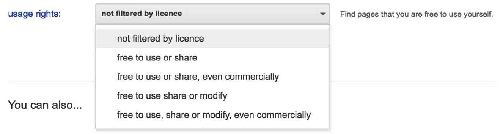
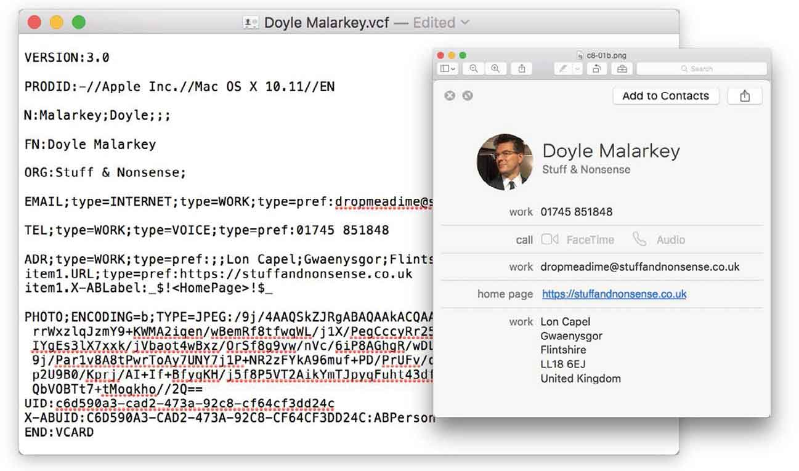

# 第8章　语义化与微格式

> 经典微格式和微格式2之间有一个明显的变化就是， 新版本有个帮助添加样式的前缀，五个前缀如下。
> `h-*`  根元素的标识，用来表示某个元素是微格式，如 `h-card` 。
> `dt-*`  把一个元素解释成日期或时间。
> `e-*`  把HTML包括进一个元素。
> `p-*`  表示一个纯文本元素，如 `<span class="p-name">Andy Clarke </span>` 。
> `u-*`  表示一个URL元素，包括电子邮件或者网站。
> 像BEM这样的属性命名系统，用来帮助在HTML元素之间建立沟通。开发者Harry Roberts一直在寻求将这些原则进行扩展，包括用来描述属性作用的命名空间，如组件、对象、工具和主题。遗憾的是，它的 `u-utility` 值和微格式2的URL值冲突了。

> 微格式2比之前的版本更简单，因为它的一些属性附带了其他的的含义。例如，我们可以使用 `p-name` 来标记某人的完整名字，使用 `u-url` 来标记他们的网站地址。
> 然而，微格式2可以去除额外的元素，让整个模式更简单、代码更干净。我们可以直接在链接上使用 `h-card` ，并删除 `p-name` 和 `u-url` ，因为 `h-card` 里已经附带了这些属性。

## 带前缀的class属性

## 在微格式2中隐含属性

如果你关心每个HTML元素和属性的制订，并且你想让它们更加语义化，那么我希望微格式2能使你兴奋起来。基于HTML模式，然后提高标记特定类型的信息的语义，比如联系人详情、事件、评论和内容，使它们可以被机器解析，同时对人类也是可读的，这是我们正在持续努力的方向。我认为Brian Suda对于微格式的解释是最经典的：

“微格式就是Web页面里所有代表语义信息的编码，这种利用信息的方式可能是厂商从来没有设想过的。”

```html
<div class="h-card"> 
   <a href="http://stuffandnonsense.co.uk" class="p-name u-url"> 
      Andy Clarke</a> 
</div>
```

微格式是在现有标准（在元素上添加属性来描述内容）上发展来的。所以我们唯一需要知道的，就是如何开始使用它们编写HTML，微格式2也是如此。事实上，它们非常简单，和经典的微格式相比，它们只需要更少的额外HTML元素，因为它们本身就意味着某种特定内容。但是，究竟为什么经典微格式以及微格式2更是如此厉害呢？

在任何网站上查看源代码，我们都会看到大量的 `id` 和 `class` ，它们被用来将CSS样式绑定到元素上。我希望你选择的 `id` 或 `class` 值能够附带描述内容，例如使用像 `tagline` 这样语义化的值，而不是使用像 `bold-heading` 这种描述表现的值。

```html
<a href=http://stuffandnonsense.co.uk class="h-card">Andy Clarke</a>
```

即便如此，通常我们选择的值对内容和访客都没有真正的价值，这些稀奇古怪的名字和命名约定会花费我们大量的时间，并且时间一长就会变得难以维护。

当遵循微格式的模式时，我们可以很大程度上给 `id` 和 `class` 属性赋一个有具体意义的值。微格式2带来了更多的 `class` 属性，因此使用微格式2将有助于使你的HTML更精简、更合理，减少设计或布局。简而言之，就是更加犀利，我们接下来会分析对比一些最常用的经典微格式和微格式2。

## 基于链接的微格式

## 混乱的命名空间

如果你对在HTML文档的头部 `head` 引用外部链接很熟悉，那么你可以看出这是一个外链的CSS样式表。

```html
<link rel="stylesheet" href="screen.css" media="screen">
```

这个属性定义了HTML文档和链接目标之间的关系，关联样式表是其中之一。我们采用类似的方法来连接RSS提要。

```html
<link rel="alternate" type="application/rss+xml" href="articles.rss">
```

我们还可以为关联到收藏或者关联到苹果图标 `apple-touch-icon` 做个定义，这是专门为iOS设备设计的：

```html
<link rel="shortcut icon" href="favicon.jpg" type="image/gif"> 
<link rel="shortcut icon" href="favicon.png" type="image/png"> 
<link rel="apple-touch-icon" href="ios.png">
```

所有基于链接的微格式，都是用这种方式来描述文档之间的关系。

## 内容版权

最常见的基于链接的微格式的用途之一，就是链接到版权。当使用 `rel-licence` 时，目的十分明确，就是链接一个许可证。

```html
<a href="http://creativecommons.org/licenses/by-sa/4.0/" rel="license"> 
Creative Commons Attribution-ShareAlike 4.0 International License</a>
```

你可能会认为任何人都会使用微格式链接到版权，没错，毕竟微格式的原则之一就是降低使用门槛。虽然门槛很低，但是它带来的好处却是巨大的，尤其是随着谷歌在高级搜索里添加了一个使用权选项。


<center class="my_markdown"><b class="my_markdown">想要搜索可以自由使用，共享和修改，甚至商业化的东西？可以使用隐藏在谷歌高级搜索选项里的使用权过滤器。</b></center>

那么作为工程师的我们，该如何设计 `rel-license` ? 也许我们想要通过添加一个小图标来让许可链接和页面上的其他链接看起来不同。我们可以为这个链接添加个 `class` :

```html
<a href="http://creativecommons.org/licenses/by-sa/4.0/" 
rel="license" class="license">Creative Commons Attribution-
ShareAlike 4.0 International License</a>
```

其实我们并不需要这个额外的 `class` ，因为我们可以通过CSS属性选择器来达到同样的效果。

```html
a[rel="license"] { 
padding-left : 20px; 
background : transparent url(cc.png) no-repeat 0 0; }
```

通过使用微格式，可以使我们的HTML更加犀利，而且这种方式能为我们及用户提供更多的价值。

## HTML链接关系

HTML5引入了更多的链接关系，使我们能够定义指向到其他页面的链接的意义。这里罗列一些对我最有用的。

| `author` | 内容的作者，例如在同一个站点里，作者的介绍，或者在其他地方放置的作者联系信息 |
| :-----  | :-----  | :-----  | :-----  |
| `bookmark` | 一个完整的页面或section元素 |
| `next` | 当文档是系列中的一部分时，表示下一个文档的链接 |
| `nofollow` | Google的反垃圾评论中首次使用该属性，这个属性用于告诉搜索引擎不要追踪特定的网页链接 |
| `previous` | 当文档是系列中的一部分时，表示前一个文档的链接 |
| `search` | 专门的搜索页面或搜索界面 |

尽管微格式和无障碍提供了一些重叠的HTML链接关系，但这并不影响你使用它们，因为它们拥有更深层的语义，并且为我们提供了使用CSS样式的钩子。

## h-card: 人物、地点和组织

当我们在网上找到一个人的联系方式，可以通过双击将它添加到地址簿，是不是很酷？你猜怎么着？如果他们使用 `h-card` 格式发布这些信息，我们就可以做到。仔细阅读以下这段：

“Andy Clarke（Malarkey）是一位想要成为侦探的英国Web设计师，他经营着一家叫Stuff & Nonsense的小公司，平时会写写书，并且会在一些会议上分享经验。如果你想聘请他，可以给dropadime@hardboiledWebdesign.com发电子邮件，或者致电01745 851 848找到他。”

这段描述包含了各种信息，你可以很容易地发现我的全名、小名、公司、电子邮件地址和电话号码。

除了意识到这段文字本身，我们的大脑还可以辨别出这些信息的存在。到目前为止，机器还做不到这一点。

标记语言词汇量有限，不能充分表达所有内容的含义。标题和段落、章节和文章，这些都没有问题。但是该如何描述一个人的信息呢？对于一个人或公司的联系信息的缺乏对应的元素标记， `h-card` 能补充这种缺失。


<center class="my_markdown"><b class="my_markdown">苹果公司的联系人应用程序里的名片信息有一个结构化的数据。</b></center>

## 结构化数据标记

在Mac和iOS设备上的联系人管理应用程序中，有一个使用开放标准的电子名片，在里面可以看到熟悉的结构化信息。你可以使用文本编辑器打开电子名片查看其中的细节，包括名字（FN格式名称）、公司（ORG）、地址（ADR）、电话（TEL）、电子邮件地址（EMAIL）,还有一些其他信息（中文版与英文版有所不同）。

学习 `h-card` 最好的方式就是制作一张名片，你可以去使用微格式的网站看看，再对比其他大量使用 `div` 和 `span` 的网站，就会理解什么是超越平凡的硬派做法。

```html
<div class="h-card"> 
   <span class="p-name">Andy Clarke</span> 
   <a class="u-email" href="mailto:dropadime@HardboiledWebdesign.com"> 
    dropadime@HardboiledWebdesign.com</a> 
   <span class="p-country-name">United Kingdom</span> 
   <span class="p-tel">01745 851848</span> 
</div>
```

第一眼看上去，这些属性似乎有点使用过度了。但是这些属性却很重要，因为它们使内容更容易被其他应用程序提取和使用。记住这一点，然后我们来复习前面的内容。我们将从应用的顶层元素开始添加值为 `h-card` 的 `class` 属性，它使其他细节信息更有意义，因为它是这种格式的根元素。

```html
<p class="h-card"><span class="p-name">Andy Clarke</span> (<span 
class="p-Nickname">Malarkey</span>) is a <span class="p-job-title">
Web designer</a> and wannabe detective based in the <span 
class="p-country-name">United Kingdom</span>. He runs a small
agency called <span class="p-org">Stuff & Nonsense</span>, writes
books and speaks at conferences. If you&#8217;d like to hire Andy,
you can e-mail him at <a class="u-email" href="mailto:dropadime@ 
HardboiledWebdesign.com">dropadime@HardboiledWebdesign.com</a> or
call him on <span class="p-tel">01745 851848</span>.</p>
```

还记得HTML文档的根元素是 `html` 吗？微格式也需要自己的根元素，来告诉应用程序这是一个微格式。对于 `h-card` 来说，这真的如同添加一个值为 `h-card` 的 `class` 一样简单。

## 名字

现在我们深入的看一下组成 `h-card` 的各个值，以及它们是怎么构建的。我先从构建人名的两种方法开始介绍。

一个完整的、格式化的人或者公司名称。

一个结构化的名字，包含前缀、第一个名字、中间名、姓氏和后缀。

## 格式化的名字

当我们要把一个人的名字呈现在名片或者办公室的门上时，我们会用到这些值，包括前缀、第一个名字、中间名、姓氏和后缀。要做到这一点，我们只需要用一个 `p-name` 就可以完成。

```html
<span class="p-name">Nick Jefferies</span>
```

## 结构化的名字

当我们构造一个名字时，会把名字分成多个部分，第一个是名字Nick，第二个是他的姓氏Jefferies。

```html
<span class="p-given-name">Nick</span> 
<span class="p-family-name">Jefferies</span>
```

如果Nick Jefferies的名片上有一个尊称的前缀（先生、女士、长官、教授等），甚至是他的绰号（Sawbuck），我们也可以包括进来。

```html
<span class="p-honorific-prefix">Mr.</span> 
<span class="p-Nickname">Sawbuck</span>
```

Mr Nick （Sawbuck）Jefferies的结构化名称里的所有单独的组件，现在看起来应该是这样的。

```html
<span class="p-honorific-prefix">Mr.</span> 
<span class="p-given-name">Nick</span> 
<span class="p-Nickname">Sawbuck</span> 
<span class="p-family-name">Jefferies</span>
```

然后我们所要做的就是把Nick的结构化名字放在一个最合适的HTML根元素里。一般情况下是列表、段落、 `section` 、 `article` 或者 `footer` 。哪个更合适，就把 `h-card` 赋值到它的 `class` 上就好了。

```html
<div class="h-card"> 
   <span class="p-honorific-prefix">Mr.</span> 
   <span class="p-given-name">Nick</span> 
   <span class="p-Nickname">Sawbuck</span> 
   <span class="p-family-name">Jefferies</span> 
</div>
```

## URL

现在的联系人信息里通常都包含了网址，所以当你在 `h-card` 里发现网址时也不应该感到惊讶。在h-card里添加URL最明显的方式是这样的。

```html
<a href="http://HardboiledWebdesign.com" class="u-url"> 
http://HardboiledWebdesign.com</a>
```

## 公司

为了展示 `h-card` 的嵌套功能，我们虚构一个公司或者组织里的某个人。首先，我们将为一个名为Cole Henley的人创建一个 `h-card` ，Cole的名片里只包含他的名字和网址。

```html
<div class="h-card"> 
   <a href="http://HardboiledWebdesign.com" class="p-name 
u-url">Cole Henley</a> 
</div>
```

现在我们将把Cole工作的公司嵌套进来，并用 `p-org` 属性来描述它。因为该公司是个独立的实体，我们给它自己添加 `h-card` ，并嵌套在Cole的 `h-card` 里：

```html
<div class="h-card"> 
   <a href="http://HardboiledWebdesign.com" class="p-name 
u-url">Cole Henley</a> 
   <span class="p-org h-card">The No. 1 Detective Agency</span> 
</div>
```

当需要显示公司的标志时，我们可以在 `h-card` 里使用名为 `u-logo` 的 `class` 来嵌入一张图片。

## 地址

想在信息里添加地址，我们可以在 `h-card` 里添加的值有这些： `p-street-address` 、 `p-locality` 、 `p-region`  和 `p-postal-code` 。

```html
<span class="p-street-address">221b Baker Street</span>, 
<span class="p-locality">London</span>, 
<span class="p-postal-code">NW1 6XE</span>, 
<span class="p-country-name">United Kingdom</span>
```

在这一点上，你可能会想“为什么不使用HTML里的 `address` 元素？”不管你怎么理解这个元素，其实 `address` 元素应该只用来为一个特定页面或者内容的作者标记联系信息。令人费解的是，到目前为止还没有一个专门描述物理地址的元素。如果你怀疑我的观点，那么请看下面这段出自WHATWG（网页超文本应用技术工作小组）的描述。

“ `address` 元素表示最近的文章或者父元素的联系信息。[…]  `address` 不能用来表示任何物理地址（如邮政地址），除非这些地址是和实际内容相关的联系信息。”

### 需要多个地址？

如果有人有不止一个地址呢？除非你像我一样在家里办公，否则你会有家庭和工作两个地址。别担心，我们可以把两个地址都包括在 `h-card` 里，并保证它们清晰可辨。我们把 `h-card` 里的 `p-street-address` 、 `p-locality` 、 `p-region`  和 `p-postal-code`  组合到一起，来形成独立的 `h-adr` 元素。

```html
<div class="h-adr"> 
   <span class="p-street-address">221b Baker Street</span>, 
   <span class="p-locality">London</span>, 
   <span class="p-postal-code">NW1 6XE</span>, 
   <span class="p-country-name">United Kingdom</span> 
</div> 
<div class="h-adr"> 
   <span class="p-street-address">8-10 Broadway</span>, 
   <span class="p-locality">London</span>, 
   <span class="p-postal-code">SW1H 0BG</span>, 
   <span class="p-country-name">United Kingdom</span> 
</div>
```

## 电话号码

我还是喜欢通过电话交谈，可能这样已经过时了。幸运的是，在 `h-card` 里包含一个电话号码（两个或者三个）是小菜一碟，使用 `p-tel` 就可以搞定。

```html
<div class="p-tel">01745 851848</div>
```

大多数人通常都有多个电话号码：家里的、办公室的，还有手机号码。我们可以使用相同的格式来添加这些电话号码。

## 电子邮箱

我们通过在 `h-card` 里使用 `u-email` 来添加电子邮件：

```html
<a href="mailto:dropadime@HardboiledWebdesign.com" 
class="u-email">Drop me a dime</a>
```

## 其他h-card属性

`h-card` 是一种理想的格式，可以帮助一个人或者组织创建结构化的信息。当然有些人或者公司可能不只需要名字、地址、联系方式这些信息。所以 `h-card` 里还包括了很多的可选项。这里罗列一些我认为最有用的：

| `u-photo` | 表示一张特定的照片，可以是一个头像 |
| :-----  | :-----  | :-----  | :-----  |
| `p-note` | 附加说明 |
| `dt-bday` | 生日 |
| `p-job-title` | 工作职级 |
| `p-role` | 工作岗位 |
| `p-sex` | 生理性别 |
| `p-gender-identity` | 性别认同 |

## 标记Get Hardboiled网站的作者页面

理解 `h-card` 各个属性之间细微差别的最好的方法就是使用它们。我们将为Get Hardboiled网站构建一系列的 `h-card` 。每个侦探的名片使用稍微不同的属性值。


## 使用h-event发布事件

回想一下你每天在网上看到的一些事件信息，你会发现一些关于会议、体育赛事、音乐会或者电影里的细节。事件信息有时出现在组织中，有时出现在自然语言中。例如，我可能会在我的博客中写道，“今年11月份，我在曼彻斯特的艾伯特大厅看了Kacey Musgraves的演唱会”。

你不必去网上找一些很难找的事件信息，网站与网站之间使用HTML来标记事件信息的差别很大。这是Kacey Musgraves演唱会在Ticketmaster上的标记：

```html
<tr> 
   <td class="event"> 
      <div class="summary"> </div> 
      <div class="ratingContainer" title="4.8 out of 5 stars"></div> 
   </td> 
   <td class="location">Albert Hall Manchester, GB</td> 
   <td class="date">Mon 16/11/15 19:00</td> 
</tr>
```

Seetickets使用不同的HTML发布了相同的事件：

```html
<div class="browse-width result-text"> 
   <h3>Kacey Musgraves</a></h3> 
   <p>Albert Hall, Manchester</p> 
   <p>at 7:00 PM</p> 
</div>
```

人们可以很容易理解它包含一个事件，但是这种HTML没法帮助机器去理解。这使得微格式成了完美的解决方案。

一个日历事件很可能包含：

+ 名称或摘要
+ 描述
+ 地点
+ 开始和结束的时间
+ URL链接指向事件页面或者网站
+ 场地的联系信息

我们将构建一个单独的事件，用 `h-event` 属性值来指定根元素，然后在一个元素上使用 `p-name` ，甚至是 `u-url` 来表示，以保证我们的事件足够简单。

```html
<div class="h-event">The Maltese Falcon</div>
```

我们需要更多有用的信息来展示《The Maltese Falcon》，然而，我们通过在 `article` 嵌入一个使用 `p-name` 属性值的主标题来区分开：

```html
<article class="h-event"> 
   <h1 class="p-name">The Maltese Falcon</h1> 
</article>
```

### 摘要

接下来，我们在一个适当的HTML元素上使用属性值 `p-summary` ，来添加一个简短的摘要，这里我们使用了一个段落：

```html
<article class="h-event"> 
   <h1 class="p-name">The Maltese Falcon</h1> 
   <p class="p-summary">A special showing of the remastered
mystery that kicked off the film noir genre of the 1940s…</p> 
</article>
```

如果我们的摘要包含多个段落，那么我们可以把标题、段落、列表或者任何其他元素放到一个 `section` 中划分出来做摘要。而不要在一个 `h-event` 里包含多个段落的摘要，否则，这将是一个无效的事件。

### 位置

让人们知道事件在哪发生，只需要在一个元素上应用属性值 `p-location` ，在这个例子里， 场馆名字用 `span` 包起来：

```html
<p>Showing at <span class="p-location"> 
The Scala Cinema and Art Centre</span></p>
```

我们应该需要提供更多关于地点的信息，比如地址，我们应该为场地创建一个 `h-adr` 元素，并把它嵌入到 `h-event` 里面。 `h-adr` 里包含相同的地址，这跟我们使用 `h-card` 时一样。

```html
<div class="p-location h-adr"> 
<span class="p-street-address">47 High Street</span> 
<span class="p-locality">Prestatyn</span> 
<span class="p-region">Denbighshire</span> 
<span class="p-country-name">Wales</span> 
</div>
```

### URL

如果这个事件中有个网站，那么我们将会使用和构建 `h-card` 时一样的 `u-url` 属性值：

```html
<a href="http://scalaPrestatyn.co.uk" class="u-url">The Scala
Cinema Website</a>
```

### 开始日期和持续时间

我们构建的 `h-event` 微格式几乎要完整了，但是还缺少了开始日期和到场时间。首先，我们使用 `time` 元素，并为它添加属性值 `datetime` 来标记开始时间：

```html
<time datetime="2015-11-20 T19:30">Nov. 20th, 2015 at 7:30pm</time>
```

显而易见，这是一个开始日期，我们还需要给 `time` 元素添加一个 `dt-start` 属性值：

```html
<time datetime="2015-11-20 T19:30" class="dt-start"> 
November 20th, 2015 at 7:30pm</time>
```

这个事件是从傍晚持续到晚上10点。所以我们可以把这个时间也添加到我们的 `datetime` 属性里：

```html
<time datetime="2015-11-20 T19:30 P 150M" class="dt-start"> 
November 20th, 2015 at 7:30pm</time>
```

### 混合事件和联系人

微格式按模块化、可嵌入来设计的，因此我们可以很容易把一个人的 `h-card` 嵌入到一个 `h-event` 里。

还记得之前我们为《The Maltese Falcon》标记位置信息吗？我们为场馆名添加了属性值 `p-location` :

```html
<p>Showing at <span class="p-location"> 
The Scala Cinema and Art Centre</span></p>
```

现在需要为事件添加更精确的位置信息，所以我们要创建一个 `h-card` ，嵌入到我们的 `h-event` 里。

```html
<div class="p-location h-card"> 
   <span class="p-name">The Scala Cinema and Art Centre</span> 
   <span class="p-street-address">47 High Street</span> 
   <span class="p-locality">Prestatyn</span> 
   <span class="p-region">Denbighshire</span> 
   <span class="p-country-name">Wales</span> 
</div>
```

## 使用h-review发表评论

到目前为止，我希望你很享受之前所读到的内容，并且写一篇热情洋溢的评论，因为接下来我们将会讲到 `h-review` 。

不论是谈话还是阅读，人们经常会表达自己的意见或者看法。我们的大脑随时都会产生评论：

上周我租了一盘DVD，1994年的由Humphrey Bogart饰演Sam Spade的《The Maltese Falcon》，它仍然是我最喜欢的电影，给它一个赞”

“电影: 《The Maltese Falcon》: 评分：10/10”

“我对《Who Framed Roger Rabbit》预期很低，但我还是给了5颗星”

电脑不能识别语言的细微差别，对它来说，这些评论信息只不过是一串字符。它是建立在我们学习过的微格式 `h-card` 和 `h-event` 之上，通过 `h-review` 提供的内容识别模式来解析这些内容的。

和我们学过的其他微格式一样， `h-review` 也是用根元素来包含其他元素。它的根元素属性值是 `h-review` ，我们可以把它应用到任何恰当的HTML元素上，下面的例子我们用到了 `article` 元素上：

```html
<article class="h-review"> 
<h1>The best detective film ever made</h1> 
</article>
```

编写一个 `h-review` 用不了多少时间，因为 `h-review` 复用了一些值，这些值你在学习 `h-card` 和 `h-event` 时已经学过了。首先，像其他微格式一样，我们用 `p-name` 来命名评论，但值得注意的是，我们的 `h-review` 里的评论项的名字不一定非要一样。

```html
<article class="h-review"> 
   <h1 class="p-name">The best detective film ever made</h1> 
</article>
```

现在我们开始定义我们评论的项目， `p-item` 元素里的内容不一定是企业、人物、地方或者产品，我们可以创新，只要是和项目相关的其他信息。

```html
<p class="p-item">Who Framed Roger Rabbit, starring the late Bob
Hoskins as private investigator Eddie Valiant.</p>
```

关于这个项目，我们需要更详细的信息，这无关评论。当评论一个人的时候，我们可以嵌入 `h-card` ，描述一个企业或者场地的位置时使用 `h-adr` ，产品评论使用 `h-product` ,其他类型的项目使用 `h-item` 来表示。这是一个特定项目的微格式结构信息。当我们正在评论一部电影，而不是一个业务或者产品，我们会选择 `h-item` ，并把它添加到我们的 `p-item` 元素上。

```html
<p class="p-item h-item">Who Framed Roger Rabbit, starring the
late Bob Hoskins as private investigator Eddie Valiant.</p>
```

如果没有意见，一条评论是不会有多大用处的，因此我们将使用 `e-description` 。如果评论很简短，那么把这个属性值添加到列表或者是其他元素上，这个例子中，我们使用了段落：

```html
<p class="e-description">How much do I know about show business?
Only that there is no business like it, no business I know.</p>
```

如果描述包含多个段落或者包含其他HTML元素，那么应该用一个元素把它们包起来，再把 `e-description` 赋值给这个包裹元素。如果我们的评论是我说的这种情况，那么使用最适当的方法是使用一个引用：

```html
<blockquote class="e-description"> 
<p>How much do I know about show business? Only that there is no
business like it, no business I know.</p> 
<p>A Classic film has to work on several different levels and animated
action movie Who Framed Roger Rabbit scores on all of them.
It's a fantastic children's film with characters like Roger, the
Weasels and Benny the Cab for them to enjoy. It also plays perfectly
as a detective story for adults. And who will ever forget
Jessica Rabbit?</p> 
</blockquote>
```

### URL

你应该能猜到我们如何在评论里包含一个URL，之前在h-card和h-event里已经看到过了。就是 `u-url` 属性值：

```html
<a href="HardboiledWebdesign.com" class="u-url">Canonical Permalink</a>
```

### 添加评分

星评级是一个用来表明肯定或否定的非常流行的评论方式。它帮助人们一眼就能看出来一个项目是好是坏。在很多评论和购物网站，我们都能看到它们。我们将按照惯例，用星星来创建一个从0（最坏）到5（最好）的评级范围。

用五颗星来评价《Who Framed Roger Rabbit》，我们将使用HTML5的 `data` 元素。如果你之前还没有用过 `data` 元素，那么很简单， `data` 是处理人类可读的、可见的元素部分。在我们的星星评级的例子中，使用了能提供同样信息的 `value` 属性，这是一种机器可读的形式：

```html
<data class="p-rating" value="5">★★★★★</data>
```

如果我们们需要更具体的，而不是一个平均的评价等级，那么我么可以分别使用 `p-best` 和 `p-worst` 来表示：

```html
<data class="p-best" value="5">★★★★★</data> 
<data class="p-worst" value="0"></data>
```

### 评论日期

当然，我们还应该加上一个日期，这将帮助人们判断我们的评价。这对于酒店和餐馆尤为重要。我们将简单的复用 `h-event` 中的 `time` 元素，并为它加上 `datetime` 属性，然后再为它加上 `dt-reviewed` 的 `class` 名:

```html
<time datetime="2015-11-20 T19:30" class="dt-reviewed"> 
November 20th, 2015 at 7:30pm</time>
```

### 混合评论和联系人

因为没必要知道是谁写的评论，所以 `h-review` 并没要求我们包含一个名字。但我们可以选择添加一个。因为一个人的身份可以大大提高一个评论的可信度。只要我们想要，就可以使用 `h-card` 来包裹很多信息。但在这里，我们只使用 `p-reviewer` 和 `h-card` 来添加评论者的名字：

```html
<a class="p-reviewer h-card" 
href="http://stuffandnonsense.co.uk">Andy Clarke</a>
```

### 在新闻文章、博客和播客里使用h-entry

接下来，你将了解 `h-entry,` 它是为出版联合内容，如新闻、博客和播客而设计的微格式。 `h-entry` 表示单个条目，我们可以和其他条目组合使用，我们来写一个 `h-entry` 博客。

微格式社区建议，我们应该用“最精确语义的HTML构建块对象等”。

这是我们最初的HTML，开始用一个标题，后面跟一个段落：

```html
<h1>The Maltese Falcon</h1> 
<p>The film stars Humphrey Bogart as private investigator Sam
Spade and Mary Astor as his femme fatale client.</p>
```

现在我们知道如何像这样单独的使用 `article` 元素，我们将在那篇文章里组合使用这些元素：

```html
<article> 
   <h1>The Maltese Falcon</h1> 
   <p>The film stars Humphrey Bogart as private investigator Sam
Spade and Mary Astor as his femme fatale client.</p> 
</article>
```

把一篇文章转换成 `h-entry` ，我们将在每个单独条目的根元素上添加 `h-entry` 属性值：

```html
<article class="h-entry"> 
   <h1>The Maltese Falcon</h1> 
   <p>The film stars Humphrey Bogart as private investigator Sam
Spade and Mary Astor as his femme fatale client.</p> 
</article>
```

`h-entry` 里包括文章、博客和播客的标题在内的一些属性是隐藏的，但是每个属性是可选的，像发布日期和作者姓名之类的最好是在每个条目里显式的添加，这些属性你应该已经比较熟悉。我们先为主标题标记 `p-name` 属性：

```html
<h1 class="p-name">The Maltese Falcon</h1>
```

这里需要说清一点，日期或者时间指的是一篇文章的发布日期，我们用 `h-entry` 的 `dt-pulished` 属性值：

```html
<time datetime="2015-11-20 T19:30" class="dt-published"> 
November 20th, 2015 at 7:30pm</time>
```

如果 `h-entry` 的发布日期出现更新，我们应该把 `dt-published` 值更改为 `dt-updated` :

```html
<time datetime="2015-11-20 T21:30" class="dt-updated"> 
November 20th, 2015 at 9:30pm</time>
```

最后我们添加一个作者到 `h-entry` 里，你应该已经很熟悉 `h-card` ，这里我们将结合使用 `h-card` 里的 `p-author` 属性值。

```html
<address class="h-card p-author"> 
<a href="http://stuffandnonsense.co.uk">Andy Clarke</a> 
</address>
```

不需要使用 `p-name` 或者 `u-url` 属性值， `h-card` 里都隐含了这些。

但是，这里为什会用 `address` 元素？

前面表述过， `address` 元素并不用来描述物理地址，但用来描述作者的联系信息绝对是恰当的。因为我们添加了一个指向作者网站的链接，所以我们需要用HTML链接来表达那个网站和作者的关系：

```html
<address class="h-card p-author"> 
<a href="http://stuffandnonsense.co.uk" rel="author">Andy Clarke</a> 
</address>
```

有些作者往往喜欢把博客分割成多页，比如，我们会主页或者存档里使用摘要，然后在文章详细页展示完整的内容。 `h-entry` 可以使用 `p-summary` 定义一个小段落当做文章的摘要：

我们的例子里，我们使用第一段：

```html
<p class="p-summary">The film stars Humphrey Bogart as private investigator
Sam Spade and Mary Astor as his femme fatale client.</p>
```

用一个属性值为 `p-summary` 的 `section` 父元素将几个元素组合包裹起来，这样就形成了一个长摘要：

```html
<section class="p-summary"> 
   <p>The film stars Humphrey Bogart as private investigator Sam
   Spade and Mary Astor as his femme fatale client.</p> 
   <p>The story follows a San Francisco private detective and his
   dealings with three unscrupulous adventurers, all of whom are
   competing to obtain a jewel-encrusted falcon statuette.</p> 
</section>
```

`p-summary` 里包含一个永久的全文链接，并出现在多个页面时，就很重要了。需要用 `rel` 属性，并赋值为 `bookmark` ，来明确 `p-summary` 的链接指向：

```html
<a href="http://HardboiledWebdesign.com" rel="bookmark"> 
Permalink</a>
```

现在人们通常在几个渠道发布自己的内容。例如，你可能会在自己的博客上发布一条。也可能在其他媒介上发布，用来获得更多的受众。如果你添加了一个指向其它地方的入口链接，那么使用 `u-syndication` 来标识那个链接为联合内容就尤为重要：

```html
<a href="http://medium.com" class="u-syndication"> 
Also published on Medium</a>
```

### 管理多个h-entry

到目前位置，我们已经可以让单个 `h-entry` 工作起来。但是很多网站首页或者存档页有相关文章列表。这些条目的组合做称作 `h-feed` 。我们需要一个合适的父元素来组合一个 `feed` ，这里我们使用了 `section` 元素。结合上下文的意思，我们会给它一个描述性的标题:

```html
<section class="h-feed"> 
   <h1>Hardboiled archives</h1> 
   <article class="h-entry"> […] </article> 
   <article class="h-entry"> […] </article> 
   <article class="h-entry"> […] </article> 
</section>
```

## 打破传统

微格式增强了HTML的语义，并补充了一些迫切需要的结构。对于Web设计人员和开发人员来说，微格式给我们提供了摆脱过去编写HTML那种表象的方式，并使我们的页面更灵活，适应性更强，也更硬派。


