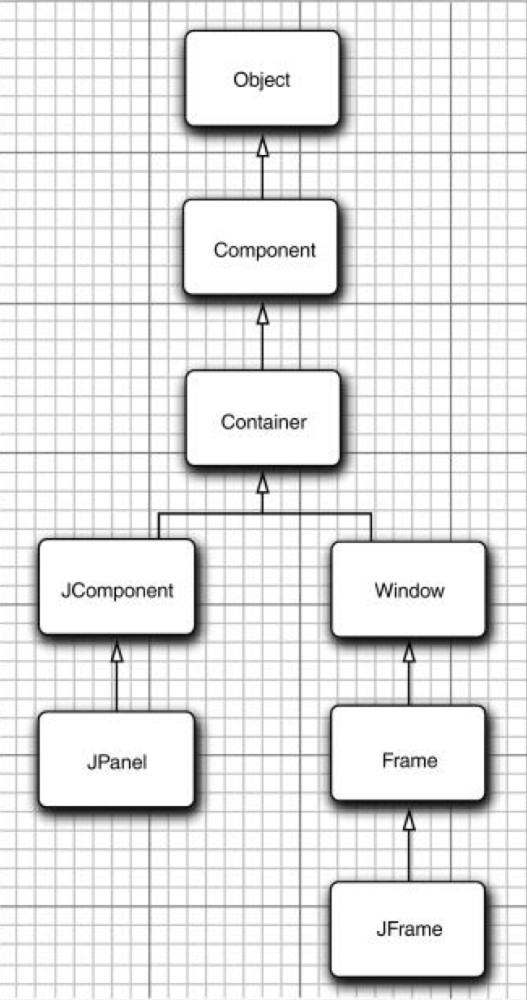
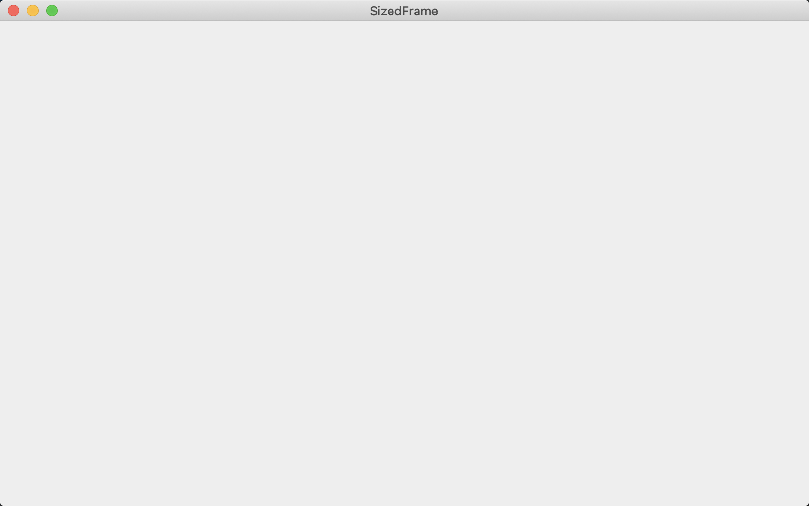

### 10.3 框架定位

JFrame类本身只包含若干个改变框架外观的方法。当然，通过继承，从JFrame的各个超类中继承了许多用于处理框架大小和位置的方法。其中最重要的有下面几个：

+ setLocation和setBounds方法用于设置框架的位置。
+ setIconImage用于告诉窗口系统在标题栏、任务切换窗口等位置显示哪个图标。
+ setTitle用于改变标题栏的文字。
+ setResizable利用一个boolean值确定框架的大小是否允许用户改变。



<center><b>图10-6 AWT 和 Swing 中框架和组件类的继承层次</b></center>

setLocation方法是重定位组件的一个方法。如果调用:

```java
setLocation(x, y)
```

setBounds方法可以实现一步重定位组件（特别是JFrame）大小和位置的操作，例如：

```java
setBounds(x, y, width, height)
```

可以让窗口系统控制窗口的位置，如果在显示窗口之前调用:

```java
setLocationByPlatform(true)
```

窗口系统会选用窗口的位置（而不是大小），通常是距最后一个显示窗口很少偏移量的位置。

> 注释：对于框架来说，setLocation和setBounds中的坐标均相对于整个屏幕。
>

#### 10.3.1 框架属性

组件类的很多方法是以获取/设置方法对形式出现的，例如，Frame类的下列方法：

```java
public String getTitle()
public void setTitle(String title)
```

针对get/set约定有一个例外：对于类型为boolean的属性，获取方法由is开头。例如，下面两个方法定义了locationByPlatform属性：

```java
public boolean isLocationByPlatform()
public void setLocationByPlatform(boolean b)
```

#### 10.3.2 确定合适的框架大小

要记住：如果没有明确地指定框架的大小，所有框架的默认值为0×0像素。

为了得到屏幕的大小，需要按照下列步骤操作。调用Toolkit类的静态方法getDefaultToolkit得到一个Toolkit对象（Toolkit类包含很多与本地窗口系统打交道的方法）。然后，调用getScreenSize方法，这个方法以Dimension对象的形式返回屏幕的大小。Dimension对象同时用公有实例变量width和height保存着屏幕的宽度和高度。下面是相关的代码：

```java
Toolkit kit = Toolkit.getDefaultToolkit();
Dimension screenSize = kit.getScreenSize();
int screenWidth = screenSize.width;
int screenHeight = screenSize.height;
```

下面，将框架大小设定为上面取值的50%，然后，告知窗口系统定位框架：

```java
setSize(screenWidth / 2, screenHeight / 2);
setLocationByPlatform(true);
```

另外，还提供一个图标。由于图像的描述与系统有关，所以需要再次使用工具箱加载图像。然后，将这个图像设置为框架的图标。

```java
Image img = new ImageIcon("icon.gif").getImage();
setIconImage(img);
```

下面是为了处理框架给予的一些提示：

+ 如果框架中只包含标准的组件，如按钮和文本框，那么可以通过调用pack方法设置框架大小。框架将被设置为刚好能够放置所有组件的大小。在通常情况下，将程序的主框架尺寸设置为最大。可以通过调用下列方法将框架设置为最大。

    ```java
    frame.setExtendedState(Frame.MAXIMIZED_BOTH);
    ```

+ 牢记用户定位应用程序的框架位置、重置框架大小，并且在应用程序再次启动时恢复这些内容是一个不错的想法。

+ GraphicsDevice类还允许以全屏模式执行应用。

**程序清单10-2　sizedFrame/SizedFrameTest.java**

```java
import javax.swing.*;
import java.awt.*;

public class SizedFrameTest {

    public static void main(String[] args) {
        EventQueue.invokeLater(() -> {
            JFrame frame = new SizedFrame();
            frame.setTitle("SizedFrame");
            frame.setDefaultCloseOperation(JFrame.EXIT_ON_CLOSE);
            frame.setVisible(true);
        });
    }
}

class SizedFrame extends JFrame {

    public SizedFrame() {
        // get screen dimensions

        Toolkit kit = Toolkit.getDefaultToolkit();
        Dimension screenSize = kit.getScreenSize();
        int screenWidth = screenSize.width;
        int screenHeight = screenSize.height;

        // set frame width, height and let platform pick screen location

        setSize(screenWidth / 2, screenHeight / 2);
        setLocationByPlatform(true);

        // set frame icon

        Image img = new ImageIcon("icon.gif").getImage();
        System.out.println("img: " + img);
        setIconImage(img);
    }
}
```



**java.awt.Component1.0**

+ boolean isVisible()

+ void setVisible(boolean b)

    获取或设置visible属性。组件最初是可见的，但JFrame这样的顶层组件例外。

+ void setSize(int width，int height) 1.1

    使用给定的宽度和高度，重新设置组件的大小。

+ void setLocation(int x，int y) 1.1

    将组件移到一个新的位置上。如果这个组件不是顶层组件，x和y坐标（或者p.x和p.y）是容器坐标；否则是屏幕坐标（例如：JFrame）。

+ void setBounds(int x，int y，int width，int height) 1.1

    移动并重新设置组件的大小。
    
+ Dimension getSize() 1.1

+ voidsetSize(Dimension d) 1.1

    获取或设置当前组件的size属性。

**java.awt.Window1.0**

+ void toFront()

    将这个窗口显示在其他窗口前面。

+ void toBack()

    将这个窗口移到桌面窗口栈的后面，并相应地重新排列所有的可见窗口。

+ boolean isLocationByPlatform() 5.0

+ void setLocationByPlatform(boolean b) 5.0

    获取或设置locationByPlatform属性。这个属性在窗口显示之前被设置，由平台选择一个合适的位置。

**java.awt.Frame1.0**

+ boolean isResizable()

+ void setResizable(boolean b) 

    获取或设置resizable属性。这个属性设置后，用户可以重新设置框架的大小。

+ String getTitle()

+ void setTitle(String s) 

    获取或设置title属性，这个属性确定框架标题栏中的文字。

+ Image getIconImage()

+ void setIconImage(Image image) 

    获取或设置iconImage属性，这个属性确定框架的图标。窗口系统可能会将图标作为框架装饰或其他部位的一部分显示。

+ boolean isUndecorated() 1.4

+ void setUndecorated(boolean b) 1.4

    获取或设置undecorated属性。这个属性设置后，框架显示中将没有标题栏或关闭按钮这样的装饰。在框架显示之前，必须调用这个方法。

+ int getExtendedState() 1.4

+ void setExtendedState(int state) 1.4

    获取或设置窗口状态。状态是下列值之一。

    ```java
    Frame.NORMAL
    Frame.ICONIFIED
    Frame.MAXIMIZED_HORIZ
    Frame.MAXIMIZED_VERT
    Frame.MAXIMIZED_BOTH
    ```

**java.awt.Toolkit1.0**

+ static Toolkit getDefaultToolkit() 

    返回默认的工具箱。

+ Dimension getScreenSize() 

    返回用户屏幕的尺寸。

**javax.swing.ImageIcon1.2**

+ ImageIcon(String filename) 

    构造一个图标，其图像存储在一个文件中。

+ Image getImage() 

    获得该图标的图像。