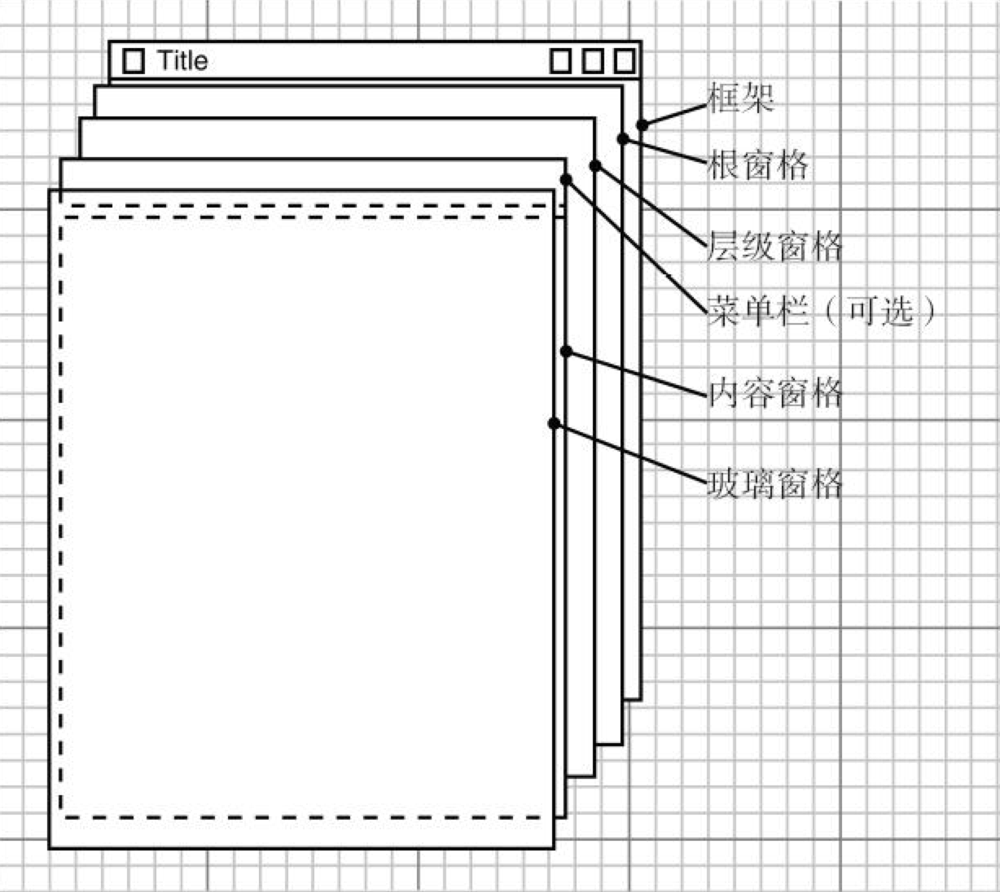
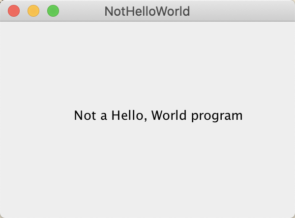

### 10.4 在组件中显示信息

在设计框架的时候，要使用下列代码将所有的组件添加到内容窗格中：

```java
Container contentPane = frame.getContentPane();
Component c = ...;
contentPane.add(c);
```



<center><b>图10-8 JFrame的内部结构</b></center>

paintComponent方法有一个Graphics类型的参数，这个参数保存着用于绘制图像和文本的设置，例如，设置的字体或当前的颜色。在Java中，所有的绘制都必须使用Graphics对象，其中包含了绘制图案、图像和文本的方法。

下列代码给出了如何创建一个能够进行绘制的组件：

```java
class MyComponent extends JComponent {
    
    public void paintComponent(Graphics g) {
        code for drawing
    }
    
}
```

一定不要自己调用 paintComponent 方法。在应用程序需要重新绘图的时候，这个方法将被自动地调用，不要人为地干预这个自动的处理过程。

> 提示：如果需要强制刷新屏幕，就需要调用repaint方法，而不是paintComponent方法。

对于屏幕显示来说，Graphics对象的度量单位是像素。坐标（0，0）指出所绘制组件表面的左上角。

显示文本是一种特殊的绘图。在Graphics类中有一个drawString方法，调用的语法格式为：

```java
g.drawString(text, x, y)
```

paintComponent方法的书写内容如下所示：

```java
public class NotHelloWorldComponent extends JComponent {
    
    public static final int MESSAGE_X = 75;
    public static final int MESSAGE_Y = 100;
    
    public void paintComponent(Graphics g) {
        g.drawString("Not a Hello World program", MESSAGE_X, MESSAGE_Y);
    }
    ...
}
```

最后，组件要告诉用户它应该有多大。覆盖getPreferredSize方法，返回一个有首选宽度和高度的Dimension类对象：

```java
public class NotHelloWorldComponent extends JComponent {
    private static final int DEFAULT_WIDTH = 300;
    private static final int DEFAULT_HEIGHT = 200;
    ...
    public Dimension getPreferredSize() { return new Dimension(DEFAULT_WIDTH, DEFAULT_HEIGHT); }
}
```

在框架中填入一个或多个组件时，如果你只想使用它们的首选大小，可以调用pack方法而不是setSize方法：

```java
class NotHelloWorldFrame extends JFrame {
   public NotHelloWorldFrame() {
      add(new NotHelloWorldComponent());
      pack();
   }
}
```

> 注释：有些程序员更喜欢扩展JPanel，而不是JComponent。JPanel是一个可以包含其他组件的容器（container），但同样也可以在其上面进行绘制。有一点不同之处是，面板不透明，这意味着需要在面板的边界内绘制所有的像素。最容易实现的方法是，在每个面板子类的paintComponent方法中调用super.paintComponent来用背景色绘制面板：
>
> ```java
> class NotHelloWorldPanel extends JPanel {
>     public void paintComponent(Graphics g) {
>         super.paintComponent(g);
>         code for drawing
>     }
> }
> ```

**程序清单10-3　notHelloWorld/NotHelloWorld.java**

```java
import javax.swing.*;
import java.awt.*;

public class NotHelloWorld {

    public static void main(String[] args) {
        JFrame frame = new NotHelloWorldFrame();
        frame.setTitle("NotHelloWorld");
        frame.setDefaultCloseOperation(JFrame.EXIT_ON_CLOSE);
        frame.setVisible(true);
    }

}

/**
 * A frame that contains a message panel
 */
class NotHelloWorldFrame extends JFrame {

    public NotHelloWorldFrame() {
        add(new NotHelloWorldComponent());
        pack();
    }

}

class NotHelloWorldComponent extends JComponent {
    public static final int MESSAGE_X = 75;
    public static final int MESSAGE_Y = 100;

    private static final int DEFAULT_WIDTH = 300;
    private static final int DEFAULT_HEIGHT = 200;

    public void paintComponent(Graphics g) {
        g.drawString("Not a Hello, World program", MESSAGE_X, MESSAGE_Y);
    }

    public Dimension getPreferredSize() {
        return new Dimension(DEFAULT_WIDTH, DEFAULT_HEIGHT);
    }
}
```



<center><b>图10-7 一个显示消息的框架</b></center>

**javax.swing.JFrame1.2**

+ Container getContentPane() 

    返回这个JFrame的内容窗格对象。

+ Component add(Component c) 

    将一个给定的组件添加到该框架的内容窗格中（在JavaSE5.0以前的版本中，这个方法将抛出一个异常）。

**java.awt.Component1.0**

+ void repaint() 

    “尽可能快地”重新绘制组件。

+ Dimension getPreferredSize() 

    要覆盖这个方法，返回这个组件的首选大小。

**javax.swing.JComponent1.2**

+ voidpaintComponent(Grphics g)

    覆盖这个方法来描述应该如何绘制自己的组件。

**java.awt.Window1.0**

+ void pack()

    调整窗口大小，要考虑到其组件的首选大小。