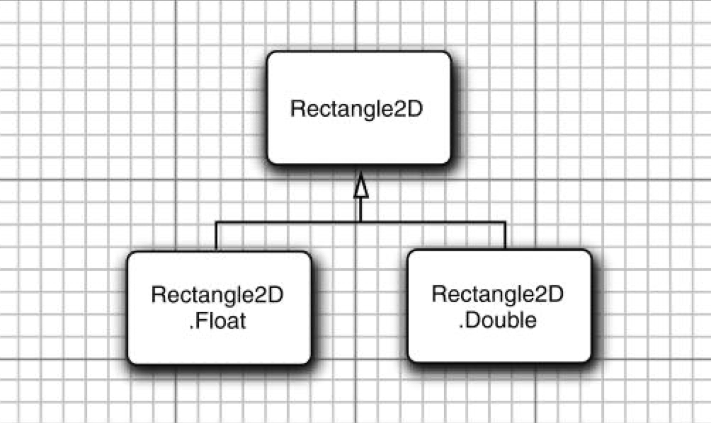
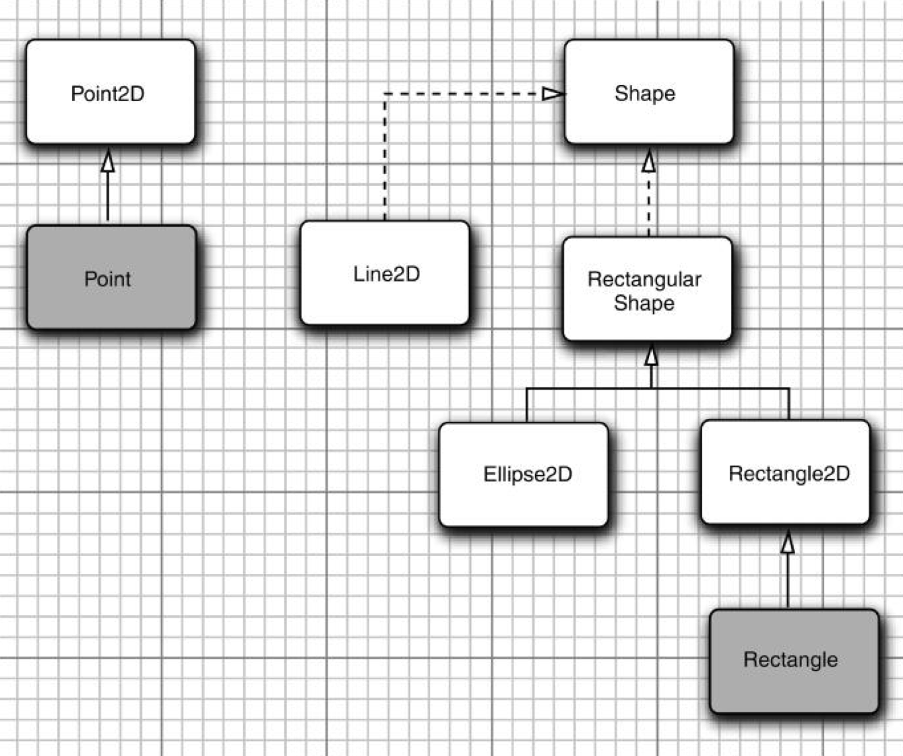
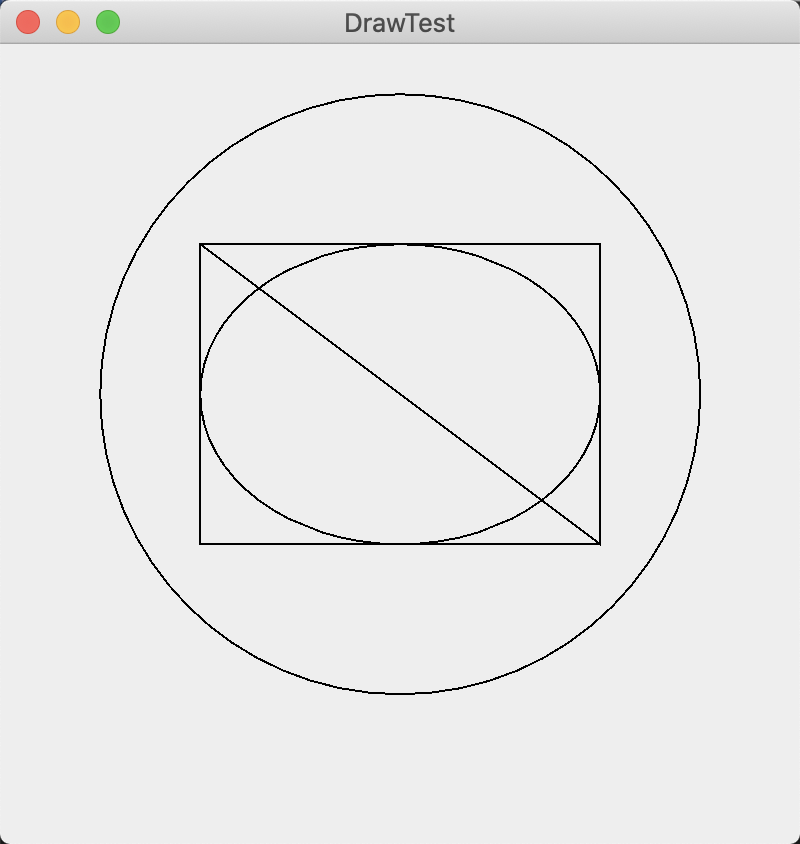

### 10.5 处理 2D 图形

自从Java版本1.0以来，Graphics类就包含绘制直线、矩形和椭圆等方法。但是，这些绘制图形的操作能力非常有限。例如，不能改变线的粗细，不能旋转这些图形。

JavaSE1.2引入了Java2D库，这个库实现了一组功能强大的图形操作。

要想使用Java2D库绘制图形，需要获得一个Graphics2D类对象。这个类是Graphics类的子类。自从JavaSE2版本以来，paintComponent方法就会自动地获得一个Graphics2D类对象，我们只需要进行一次类型转换就可以了。如下所示：

```java
public void paintComponent(Graphics g) {
    Graphics2D g2 = (Graphics2D) g;
    ...
}
```

Java2D库采用面向对象的方式将几何图形组织起来。包含描述直线、矩形的椭圆的类：

```java
Line2D
Rectangle2D
Ellipse2D
```

要想绘制图形，首先要创建一个实现了Shape接口的类的对象，然后调用Graphics2D类中的draw方法。例如，

```java
Rectangle2D rect = ...;
g2.draw(rect);
```

在1.0的绘制方法中，采用的是整型像素坐标，而Java2D图形采用的是浮点坐标。

有时候程序员处理float并不太方便，这是因为Java程序设计语言在将double值转换成float值时必须进行类型转换。例如，考虑下列的语句：

```java
float f = 1.2; // Error
```

这条语句无法通过编译，因为常量1.2属于double类型，而编译器不允许丢失精度。解决的方法是给浮点常量添加一个后缀F：

```java
float f = 1.2F;	// OK
```

现在，看一下这条语句：

```java
Rectangle2D r = ...
float f = r.getWidth();	// Error
```

由于getWidth方法的返回类型是double，所以需要进行类型强制转换：

```java
float f = (float)r.getWidth();	// OK
```

由于后缀和类型转换都有点麻烦，所以2D库的设计者决定为每个图形类提供两个版本：一个是为那些节省空间的程序员提供的float类型的坐标；另一个是为那些懒惰的程序员提供的double类型的坐标（本书主要采用的是第二个版本，即double类型的坐标）。

```java
Rectangle2D.Float
Rectangle2D.Double
```



<center><b>图10-9 2D矩形类</b></center>

当创建一个Rectangle2D.Float对象时，应该提供float型数值的坐标。而创建Rectangle2D.Double对象时，应该提供double型数值的坐标。

```java
Rectangle2D.Float floatRect = new Rectangle2D.Float(10.0F, 25.0F, 22.5F, 20.0F);
Rectangle2D.Double doubleRect = new Rectangle2D.Double(10.0, 25.0, 22.5, 20.0);
```

实际上，由于Rectangle2D.Float和Rectangle2D.Double都扩展于Rectangle2D类，并且子类只覆盖了Rectangle2D超类中的方法，所以没有必要记住图形类型。可以直接使用Rectangle2D变量保存矩形的引用。

```java
Rectangle2D floatRect = new Rectangle2D.Float(10.0F, 25.0F, 22.5F, 20.0F);
Rectangle2D doubleRect = new Rectangle2D.Double(10.0, 25.0, 22.5, 20.0);
```

> 注释：实际上，Rectangle2D.Float类包含了一个不是由Rectangle2D继承而来的附加方法setRect（floatx，floaty，floath，floatw）。如果将Rectangle2D.Float的引用存储在Rectangle2D变量中，那就会失去这个方法。但是，这也没有太大关系，因为在Rectangle2D中有一个参数为double类型的setRect方法。

Point2D类也有两个子类Point2D.Float和Point2D.Double。下面是构造一个点对象的方法：

```java
Point2D p = new Point2D.Double(10, 20);
```

Rectangle2D和Ellipse2D类都是由公共超类RectangularShape继承来的。无可非议，椭圆不是矩形，但它们都有着矩形边界。



<center><b>图10-11 图形类之间的关系</b></center>

Rectangle2D和Ellipse2D对象很容易构造。需要给出

+ 左上角的x和y坐标；
+ 宽和高。

对于椭圆，这些内容代表外接矩形。例如，

```java
Ellipse2D e = new Ellipse2D.Double(150, 200, 100, 50);
```

经常得到的是矩形的两个对角点，而这两个对角不一定是左上角和右下角。不能直接这样构造一个矩形：

```java
Rectangle2D rect = new Rectangle2D.Double(px, py, qx - px, qy - py);    // Error
```

在这种情况下，首先创建一个空矩形，然后调用setFrameFromDiagonal方法，如下所示：

```java
Rectangle2D rect = new Rectangle2D.Double();
rect.setFrameFromDiagonal(px, py, qx, qy);
```

或者，如果已知的顶点分别用Point2D类型的两个对象p和q表示，就应该这样调用：

```java
rect.setFrameFromDiagonal(p, q);
```

setFrameFromCenter方法使用中心点，但仍然要给出四个顶点中的一个。因此，通常采用下列方式构造椭圆：

```java
Ellipse2D ellipse = new Ellipse2D.Double(centerX - width / 2, centerY - height / 2, width, height);
```

要想构造一条直线，需要提供起点和终点。

```java
Line2D line = new Line2D.Double(start, end);
```

或者

```java
Line2D line = new Line2D.Double(startX, startY, endX, endY);
```

**程序清单10-4　draw/DrawTest.java**

```java
import javax.swing.*;
import java.awt.*;
import java.awt.geom.Ellipse2D;
import java.awt.geom.Line2D;
import java.awt.geom.Rectangle2D;

public class DrawTest {
    public static void main(String[] args) {
        EventQueue.invokeLater(() -> {
            JFrame frame = new DrawFrame();
            frame.setTitle("DrawTest");
            frame.setDefaultCloseOperation(JFrame.EXIT_ON_CLOSE);
            frame.setVisible(true);
        });
    }
}

/**
 * A frame that contains a panel with drawings
 */
class DrawFrame extends JFrame {
    public DrawFrame() {
        add(new DrawComponent());
        pack();
    }
}

/**
 * A component that displays rectangles and ellipses.
 */
class DrawComponent extends JComponent {
    private static final int DEFAULT_WIDTH = 400;
    private static final int DEFAULT_HEIGHT = 400;

    public void paintComponent(Graphics g) {
        Graphics2D g2 = (Graphics2D) g;

        // draw a rectangle

        double leftX = 100;
        double topY = 100;
        double width = 200;
        double height = 150;

        Rectangle2D rect = new Rectangle2D.Double(leftX, topY, width, height);
        g2.draw(rect);

        // draw the enclosed ellipse

        Ellipse2D ellipse = new Ellipse2D.Double();
        ellipse.setFrame(rect);
        g2.draw(ellipse);

        // draw a diagonal line

        g2.draw(new Line2D.Double(leftX, topY, leftX + width, topY + height));

        // draw a circle with the same center

        double centerX = rect.getCenterX();
        double centerY = rect.getCenterY();
        double radius = 150;

        Ellipse2D circle = new Ellipse2D.Double();
        circle.setFrameFromCenter(centerX, centerY, centerX + radius, centerY + radius);
        g2.draw(circle);
    }

    public Dimension getPreferredSize() {
        return new Dimension(DEFAULT_WIDTH, DEFAULT_HEIGHT);
    }
}
```



<center><b>图10-12 绘制几何图形</b></center>