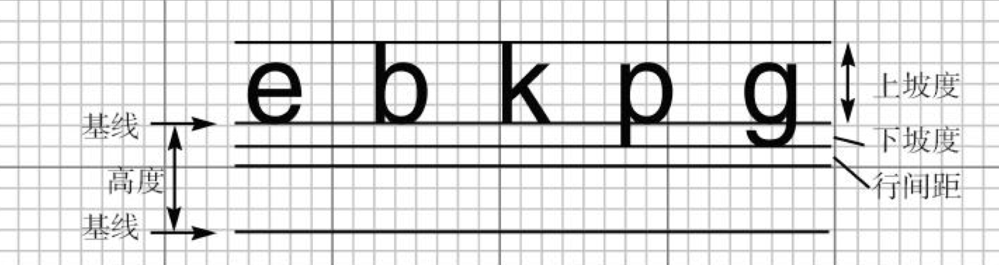
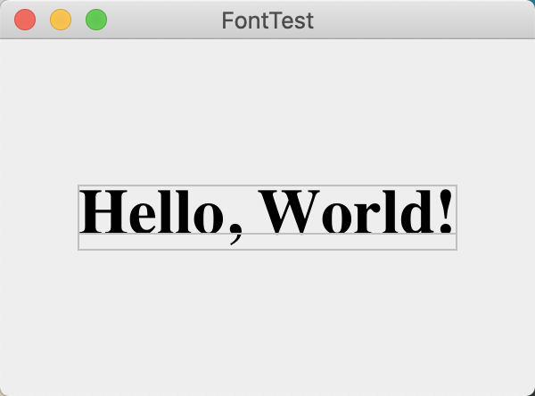

### 10.7 文本使用特殊字体

要想知道某台特定计算机上允许使用的字体，就需要调用GraphicsEnvironment类中的getAvailableFontFamilyNames方法。这个方法将返回一个字符型数组，其中包含了所有可用的字体名。GraphicsEnvironment类描述了用户系统的图形环境，为了得到这个类的对象，需要调用静态的getLocalGraphicsEnvironment方法。下面这个程序将打印出系统上的所有字体名：

```java
public class ListFonts{
   public static void main(String[] args){
      String[] fontNames = GraphicsEnvironment.getLocalGraphicsEnvironment()
            .getAvailableFontFamilyNames();

      for (String fontName : fontNames)
         System.out.println(fontName);
   }
}
```

为了创建一个公共基准，AWT定义了五个逻辑（logical）字体名：

```text
SansSerif
Serif
Monospaced
Dialog
DialogInput
```

这些字体将被映射到客户机上的实际字体。

下面是构造一个Font对象的例子：

```java
Font f = new Font("Serif", Font.BOLD, 36);
```

第三个参数是以点数目计算的字体大小。点数目是排版中普遍使用的表示字体大小的单位，每英寸包含72个点。

另外，利用Font构造器的第二个参数可以指定字体的风格（常规、加粗、斜体或加粗斜体），下面是几个字体风格的值：

```text
Font.PLAIN
Font.BOLD
Font.ITALIC
Font.BOLD + Font.ITALIC
```

> 注释：字体映射定义在Java安装的jre/lib子目录中的fontconfig.properties文件中。有关这个文件的详细内容请参看http://docs.oracle.com/javase/8/docs/technotes/guides/intl/fontconfig.html。
>

可以读取TrueType或PostScriotType1格式的字体文件。这需要一个字体输入流——通常从磁盘文件或者URL读取（有关流的更详细信息请参看卷Ⅱ第1章）。然后调用静态方法Font.createFont：

```java
URL url = new URL("http://www.fonts.com/Wingbats.ttf");
InputStream in = url.openStream();
Font f1 = Font.createFont(Font.TRUETYPE_FONT, in);
```

上面定义的字体为常规字体，大小为1。可以使用deriveFont方法得到希望大小的字体：

```java
Font f = f1.deriveFont(14.0F);
```

> 警告：deriveFont方法有两个重载版本。一个（有一个float参数）设置字体的大小；另一个（有一个int参数）设置字体风格。所以f.deriveFont（14）设置的是字体风格，而不是大小（其结果为斜体，因为14的二进制表示的是ITALIC，而不是BOLD）。
>

下面这段代码将使用系统中14号加粗的标准sansserif字体显示字符串“Hello，World”：

```java
Font f = new Font("Serif", Font.BOLD, 36);
g2.setFont(f);
String message = "Hello, World!";
g2.drawString(message, 75, 100);
```

要想得到屏幕设备字体属性的描述对象，需要调用Graphics2D类中的getFontRenderContext方法。它将返回一个FontRenderContext类对象。可以直接将这个对象传递给Font类的getStringBounds方法：

```java
FontRenderContext context = g2.getFontRenderContext();
Rectangle2D bounds = f.getStringBounds(message, context);
```

getStringBounds方法将返回包围字符串的矩形。



<center><b>图10-13 排版术语解释</b></center>

字体的高度是连续两个基线之间的距离，它等于下坡度+行间距+上坡度。

可以采用下面的方法获得字符串的宽度、高度和上坡度：

```java
double width = bounds.getWidth();
double height = bounds.getHeight();
double ascent = -bounds.getY();
```

如果需要知道下坡度或行间距，可以使用Font类的getLineMetrics方法。这个方法将返回一个LineMetrics类对象，获得下坡度和行间距的方法是：

```java
LineMetrics metrics = f.getLineMetrics(message, context);
float descent = metrics.getDescent();
float leading = metrics.getLeading();
```

下面这段代码使用了所有这些信息，将字符串显示在包围它的组件中央：

```java
FontRenderContext context = g2.getFontRenderContext();
Rectangle2D bounds = f.getStringBounds(message, context);

// set (x,y) = top left corner of text

double x = (getWidth() - bounds.getWidth()) / 2;
double y = (getHeight() - bounds.getHeight()) / 2;

// add ascent to y to reach the baseline

double ascent = -bounds.getY();
double baseY = y + ascent;

// draw the message

g2.drawString(message, (int) x, (int) baseY);
```

> 注释：如果需要在paintComponent方法外部计算布局图的尺度，不能从Graphics2D对象得到字体绘制环境。换作调用JComponent类的getFontMetrics方法，而后紧接着调用getFontRenderContext：
>
> ```java
> FontRenderContext context = getFontMetrics(f).getFontRenderContext();
> ```



<center><b>图10-14 绘制基线和字符串边框</b></center>

**程序清单10-5　font/FontTest.java**

```java
import javax.swing.*;
import java.awt.*;
import java.awt.font.FontRenderContext;
import java.awt.geom.Line2D;
import java.awt.geom.Rectangle2D;

public class FontTest {
    public static void main(String[] args) {
        EventQueue.invokeLater(() -> {
            JFrame frame = new FontFrame();
            frame.setTitle("FontTest");
            frame.setDefaultCloseOperation(JFrame.EXIT_ON_CLOSE);
            frame.setVisible(true);
        });
    }
}

/**
 * A frame with a text message component
 */
class FontFrame extends JFrame {
    public FontFrame() {
        add(new FontComponent());
        pack();
    }
}

/**
 * A component that shows a centered message in a box.
 */
class FontComponent extends JComponent {
    private static final int DEFAULT_WIDTH = 300;
    private static final int DEFAULT_HEIGHT = 200;

    public void paintComponent(Graphics g) {
        Graphics2D g2 = (Graphics2D) g;

        String message = "Hello, World!";

        Font f = new Font("Serif", Font.BOLD, 36);
        g2.setFont(f);

        // measure the size of the message

        FontRenderContext context = g2.getFontRenderContext();
        Rectangle2D bounds = f.getStringBounds(message, context);

        // set (x,y) = top left corner of text

        double x = (getWidth() - bounds.getWidth()) / 2;
        double y = (getHeight() - bounds.getHeight()) / 2;

        // add ascent to y to reach the baseline

        double ascent = -bounds.getY();
        double baseY = y + ascent;

        // draw the message

        g2.drawString(message, (int) x, (int) baseY);

        g2.setPaint(Color.LIGHT_GRAY);

        // draw the baseline

        g2.draw(new Line2D.Double(x, baseY, x + bounds.getWidth(), baseY));

        // draw the enclosing rectangle

        Rectangle2D rect = new Rectangle2D.Double(x, y, bounds.getWidth(), bounds.getHeight());
        g2.draw(rect);
    }

    public Dimension getPreferredSize() {
        return new Dimension(DEFAULT_WIDTH, DEFAULT_HEIGHT);
    }
}
```

