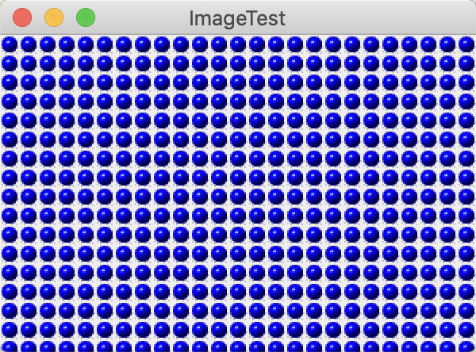

### 10.8 显示图像

读取图像有很多方法。在这里我们使用你之前已经见过的ImageIcon类：

```java
Image image = new ImageIcon(filename).getImage();
```

可以使用Graphics类的drawImage方法将图像显示出来。

```java
public void paintComponent(Graphics g) {
    ...
    g.drawImage(image, x, y, null);
}
```

这里采用paintComponent方法来实现平铺显示。它的基本过程为：先在左上角显示图像的一个拷贝，然后使用copyArea将其拷贝到整个窗口：

```java
for (int i = 0; i * imageWidth <= getWidth(); i++)
    for (int j = 0; j * imageHeight <= getHeight(); j++)
        if (i + j > 0)
            g.copyArea(0, 0, imageWidth, imageHeight, i * imageWidth, j * imageHeight);
```



<center><b>图10-15 平铺图像的窗口</b></center>

**程序清单10-6　image/ImageTest.java**

```java
import java.awt.*;
import javax.swing.*;

public class ImageTest {
    public static void main(String[] args) {
        EventQueue.invokeLater(() -> {
            JFrame frame = new ImageFrame();
            frame.setTitle("ImageTest");
            frame.setDefaultCloseOperation(JFrame.EXIT_ON_CLOSE);
            frame.setVisible(true);
        });
    }
}

/**
 * A frame with an image component
 */
class ImageFrame extends JFrame {
    public ImageFrame() {
        add(new ImageComponent());
        pack();
    }
}

/**
 * A component that displays a tiled image
 */
class ImageComponent extends JComponent {
    private static final int DEFAULT_WIDTH = 300;
    private static final int DEFAULT_HEIGHT = 200;

    private Image image;

    public ImageComponent() {
        image = new ImageIcon("blue-ball.gif").getImage();
    }

    public void paintComponent(Graphics g) {
        if (image == null) return;

        int imageWidth = image.getWidth(null);
        int imageHeight = image.getHeight(null);

        // draw the image in the upper-left corner

        g.drawImage(image, 0, 0, null);
        // tile the image across the component

        for (int i = 0; i * imageWidth <= getWidth(); i++)
            for (int j = 0; j * imageHeight <= getHeight(); j++)
                if (i + j > 0)
                    g.copyArea(0, 0, imageWidth, imageHeight, i * imageWidth, j * imageHeight);
    }

    public Dimension getPreferredSize() {
        return new Dimension(DEFAULT_WIDTH, DEFAULT_HEIGHT);
    }
}
```

