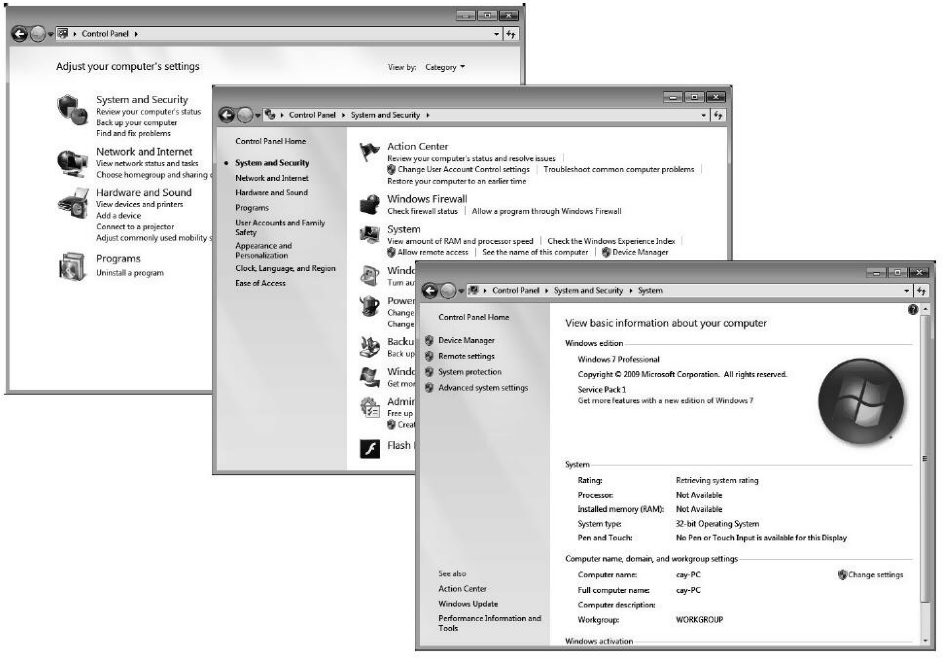
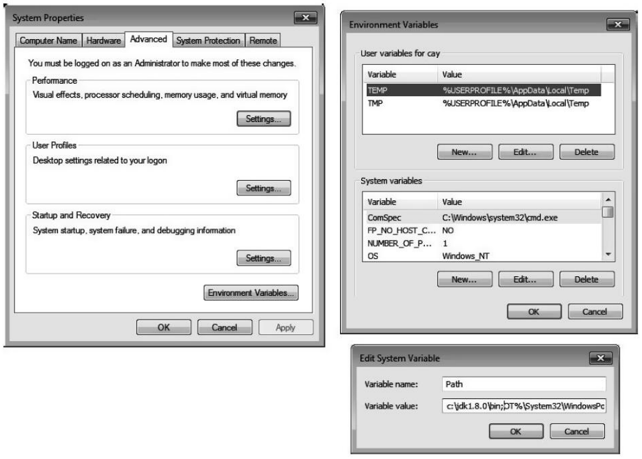

[toc]

### 2.1 安装 Java 开发工具包

#### 2.1.1 下载 JDK

要想下载 Java 开发工具包，可以访问 Oracle 网站：<http://www.oracle.com/technetwork/java/javase/downloads> 。

<center><b>表2-1 Java 术语</b></center>

| 术语名                   | 缩写 | 解释                                                         |
| ------------------------ | ---- | ------------------------------------------------------------ |
| Java Development Kit     | JDK  | 编写 Java 程序的程序员使用的软件                             |
| Java Runtime Environment | JRE  | 运行 Java 程序的用户使用的软件                               |
| Server JRE               | ——   | 在服务器上运行 Java 程序的软件                               |
| Standard Edition         | SE   | 用于桌面或简单服务器应用的 Java 平台                         |
| Enterprise Edition       | EE   | 用于复杂服务器应用的 Java 平台                               |
| Micro Edition            | ME   | 用于手机和其他小型设备的 Java 平台                           |
| Java FX                  | ——   | 用于图形化用户界面的一个替代工具包，在 Oracle 的 Java SE 发布版本中提供 |
| OpenJDK                  | ——   | Java SE 的一个免费开源实现，不包含浏览器继承或 Java FX       |
| Java 2                   | J2   | 一个过时的术语，用于描述 1998 年 ~ 2006 年之间的 Java 版本   |
| Software Development Kit | SDK  | 一个过时的术语，用于描述 1998 年 ~ 2006 年之间的 JDK         |
| Update                   | u    | Oracle 的术语，表示 bug 修正版本                             |
| NetBean                  | ——   | Oracle 的集成开发环境                                        |

#### 2.1.2 设置 JDK

+ 在 Windows 上，启动安装程序。会询问你要在哪里安装 JDK。最好不要接受路径名中包含空格的默认位置，如: C:\Program Files\Java\jdk1.8.0_version。取出路径名中的 Program Files 部分就可以了。
+ 在 Mac 上，运行安装程序。这会把软件安装到 /Library/Java/JavaVirtualMachines/jdk1.8.0_version.jdk/Contents/Home 。用 Finder 找到这个目录。
+ 在 Linux 上，只需要把 .tar.gz 文件解压缩到你选择的某个位置，如你的主目录，或者 /opt。如果从 RPM 文件安装，则要反复检查是否安装在 /usr/java/jdk1.8.0_version。

在 Windows 或 Linux 上安装 JDK 时，还需要另外完成一个步骤：将 jdk/bin 目录增加到执行路径中：

+ 在 Linux 上，需要在 `~/.bashrc` 或 `~/.bash_profile` 文件的最后增加这样一行：

  ```console
  export PATH=jdk/bin:$PATH
  ```

+ 一定要使用 JDK 的正确路径，如 `/opt/jdk1.8.0_31`。

+ 在 Windows 上，启动控制面板，选择 "系统与安全"（System and Security），再选择 "系统"（System），选择高级系统设置（Advanced System Serttings）。在系统属性（System Properties）对话框中，点击 "高级"（Advanced）标签页，然后点击 "环境"（Environment）按钮。

  
  
  滚动 "系统变量"（System Variables）列表，直到找到名为 Path 的变量。点击 "编辑"（Edit）按钮。将 `jdk\bin` 目录增加到路径最前面，并用一个分号分隔新增的这一项，如下所示：	

  ```console
  jdk\bin;other stuff
  ```

  

可以如下测试设置是否正确：打开一个终端窗口，键入：

```console
javac -version
```

然后按回车键。应该能看到显示以下信息：

```console
javac 1.8.0_31
```

#### 2.1.3 安装库源文件和文档

库源文件在 JDK 中以一个压缩文件 src.zip 的形式发布，必须将其解压缩后才能够访问源代码。建议安装下面所述的步骤操作：

1）确保 JDK 已经安装，并且 `jdk/bin` 目录再执行路径中。

2）在主目录中建立一个目录 javasrc。

```shell
mkdir javasrc
```

3）在 jdk 目录下找到文件 src.zip。

4）将 src.zip 文件解压缩到 javasrc 目录。

```shell
cd javasrc
jar xvf jdk/src.zip
cd ..
```

文档包含在一个压缩文件中，它是一个独立于 JDK 的压缩文件。可以直接从网站 <http://www.oracle.com/technetwork/java/javase/downloads> 下载这个文档。操作步骤如下：

1）下载文档压缩文件。这个文件名为 jdk-version-docs-all.zip，其中的 version 表示版本号，例如 8u31。

2）解压缩这个文件，将 doc 目录重命名为一个更有描述性的名字，如 javadoc。

```shell
jar xvf Downloads/jdk-version-docs-all.zip
mv doc javadoc
```

3）在浏览器中导航到 `javadoc/api/index.html`，这个页面增加到书签。