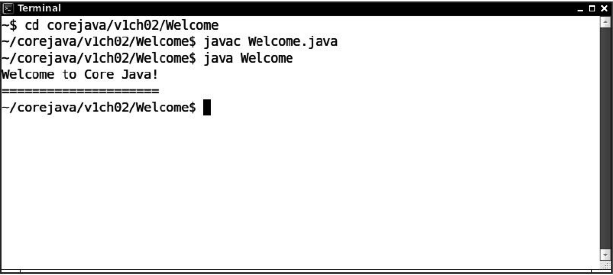

[toc]

### 2.2 使用命令行工具

从命令行编译并运行 Java 程序：

1）打开一个终端窗口。

2）进入 corejava/v1ch02/Welcom 目录。

3）键入下面的命令：

```shell
javac Welcome.java
java Welcome
```

然后，将会在终端窗口中看到图2-3所示的输出。



**程序清单2-1 Welcome/Welcome.java**

```java
public class Welcome {
   public static void main(String[] args) {
      String greeting = "Welcome to Core Java!";
      System.out.println(greeting);
      for (int i = 0; i < greeting.length(); i++) {
         System.out.print("=");
      }
      System.out.println();
   }
}
```

> 提示：在 <http://docs.oracle.com/javase/tutorial/getStarted/cupojava> 上有一个很好的教程。其中提到了初学者经常容易犯的一些错误。

